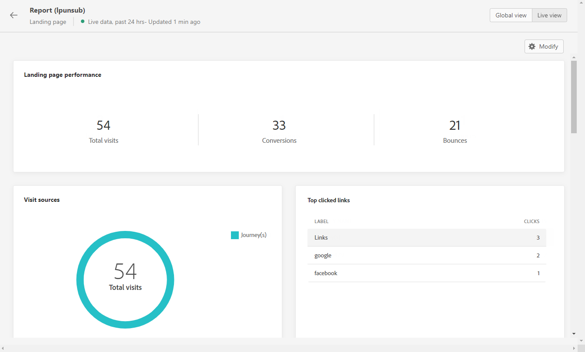

# Relatório ao vivo da página de aterrissagem {#lp-report-live}

A landing page **[!UICONTROL Live report]** O relatório exibe detalhes sobre o impacto de suas landing pages somente nas últimas 24 horas. Para medir os dados da landing page em um período selecionado, consulte [Relatório global da página de aterrissagem](lp-report-global.md).

Para acessar os relatórios, selecione **[!UICONTROL Live report]** no menu avançado da landing page selecionada.

A landing page **[!UICONTROL Live report]** é dividido em diferentes widgets detalhando o sucesso e os erros do delivery. Cada widget pode ser redimensionado e excluído, se necessário. Para obter mais informações, consulte [seção](live-report.md).

O **[!UICONTROL Landing page performance]** o widget detalha as informações principais relativas à sua mensagem nas últimas 24 horas por meio dos KPIs:

* **[!UICONTROL Total visits]**: Número total de visitas à sua página inicial a partir de uma jornada ou de outras fontes, incluindo várias visitas de um recipient.

* **[!UICONTROL Conversions]**: Número de pessoas que interagiram com a landing page, por exemplo, assinaram um formulário.

* **[!UICONTROL Bounces]**: Número de pessoas que não interagiram com a landing page e não concluíram a ação de assinatura.

O **[!UICONTROL Visit sources]** O widget representa como os visitantes estão acessando sua página de aterrissagem:

* **[!UICONTROL Journey(s)]**: Número de visitas à sua página de aterrissagem provenientes de uma jornada.

* **[!UICONTROL Other sources]**: Número de visitas à sua página inicial provenientes de uma fonte externa em vez de uma jornada.

O **[!UICONTROL Top clicked links]** identifica a interação dos visitantes com a landing page:

* **[!UICONTROL Clicks]**: Número de vezes que um conteúdo foi clicado na página de aterrissagem.

O **[!UICONTROL Journey(s)]** widget representa o número de visitas à página de aterrissagem de uma jornada.

O **[!UICONTROL Other sources]** O widget representa o número de visitas à página de aterrissagem de uma fonte externa em vez de uma jornada.

O **[!UICONTROL Visits by messages]** / **[!UICONTROL Conversions by messages]** Os gráficos representam o número total de visitas e pessoas que interagiram com êxito com sua landing page nas últimas 24 horas, dependendo das mensagens enviadas.

O **[!UICONTROL Visits by channels]** / **[!UICONTROL Conversions by channels]** Os gráficos representam o número total de visitas e pessoas que interagiram com êxito com sua landing page nas últimas 24 horas, dependendo dos canais.
