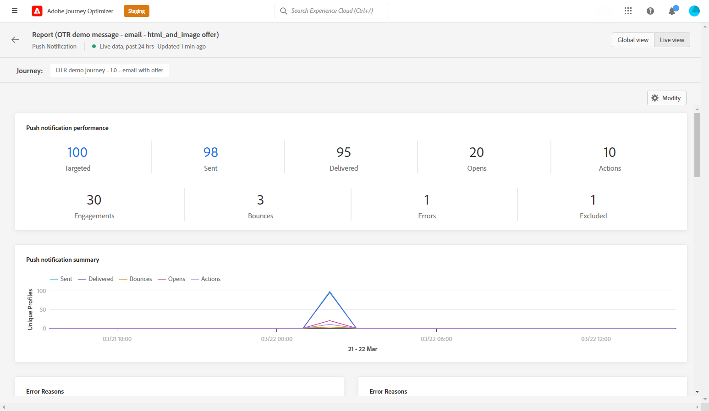

# Relatório ao vivo por push {#push-live-report}

O push **[!UICONTROL Live report]** direciona somente um delivery de push específico.

No **[!UICONTROL Executions]** da guia **[!UICONTROL Messages]** selecione **[!UICONTROL Live view]** em seguida, no menu avançado do delivery selecionado, selecione **[!UICONTROL Live report]**.

O push **[!UICONTROL Live report]** O é dividido em diferentes widgets detalhando o sucesso e os erros do delivery. Cada widget pode ser redimensionado e excluído, se necessário. Para obter mais informações, consulte [seção](live-report.md#modify-dashboard).

**[!UICONTROL Push notification performance]** e **[!UICONTROL Push notification summary]** os widgets detalham as informações principais relativas à sua mensagem com o gráfico e KPIs:

* **[!UICONTROL Sent]**: Número total de envios para o delivery.

* **[!UICONTROL Delivered]**: Número de mensagens enviadas com êxito em relação ao número total de mensagens enviadas.

* **[!UICONTROL Bounces]**: Total de erros acumulados durante o delivery e o processamento automático de retorno em relação ao número total de mensagens enviadas.

* **[!UICONTROL Errors]**: Número total de erros que ocorreram durante um delivery, impedindo que ele fosse enviado a perfis.

* **[!UICONTROL Opens]**: Número de vezes que uma mensagem foi aberta em um delivery.

* **[!UICONTROL Actions]**: Número total de ações na notificação por push entregue, por exemplo, clique no botão ou descarta.

* **[!UICONTROL Engagements]**: Número total de aberturas e ações para essa notificação por push, ou seja, se o perfil abriu o push ou se um botão foi clicado.

O **[!UICONTROL Sending metrics - by push]** tabela detalha o sucesso do delivery:

* **[!UICONTROL Targeted]**: Número de perfis de usuário que se qualificaram como perfis de público-alvo para este delivery.

* **[!UICONTROL Excluded]**: Número de perfis de usuário, excluídos dos perfis segmentados, que não receberam a mensagem.

* **[!UICONTROL Sent]**: Número total de envios para o delivery.

* **[!UICONTROL Delivered]**: Número de mensagens enviadas com êxito em relação ao número total de mensagens enviadas.

* **[!UICONTROL Bounces]**: Total de erros acumulados durante o delivery e o processamento automático de retorno em relação ao número total de mensagens enviadas.

* **[!UICONTROL Errors]**: Número total de erros que ocorreram durante um delivery, impedindo que ele fosse enviado a perfis.

* **[!UICONTROL Opens]**: Número de vezes que uma mensagem foi aberta em um delivery.

O **[!UICONTROL Tracking by platform]**, **[!UICONTROL Sending by platform]** e **[!UICONTROL Breakdown by platform]** gráficos e tabelas detalham o sucesso da sua notificação por push, dependendo do sistema operacional.

O **[!UICONTROL Sending statistics - Failed]** permite que você veja quantos erros e saltos ocorreram.

O **[!UICONTROL Error Reasons]** gráfico e tabela permitem ver qual erro ocorreu durante o delivery.
