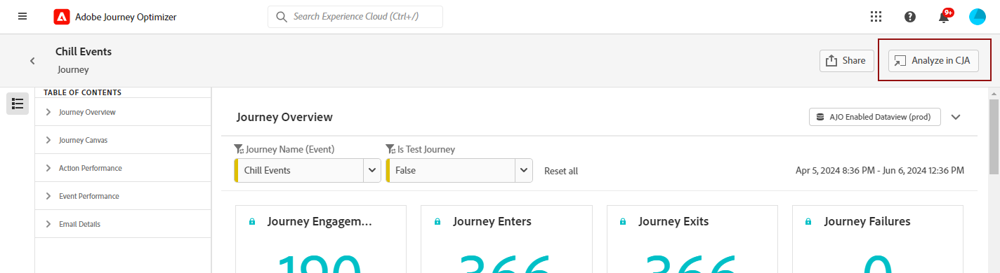
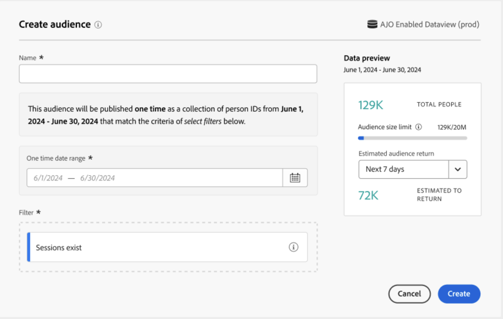
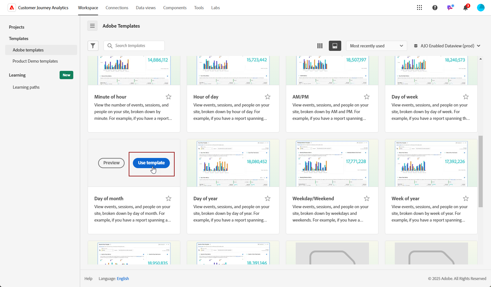
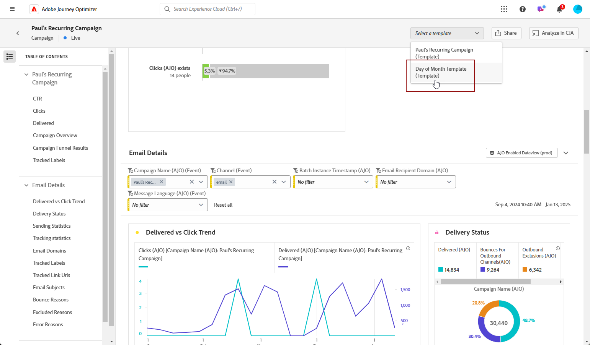

# Gerenciar seus relatórios {#channel-cja-manage}

## Analisar no Customer Journey Analytics {#analyze}

>[!AVAILABILITY]
>
> A funcionalidade **Analisar no CJA** está disponível exclusivamente para usuários com uma licença do [!DNL Customer Journey Analytics].

Melhore sua experiência de análise de dados com sua licença do **[!DNL Customer Journey Analytics]** aproveitando o recurso **[!UICONTROL Analisar no CJA]**, disponível em todos os relatórios.

Essa poderosa opção redireciona você facilmente para o ambiente do **[!DNL Customer Journey Analytics]**, permitindo que você personalize seus relatórios extensivamente. Você pode enriquecer seus widgets com métricas de Customer Journey Analytics especializadas, elevando seus insights a um novo nível.

[Saiba mais sobre a interface Customer Journey Analytics.](https://experienceleague.adobe.com/en/docs/analytics-platform/using/cja-overview/cja-getting-started)

## Definir o período do relatório {#report-period}

Ao acessar um relatório, você pode aplicar um filtro de período de tempo, localizado no canto superior direito do relatório.

Por padrão, o período do filtro para uma campanha ou jornada é definido com suas datas de início e término. Se não houver uma data de término, o filtro assumirá como padrão a data atual.

Para modificar o filtro, é possível selecionar uma data de início e uma duração personalizadas ou escolher entre opções predefinidas, como semana passada ou dois meses atrás.

O relatório será atualizado automaticamente assim que o filtro for aplicado ou modificado.

## Exportar seus relatórios {#export-reports}

É possível exportar facilmente seus diferentes relatórios para formatos PDF ou CSV, o que permite compartilhá-los ou imprimi-los. As etapas para exportar relatórios estão detalhadas nas guias abaixo.

>[!BEGINTABS]

>[!TAB Exportar seu relatório como um arquivo CSV]

1. Em seu relatório, clique em **[!UICONTROL Compartilhar]** e selecione **[!UICONTROL Baixar CSV]** para gerar um arquivo CSV no nível de relatório geral.

   

1. O arquivo é baixado automaticamente e pode ser localizado em seus arquivos locais.

   Se você gerou o arquivo no nível do relatório, ele contém informações detalhadas para cada widget, incluindo seu título e dados.

>[!TAB Exportar seu relatório como um arquivo PDF]

1. No seu relatório, clique em **[!UICONTROL Compartilhar]** e selecione **[!UICONTROL Baixar PDF]**.

   

1. Após o download ter sido solicitado, clique em **[!UICONTROL Download]**.

   

1. O arquivo será aberto automaticamente no navegador.

Seu relatório agora está disponível para visualização, download ou compartilhamento em um arquivo pdf.

>[!ENDTABS]

## Agendar exportações {#schedule-export}

O **Agendar exportação** permite automatizar a entrega de até 10 relatórios em intervalos semanais, mensais ou anuais. Você também pode gerenciar facilmente os relatórios agendados, com opções para atualizar, editar, cancelar ou excluir qualquer uma das exportações agendadas.

1. Em seu relatório, clique em **[!UICONTROL Compartilhar]** e selecione **[!UICONTROL Exportação de agendamento]**.

   

1. Escolha seu **[!UICONTROL Tipo de arquivo]** entre CSV e PDF.

1. Se necessário, você pode adicionar uma **[!UICONTROL Descrição]** à sua exportação.

1. Insira o nome dos recipients que receberão esse delivery automatizado.

   

1. Escolha a **[!UICONTROL Frequência]**.

1. Com base na frequência selecionada, forneça os detalhes de agendamento relevantes, como:

   * Datas iniciais e finais

   * Intervalo (por exemplo, a cada poucas semanas)

   * Dia da semana específico

   * Semana do mês

   * Dia do mês

   * Mês do ano

1. Clique em **[!UICONTROL Enviar conforme agendado]**.

1. Para editar uma exportação agendada criada anteriormente, clique em **[!UICONTROL Compartilhar]** e selecione **[!UICONTROL Gerenciar agendamentos]**.

   

1. Na lista de exportações programadas, escolha a que deseja atualizar e faça as alterações necessárias.

1. Para excluir um relatório agendado, selecione um na lista de agendamentos gerenciados e clique em **[!UICONTROL Excluir]**.

   

## Criar uma métrica simples {#create-simple-metric}

Você pode criar métricas calculadas personalizadas diretamente dos seus relatórios. Você pode gerar insights mais personalizados e analisar melhor seus dados combinando duas métricas existentes de maneiras que se adaptam às suas necessidades específicas de relatórios.

1. Comece acessando o relatório no qual deseja adicionar uma nova métrica.

1. Na tabela do relatório, selecione as métricas desejadas, mantendo pressionadas as teclas `Shift` ou `CTRL/CMD` enquanto clica nelas. Em seguida, clique com o botão direito e selecione **[!UICONTROL Criar métrica a partir da seleção]**.

   Se você selecionar mais de duas métricas, somente as duas primeiras serão usadas no construtor de métricas.

   

1. No Criador de métrica calculada, nomeie sua nova métrica digitando o campo **[!UICONTROL Título]**. Você também pode adicionar uma **[!UICONTROL Descrição]**.

   >[!NOTE]
   >
   >Se você tiver o Customer Journey Analytics, poderá personalizar ainda mais suas métricas com opções adicionais. [Saiba mais](https://experienceleague.adobe.com/en/docs/analytics-platform/using/cja-components/cja-calcmetrics/cm-workflow/cm-build-metrics#areas-of-the-calculated-metrics-builder)

1. Escolha as **[!UICONTROL Casas decimais]** apropriadas e selecione um **[!UICONTROL Formato]** (Decimal, Hora, Porcentagem ou Moeda) com base em como você deseja que sua métrica seja exibida.

1. Selecione o operador, como adição, subtração, multiplicação ou divisão, que determinará como a métrica é calculada.

   

1. Você pode reordenar os componentes, se necessário.

1. Quando estiver satisfeito com suas configurações, clique em **[!UICONTROL Aplicar]** para finalizar sua nova métrica.

1. Sua nova métrica aparecerá ao lado das métricas originais em seu relatório.

   

A métrica recém-criada será incluída ao exportar o relatório como um PDF ou CSV. No entanto, ela será removida do relatório assim que você fechá-lo.

## Explorar dados com a Análise Exploratória {#exploratory}

Use a ferramenta de Análise Exploratória para criar facilmente tabelas e visualizações a partir dos **[!UICONTROL Dimension]** e **[!UICONTROL Métricas]** selecionados. Essa ferramenta simplifica a exploração de dados, permitindo personalizar e analisar informações automaticamente com facilidade. Saiba mais em [esta documentação](https://experienceleague.adobe.com/en/docs/analytics/analyze/analysis-workspace/panels/quickinsight).

1. Comece acessando o relatório no qual deseja usar a Análise Exploratória.

1. Selecione o menu Análise exploratória no menu do painel esquerdo.

   

1. Crie uma consulta escolhendo um **[!UICONTROL Dimension]** e uma **[!UICONTROL Métrica]** usando os menus suspensos. Você também pode selecionar um **[!UICONTROL Segmento]**, se necessário.

   

1. Defina o intervalo de datas da análise para especificar o período em que deseja se concentrar. Por padrão, o intervalo de datas será definido como aquele usado no painel de relatórios.

1. Use as opções **[!UICONTROL Adicionar detalhamento]** ou **[!UICONTROL Adicionar métrica]** para incluir dimensões adicionais, permitindo um detalhamento de dados mais detalhado.

   Observe que você só pode adicionar até três **[!UICONTROL Dimension]**, **[!UICONTROL Métricas]** e **[!UICONTROL Segmentos]**.

Agora você pode analisar seus dados usando suas ferramentas personalizadas de tabela e visualização.

<!--## Create a down-funnel metric {#down-funnel}

1. Create a new journey or open an existing one. [Learn more on journey creation](../building-journeys/journey-gs.md)

1. On the canvas editor, select the option to "add a metric".

c. In the metric selector, choose whichever conversion metric seems appropriate and publish your journey

d. Open the report for the journey that you added the metric to and ensure that the metric has been added to the table alongside all the other pre-configured metrics.
-->

## Criar um público-alvo a partir dos dados de relatórios {#create-audience}

>[!IMPORTANT]
>
>Cada organização está limitada à publicação de 25 públicos-alvo. Além disso, os usuários podem publicar no máximo 5 públicos-alvo por hora e 20 por dia.
> Públicos-alvo únicos têm uma duração de 48 horas. Portanto, se 25 públicos-alvo forem publicados dentro desse período, públicos-alvo adicionais só poderão ser publicados após o período de 48 horas.

Agora é possível selecionar dados específicos na tabela e criar um público-alvo diretamente nessas seleções, simplificando e simplificando o processo de criação de público-alvo.

1. Comece navegando até a tabela de relatório que contém os dados que você deseja transformar em um público-alvo.

1. Clique com o botão direito na célula desejada e selecione **[!UICONTROL Criar público-alvo]**.

   Como alternativa, você pode iniciar a criação de públicos-alvo no widget **[!UICONTROL tela de Jornada]** selecionando um nó e clicando com o botão direito do mouse nele.

1. Na janela **[!UICONTROL Criar público-alvo]**, digite um **[!UICONTROL Nome]** e defina um **[!UICONTROL Intervalo de datas único]** para o público-alvo que você pretende publicar.

   >[!NOTE]
   >
   >Se você tiver o Customer Journey Analytics, poderá personalizar ainda mais suas métricas com opções adicionais. [Saiba mais](https://experienceleague.adobe.com/en/docs/analytics-platform/using/cja-components/audiences/publish)

   

1. Clique no botão **[!UICONTROL Criar]** para finalizar a criação do público-alvo. Observe que esse processo pode levar algum tempo para ser concluído.

Agora você pode continuar a usar o público recém-criado com uma Jornada ou Campanha.

## Gerenciar modelos {#cja-template}

>[!AVAILABILITY]
>
> A funcionalidade **Modelo** é progressivamente implementada em fases, com Disponibilidade Geral completa planejada para o final de janeiro, e disponível exclusivamente para usuários com uma licença [!DNL Customer Journey Analytics].

Agora há a opção de aprimorar os relatórios do Journey Optimizer utilizando modelos de Customer Journey Analytics. [Saiba mais sobre o modelo de Customer Journey Analytics](https://experienceleague.adobe.com/en/docs/analytics-platform/using/cja-workspace/templates/use-templates#use-reports)

Ao acessar seus relatórios, você pode escolher entre dois tipos de modelo na lista suspensa **[!UICONTROL Selecionar um modelo]**:

* modelo padrão fornecido pelo Adobe
* Modelos gerados pelo cliente

Se nenhum modelo tiver sido criado, a lista suspensa **[!UICONTROL Selecionar um modelo]** não aparecerá na interface dos relatórios.

Para criar um template, siga as etapas abaixo:

1. Em [!DNL Customer Journey Analytics], navegue até o menu **[!UICONTROL Workspace]** e selecione **[!UICONTROL modelos de Adobe]**. [Saiba mais sobre os modelos disponíveis](https://experienceleague.adobe.com/en/docs/analytics-platform/using/cja-workspace/templates/use-templates#available-templates)

1. Navegue pelos modelos pré-criados disponíveis e clique em **[!UICONTROL Usar modelo]** para selecionar um.

   

1. Ajuste seu relatório para atender às suas necessidades. Consulte a [documentação do Customer Journey Analytics](https://experienceleague.adobe.com/en/docs/analytics-platform/using/cja-workspace/home).

1. Após a conclusão do modelo personalizado, acesse o menu **[!UICONTROL Projeto]** e selecione **[!UICONTROL Salvar como modelo]**.

   

1. Forneça os detalhes necessários para o modelo. Consulte a [documentação do Customer Journey Analytics](https://experienceleague.adobe.com/en/docs/analytics-platform/using/cja-workspace/templates/create-templates#edit-or-delete-a-template) para obter informações detalhadas.

   >[!IMPORTANT]
   >
   > Escolha **Journey Optimizer** em **[!UICONTROL Casos de uso]** e especifique o **tipo de atividade do Journey Optimizer** e a **atividade** correspondentes. Isso permite que seu relatório seja exibido no Journey Optimizer.

   

1. Em [!DNL Journey Optimizer], no seu relatório, acesse o relatório e escolha o modelo criado anteriormente na lista suspensa **[!UICONTROL Selecionar um modelo]**.

   

Para criar um modelo diretamente do seu relatório do otimizador de Jornadas, basta acessar o relatório de campanha ou jornada, selecionar **[!UICONTROL Analisar no CJA]** e personalizar o modelo padrão seguindo as etapas descritas acima.
