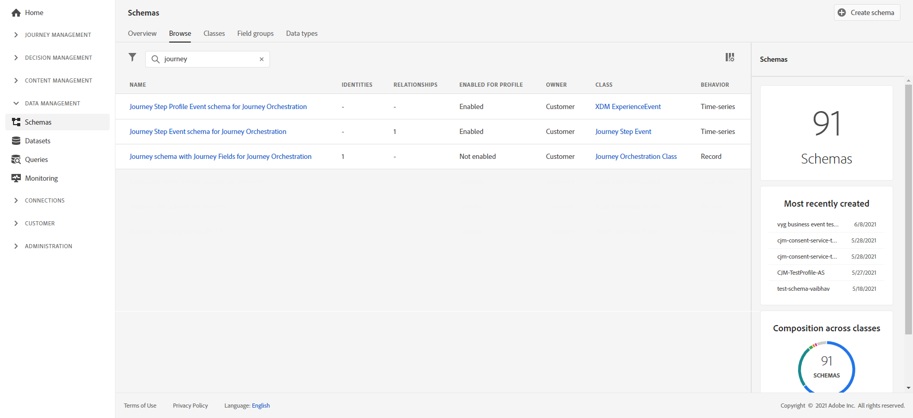
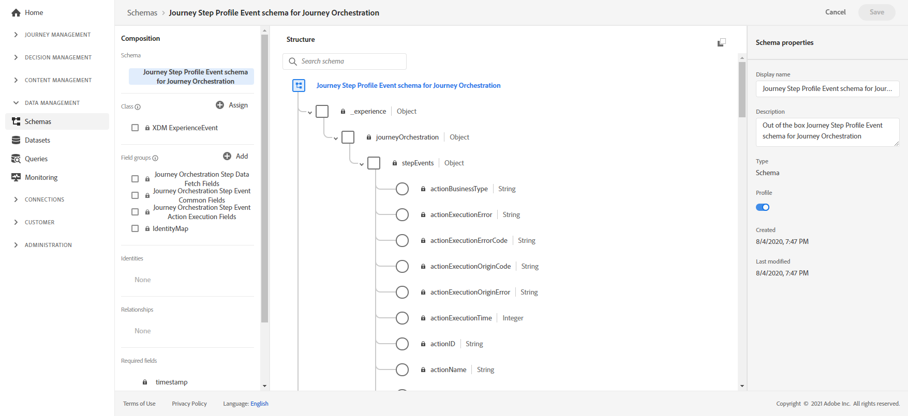
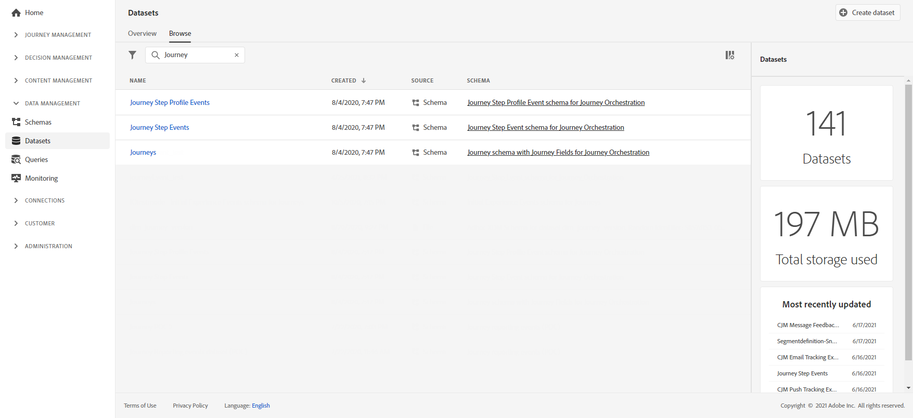

# Criar relatórios de jornada {#design-jo-reports}

Além dos [relatórios em tempo real](live-report.md) e dos [recursos de relatórios](report-gs-cja.md) internos, o [!DNL Journey Optimizer] pode enviar automaticamente dados de desempenho do jornada para a Adobe Experience Platform, para que ele possa ser combinado com outros dados para fins de análise.

>[!NOTE]
>
>Esse recurso é ativado por padrão em todas as instâncias para eventos de etapas de jornada. Não é possível modificar ou atualizar os esquemas e conjuntos de dados que foram criados durante o provisionamento para eventos da etapa. Por padrão, esses esquemas e conjuntos de dados estão no modo somente leitura.

Por exemplo, você configurou uma jornada que envia vários emails. Esse recurso permite combinar dados do [!DNL Journey Optimizer] com dados de eventos downstream, como quantas conversões ocorreram, quanto de engajamento aconteceu no site ou quantas transações ocorreram no armazenamento. As informações da jornada podem ser combinadas com dados no Adobe Experience Platform, a partir de outras propriedades digitais ou de propriedades offline, para fornecer uma visualização mais abrangente do desempenho.

O [!DNL Journey Optimizer] cria automaticamente os esquemas e fluxos necessários em conjuntos de dados para a Adobe Experience Platform para cada etapa que um indivíduo realiza em uma jornada. Um evento de etapa corresponde a um indivíduo movendo-se de um nó para outro em uma jornada. Por exemplo, em uma jornada que tenha um evento, uma condição e uma ação, os eventos de três etapas são enviados para o Adobe Experience Platform.

>[!NOTE]
>
>Além dos eventos de etapa no nível do perfil, o sistema também gera eventos internos para atividades de **Ler público**. Esses eventos, chamados de `segmentExportJob` eventos, registram o ciclo de vida do nó Read Audience (como criação de trabalho de exportação, enfileiramento, conclusão e erros) e são gerados por atividade Read Audience, não por perfil individual. Como resultado, esses eventos podem não ter um identificador de perfil associado (UPMID). Esses eventos internos são úteis para monitorar e solucionar problemas de desempenho de Leitura de Público e podem ser consultados usando os campos documentados na [seção serviceEvents](../reports/sharing-field-list.md#servicevents-field). Para obter exemplos de consulta sobre como trabalhar com eventos segmentExportJob, consulte [Consultas relacionadas ao Público-alvo de Leitura](../reports/query-examples.md#read-segment-queries).

Há casos em que vários eventos podem ser criados para o mesmo nó. Por exemplo, no caso da atividade Wait:

* Um evento é gerado quando o perfil entra na espera (o atributo journeyNodeProcessed é igual a false)
* Um evento é gerado quando o perfil sai dele (o atributo journeyNodeProcessed é igual a true)

A lista de campos XDM transmitidos é abrangente. Alguns contêm códigos gerados pelo sistema e outros têm nomes amigáveis legíveis. Os exemplos incluem o rótulo da atividade de jornada ou o status da etapa: quantas vezes uma ação atingiu o tempo limite ou terminou com erro.

>[!CAUTION]
>
>Os conjuntos de dados não podem ser ativados para o serviço de perfil em tempo real. Verifique se a opção de alternância **[!UICONTROL Perfil]** está desativada.

[!DNL Journey Optimizer] envia dados conforme ocorrem, em streaming. Você pode consultar esses dados usando o Serviço de consulta. É possível conectar-se ao Customer Journey Analytics ou a outras ferramentas de BI para visualizar dados relacionados a essas etapas.

Os seguintes esquemas são criados:

* Esquema de Evento de Etapa de Jornada para [!DNL Journey Orchestration] - Evento de etapa de Jornada vinculado a Metadados de Jornada.
* Esquema de Jornada com Campos de Jornada para [!DNL Journey Orchestration] - Jornada Metadados para descrever Jornadas.

Os seguintes conjuntos de dados são transmitidos:

* Jornada eventos de etapa
* Jornadas

As listas de campos XDM transmitidas para o Adobe Experience Platform estão detalhadas aqui:

* [Lista de campos de evento de etapa](../reports/sharing-field-list.md)
* [Campos de eventos de etapas herdados](../reports/sharing-legacy-fields.md)

## Integração com o Customer Journey Analytics {#integration-cja}

Os eventos de etapa [!DNL Journey Optimizer] podem ser vinculados a outros conjuntos de dados no [Adobe Customer Journey Analytics](https://experienceleague.adobe.com/pt-br/docs/analytics-platform/using/cja-overview/cja-b2c-overview/cja-overview){target="_blank"}.

O fluxo de trabalho geral é:

* [!DNL Customer Journey Analytics] assimila o conjunto de dados de &quot;Evento de etapa de Jornada&quot;.
* O campo **profileID** no esquema associado de &quot;Evento de Etapa de Jornada para Journey Orchestration&quot; está definido como um campo de Identidade. Em [!DNL Customer Journey Analytics], você pode vincular esse conjunto de dados a qualquer outro que tenha o mesmo valor que o identificador baseado em pessoa.
* Para usar este conjunto de dados no [!DNL Customer Journey Analytics], para análise de jornada entre canais, consulte a [documentação do Customer Journey Analytics](https://experienceleague.adobe.com/docs/analytics-platform/using/cja-usecases/cross-channel.html){target="_blank"}.

➡️ [Trabalhar com o Customer Journey Analytics](cja-ajo.md){target="_blank"}
