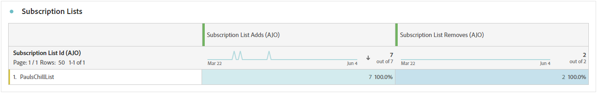

# Relatório de assinaturas {#subscription-report-global-cja}

O **Relatório de assinatura** oferece informações essenciais sobre assinaturas e cancelamentos de assinaturas de perfis associados a listas específicas, ajudando você a entender a eficácia de diferentes campanhas e iniciativas de assinatura na geração de engajamento e conversões.

Para acessar seus relatórios, clique no ícone **[!UICONTROL Relatório]** da lista de assinaturas selecionada no menu avançado.

Para saber mais sobre o espaço de trabalho do Customer Journey Analytics e como filtrar e analisar dados, consulte [esta página](https://experienceleague.adobe.com/en/docs/analytics-platform/using/cja-workspace/home).

## Adições à lista de assinaturas

O KPI **[!UICONTROL Lista de assinaturas adicionada]** fornece uma visão geral abrangente do número total de assinaturas adquiridas durante o período especificado. Essa métrica destaca o crescimento e a aquisição de novos assinantes, oferecendo insights valiosos sobre a eficácia de suas campanhas ou iniciativas de assinatura.

## A lista de assinaturas remove

O KPI **[!UICONTROL Subscription list remove]** e fornece um detalhamento do número total de cancelamentos de subscrições ocorridos durante o período especificado. Essa métrica oferece insights valiosos sobre o desengajamento do assinante.

## Crescimento das subscrições ao longo do tempo

O gráfico **[!UICONTROL Crescimento das assinaturas ao longo do tempo]** mostra visualmente o progresso das assinaturas durante o período especificado, fornecendo uma compreensão clara de como a sua base de assinantes evoluiu.

* **[!UICONTROL Inclusões na lista de assinaturas]**: número total de assinaturas do período relacionado.

* **[!UICONTROL A lista de assinaturas remove]**: Número total de cancelamentos de assinaturas do período relacionado.

* **[!UICONTROL Crescimento da lista de assinaturas]**: taxa na qual a lista de assinantes está crescendo durante um período específico.

## Listas de assinaturas

A tabela **[!UICONTROL Listas de assinaturas]** fornece informações essenciais sobre suas assinaturas e cancelamentos de assinaturas de perfis associados a listas de assinaturas específicas. Essas informações ajudam você a entender a eficácia de diferentes listas de assinaturas na promoção do engajamento e das conversões.

* **[!UICONTROL Inclusões na lista de assinaturas]**: número total de assinaturas do período relacionado.

* **[!UICONTROL A lista de assinaturas remove]**: Número total de cancelamentos de assinaturas do período relacionado.

## Jornadas

A tabela **[!UICONTROL Jornada]** oferece uma exibição extensa, apresentando detalhes complexos das assinaturas dos visitantes como parte da jornada do usuário.

* **[!UICONTROL Inclusões na lista de assinaturas]**: número total de assinaturas do período relacionado.

* **[!UICONTROL A lista de assinaturas remove]**: Número total de cancelamentos de assinaturas do período relacionado.

## Campanhas

A tabela **[!UICONTROL Campanhas]** oferece informações valiosas sobre assinaturas e cancelamentos de assinaturas de seus perfis acionados por campanhas específicas. Essa visualização abrangente permite medir a eficácia de suas campanhas e rastrear o engajamento com o conteúdo da sua página de aterrissagem de maneira eficaz.

* **[!UICONTROL Inclusões na lista de assinaturas]**: número total de assinaturas do período relacionado.

* **[!UICONTROL A lista de assinaturas remove]**: Número total de cancelamentos de assinaturas do período relacionado.

## Canal

A tabela **[!UICONTROL Canal]** exibe o número de assinaturas de perfis e de cancelamentos de assinaturas categorizadas por cada canal.

* **[!UICONTROL Inclusões na lista de assinaturas]**: número total de assinaturas do período relacionado.

* **[!UICONTROL A lista de assinaturas remove]**: Número total de cancelamentos de assinaturas do período relacionado.
