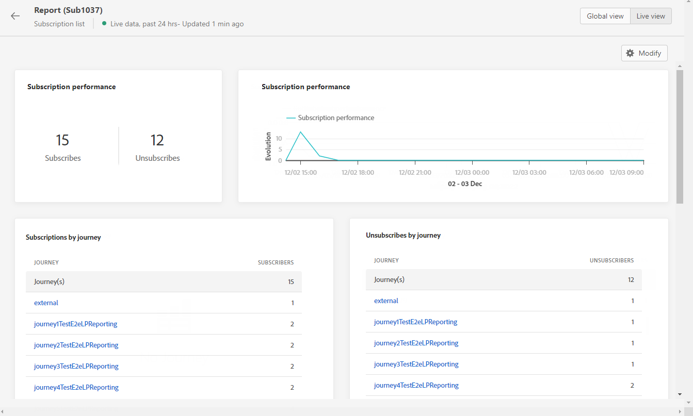

# Relatório ao vivo da assinatura {#subscription-report-live}

A assinatura **[!UICONTROL Live report]** O exibe detalhes sobre a atividade dos assinantes somente nas últimas 24 horas. Para medir suas subscrições por um período selecionado, consulte [Relatório global de subscrição](subscription-report-global.md).

Para acessar os relatórios, selecione **[!UICONTROL Live report]** no menu avançado da lista de assinaturas selecionada.

A assinatura **[!UICONTROL Live report]** O é dividido em diferentes widgets detalhando suas assinaturas e unsubscriptions. Cada widget pode ser redimensionado e excluído, se necessário. Para obter mais informações, consulte [seção](live-report.md).

O **[!UICONTROL Subscription performance]** KPIs e o **[!UICONTROL Subscriptions by journey]**/**[!UICONTROL Unsubscribes by journey]** as tabelas detalham as informações principais relativas ao envolvimento dos visitantes com a página de aterrissagem. As tabelas e os KPIs contêm os dados disponíveis relacionados à página de aterrissagem, como:

* **[!UICONTROL Subscribes]**: Número total de subscrições nas últimas 24 horas.

* **[!UICONTROL Unsubscribes]**: Número total de cancelamentos de subscrições nas últimas 24 horas.

O **[!UICONTROL Subscription performance]** gráfico mostra a evolução das subscrições nas últimas 24 horas.

O **Subscrições - Detalhamento** e **Cancelamentos de assinatura - Detalhamento** Os gráficos representam o número total de pessoas que assinaram ou cancelaram a assinatura nas últimas 24 horas, dependendo das mensagens, das páginas de aterrissagem e dos canais.

