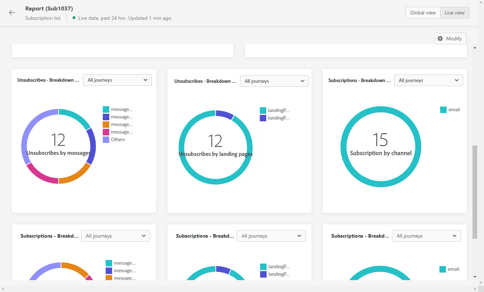

# Relatório ao vivo de inscrições {#subscription-report-live}

>[!CONTEXTUALHELP]
>id="ajo_subscription_live_report"
>title="Relatório ao vivo de inscrições"
>abstract="O relatório em tempo real de inscrições permite medir e visualizar em tempo real a atividade de inscritos somente nas últimas 24 horas. O relatório é dividido em diferentes widgets detalhando inscrições e cancelamentos de inscrição. Cada painel de relatórios pode ser modificado redimensionando ou removendo widgets."

Os relatórios em tempo real, acessíveis a partir da guia Últimas 24 horas, exibem eventos que ocorreram nas últimas 24 horas, com um intervalo mínimo de dois minutos a partir da ocorrência do evento. Em comparação, os relatórios de Customer Journey Analytics se concentram em eventos que ocorreram há pelo menos duas horas e abrangem eventos durante um período selecionado.

Para acessar seus relatórios, clique no ícone **[!UICONTROL Relatório]** da lista de assinaturas selecionada.

O **[!UICONTROL Relatório ao vivo]** da assinatura é dividido em widgets diferentes detalhando suas assinaturas e unsubscriptions. Cada widget pode ser redimensionado e excluído, se necessário. Para obter mais informações, consulte esta [seção](live-report.md).

Os KPIs de **[!UICONTROL Desempenho da assinatura]** e as tabelas de **[!UICONTROL Assinaturas por jornada]**/**[!UICONTROL Cancelamentos de assinatura por jornada]** detalham as principais informações relativas ao envolvimento dos visitantes com a página de aterrissagem. As tabelas e os KPIs contêm os dados disponíveis relacionados à sua página de aterrissagem, como:

* **[!UICONTROL Assinaturas]**: número total de assinaturas nas últimas 24 horas.

* **[!UICONTROL Cancelamentos de assinatura]**: Número total de cancelamentos de assinatura nas últimas 24 horas.

O gráfico de **[!UICONTROL Desempenho da assinatura]** mostra a evolução das assinaturas nas últimas 24 horas.

Os gráficos **Assinaturas - Detalhamento** e **Cancelamentos de Assinatura - Detalhamento** representam o número total de pessoas que assinaram ou cancelaram assinaturas nas últimas 24 horas, dependendo das mensagens, páginas de aterrissagem e canais.
