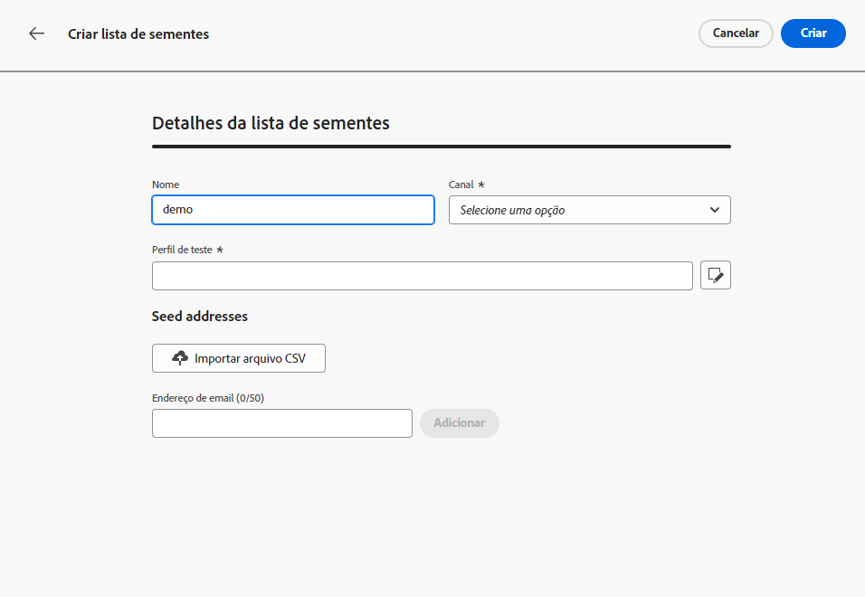

# Notas de versão antecipadas {#e-release-notes}

O [!DNL Adobe Journey Optimizer] fornece continuamente novos recursos, melhorias para os recursos existentes e correções de erros. Todas as alterações são consolidadas na última semana de cada mês nas [notas de versão](release-notes.md).

As notas de versão antecipadas abaixo estão sujeitas a alterações sem aviso prévio até a data de disponibilidade do lançamento. Links, telas e documentação atualizada são publicados nas [notas de versão](release-notes.md), na data de lançamento.

## Notas de versão antecipadas de agosto de 2023 {#aug-rn-2023}

**Data de lançamento**: 23-24 de agosto de 2023

### Novos recursos{#aug-2023-features}

Essa versão traz os novos recursos listados abaixo.

<table>
<thead>
<tr>
<th><strong>Enviar mensagens no aplicativo em suas jornadas</strong> </th>
</tr>
</thead>
<tbody>
<tr>
<td>

Agora é possível enviar mensagens personalizadas no aplicativo para os usuários e usuárias em uma campanha. Use o Journey Optimizer para criar notificações e personalizar o layout, a exibição, o texto e os botões das mensagens para criar uma experiência perfeita.

Para obter mais informações, consulte a <a href="../in-app/get-started-in-app.md">documentação detalhada</a>.

</tr>
</tbody>
</table>

<table>
<thead>
<tr>
<th><strong>Validação de seus emails com listas de seeds</strong> </th>
</tr>
</thead>
<tbody>
<tr>
<td>

Agora é possível criar e gerenciar listas de seeds no Journey Optimizer. Uma lista de propagação consiste em endereços internos que podem ser adicionados ao público-alvo real e receber exatamente a mesma mensagem que os perfis direcionados no tempo de execução do delivery. Use esse recurso para monitorar as comunicações enviadas e garantir que todos os formatos de exibição, URLs, imagens e links estejam corretos.

<!--p>For more information, refer to the <a href="../audience/get-started-audience-orchestration.md">detailed documentation</a>.</p-->
</td>
</tr>
</tbody>
</table>

<!--table>
<thead>
<tr>
<th><strong>Generate text and images with the Content assistant</strong> </th>
</tr>
</thead>
<tbody>
<tr>
<td>

Once you have created and personalized your message, take your content to the next level with the Content assistant. You can now use the Content assistant to optimize your message's impact by experimenting with different main titles, and images. Each variant is managed as a unique Treatment, to measure and compare which title effectively generates more clicks.

This capability is currently available as a private beta.

For more information, refer to the <a href="../start/search-filter-categorize.md#tags">detailed documentation</a>.

</td>
</tr>
</tbody>
</table-->

### Melhorias {#aug-2023-improvements}

Esta versão vem com as melhorias listadas abaixo.

**APIs**

Uma nova API para criar e gerenciar Fragmentos de conteúdo agora está disponível. [Saiba mais](https://developer.adobe.com/journey-optimizer-apis/references/content-templates/#tag/Content-fragment-API){target="_blank"}.

**Canal de email**

Uma nova opção está disponível nas configurações da superfície do email para incluir endereços de email suprimidos devido a reclamações de spam nos públicos-alvo de mensagens transacionais. Mesmo que marquem mensagens de marketing como spam, esses perfis poderão receber mensagens transacionais, como redefinição de senha ou declarações de conta. Essa opção está desabilitada por padrão.

**Jornadas**

* Agora é possível aproveitar as respostas de chamada da API em ações personalizadas e orquestrar sua jornada com base nessas respostas. No momento, esse recurso está disponível como um private beta.
<!--* A new type of system alert has been introduced. You can now get notified when a custom action fails.
* When duplicating a journey, you can now define the name of the journey copy.-->

**Correspondência direta**

* O Azure agora pode ser selecionado como o tipo de servidor na configuração de roteamento de arquivos.
* O E comercial agora está disponível como campo separador de coluna nas configurações de superfície de correspondência direta.