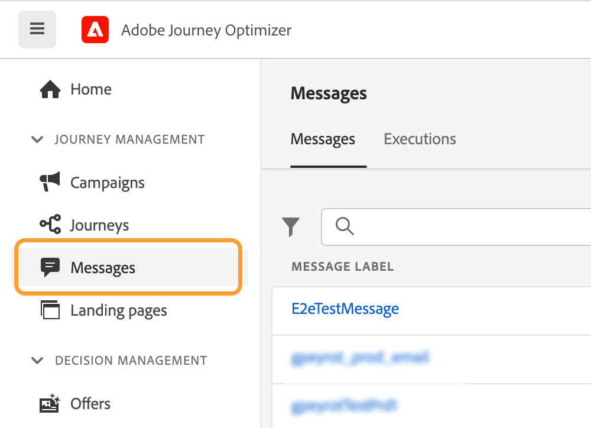
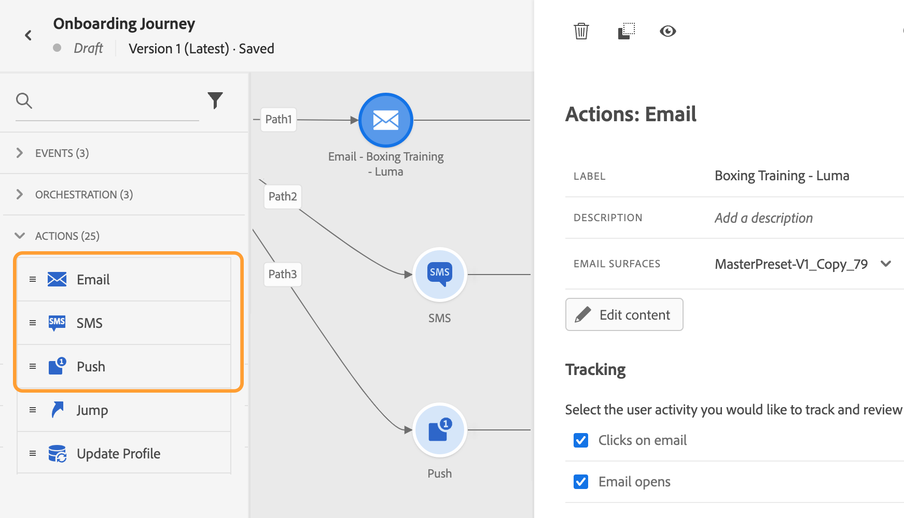

# Visão geral da migração de criação em linha{#inline-authoring}

>[!CONTEXTUALHELP]
>id="ajo_messages_migration_before"
>title="Saiba mais sobre o novo recurso de criação em linha"
>abstract="A partir de 25 de julho de 2022, as mensagens serão criadas diretamente de uma Jornada. As mensagens existentes são migradas automaticamente para o novo modelo. Ações adicionais serão necessárias após a migração, se você usar mensagens em suas jornadas."
>additional-url="https://experienceleague.adobe.com/docs/journey-optimizer/using/whats-new/inline-authoring/inline-messages-steps.html" text="Etapas de migração"

>[!CONTEXTUALHELP]
>id="ajo_messages_migration_during"
>title="Saiba o que está acontecendo"
>abstract="A partir de 25 de julho de 2022, as mensagens serão criadas diretamente de uma Jornada. Seu ambiente está sendo migrado. Ações adicionais serão necessárias após a migração, se você usar mensagens em suas jornadas."
>additional-url="https://experienceleague.adobe.com/docs/journey-optimizer/using/whats-new/inline-authoring/inline-messages-steps.html" text="Etapas de migração"

>[!CONTEXTUALHELP]
>id="ajo_messages_migration_after"
>title="Saiba como migrar suas mensagens"
>abstract="A partir de 25 de julho de 2022, as mensagens serão criadas diretamente de uma Jornada. As mensagens existentes foram migradas para o novo modelo. Como profissional de jornada, agora são necessárias ações adicionais para jornadas que usam mensagens."
>additional-url="https://experienceleague.adobe.com/docs/journey-optimizer/using/whats-new/inline-authoring/inline-messages-steps.html" text="Etapas de migração"

>[!CONTEXTUALHELP]
>id="ajo_messages_depecrated_inventory"
>title="Saiba como migrar suas mensagens"
>abstract="A partir de 25 de julho de 2022, o menu Mensagens desaparecerá e as mensagens serão criadas diretamente de uma Jornada. Se você quiser reutilizar suas mensagens herdadas no jornada, é necessário salvá-las como modelos."
>additional-url="https://experienceleague.adobe.com/docs/journey-optimizer/using/design/email-templates.html#save-as-template" text="Salvar mensagens como modelos"

O Adobe Journey Optimizer está lançando um novo recurso que melhora a maneira como você cria conteúdo para canais do Journey Optimizer (email, push, SMS). Como profissional da Journey Optimizer, agora você cria e cria suas mensagens diretamente de uma jornada.

Esse recurso requer uma migração de jornadas existentes que estejam usando mensagens. Nesta página, você encontrará as informações necessárias sobre essa alteração, bem como as etapas necessárias.

Para obter mais informações sobre suas funções e responsabilidades como administrador da Journey Optimizer, consulte esta seção [página](../start/path/marketer.md).

<!--
Here are the main changes in the interface:

* Messages are created direcly from journeys.
* The **Messages** entry in the left navigation menu has been removed. 
* There is no separate library of messages, the journey now centralizes all components.

-->

>[!VIDEO](https://video.tv.adobe.com/v/344698)

## Captura de chaves{#keys}

* **Eu fui afetado?**: você será afetado se criar mensagens do **Mensagens** no menu de navegação esquerdo e use-os em suas jornadas. Se estiver usando um sistema de terceiros (como o Adobe Campaign), você não será afetado por essa migração.

* **Alterações do produto**: no GA (25 de julho), o conteúdo do seu canal é criado e gerenciado em cada jornada. O **Mensagens** no menu de navegação esquerdo , a navegação à esquerda não está mais disponível ([saiba mais](../rn/inline-messages.md#change)). Prosseguiremos com a migração de suas jornadas existentes.

* **Linha do tempo**: a migração ocorre para cada região durante a noite, por meio de várias [iterações](../rn/inline-messages.md#iterations).

   

* **Ações necessárias**: uma conversão automática de jornadas é executada para você. Dito isto, precisamos da vossa ajuda com alguns passos. Saiba mais sobre as etapas necessárias nesta seção [página](../rn/inline-messages-steps.md).

* **Descontinuação**: após o dia 6 de setembro, todas as jornadas que ainda usarem mensagens herdadas serão interrompidas e serão excluídas posteriormente.

## Benefícios e alterações do produto{#change}

O Adobe é capaz de simplificar continuamente os fluxos do produto. Essa nova maneira de criar mensagens traz um processo de usuário mais simplificado.

Criamos esse novo fluxo de trabalho para centralizar o conteúdo em um local, diretamente onde ele é usado.

A criação de conteúdo agora é executada diretamente na jornada. O imediato **benefícios** você obtém:

* Criação de jornadas mais rápida usando canais Journey Optimizer em um único fluxo.
* Visualização rápida do conteúdo ao alternar facilmente entre todo o conteúdo de email, push e SMS em uma jornada.
* Fluxo aprimorado para emails e push usando personalização contextual da tela.
* O relatório do Jornada centraliza informações detalhadas de relatório de canal.

Aqui estão os **alterações do produto** trazido por este novo recurso:

<table>
<tr>
<th>Antes da migração</th>
<th>Após a migração</th>
</tr>
<tr>
<td>
Antes, você criava a mensagem da <strong>Mensagens</strong> menu. 
</td>
<td>
Agora, o <strong>Mensagens</strong> no menu de navegação esquerdo, não está mais disponível. 
</td>
</tr>
<tr>
<td>
Em seguida, você criou uma jornada, adicionou uma <strong>Mensagem</strong> e selecionou a mensagem criada anteriormente.
</td>
<td>
Agora basta adicionar a atividade de ação de canal desejada (email, SMS, push) à jornada. Na atividade , você configura diretamente os parâmetros da mensagem e acessa o editor de conteúdo.
</td>
</tr>
<tr>
<td>
Antes, os relatórios ficavam acessíveis tanto em nível de mensagem quanto de jornada. Era necessário navegar entre a guia de execução da mensagem e o relatório de jornada.
</td>
<td>
Todos os relatórios agora estão centralizados no nível da jornada. Isso melhora a navegação e a experiência do usuário. Quando você tem vários emails em uma jornada, é possível usar a variável <strong>Ação</strong> menu suspenso para exibir o relatório relacionado.

</td>
</tr>
</table>

No GA (25 de julho), esse novo fluxo de usuários se aplica a todas as novas jornadas. O **Mensagens** no menu de navegação esquerdo, não está mais disponível.

## Linha do tempo da migração{#iterations}

É necessária uma migração para transformar suas jornadas existentes usando **Mensagens** em jornadas com ações criadas em linha. Uma conversão automática de jornadas é executada para você. Dito isto, precisamos da vossa ajuda com alguns passos.

A migração ocorre para cada região durante a noite, por meio de várias iterações. Esta é a linha do tempo da migração:

* 25 de julho de 2022: GA - 1ª iteração
* 1º de agosto de 2022: Segunda iteração
* 5 de setembro de 2022: Terceira iteração
* 6 de setembro de 2022: desaprovação

Por que precisamos de múltiplas iterações?

Durante uma iteração, passamos por cada jornada e os migramos quando possível. Há casos em que não queremos migrar automaticamente: quando a jornada estiver ativa (o que significa que ainda pode haver perfis nela). Nesses casos, solicitamos que você execute uma ação e, em seguida, a próxima iteração migrará essas jornadas que não puderam ser migradas na iteração anterior.

## Perguntas frequentes {#faq}

### Como serei informado sobre a mudança?{#inform}

O Adobe se comunica com você antes da primeira iteração.

A alteração é implantada da noite para o dia, por meio de várias iterações. Saiba mais sobre [iterações](../rn/inline-messages.md#inline-authoring).

Você também é informado por notificações no produto, exibidas nas telas do Jornada:

* Antes de alterar a implantação

   

* Durante uma iteração

   

* Após uma iteração

   

   Após uma iteração, a variável **Verificar status** é exibido. Isso permite exibir todas as jornadas no formato JSON e seu respectivo status de migração. Veja isso [seção](../rn/inline-messages.md#status).

* Quando o banner desaparecer, você estará pronto. Não é necessária mais nenhuma ação da sua parte.

### Qual é o processo de migração?{#process}

A migração é totalmente automática para jornadas que não estão ativas ou fechadas. Não queremos afetar jornadas ativas ou fechadas para evitar qualquer impacto na produção. Pedimos que você publique a nova versão que criamos para você.

Todas as sandboxes de um ORG do cliente são processadas simultaneamente. Durante a implantação de alteração, as seguintes ações são executadas:

**QUALQUER jornada que não use mensagens**

Elas não são afetadas pela alteração. Somente as jornadas que usam mensagens são direcionadas pela migração. No entanto, você ainda poderá acessar mensagens que não são usadas em uma jornada por meio do seguinte URL: https://experience.adobe.com/#/@[ORG]/sname:[SANDBOX]/jornada-otimizer/messages/

**JORNADAS RASCUNHO utilizando pelo menos uma mensagem**

As versões de rascunho de mensagens são modificadas durante a migração. Eles não fazem mais referência a uma mensagem. O **Mensagem** As atividades do são substituídas pelas atividades de ação de canal apropriadas. Cada um deles inclui os parâmetros de canal e o conteúdo.

Como de costume, teste sua jornada de rascunho antes de publicá-la.

**JORNADAS AO VIVO usando pelo menos uma mensagem**

A versão ao vivo de uma jornada continua em execução para evitar qualquer impacto na produção.

Uma nova versão de rascunho dessa jornada é criada durante a migração. Esta nova versão de rascunho é uma cópia da sua versão ao vivo, mas as mensagens são substituídas por ações de canal criadas em linha. Cada atividade de ação de canal inclui os parâmetros e o conteúdo do canal. O conteúdo não é perdido. A criação de relatórios não é perdida.

Esperamos que você revise essa versão de rascunho, a teste e a publique para que ela se torne a versão em tempo real.

**JORNADAS CONCLUÍDAS ou PARADAS usando pelo menos uma mensagem**

Essas jornadas também são migradas.

Ao analisar o relatório de jornada, os relatórios agora são mais ricos e incluem o nível de informações anteriormente disponíveis no relatório de mensagem.

**Jornadas FECHADAS usando pelo menos uma mensagem**

A versão fechada de uma jornada continua em execução para qualquer perfil dentro, para evitar qualquer impacto na produção.

As jornadas fechadas são automaticamente alternadas para o status &quot;Concluído&quot; após 30 dias. Eles serão considerados na próxima iteração, quando estiverem concluídos.

**Jornadas de vários canais**

Eles não são migrados. Você precisa recriá-los.

### Quais são meus itens de ação como cliente?{#actions}

Uma conversão automática de jornadas é executada para você, mas algumas etapas são necessárias. Saiba mais sobre as etapas necessárias nesta seção [página](../rn/inline-messages-steps.md).

<!--

The process timeline is indicated in a blue banner on the Journeys screen. See this [section](../rn/inline-messages.md#inform). 

**Before migration**

* Check the date indicated in the banner. 
* Stop non-critical journeys, on development, stage and production environments.
* If you have draft messages that you want to keep using, add them to a journey so they are migrated.

**During migration**

* Migration occurs at night-time
* Do not to create, edit or delete journeys.

**After migration**

* After each iteration, click the **Check status** button in the top banner. This page lists all journeys and their migration status. See this [section](../rn/inline-messages.md#status). 

* For each live journey, a new version is created. Review the new version, test it and publish it. 

* The **Messages** menu, in the left navigation is no longer available. You need to use the new in-line message feature. See this [section](../rn/inline-messages.md#change). 

* If you need to access a specific message which was not used in a journey, you can use this URL and save the content as a template: https://experience.adobe.com/#/@[ORG]/sname:[SANDBOX]/journey-optimizer/messages/

## How can I check the migration status?{#status}

Click the **Check status** button in the top banner. The following page is displayed.

The status report is at sandbox level. This report includes several useful sections:

**migrationStatus**

This section displays the migration information since the first iteration. Numbers are incremented after each iteration.

* MIGRATED: number of draft journeys migrated successfully.
* NEW_VERSION_CREATED: number of live journeys migrated. For each live journey, a new draft version is created: you must test and publish this version.
* ERROR: number of draft journeys not migrated because of a failure. You need to re-create them.
* ERROR_ON_NEW_VERSION_CREATION: number of live journeys not migrated because of a failure. new draft journey versions not migrated because of a failure. You need to re-create them.

**eligibilityStatus**

This section lists the remaining items after the last iteration:

* toMigrate: number of draft journeys that need to be migrated.
* createNewVersion: number of live journeys to migrate.
* noMigration_live: number of live journeys that do not need to be migrated
* noMigration: number of draft journeys that do not need to be migrated.

The **details** section gives, for each of the above indicators, the list of related journeys.

-->

### Como posso verificar o status da migração?{#status}

Clique no botão **Verificar status** no banner superior. A página a seguir é exibida.

O relatório de status está no nível da sandbox. Este relatório inclui várias seções úteis:

**migrationStatus**

Esta seção exibe as informações de migração desde a primeira iteração. Os números são aumentados após cada iteração.

* MIGRADO: número de jornadas de rascunho, concluídas e interrompidas migradas com êxito.
* NEW_VERSION_CREATED: número de jornadas ativas migradas. Para cada jornada ao vivo, uma nova versão de rascunho é criada: você deve testar e publicar essa versão.
* ERRO: número de jornadas de rascunho, concluídas e interrompidas não migradas devido a uma falha. Você precisa recriá-los.
* ERROR_ON_NEW_VERSION_CREATION: número de jornadas ativas não migradas devido a uma falha. novas versões de jornada de rascunho não migradas devido a uma falha. Novas versões de rascunho não foram criadas para elas. Você precisa recriá-los manualmente.

**eligentStatus**

Esta seção lista os itens restantes após a última iteração:

* paraMigrar: número de jornadas de rascunho, concluídas e interrompidas que precisam ser migradas.
* createNewVersion: número de jornadas ativas para migrar.
* noMigration_live: número de jornadas ativas que não precisam ser migradas. Jornadas fechadas também estão listadas aqui.
* noMigration: número de jornadas que não precisam ser migradas.

O **detalhes** Essa seção fornece, para cada uma das seções acima, a lista de jornadas relacionadas.

### Essa mudança causará interrupção de serviço?{#interruption}

Não haverá interrupção de serviço.

* Em jornadas ao vivo: sem impacto, eles continuam correndo.
* Em jornadas criadas: durante a migração (à noite), recomendamos não criar, editar ou excluir jornadas.

### Haverá perda de dados? {#data}

Não haverá perda de dados nem impacto nas jornadas ativas. Você estará controlando a publicação de versões atualizadas do jornada.

### Haverá perda de funcionalidade?{#functionality}

Haverá uma mudança na maneira como você cria a mensagem. Não haverá perda de funcionalidade.

### Haverá acesso ao ambiente durante o processo de migração?

A migração ocorre à noite. Você poderá usar o produto. Mas não crie, edite ou exclua jornadas.

### As mensagens continuarão a ser enviadas?

Sim, as jornadas ao vivo continuam correndo.

### Como saber se a migração foi concluída?

A migração é concluída quando o banner desaparece. Veja isso [seção](../rn/inline-messages.md#inform).

### Como as permissões relacionadas a mensagens serão afetadas?

O recurso de criação em linha afetará as permissões. Todas as permissões relacionadas a mensagens, como [!DNL View Messages] ou [!DNL Manage Messages], serão incluídas automaticamente nas permissões vinculadas ao recurso Jornada.

Saiba mais nesta seção [página](../administration/ootb-product-profiles.md).

<!--
* Improved authoring flow and navigation
* Personalization: improved contextual personalization flow
* Reporting: the message execution screen will no longer exist. Reporting is centralized in journeys.
* You will still be able to update content in a live journey.
->>
