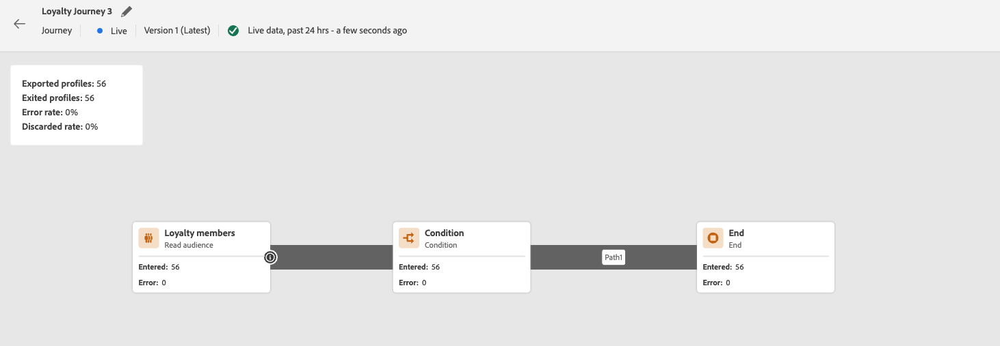

# Bem-vindo ao Designer de Jornada aprimorado {#new-canvas}

>[!CONTEXTUALHELP]
>id="ajo_new_canvas"
>title="Novidades"
>abstract="Nova tela"

Bem-vindo ao designer de jornadas aprimorado!

Desenvolvemos um **modelo de jornada simplificado** que visa melhorar os processos internos. Embora esse novo modelo seja uma melhoria de back-end, nossa equipe aproveitou a oportunidade para adicionar recursos que são visíveis e benéficos para os usuários do Journey Optimizer:

* A **tela de jornada recriada** criado para uma experiência de interface modernizada
* A **relatórios ao vivo** Interface do usuário diretamente disponível na tela de jornada

## Atualizações no modelo de jornada

O novo modelo de jornada conterá o existente, o que significa que haverá jornadas usando **dois modelos diferentes**:

* O antigo, chamado &quot;v1&quot;
* E o novo, chamado &quot;v2&quot;

Todas as jornadas na v1 permanecerão na v1. Você ainda poderá editá-los, testá-los ou publicá-los. Qualquer nova versão criada a partir de uma v1 também permanecerá na v1. Há **nenhuma alteração funcional** em torno de jornadas v1.

Como você vê na captura de tela abaixo, os nós são em forma de rodada, que é a interface antiga para jornadas no modelo v1.

No entanto, quando você c **Criar uma nova jornada** ou **duplicar um existente**, será uma jornada v2.  Planejamos continuar a oferecer suporte às jornadas v1 até que a maioria dos clientes passe para as jornadas v2.

Há uma limitação para o novo modelo de jornada; ela **não é possível copiar e colar atividades de uma jornada v1 para v2 e vice-versa**. Se desejar fazer isso, recomendamos que você duplique sua jornada v1 para transformá-la em v2 e, em seguida, copie suas atividades.

Na captura de tela abaixo, é possível ver a interface do usuário reprojetada para a tela de jornada (disponível somente com o modelo v2):

**Qualquer novo recurso adicionado ao designer do jornada (incluindo relatórios em tempo real) só estará disponível para jornadas v2 a partir de agora.**

## Aprimoramento do design da tela de jornada

Com o novo modelo de jornada, estamos introduzindo um novo e aprimorado **Interface do usuário da tela de jornada**, que se encaixa perfeitamente no ecossistema de soluções e aplicativos da Adobe Experience Cloud, proporcionando uma experiência do usuário intuitiva e eficiente. Qualquer jornada na pilha da v2 estará nesse novo design.

As atividades agora serão representadas por caixas quadradas com os seguintes recursos:

* A primeira linha que representa o tipo de atividade que geralmente será substituída por informações mais contextuais (por exemplo: em Ler públicos, ela conterá o nome do público selecionado) ou por um rótulo personalizado, se você definir um.
* A segunda linha sempre representa o tipo de atividade.

Essa nova interface melhora a legibilidade da tela de jornada ao fornecer **rótulos e tipos de atividades mais claros**.

Também permite que a equipe de produtos adicione mais informações à tela com menos cliques. Um exemplo de &quot;mais informações&quot; seria a inclusão de relatórios ao vivo na tela de jornada, onde é possível ver os perfis que entram e saem das atividades devido a erros.

## Relatórios ao vivo na tela de jornada

Juntamente com o design aprimorado da tela de jornada, estamos introduzindo a capacidade de ver **métricas de relatórios das últimas 24 horas** (chamado de &quot;relatório em tempo real&quot;) diretamente na tela de jornada.

Com cada jornada em tempo real no novo modelo, você poderá ver dois tipos de informações de relatórios &quot;últimas 24 horas&quot;:

* Em um **nova inserção**, você verá:
   * O número de perfis que foram exportados para jornadas acionadas pelo público-alvo. Você verá o número de perfis disponíveis no último trabalho de exportação ao lado do tempo em que essa exportação foi feita.
   * O número de perfis que saíram da jornada
   * A porcentagem de erros
     
* **Em cada atividade**, você verá o número de perfis que entraram nessa atividade e o número de perfis que saíram por causa de um erro:
  

A interface é atualizada automaticamente a cada minuto.

Observe que você pode ver diferenças entre o número de perfis exportados e o número de perfis que fluem pela jornada. A contagem de perfis exportados fornece apenas informações sobre o último trabalho de exportação que está sendo feito, enquanto o número de perfis que entram em uma atividade contém apenas perfis que o fizeram nas últimas 24 horas. Isso pode ser visível especialmente em jornadas diárias recorrentes, pois pode haver uma sobreposição de dados entre dois dias.
