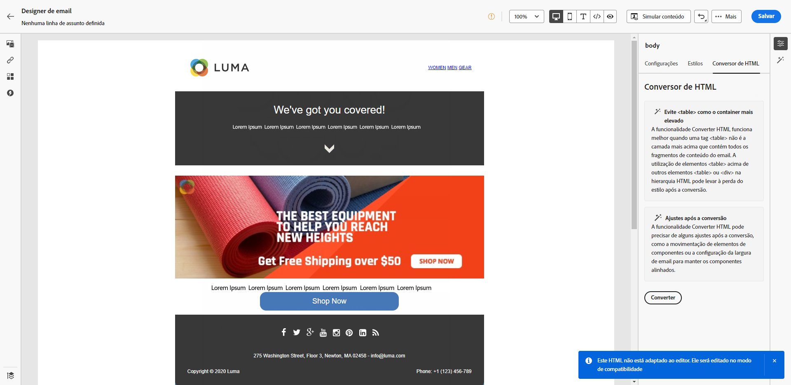

# Notas de versão de 2023 {#release-notes-2023}

Esta página lista todos os recursos e as melhorias do [!DNL Journey Optimizer] lançado em 2023.

## Notas de versão de outubro de 2023 {#oct-rn-2023}

### Novos recursos{#oct-2023-features}

Essa versão traz os novos recursos listados abaixo.

<table>
<thead>
<tr>
<th><strong>Ferramentas de sandbox</strong> </th>
</tr>
</thead>
<tbody>
<tr>
<td>

As ferramentas de sandbox permitem copiar objetos em várias sandboxes aproveitando a exportação e a importação de pacotes. Um pacote pode consistir em um único objeto ou em vários objetos. Todos os objetos incluídos em um pacote precisam ser da mesma sandbox.

<!--img src="../data/assets/dataset-export-setup.png"-->

Para obter mais informações, consulte a <a href="../building-journeys/copy-to-sandbox.md">documentação detalhada</a>.

</td>
</tr>
</tbody>
</table>

<!--
<table>
<thead>
<tr>
<th><strong>Multimedia Message Service (MMS) in SMS</strong> </th>
</tr>
</thead>
<tbody>
<tr>
<td>

With the SMS Channel, you can now enhance your communication by sending Multimedia Message Service (MMS) messages, enabling the sharing of images, GIFs, or videos with your customers. Note that this feature is currently available with Sinch only.

For more information, refer to the <a href="../sms/create-sms.md#mms-content">detailed documentation</a>.

</tr>
</tbody>
</table>
-->

### Melhorias {#oct-2023-improvements}

Esta versão vem com as melhorias listadas abaixo.

**Públicos-alvo**

* Agora é possível direcionar públicos-alvo enviados a partir de um arquivo CSV para jornadas e campanhas. [Saiba mais](../audience/about-audiences.md#segments-in-journey-optimizer)
* Agora é possível direcionar públicos-alvo criados por meio da composição de público-alvo e aproveitar os atributos de enriquecimento em jornadas. [Saiba mais](../building-journeys/read-audience.md)

>[!AVAILABILITY]
>
>No momento, esses recursos estão disponíveis como um beta privado.

<!--
**Spam scoring for emails**

* When simulating an email content, a new option enables you to check how your content performs against inboxes spam filtering. This feature is currently proposed to a set of customers only (Limited Availability), and available for the Email channel.-->

**Campanhas**

<!--* You can now stop a live one-time campaign, make modifications and resume it again. This improvement is available in Beta.-->
* Quando ocorre um erro em uma das campanhas, um ícone de aviso agora é exibido na lista de campanhas junto com o status da campanha. [Saiba mais](../campaigns/modify-stop-campaign.md#statuses)

**Jornadas**

* A duração máxima que você pode definir em qualquer tempo de espera agora é de 29 dias, em vez de 30. Essa melhoria foi introduzida para evitar que a espera exceda os 30 dias de duração da jornada. Isso se aplica a:

   * o campo **Quantidade de tempo** na [atividade de espera](../building-journeys/wait-activity.md)
   * o **período de espera de reentrada** nas [propriedades da jornada](../building-journeys/journey-gs.md#entrance)
   * o campo **Aguardar por** na definição de tempo limite das [atividades de evento](../building-journeys/general-events.md#events-specific-time).

<!--
**Consent in channel configuration**

* You can now select a marketing action at the channel surface level. When used in a surface, all consent policies associated with that marketing action are leveraged in order to respect the preferences of your customers.-->

**Gestão de decisões**

* Vários rótulos relacionados ao limite de ofertas na interface da gestão de decisões foram atualizados. [Saiba mais](../offers/offer-library/add-constraints.md#capping)

## Notas de versão de setembro de 2023 {#sept-rn-2023}

### Novos recursos{#sept-2023-features}

Essa versão traz os novos recursos listados abaixo.

<table>
<thead>
<tr>
<th><strong>Atributos computados</strong> </th>
</tr>
</thead>
<tbody>
<tr>
<td>

Os atributos computados permitem resumir facilmente os dados do evento em atributos de perfil por meio de uma interface intuitiva para segmentação, personalização e ativação aprimoradas com base em comportamento. Com esse recurso, você pode criar atributos computados de maneira independente, gerenciá-los e usá-los na segmentação, nos destinos do Perfil do cliente em tempo real ou no Journey Optimizer.  
Além disso, os atributos computados simplificam os fluxos de trabalho de jornada e segmentação, ajudando a fornecer experiências relevantes perfeitamente. Saiba mais na <a href="../audience/computed-attributes.md">documentação detalhada</a>.

</tr>
</tbody>
</table>

<table>
<thead>
<tr>
<th><strong>Relatórios de canal consolidados</strong> </th>
</tr>
</thead>
<tbody>
<tr>
<td>

O recurso Relatório de canal oferece aos analistas e profissionais de marketing uma visão geral abrangente das métricas de tráfego e engajamento no nível do canal.

Para acessar o menu <b>Relatório</b>, é necessário ter a permissão <b>Exibir Relatórios de Canal</b>.

Para obter mais informações, consulte a <a href="../reports/channel-report.md">documentação detalhada</a> e o <a href="../reports/channel-report.md#channel-report-video">vídeo explicativo</a>.

</tr>
</tbody>
</table>

<table>
<thead>
<tr>
<th><strong>Destinos de exportação do conjunto de dados (GA)</strong> </th>
</tr>
</thead>
<tbody>
<tr>
<td>

A exportação de conjuntos de dados do Journey Optimizer para destinos de armazenamento na nuvem agora está disponível. Com esse recurso, é possível estabelecer uma conexão ativa com locais de armazenamento na nuvem para exportar o conteúdo dos conjuntos de dados.

Para obter mais informações, consulte a <a href="../data/export-datasets.md">documentação detalhada</a>.

</td>
</tr>
</tbody>
</table>

<table>
<thead>
<tr>
<th><strong>Armazenamento de credenciais do aplicativo móvel por sandbox</strong> </th>
</tr>
</thead>
<tbody>
<tr>
<td>

Esse novo recurso permite gerenciar e associar facilmente as credenciais de push a uma sandbox dedicada nas Superfícies do aplicativo.

Para obter mais informações, consulte a <a href="../in-app/inapp-configuration.md#channel-prerequisites">documentação detalhada</a>.

</tr>
</tbody>
</table>

### Melhorias {#sept-2023-improvements}

Esta versão vem com as melhorias listadas abaixo.

**Gestão de decisões**

* Já estão disponíveis novas APIs para criação e gerenciamento de objetos de gestão de decisões. Essas APIs fornecem maior desempenho e melhoria na experiência do usuário. As APIs herdadas serão compatíveis até 27/03/2024. [Saiba mais](../offers/api-reference/getting-started.md)

**Personalização**

* Além dos fragmentos visuais, agora é possível criar, salvar e reutilizar fragmentos de expressão da interface do Journey Optimizer por meio do Editor de expressão. Os fragmentos de expressão substituem as expressões salvas anteriormente. [Saiba mais](../personalization/use-expression-fragments.md)

**Alertas**

* Foi introduzido um novo tipo de alerta de sistema. Agora é possível receber uma notificação quando uma atividade de **Público-alvo de leitura** falhar. [Saiba mais](../reports/alerts.md).

**Canal da Web**

* Agora, os aplicativos de página única (SPA) podem ser criados no editor visual da Web, o que permite selecionar em quais exibições específicas você deseja aplicar as modificações da página da Web. Uma exibição pode ser definida como um site inteiro ou um grupo de elementos visuais de um site, como a página inicial, a totalidade do site de produtos ou o quadro de preferências de entrega em todas as páginas de check-out. É necessária a configuração do desenvolvedor uma única vez para definir as exibições na implementação do SDK da Web da Adobe Experience Platform. Isso permite que os profissionais de marketing criem e executem campanhas da Web do Adobe Journey Optimizer em SPAs. [Saiba mais](../web/web-spa.md)

* Ao editar uma página usando o designer da Web, agora é possível adicionar novas alterações ao conteúdo diretamente do painel Modificações, sem a necessidade de selecionar um componente e editá-lo na interface do designer. [Saiba mais](../web/manage-web-modifications.md#add-modifications)

* Ao configurar subdomínios da Web, agora há a opção de adicionar seu próprio subdomínio, além de usar um subdomínio já delegado à Adobe. [Saiba mais](../web/web-delegated-subdomains.md#web-configure-new-subdomain)

**Jornadas**

* Agora é possível definir o nome da cópia da jornada ao duplicá-la. [Saiba mais](../building-journeys/journey-gs.md#uplicate-a-journey

* O suporte a respostas de ação personalizadas agora está disponível para o público geral. Esse recurso permite aproveitar as respostas de chamada da API em ações personalizadas e orquestrar sua jornada com base nessas respostas. Além disso, uma [nova medida de proteção de limite](../start/guardrails.md#custom-actions-g) foi adicionada para limitar automaticamente as chamadas de ação personalizadas. [Saiba mais](../action/action-response.md)
<!--
* The maximum duration that you can define in the Wait activity is now 29 days instead of 30.
-->

**Canal de email**

* Uma nova opção na configuração da superfície de email permite optar por enviar mensagens transacionais para perfis mesmo que os endereços de email estejam na lista de supressão do Adobe [!DNL Journey Optimizer]. [Saiba mais](../email/email-settings.md#send-to-suppressed-email-addresses)

**Canal SMS**

* Dois novos campos, **Mensagem de aceitação** e **Mensagem de ajuda**, foram adicionados à tela de configuração da API, permitindo personalizar respostas para palavras-chave de entrada. Observe que isso só está disponível para o provedor de SMS Sinch. [Saiba mais](../sms/sms-configuration.md#create-api)

* A recusa de SMS não é mais gerenciada no nível do canal. Agora é específico para um número, o que significa que se alguns perfis optarem por não receber um determinado número ou código curto, você ainda poderá enviar mensagens de outros números que possa estar usando para enviar mensagens SMS. Uma nova opção permite selecionar o **Número de recusa** que deseja usar em uma determinada superfície. [Saiba mais](../sms/sms-configuration.md#message-preset-sms)

**Canal de correspondência direta**

* Agora é possível criptografar arquivos destinados aos seus provedores de correspondência direta quando eles são transferidos para um servidor. Para fazer isso, um novo campo está disponível na tela de configuração de roteamento de arquivos, permitindo copiar e colar sua chave de criptografia. [Saiba mais](../direct-mail/direct-mail-configuration.md)

**Relatórios**

* Agora é possível exportar os relatórios do Journey Optimizer como arquivos CSV. Saiba mais na [documentação detalhada](../reports/global-report.md#export-reports) e no [vídeo explicativo](../reports/global-report.md#video-csv).

**Ativos**

* Uma nova opção de ativos permite escolher o repositório dos ativos no Journey Optimizer. Você pode optar por um repositório do Assets Essentials ou um repositório do Assets as a Cloud Service, desde que seja o proprietário dessa solução. [Saiba mais](../content-management/assets.md)

<!--**Decision management**

Enhancements have been made to the audience picker in journeys or campaigns, with the addition of new columns displaying the origin and update frequency of audiences.    -->

## Notas de versão de agosto de 2023 {#aug-rn-2023}

### Novos recursos{#aug-2023-features}

Essa versão traz os novos recursos listados abaixo.

<table>
<thead>
<tr>
<th><strong>Enviar mensagens no aplicativo em suas jornadas</strong> </th>
</tr>
</thead>
<tbody>
<tr>
<td>

Agora é possível enviar mensagens personalizadas no aplicativo para os usuários e usuárias em uma campanha. Use o Journey Optimizer para criar notificações e personalizar o layout, a exibição, o texto e os botões das mensagens para criar uma experiência perfeita.

Para obter mais informações, consulte a <a href="../in-app/create-in-app.md">documentação detalhada</a>.

</tr>
</tbody>
</table>

<table>
<thead>
<tr>
<th><strong>Validação de seus emails com listas de seeds</strong> </th>
</tr>
</thead>
<tbody>
<tr>
<td>

Agora é possível criar e gerenciar listas de seeds no Journey Optimizer. Uma lista de seeds consiste em endereços internos que podem ser adicionados ao público-alvo em si e recebem exatamente a mesma mensagem que os perfis direcionados na hora da execução da entrega. Use esse recurso para monitorar as comunicações enviadas e garantir que todos os formatos de exibição, URLs, imagens e links estejam corretos.

Para obter mais informações, consulte a <a href="../configuration/seed-lists.md">documentação detalhada</a>.

</td>
</tr>
</tbody>
</table>

<!--table>
<thead>
<tr>
<th><strong>Generate text and images with the Content assistant</strong> </th>
</tr>
</thead>
<tbody>
<tr>
<td>

Once you have created and personalized your message, take your content to the next level with the Content assistant. You can now use the Content assistant to optimize your message's impact by experimenting with different main titles, and images. Each variant is managed as a unique Treatment, to measure and compare which title effectively generates more clicks.

This capability is currently available as a private beta.

For more information, refer to the <a href="../start/search-filter-categorize.md#tags">detailed documentation</a>.

</td>
</tr>
</tbody>
</table-->

### Melhorias {#aug-2023-improvements}

Esta versão vem com as melhorias listadas abaixo.

<!--
**APIs**

A new API to create and manage Content Fragments is now available. [Learn more](https://developer.adobe.com/journey-optimizer-apis/references/content-templates/#tag/Content-fragment-API){target="_blank"}.-->

<!--**Email channel**

A new option is available in the email surface settings to include email addresses suppressed due to spam complaint in your transactional messages audiences. Even if they marked marketing messages as spam, these profiles can then receive transactional messages, such as password reset or account statements. This option is disabled by default.-->

**Jornadas**

* Agora é possível aproveitar as respostas de chamada da API em ações personalizadas e orquestrar sua jornada com base nessas respostas. No momento, esse recurso está disponível como um private beta. [Saiba mais](../action/action-response.md).
* Foi introduzido um novo tipo de alerta de sistema. Agora você pode ser notificado quando houver uma falha em uma ação personalizada. [Saiba mais](../reports/alerts.md).
  <!--* When duplicating a journey, you can now define the name of the journey copy.-->

**Correspondência direta**

* O Azure agora pode ser selecionado como o tipo de servidor na configuração de roteamento de arquivo. [Saiba mais](../direct-mail/direct-mail-configuration.md#file-routing-configuration)
* O “E” comercial agora está disponível como campo separador de colunas nas configurações de superfície da correspondência direta. [Saiba mais](../direct-mail/direct-mail-configuration.md#direct-mail-surface)

## Notas de versão de julho de 2023 {#july-rn-2023}

### Novos recursos{#july-2023-features}

<table>
<thead>
<tr>
<th><strong>Composição de público-alvo</strong> </th>
</tr>
</thead>
<tbody>
<tr>
<td>

Agora é possível criar fluxos de trabalho de composição para combinar públicos-alvo já existentes do Adobe Experience Platform em uma tela visual e aproveitar várias atividades (divisão, enriquecer...) para criar novos públicos-alvo. Os públicos-alvo recém-criados são salvos na Adobe Experience Platform junto com os públicos-alvo existentes e podem ser aproveitados nas campanhas do Journey Optimizer para direcionar clientes.

Para obter mais informações, consulte a <a href="../audience/get-started-audience-orchestration.md">documentação detalhada</a>.

A composição de público-alvo vem totalmente integrada ao novo menu “Públicos-alvo” da Adobe Experience Platform, que serve como um portal centralizado para públicos-alvo. Agora é possível usar uma página de navegação que inclui um novo painel com tendências de segmento e sobreposições para encontrar novos insights e explorar ferramentas organizacionais para organização em pastas e marcação. Incorporados nessa experiência estão controles de governança para rotulagem de público-alvo padronizada, bem como recursos de gerenciamento do ciclo de vida do público-alvo para gerenciar fluxos de trabalho de ativação. Com essa nova experiência de gerenciamento, agora é possível gerenciar públicos-alvo de maneira fácil e segura em um único local. Para obter mais informações, consulte a <a href="https://experienceleague.adobe.com/docs/experience-platform/segmentation/ui/overview.html?lang=pt-BR" target="_blank">Documentação da Adobe Experience Platform</a>.

</td>
</tr>
</tbody>
</table>

<table>
<thead>
<tr>
<th><strong>Canal de correspondência direta</strong> </th>
</tr>
</thead>
<tbody>
<tr>
<td>

Agora você pode adicionar mensagens de correspondência direta em suas campanhas. Correspondência direta é um canal offline que permite personalizar e gerar os arquivos exigidos por provedores de correspondência direta para enviar correspondência para seus clientes.

Ao preparar uma entrega de correspondência direta, o Journey Optimizer gera um arquivo incluindo todos os perfis de destino e as informações do contato escolhido (endereço postal por exemplo). Será possível então enviar esse arquivo para seu provedor de correspondência direta que irá cuidar do envio em si.

Por enquanto, o canal de Correspondência direta não está disponível para organizações que compraram a oferta complementar do Adobe Healthcare Shield.

Para obter mais informações, consulte a <a href="../direct-mail/get-started-direct-mail.md">documentação detalhada</a>.

</tr>
</tbody>
</table>

<table>
<thead>
<tr>
<th><strong>Converter conteúdo de HTML para o designer de email</strong> </th>
</tr>
</thead>
<tbody>
<tr>
<td>

Agora é possível importar e converter qualquer conteúdo de HTML no editor de email do Journey Optimizer. Os blocos de conteúdo são identificados automaticamente e disponibilizados no designer de email: use seus recursos de design eficientes para atualizá-los e personalizá-los.

Para obter mais informações, consulte a <a href="../email/existing-content.md">documentação detalhada</a>.

</td>
</tr>
</tbody>
</table>

<table>
<thead>
<tr>
<th><strong>Usar tags no Journey Optimizer</strong> </th>
</tr>
</thead>
<tbody>
<tr>
<td>

Além de campanhas e jornadas, agora é possível atribuir Tags unificadas da Adobe Experience Platform às suas páginas de destino, modelos de conteúdo, fragmentos e listas de assinatura. Isso permite classificá-los facilmente e melhorar a pesquisa e a navegação em todas as listas. 

Para obter mais informações, consulte a <a href="../start/search-filter-categorize.md#tags">documentação detalhada</a>.

</td>
</tr>
</tbody>
</table>

<table>
<thead>
<tr>
<th><strong>APIs de modelos de conteúdo</strong> </th>
</tr>
</thead>
<tbody>
<tr>
<td>

Agora é possível criar e gerenciar modelos de conteúdo do Adobe Journey Optimizer usando APIs dedicadas, proporcionando uma integração perfeita com seu sistema de conteúdo já existente.

Para obter mais informações, consulte a <a href="https://developer.adobe.com/journey-optimizer-apis/references/content/">documentação detalhada</a>.

</td>
</tr>
</tbody>
</table>

### Melhorias {#july-2023-improvements}

Esta versão vem com as melhorias listadas abaixo.

**Campanhas**

Eventos contextuais relacionados a campanhas agora estão disponíveis para uso no menu “Atributos contextuais” do editor de personalização.

**Públicos-alvo**

Foram feitos aprimoramentos no seletor de público-alvo em jornadas ou campanhas, com a adição de novas colunas que exibem a origem e a frequência de atualização dos públicos-alvo. Com o lançamento do portal Composição de público-alvo, a Adobe Experience Platform e o Adobe Journey Optimizer atualizaram oa utilização de “públicos-alvo” e “segmentos” no sistema e na documentação.

* Público-alvo: um conjunto de pessoas, contas, famílias ou outras entidades que compartilham características e comportamentos comuns.
* Definição de segmento: na Adobe Experience Platform, as regras usadas para descrever as principais características ou comportamentos de um público-alvo. Esse termo era anteriormente conhecido apenas como “segmento”.

Como resultado, na interface do Adobe Journey Optimizer e da Adobe Experience Platform, “Segmentos” será substituído por “Públicos-alvo” para refletir esse novo caminho de criação e gerenciamento de público-alvo.

**APIs**

O método JWT para gerar tokens de acesso para a autenticação de APIs do Adobe Journey Optimizer foi descontinuado. Todas as novas integrações devem ser criadas usando o método de autenticação OAuth de servidor para servidor. A Adobe também recomenda migrar as integrações já existentes para o método OAuth. [Saiba mais](https://developer.adobe.com/journey-optimizer-apis/references/authentication/){target="_blank"}.

**Outras alterações**

A exportação de conjuntos de dados do Journey Optimizer para Destinos de armazenamento na nuvem agora está disponível para todos os clientes como um beta público. Com esse recurso, é possível estabelecer uma conexão ativa com locais de armazenamento na nuvem para exportar o conteúdo dos conjuntos de dados. [Saiba mais](../data/export-datasets.md)

## Notas de versão de junho de 2023 {#june-rn-2023}

<table>
<thead>
<tr>
<th><strong>Campanhas acionadas por API para casos de uso de marketing</strong> </th>
</tr>
</thead>
<tbody>
<tr>
<td>

Agora é possível usar APIs para acionar campanhas de marketing no Adobe Journey Optimizer a partir de um sistema externo.

Até essa versão, o recurso de campanhas acionadas por API cobria várias necessidades de mensagens operacionais e transacionais, como redefinições de senha ou token OTP, mas não podia ser usado para criar campanhas de marketing. Os canais disponíveis para campanhas acionadas por API são: email, SMS e mensagens por push.

Para obter mais informações, consulte a <a href="../campaigns/api-triggered-campaigns.md">documentação detalhada</a>.
</td>
</tr>
</tbody>
</table>

<!--
### Improvements {#june-2023-improvements}

**Audiences**

Enhancements have been made to the audience picker in journeys or campaigns, with the addition of new columns displaying the origin and update frequency of audiences.

**Journeys**

You can now leverage API call responses in custom actions and orchestrate your journey based on these responses.
-->

<!--
## June 2023 early release notes {#june-rn-2023}

Information below is subject to change without prior notice until the release availability date. Updated documentation will be published at the release date, and direct links will be added in this page.

**Audiences**

Enhancements have been made to the audience picker in journeys or campaigns, with the addition of new columns displaying the origin and update frequency of audiences.    

**Journeys**

* You can now leverage API call responses in custom actions and orchestrate your journey based on these responses.     

* A new type of system alert has been introduced. You can now get notified when a custom action fails.
-->

## Notas de versão de maio de 2023 {#may-rn-2023}

### Novos recursos{#may-2023-features}

<table>
<thead>
<tr>
<th><strong>Experimentação de conteúdo em campanhas</strong> </th>
</tr>
</thead>
<tbody>
<tr>
<td>

O Adobe Journey Optimizer agora oferece suporte a experimentos em campanhas. Experimentos são ensaios aleatórios, o que, no contexto de testes online, significa que você expõe alguns usuários selecionados aleatoriamente a uma determinada variação de uma mensagem e outro conjunto de usuários selecionados aleatoriamente a outra variação ou tratamento. Após a exposição, é possível medir as métricas de resultado em que está interessado, como abertura de emails, assinaturas ou compras.

Para obter mais informações, consulte a <a href="../campaigns/content-experiment.md">documentação detalhada</a>.

</td>
</tr>
</tbody>
</table>

<!--
<table>
<thead>
<tr>
<th><strong>Objective reporting and performance measurement in campaigns</strong> </th>
</tr>
</thead>
<tbody>
<tr>
<td>

You can now measure the performance of your campaigns across inbound and outbound through dedicated reports. Adobe Journey Optimizer reports can retrieve additional metrics to use in the Objectives tab of your campaign reports.

For more information, refer to the <a href="../reports/campaign-global-report.md">detailed documentation</a>.

</td>
</tr>
</tbody>
</table>
-->

<table>
<thead>
<tr>
<th><strong>Criar e usar fragmentos no conteúdo de email</strong> </th>
</tr>
</thead>
<tbody>
<tr>
<td>

Agora é possível criar, usar e gerenciar fragmentos para produzir rapidamente emails e modelos de conteúdo. Um fragmento é um componente reutilizável pré-construído que pode ser referenciado em vários emails em campanhas e jornadas do Journey Optimizer para um processo de design aprimorado e acelerado.

Para obter mais informações, consulte a <a href="../content-management/fragments.md">documentação detalhada</a>.

</td>
</tr>
</tbody>
</table>

<table>
<thead>
<tr>
<th><strong>Usar tags em suas campanhas (Beta)</strong> </th>
</tr>
</thead>
<tbody>
<tr>
<td>

Agora é possível atribuir tags unificadas da Adobe Experience Platform às campanhas. Isso permite classificá-las facilmente e melhorar a pesquisa na lista de campanhas. Observe que o recurso de Tags unificadas está atualmente na versão beta.

Para obter mais informações, consulte a <a href="../start/search-filter-categorize.md#tags">documentação detalhada</a>.

</td>
</tr>
</tbody>
</table>

<table>
<thead>
<tr>
<th><strong>Modelo de classificação de IA de otimização personalizada (Disponibilidade geral)</strong> </th>
</tr>
</thead>
<tbody>
<tr>
<td>

Os modelos de classificação de IA de otimização personalizada agora estão disponíveis na Gestão de decisões. Esse novo tipo de modelo permite otimizar e personalizar ofertas com base nos públicos-alvo e no desempenho da oferta.

Para obter mais informações, consulte a <a href="../offers/ranking/personalized-optimization-model.md">documentação detalhada</a>.

</td>
</tr>
</tbody>
</table>

### Melhorias {#may-2023-improvements}

**Públicos-alvo**

* Em preparação para a disponibilidade geral do recurso Portal de público-alvo, a Adobe Experience Platform está atualizando o uso de “públicos-alvo” e “segmentos” no sistema e na documentação.

   * Público-alvo: um conjunto de pessoas, contas, famílias ou outras entidades que compartilham características e comportamentos comuns.
   * Definição de segmento: na Adobe Experience Platform, as regras usadas para descrever as principais características ou comportamentos de um público-alvo. Esse termo era anteriormente conhecido apenas como “segmento”.

  Como resultado, na interface do Adobe Journey Optimizer e da Adobe Experience Platform, “Segmentos” será substituído por “Públicos-alvo” para refletir esse novo caminho de criação e gerenciamento de público-alvo.

  As traduções do termo “público-alvo” ao se referir a um grupo de perfis direcionados para receber uma mensagem foram harmonizadas em todos os produtos de Experiência digital para alguns idiomas:

   * Alemão: Zielgruppe
   * Português (Brasil): público-alvo
   * Espanhol: público destinatario

<!--* Enhancements have been made to the audience picker in journeys or campaigns, with the addition of new columns displaying the origin and update frequency of audiences.-->

**Canal SMS**

* O Infobip foi adicionado como provedor de fornecedores ao configurar suas superfícies de canal de SMS. [Leia mais](../sms/sms-configuration.md)
* Twillio - A configuração de credencial da API agora inclui a capacidade de adicionar SID de serviço de mensagens para integração perfeita com sua conta do Twillio. [Leia mais](../sms/sms-configuration.md)

**Canal no aplicativo**

* Adição de novas regras de acionador de mensagem para o serviço do Adobe Places. [Leia mais](../in-app/inapp-configuration.md)
* Adição de novos recursos da Adobe Experience Platform Assurance para capturar eventos de dispositivos e adicionar como regras de acionador.

<!--
**Journeys**

* You can now leverage API call responses in custom actions and orchestrate your journey based on these responses.
-->

**Campanhas**

* Agora é possível duplicar uma campanha a partir da tela de inventário usando o menu de ação de reticências. [Leia mais](../campaigns/modify-stop-campaign.md#duplicate)
* Agora é possível excluir modificações de rascunho em uma campanha ativa.
* As etapas para ativar uma campanha agora foram simplificadas. [Leia mais](../campaigns/modify-stop-campaign.md)

**Gestão de decisões**

* Agora é possível editar o limite de frequência se a oferta tiver o status **[!UICONTROL Rascunho]** e nunca tiver sido publicada antes com o limite de frequência habilitado. [Leia mais](../offers/offer-library/add-constraints.md#frequency-capping)

**Personalização**

* Agora é possível selecionar e inserir referências de ativos diretamente do Editor de personalização ao trabalhar em conteúdo de HTML.

### Correções{#may-2023-fixes}

* Mensagens no aplicativo - correção de um problema no qual o agendamento da campanha entrava em conflito com as configurações de frequência da mensagem.

## Notas da versão de abril de 2023 {#apr-rn-2023}

<!--Information below is subject to change without prior notice until the release availability date. Updated documentation will be published at the release date, and direct links will be added in this page.

**Release date**: April 27, 2023-->

### Novos recursos{#apr-2023-features}

<table>
<thead>
<tr>
<th><strong>Canal web (disponibilidade geral)</strong> </th>
</tr>
</thead>
<tbody>
<tr>
<td>

O Adobe Journey Optimizer está expandindo seus recursos entre canais adicionando compatibilidade com o canal web. Agora é possível criar, alterar e visualizar experiências da Web como em qualquer outro canal, por meio de uma interface visual inteligente e intuitiva, a fim de personalizar a experiência dos usuários finais. Observe que, atualmente, o Journey Optimizer só permite a criação de experiências da Web em campanhas.

Para obter mais informações, consulte a <a href="../web/get-started-web.md">documentação detalhada</a>.

</tr>
</tbody>
</table>

<table>
<thead>
<tr>
<th><strong>Fluxo de trabalho de início rápido de integração para dispositivos móveis (Beta)</strong> </th>
</tr>
</thead>
<tbody>
<tr>
<td>

O novo fluxo de trabalho de início rápido de integração para dispositivos móveis está disponível. Use esse novo recurso do produto para configurar rapidamente o SDK móvel para começar a coletar e validar dados de eventos móveis e enviar notificações por push para dispositivos móveis com o Adobe Journey Optimizer. Esse recurso é acessível por meio da página inicial da Coleção de dados, na forma de um beta público.

Para obter mais informações, consulte a <a href="../push/mobile-onboarding-wf.md">documentação detalhada</a>.

</td>
</tr>
</tbody>
</table>

<table>
<thead>
<tr>
<th><strong>Novo painel da jornada (Beta)</strong> </th>
</tr>
</thead>
<tbody>
<tr>
<td>

 O painel da jornada agora está dividido em duas guias:

<ul><li>Use a guia <strong>Visão geral</strong> para acessar um novo painel que exibe as métricas principais relacionadas às suas jornadas.</li>
<li>Use a guia <strong>Procurar</strong> para acessar a lista de todas as jornadas.</li></ul>

Esse recurso pode ser acessado em todas as jornadas como um beta público.

Para obter mais informações, consulte a <a href="../building-journeys/journey-gs.md#journey-access">documentação detalhada</a>.

</td>
</tr>
</tbody>
</table>

### Melhorias {#april-2023-improvements}

**Jornadas**

* A tela da jornada agora exibe a ID da atividade nas atividades de mensagem e tags finais. Isso melhora os relatórios e o redirecionamento.
* O layout do painel de configuração, que aparece em ações, fontes de dados, eventos e jornadas, foi aprimorado.
* Novo insight para um número de nós em telas com proteções para ajudar no crescimento: mantenha as jornadas fáceis de ler, controle a qualidade e solucione problemas com um número máximo de 50 nós por jornada. [Leia mais](../start/guardrails.md#journeys-guardrails-journeys)
* Ao adicionar uma ação de [email](../email/create-email.md), [SMS](../sms/create-sms.md) ou [push](../push/create-push.md) em uma jornada, a superfície agora é pré-preenchida, por padrão, com a última superfície usada para esse canal na jornada atual.
* Agora é possível definir parâmetros de consulta estáticos ou dinâmicos em suas ações personalizadas. [Saiba mais](../action/about-custom-action-configuration.md#url-configuration)

**Relatórios**

* Agora é possível exportar os relatórios do Journey Optimizer como um arquivo PDF. [Saiba mais](../reports/global-report.md#export-reports)

**Designer de conteúdo**

* O Designer de conteúdo do Adobe Journey Optimizer foi atualizado e o acesso aos estilos e componentes de design foi simplificado. Esta nova versão propõe uma melhor experiência do usuário e vem com um desempenho aprimorado, compatibilidade parcial com o modo escuro e suporte aos novos padrões de acessibilidade.

## Notas da versão de março de 2023 {#mar-2023}

### Novos recursos{#mar-2023-features}

<table>
<thead>
<tr>
<th><strong>Canal no aplicativo (disponibilidade geral)</strong> </th>
</tr>
</thead>
<tbody>
<tr>
<td>

Agora você pode enviar mensagens personalizadas no aplicativo para os usuários do aplicativo em uma campanha. Use o Journey Optimizer para criar notificações e personalizar o layout, a exibição, o texto e os botões das mensagens para criar uma experiência perfeita.

Para obter mais informações, consulte a <a href="../in-app/get-started-in-app.md">documentação detalhada</a>.

</tr>
</tbody>
</table>

<table>
<thead>
<tr>
<th><strong>Rastreamento de cliques de SMS</strong> </th>
</tr>
</thead>
<tbody>
<tr>
<td>

Com o rastreamento de cliques de SMS, você pode monitorar o desempenho de seus URLs encurtados, identificar quem os clicou e usar esses dados para redirecionar esses clientes com campanhas subsequentes.

Para obter mais informações, consulte a <a href="../sms/create-sms.md#sms-content">documentação detalhada</a>.

</td>
</tr>
</tbody>
</table>

<table>
<thead>
<tr>
<th><strong>Usar tags em suas jornadas (Beta)</strong> </th>
</tr>
</thead>
<tbody>
<tr>
<td>

Como um profissional do Journey Optimizer, agora você pode organizar seus objetos de negócios usando tags. As tags são uma maneira rápida e fácil de classificar objetos para melhorar a pesquisa. No momento, esse recurso está na versão beta e só está disponível para jornadas.

Para obter mais informações, consulte a <a href="../start/search-filter-categorize.md#tags">documentação detalhada</a>.

</td>
</tr>
</tbody>
</table>

### Melhorias {#mar-2023-improvements}

**Jornadas**

* A nova **API de limitação** permite definir um limite para o número de eventos enviados por segundo, evitando picos de tráfego grandes demais em sistemas externos ou APIs. Quando o limite definido é atingido, todas as chamadas de API subsequentes são enfileiradas e processadas o mais rápido possível, na ordem em que forem recebidas. Observe que esse recurso suporta apenas uma configuração de limitação em todas as suas sandboxes. [Saiba mais](../configuration/external-systems.md)
* A tela da jornada foi aperfeiçoada para oferecer uma experiência do usuário mais simples e polida. No final de cada caminho na tela, os espaços reservados vazios foram removidos. Agora é possível adicionar suas atividades simplesmente arrastando-as para o final de um caminho.
* Na tela da jornada, o rótulo da tag **Fim** não é mais definida automaticamente com o nome da atividade anterior. Os usuários podem adicionar manualmente um rótulo personalizado, se necessário.
* O tempo limite padrão e a duração de erro nas propriedades da jornada foram alterados de 5 para 30 segundos. [Saiba mais](../configuration/external-systems.md#timeout)
* A taxa de limitação padrão em atividades de público-alvo de leitura foi alterada de 20.000 para 5.000 mensagens por segundo. [Saiba mais](../building-journeys/read-audience.md#configuring-segment-trigger-activity)
* Uma medida de proteção foi adicionada ao modo de teste para ouvir apenas os eventos enviados através da interface. Os eventos enviados por uma ferramenta externa não são considerados. [Saiba mais](../building-journeys/testing-the-journey.md)

<!-- 
* When adding an Email, SMS or Push action in a journey, the surface is now pre-filled, by default, with the last used surface for that channel.
* A new type of system alert has been introduced. You can now get notified when a custom action fails. [Learn more](../reports/alerts.md)
* Timeout and error management has been improved in journeys. Timeout and error paths are now always added on the canvas. A new toolbar button is available to show/hide these paths. [Learn more](../building-journeys/journey-gs.md#timeout_and_error)
* The Journey dashboard is now split in two tabs:
    * Use the **Overview** tab to access a new dashboard which displays key metrics related to your journeys.
    * Use the **Browse** tab to access list of all journeys.
-->

**Gestão de decisões**

* Para evitar qualquer possível confusão com o lançamento recente do recurso de tags na Adobe Experience Platform, as tags da gestão de decisões agora são chamadas de “Qualificadores de coleção”.

  Observe que, embora o termo “tag” não seja mais usado na interface da gestão de decisões, ele ainda é usado nos serviços de back-end, como APIs e conjuntos de dados.

* Agora é possível redefinir o contador de limite de oferta por dia, por semana ou por mês. [Saiba mais](../offers/offer-library/add-constraints.md#capping)

* Você também pode escolher qual evento da Adobe Experience Platform deve ser observado para o limite de definição de ofertas. [Saiba mais](../offers/offer-library/add-constraints.md#capping)

* Parâmetros complementares foram adicionados à tela de criação de posicionamentos. Eles permitem controlar se uma oferta pode ser duplicada em vários posicionamentos e especificar se o conteúdo e os metadados da oferta devem ser incluídos na resposta da API. [Saiba mais](../offers/offer-library/creating-placements.md)

**Personalização**

* Agora é possível incluir texto de fallback padrão para atributos de perfil baseados em string no Editor de expressão. Esses valores serão exibidos se os atributos selecionados não retornarem nenhum resultado. [Saiba mais](../personalization/personalization-build-expressions.md#add)

**Relatórios**

* A funcionalidade do widget de relatórios foi aprimorada com a capacidade de personalizar a forma como os usuários visualizam seus dados. Com esse aprimoramento, os usuários agora podem escolher entre várias opções de visualização, incluindo gráficos, tabelas e gráficos de rosca.

  Para ter acesso aos widgets mais recentes, observe que será necessário redefinir os diferentes painéis de relatórios. Para obter mais informações sobre a personalização de painéis, consulte a [documentação detalhada](../reports/global-report.md#modify-dashboard).

## Notas da versão de fevereiro de 2023 {#feb-2023}

### Novos recursos{#feb-2023-features}

<table>
<thead>
<tr>
<th><strong>Canal no aplicativo (Beta)</strong> </th>
</tr>
</thead>
<tbody>
<tr>
<td>

Agora você pode enviar mensagens personalizadas no aplicativo para os usuários do aplicativo em uma campanha. Use o Journey Optimizer para criar notificações e personalizar o layout, a exibição, o texto e os botões das mensagens para criar uma experiência perfeita.

<strong>Aviso</strong>: no momento, esse recurso está na versão beta e só está disponível para clientes beta. Para participar do programa beta, entre em contato com o Atendimento ao cliente da Adobe.

Para obter mais informações, consulte a <a href="../in-app/get-started-in-app.md"> documentação detalhada </a>.

</td>
</tr>
</tbody>
</table>

<table>
<thead>
<tr>
<th><strong>Exportar conjuntos de dados do Journey Optimizer para destinos de armazenamento na nuvem (Beta)</strong> </th>
</tr>
</thead>
<tbody>
<tr>
<td>

Agora é possível estabelecer uma conexão ativa com locais de armazenamento na nuvem para exportar o conteúdo de seus conjuntos de dados. Os destinos disponíveis são: Amazon S3 Cloud Storage, Azure Blob, Azure Data Lake Gen 2, Data Landing Zone, Google Cloud Storage e SFTP.

<strong>Aviso</strong>: esse recurso está atualmente na versão beta e está disponível para todos os usuários do Adobe Journey Optimizer. Entre em contato com seu representante da Adobe para obter acesso aos destinos, caso ainda não o tenha.

Para obter mais informações, consulte a <a href="../data/export-datasets.md">documentação detalhada</a>.

</td>
</tr>
</tbody>
</table>

<!--

<table>
<thead>
<tr>
<th><strong>Performance Measurement in campaigns</strong> </th>
</tr>
</thead>
<tbody>
<tr>
<td>

You can now measure the performance of your campaigns across inbound and outbound through dedicated reports. Adobe Journey Optimizer reports can retrieve additional metrics to use in the <strong>Objective</strong> tab of your campaign reports. 

For more information, refer to the <a href="../privacy/data-hygiene.md">detailed documentation</a>.

</td>
</tr>
</tbody>
</table>

+++ Learn more about Performance Measurement

The **[!UICONTROL Objective]** tab of your Campaign report allows you to better fine-tune your deliveries' reports by targeting one specific metric. With this feature, you can effectively track and analyze your campaign's performance and make informed decisions to improve your results.

The **[!UICONTROL Objectives]** listed are linked to **[!UICONTROL Datasets]** that define a connection to a system in order to retrieve additional information. A list of pre-configured **[!UICONTROL Objectives]** is available, but you can also customize your report by adding new **[!UICONTROL Datasets]** and defining your own objectives. 

By selecting the desired Objectives, the **[!UICONTROL Performance overview]** and **[!UICONTROL Campaign objective]** widgets provide a comprehensive and insightful summary of your delivery performance, allowing you to closely monitor and evaluate the success of your campaign.

With the **[!UICONTROL Campaign objective]** widget, you can also choose to compare your primary objective against another performance metric.

Note that each widget can be resized and deleted as needed.
+++

<table>
<thead>
<tr>
<th><strong>Use Tags in your Journeys</strong> </th>
</tr>
</thead>
<tbody>
<tr>
<td>

As a Journey Optimizer practitioner, you can now organize your business objects using tags. Tags are a quick and easy way of classifying objects to improve search. Tags are currently only available for Journeys.

</td>
</tr>
</tbody>
</table>

-->

### Melhorias {#feb-2023-improvements}

**Jornadas**

* O campo **Período de espera de reentrada** foi adicionado às propriedades da jornada. Este campo possibilita definir o tempo de espera antes de permitir que um perfil entre novamente em jornadas unitárias (que começam com um evento ou uma qualificação de público-alvo). Isso impede que uma mesma jornada seja incorretamente acionada várias vezes no mesmo evento. Por padrão, o campo é definido como 5 minutos. [Saiba mais](../building-journeys/journey-gs.md#entrance)

* Foram realizadas melhorias nas **datas de início e término da jornada**. Se você não tiver especificado uma data de início, ela agora será adicionada automaticamente no momento da publicação. Agora é possível adicionar uma data final para jornadas de **Público-alvo de leitura**. Isso permite que os perfis saiam automaticamente quando a data for atingida. [Saiba mais](../building-journeys/journey-gs.md#dates)

<!--

* The Journey canvas has been enhanced for a simpler and improved user experience. At the end of each path in the canvas, the empty placeholders have been removed. You can now simply add your activities by dragging them anywhere between nodes. [Learn more](../building-journeys/using-the-journey-designer.md)

* Timeout and error management has been improved in journeys. Timeout and error paths are now always added on the canvas. A new toolbar button is available to show/hide these paths. [Learn more](../building-journeys/journey-gs.md#timeout_and_error)

* A new type of system alert has been introduced. You can now get notified when a custom action fails. [Learn more](../reports/alerts.md)

* The Journey dashboard is now split in two tabs:
    * Use the **Overview** tab to access a new dashboard which displays key metrics related to your journeys.
    * Use the **Browse** tab to access list of all journeys.
-->

**Administração**

* **Lista de permissões**: agora é possível baixar a lista de permissões como um arquivo .csv. [Saiba mais](../configuration/allow-list.md#download-allowed-list)

* **Superfície de email**: uma verificação adicional foi incluída nas configurações da superfície de email. Se o registro MX do subdomínio usado no endereço **Responder para (email)** ou no **endereço de email Cco** não estiver configurado corretamente, a superfície de email não poderá mais ser criada. Você precisa configurá-lo ou usar outro. [Saiba mais](../email/email-settings.md#reply-to-email)

* **Superfície de email**: na seção **Parâmetros de rastreamento de URL** das configurações da superfície de email, o limite para cada campo de **Valor** foi atualizado de 255 caracteres para 5 KB, a fim de oferecer compatibilidade com o rastreamento do Adobe Analytics. [Saiba mais](../email/email-settings.md#url-tracking)

**Gestão de decisões**

* **Posicionamentos** - Parâmetros complementares foram adicionados à tela de criação de posicionamentos. Eles permitem controlar se uma oferta pode ser duplicada em vários posicionamentos e especificar se o conteúdo e os metadados da oferta devem ser incluídos na resposta da API. [Saiba mais](../offers/offer-library/creating-placements.md)

* **Personalização de URL**: ao adicionar URLs como conteúdo às representações de suas ofertas, agora é possível personalizar esses URLs usando o editor de expressão. [Saiba mais](../offers/offer-library/add-representations.md)

## Notas da versão de janeiro de 2023{#jan-2023-release}

### Novos recursos{#jan-2023-features}

<table>
<thead>
<tr>
<th><strong>Higiene de dados</strong> </th>
</tr>
</thead>
<tbody>
<tr>
<td>

A Adobe Experience Platform fornece um conjunto de recursos de higiene de dados que permitem gerenciar seus dados armazenados por meio de exclusões programáticas de conjuntos de dados e registros do consumidor. Esse recurso está disponível agora para o Adobe Journey Optimizer. 

Você pode gerenciar seus armazenamentos de dados para garantir que as informações sejam usadas conforme esperado, atualizadas quando dados incorretos precisarem de correção e excluídas quando as políticas organizacionais considerarem necessário.

<strong>Atenção</strong> - Atualmente, os recursos de Higiene de dados estão disponíveis apenas para as organizações que compraram as ofertas complementares do <strong>Healthcare Shield</strong> e do <strong>Privacy and Security Shield</strong>.

Para obter mais informações, consulte a <a href="../privacy/data-hygiene.md">documentação detalhada</a>.
</td>
</tr>
</tbody>
</table>

<table>
<thead>
<tr>
<th><strong>Modelos de conteúdo de email</strong> </th>
</tr>
</thead>
<tbody>
<tr>
<td>

Agora você pode criar modelos de conteúdo independentes que possam ser aproveitados em jornadas e campanhas para reutilização rápida.
 

Saiba como criar, editar e usar modelos de conteúdo <a href="https://experienceleague.adobe.com/docs/journey-optimizer-learn/tutorials/email-channel/content-templates.html?lang=pt-BR">neste vídeo</a>. Para obter mais informações, consulte a <a href="../content-management/content-templates.md">documentação detalhada</a>.

</td>
</tr>
</tbody>
</table>

### Melhorias {#jan-2023-improvements}

**Jornadas**

* Ao adicionar uma **Qualificação de público-alvo** ou um **Público-alvo de leitura** em uma jornada, o namespace agora é pré-preenchido, por padrão, com o último namespace usado. Consulte as seções [Qualificação de público-alvo](../building-journeys/audience-qualification-events.md#about-segment-qualification) e [Público-alvo de leitura](../building-journeys/read-audience.md#configuring-segment-trigger-activity).

* Um novo botão está disponível na barra de ferramentas da tela de jornada, que permite baixar uma captura de tela da sua jornada.

**Designer de email**

* Agora você pode exportar o conteúdo de email do menu **Exportar HTML**. Os arquivos exportados são disponibilizados em um arquivo compactado (.zip).

**Administração**

* Uma nova subseção fornece recomendações sobre a criação de um endereço **Responder para (email)** e sobre como garantir uma gestão adequada das respostas. [Saiba mais](../email/email-settings.md#reply-to-email)

* Ao criar ou editar **pools de IPs**, os registros PTR associados agora são exibidos na lista de IP e ao passar o cursor do mouse sobre os endereços IP selecionados. [Saiba mais](../configuration/ip-pools.md#create-ip-pool)

* Depois que um pool de IP é selecionado em uma superfície de canal, as informações do registro PTR agora são visíveis ao passar o cursor do mouse sobre os endereços IP. [Saiba mais](../email/email-settings.md#subdomains-and-ip-pools)

* A interface de edição de [registros PTR](../configuration/ptr-records.md#edit-ptr-record) e [campos de execução](../configuration/primary-email-addresses.md) foi atualizada.

* A interface de criação e edição de subdomínios foi aprimorada. [Saiba mais](../configuration/delegate-subdomain.md)

* A tela de **Uploads recentes** da lista de supressão foi atualizada. [Saiba mais](../configuration/manage-suppression-list.md#recent-uploads)

**Campanhas**

* Uma solicitação cURL de exemplo que permite a execução de campanhas acionadas por API agora é gerada automaticamente e disponibilizada na tela da campanha. [Saiba mais](../campaigns/api-triggered-campaigns.md)

**Personalização**

* Novas funções de ajuda estão disponíveis: formatCurrency, charCodeAt, stringToDate, toString, formatNumber e toHexString. Além disso, a função toDateTimeOnly agora aceita os tipos de campos string, data, longo e int. [Saiba mais](../personalization/functions/functions.md)
