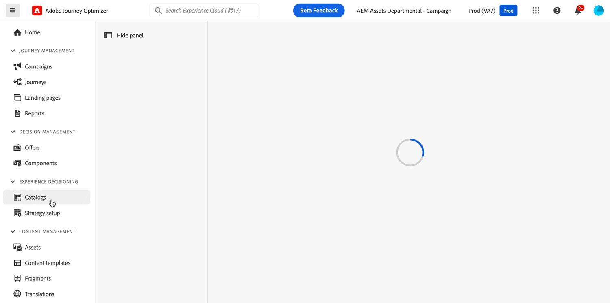

# Notas de versão de 2024 {#release-notes-2024}

Esta página lista todos os recursos e melhorias do [!DNL Journey Optimizer] lançado em 2024.

## Versão de outubro de 2024 {#24-10-rn}

**Data de lançamento**: 29 a 30 de outubro de 2024

### Novos recursos {#24-10-features}

Essa versão traz os novos recursos detalhados abaixo:

<table>
<thead>
<tr>
<th><strong>Bloqueio de conteúdo de email</strong> </th>
</tr>
</thead>
<tbody>
<tr>
<td>

O Journey Optimizer agora permite bloquear o conteúdo em modelos de email, bloqueando todo o modelo ou estruturas e componentes específicos. Isso permite evitar edições ou exclusões não intencionais, dando a você maior controle sobre a personalização do modelo e melhorando a eficiência e a confiabilidade de suas campanhas de email.

Para obter mais informações, consulte a <a href="../content-management/content-locking.md">documentação detalhada</a>.

Disponível desde 24 de outubro de 2024

</td>
</tr>
</tbody>
</table>

<table>
<thead>
<tr>
<th><strong>Experiências com base em código em jornadas</strong> </th>
</tr>
</thead>
<tbody>
<tr>
<td>

Com o novo canal de experiência com base em código, o Adobe Journey Optimizer permite realizar personalização e testes avançados para qualquer uma de suas propriedades de entrada. Isso possibilita a entrega perfeita de experiências personalizadas em diversos pontos de contato, como aplicativos Web, aplicativos móveis, aplicativos para desktop, consoles de vídeo, dispositivos conectados à TV, smart TVs, quiosques, caixas eletrônicos, dispositivos IoT, entre outros. O canal de experiência com base em código agora está disponível na tela da jornada.

Para obter mais informações, consulte a <a href="../code-based/create-code-based.md">documentação detalhada</a>.

Disponível desde 1º de outubro de 2024

</tr>
</tbody>
</table>

<table>
<thead>
<tr>
<th><strong>Experiências da Web em jornadas</strong> </th>
</tr>
</thead>
<tbody>
<tr>
<td>

Com o canal da Web, o Adobe Journey Optimizer permite personalizar a experiência da Web fornecida aos clientes por meio de jornadas da Web de entrada. O canal da Web agora está disponível na tela da jornada.

Para obter mais informações, consulte a <a href="../web/create-web.md">documentação detalhada</a>.

Disponível desde 1º de outubro de 2024

</tr>
</tbody>
</table>

<table>
<thead>
<tr>
<th><strong>Gerenciamento de conflitos e prioridades (disponibilidade limitada)</strong> </th>
</tr>
</thead>
<tbody>
<tr>
<td>

No Journey Optimizer, gerenciar o volume e o momento certo para uso de campanhas e jornadas é essencial para não sobrecarregar clientes com muitas interações. O Journey Optimizer agora oferece várias ferramentas para gerenciamento de conflitos e priorização. 
Para obter mais informações, consulte a <a href="../conflict-prioritization/gs-conflict-prioritization.md">documentação detalhada</a>.

<ul><li><b>Limite de frequência de jornada</b>: agora é possível criar conjuntos de regras para aplicar às suas jornadas, permitindo limitar o número de jornadas de um perfil por dia, semana ou mês, bem como controlar o número de jornadas simultâneas.</li>
<li><b>Pontuação de prioridade</b>: agora é possível atribuir uma pontuação de prioridade a uma campanha ou jornada, variando de 0 a 100. Um número maior indica uma prioridade mais alta. Quando duas campanhas ou ações de jornada usam a mesma configuração de canais, o Journey Optimizer seleciona aquela com a maior pontuação de prioridade. Se as campanhas tiverem a mesma pontuação, a campanha modificada menos recentemente será escolhida.</li>
<li><b>Exibir conflitos potenciais</b>: um novo botão “Exibir conflitos potenciais” agora permite identificar configurações conflitantes com outras jornadas ou campanhas, como a data inicial, o público-alvo ou a configuração de canais selecionada.</li>
<li><b>Arbitragem de jornada</b>: esse novo recurso permite priorizar as jornadas mais importantes para seus clientes. É possível criar uma regra para suprimir a entrada em uma jornada de menor prioridade quando um cliente se qualifica para uma jornada futura de maior prioridade.</li>
<li><b>Limite de frequência por tipo de comunicação: </b>ao utilizar conjuntos de regras, agora é possível definir regras granulares por tipo de comunicação (por exemplo, Vendas, Promocional) para evitar sobrecarregar os clientes com mensagens semelhantes. Você pode controlar a frequência de vários canais, excluindo automaticamente perfis solicitados em excesso para garantir uma melhor experiência do cliente.</li></ul>

Os recursos de gerenciamento de conflitos e prioridades estão em disponibilidade limitada para um grupo selecionado de clientes. Observe que esses recursos serão lançados de forma gradual para mais usuários no futuro. Entre em contato com a equipe de conta se tiver interesse em participar da lista de espera desses recursos.

</td>
</tr>
</tbody>
</table>

<table>
<thead>
<tr>
<th><strong>Integração do Movable Ink com o Adobe Journey Optimizer</strong> </th>
</tr>
</thead>
<tbody>
<tr>
<td>

Agora é possível integrar o Movable Ink Da Vinci com o Adobe Journey Optimizer. Essa nova integração permite: 

<ul><li>Aproveitar os recursos avançados do produto Movable Ink Da Vinci para reunir e personalizar variações de email para campanhas em lote</li>
<li>Acelerar os fluxos de trabalho profissionais de clientes do Journey Optimizer que usam o Da Vinci para criação e o Adobe Journey Optimizer para otimização e entrega</li>
<li>Otimizar modelos do Da Vinci com dados da Adobe.</li></ul>

Para obter mais informações, consulte a <a href="https://movableink.com/adobe-and-movable-ink">documentação do Movable Ink Da Vinci</a>.

</tr>
</tbody>
</table>

Anteriormente disponíveis para um conjunto de organizações (LA), os seguintes recursos agora estão disponíveis a todos os usuários (GA):

<table>
<thead>
<tr>
<th><strong>Personalização da configuração de email (disponibilidade geral) </strong> </th>
</tr>
</thead>
<tbody>
<tr>
<td>

Para obter mais flexibilidade e controle sobre as configurações de email, defina subdomínios dinâmicos e parâmetros de cabeçalho personalizados ao criar configurações de canal de email.

Para obter mais informações, consulte a <a href="../email/surface-personalization.md">documentação detalhada</a>.

Disponível desde 23 de outubro de 2024

</tr>
</tbody>
</table>

<table>
<thead>
<tr>
<th><strong>Aprovações em jornadas e campanhas (Disponibilidade geral)</strong> </th>
</tr>
</thead>
<tbody>
<tr>
<td>

Com as políticas de aprovação, agora é possível definir um processo de aprovação no Journey Optimizer para que as equipes de marketing garantam que as campanhas e jornadas sejam revisadas e aprovadas pelas partes interessadas apropriadas antes de serem publicadas.

Para obter mais informações, consulte a <a href="../test-approve/gs-approval.md">documentação detalhada</a>.

Disponível desde 22 de outubro de 2024

</td>
</tr>
</tbody>
</table>

<table>
<thead>
<tr>
<th><strong>Experimentação de conteúdo em jornadas (disponibilidade geral)</strong> </th>
</tr>
</thead>
<tbody>
<tr>
<td>

Já disponível em campanhas, o Adobe Journey Optimizer agora oferece suporte a experimentos em jornadas. Experimentos são ensaios aleatórios, o que, no contexto de testes online, significa que você expõe alguns usuários selecionados aleatoriamente a uma determinada variação de uma mensagem e outro conjunto de usuários selecionados aleatoriamente a outra variação ou tratamento. Após a exposição, é possível medir as métricas de resultado em que está interessado, como abertura de emails, assinaturas ou compras.

Para obter mais informações, consulte a <a href="../content-management/content-experiment.md">documentação detalhada</a>.

</td>
</tr>
</tbody>
</table>

<table>
<thead>
<tr>
<th><strong>Decisão (disponibilidade geral)</strong> </th>
</tr>
</thead>
<tbody>
<tr>
<td>

O serviço de Decisão, anteriormente disponível para apenas algumas organizações (disponibilidade limitada) e conhecido como Escolha de experiências, agora está disponível a todos os usuários (disponibilidade geral), incluindo organizações que compraram as ofertas complementares do Adobe Healthcare Shield ou do Privacy and Security Shield.

O serviço de Decisão simplifica a personalização oferecendo um catálogo centralizado de ofertas de marketing conhecidas como “itens de decisão”, além de um mecanismo de escolha sofisticado. Esse mecanismo usa regras e critérios de classificação para selecionar e apresentar os itens de decisão mais relevantes para cada pessoa. Esses itens de decisão são perfeitamente integrados a uma grande variedade de superfícies de entrada por meio do canal de experiência baseado em código.

Para obter mais informações, consulte a <a href="../experience-decisioning/gs-experience-decisioning.md">documentação detalhada</a>.

</td>
</tr>
</tbody>
</table>

<table>
<thead>
<tr>
<th><strong>Mensagens multilíngues em jornadas e campanhas (disponibilidade limitada)</strong> </th>
</tr>
</thead>
<tbody>
<tr>
<td>

Agora ficou mais fácil criar conteúdo em vários idiomas em uma única campanha ou jornada. Com esse recurso, é possível alternar entre idiomas ao editar a campanha ou a jornada, simplificando todo o processo de edição e melhorando sua capacidade de gerenciar com eficiência o conteúdo multilíngue.

Para obter mais informações, consulte a <a href="../content-management/multilingual-gs.md">documentação detalhada</a>.

</td>
</tr>
</tbody>
</table>

<table>
<thead>
<tr>
<th><strong>Experiência de relatórios atualizada (disponibilidade geral)</strong> </th>
</tr>
</thead>
<tbody>
<tr>
<td>

Os relatórios do Journey Optimizer agora estão disponíveis para o público em geral e possuem uma interoperabilidade aprimorada com os recursos do Customer Journey Analytics, padronizando os relatórios em ambas as plataformas e melhorando a consistência e a confiabilidade dos dados. Essa integração perfeita entre o Journey Optimizer e o Customer Journey Analytics fornece uma visão mais clara das métricas de desempenho, permitindo que os usuários tomem decisões mais conscientes.

Com a disponibilidade geral, quatro novos recursos são introduzidos: a capacidade de criar métricas simples, criar e publicar públicos-alvo, fazer perguntas ad-hoc usando o Insight Builder e agendar relatórios para envio automático por email aos principais destinatários.

Para obter mais informações, consulte a <a href="../reports/report-cja-manage.md">documentação detalhada</a>.

Importante: a experiência atual de relatórios será descontinuada a partir de janeiro de 2025. Após essa data, a nova experiência de relatórios se tornará o padrão. Recomendamos que você se familiarize com os novos recursos e funcionalidades para garantir uma transição tranquila. <a href="../reports/report-gs-cja.md">Saiba como começar a usar a nova interface de relatórios do Journey Optimizer</a>

Disponível desde 16 de outubro de 2024

</tr>
</tbody>
</table>

<!--The following capabilities are available to all customers in public beta:-->

<table>
<thead>
<tr>
<th><strong>Teste o conteúdo usando exemplos de dados de entrada (Beta)</strong> </th>
</tr>
</thead>
<tbody>
<tr>
<td>

O Journey Optimizer agora permite testar diferentes variantes do conteúdo, visualizando-o e enviando provas por email com exemplos de dados de entrada enviados de um arquivo ou adicionados manualmente. Todos os atributos de perfil usados no conteúdo para personalização são detectados automaticamente pelo sistema e podem ser usados nos testes para criar diversas variantes.

No momento, esse recurso está disponível para todos os clientes como um beta público para os canais de email, SMS e notificação por push.

Para obter mais informações, consulte a <a href="../test-approve/simulate-sample-input.md">documentação detalhada</a>.

</td>
</tr>
</tbody>
</table>

<table>
<thead>
<tr>
<th><strong>Usar dados da Adobe Experience Platform para personalização (Beta)</strong> </th>
</tr>
</thead>
<tbody>
<tr>
<td>

Aproveite os dados da Adobe Experience Platform no editor de personalização para personalizar seu conteúdo. Para fazer isso, os conjuntos de dados necessários para a personalização da pesquisa devem primeiro ser habilitados por meio de uma chamada de API. Depois de concluído, você poderá usar os dados para personalizar o conteúdo no [!DNL Journey Optimizer].

Esse recurso está atualmente disponível para todos os clientes como uma versão beta pública.

Para obter mais informações, consulte a <a href="../personalization/aep-data-perso.md">documentação detalhada</a>.

</td>
</tr>
</tbody>
</table>

### Aprimoramentos {#24-10-improvements}

Esta versão vem com as melhorias listadas abaixo.

**Canal SMS**

* Agora é possível editar ou excluir uma configuração de canais da API de SMS. [Saiba mais](../sms/sms-configuration.md)

* As seguintes melhorias foram introduzidas para melhorar os recursos de mensagens SMS com o Infobip e o Sinch:

   * Você pode definir e gerenciar palavras-chave exclusivas para suas campanhas e jornadas de SMS, permitindo uma comunicação mais personalizada e eficiente.

   * Você pode criar e enviar uma mensagem SMS padrão quando uma palavra-chave não for reconhecida.

  Saiba mais sobre essas melhorias na documentação da configuração de SMS do [Infobip](../sms/sms-configuration-infobip.md) e do [Sinch](../sms/sms-configuration-sinch.md).

<!--**Journeys**-->

<!--* **Path experiment in journeys** - With the journey path experiment, you can now define and track key metrics for your journey paths, allowing you to measure the impact of your activities and to provide clearer insights into your performance. -->

<!--* **Max number of Live journeys** - Journey Optimizer now has a guardrail of 500 live journeys on production sandboxes, instead of 100. The number of live journeys is visible in the journey canvas. (DOCAC-10977) -->

**Canal da Web**

* **Modo de edição não visual para a versão web do designer**: como alternativa à versão web do designer do Journey Optimizer, agora é possível adicionar modificações ao seu site usando um editor não visual. Ele permite inserir as alterações manualmente sem abrir as páginas no editor visual. Esse modo de edição não visual é útil se você não puder instalar extensões de navegador, como o Adobe Experience Cloud Visual Helper, que é necessário para carregar páginas na versão web do designer. [Saiba mais](../web/web-non-visual-editor.md)

**Conjuntos de dados**

* **Eventos de envio e abertura**: a partir de 1º de novembro de 2024, a segmentação de transmissão não será mais compatível com o uso de eventos de envio e abertura de conjuntos de dados de rastreamento e feedback do Journey Optimizer. Essa alteração se aplicará a todas as sandboxes e organizações do cliente. [Saiba mais](../data/datasets-ttl.md#segmentation-update)

* **Tempo de vida (TTL) do conjunto de dados**: a partir de fevereiro de 2025, uma medida de proteção de tempo de vida (TTL) será implantada nos conjuntos de dados gerados pelo sistema do Journey Optimizer em novas sandboxes e organizações da seguinte maneira:

   * 90 dias para dados na loja de perfis
   * 13 meses para dados no data lake

  Essa alteração será implementada nas sandboxes de clientes existentes em uma fase futura. [Saiba mais](../data/datasets-ttl.md#ttl)

* **Parâmetros em ações personalizadas**: data de disponibilidade: 3 de outubro de 2024: agora parâmetros NULL e opcionais são compatíveis com as ações personalizadas. [Saiba mais](../action/about-custom-action-configuration.md#define-the-message-parameters)

**Relatórios**

* Os **relatórios de decisões** agora estão disponíveis e oferecem insights essenciais sobre como os visitantes interagem com suas experiências. [Saiba mais](../reports/campaign-global-report-cja-code.md#decisioning-kpis)

**Políticas de governança de dados e consentimento** - Data de disponibilidade: 7 de outubro de 2024

* A aplicação das **políticas de governança de dados** agora ocorre em todos os canais do Journey Optimizer. Para clientes que criaram políticas na Adobe Experience Platform, elas são aplicadas a ações de marketing como parte da definição das configurações de canal. Ao criar conteúdo usando uma configuração, o sistema verifica todos os campos de personalização para verificar se há violações de governança de dados. Se uma violação for encontrada, não será possível publicar uma jornada ou campanha. [Saiba mais](../action/action-privacy.md)

* **As políticas de consentimento personalizadas** agora se aplicam a todos os canais do Journey Optimizer. Na aplicação, antes de uma mensagem ser enviada ou uma experiência de entrada ser entregue, o sistema verifica se o usuário deu consentimento para usar campos de personalização no conteúdo que receberá. Se nenhum consentimento for dado, a experiência não será exibida. [Saiba mais](../action/consent.md)

  >[!NOTE]
  >
  >Atualmente, as políticas de consentimento estão disponíveis apenas para as organizações que compraram as ofertas complementares do Adobe **Healthcare Shield** ou do **Privacy and Security Shield** .

**Públicos-alvo** - Data de disponibilidade: 8 de outubro de 2024

* Ao direcionar um público-alvo de arquivo CSV, agora é possível usar atributos do arquivo no editor de personalização e no construtor de regras de jornadas e campanhas. [Saiba mais](../audience/about-audiences.md)

* O uso de públicos-alvo e de atributos dos uploads personalizados (arquivos CSV) está atualmente indisponível para uso com o Healthcare Shield ou o Privacy and Security Shield.

**Configuração** - Data de disponibilidade: 23 de outubro de 2024

* Ao usar uma configuração personalizada em uma campanha ou jornada, agora é possível visualizar o conteúdo de email para verificar possíveis erros nas configurações dinâmicas que você definiu. [Saiba mais](../email/surface-personalization.md#check-configuration)

**Canal baseado em código**

* Os modelos de conteúdo agora estão disponíveis. Você pode acelerar a criação de experiências baseadas em código começando com um modelo de conteúdo criado por seus desenvolvedores. Usar um modelo de conteúdo permitirá que profissionais de marketing modifiquem apenas alguns valores ou campos, em vez de compor todo o conteúdo HTML ou JSON. [Saiba mais](../content-management/content-templates.md)

**Decisão**

* Os usuários do [Adobe Customer Journey Analytics](https://experienceleague.adobe.com/docs/analytics-platform/using/cja-overview/cja-overview.html?lang=pt-BR) agora podem escolher modelos personalizados para otimizar a configuração de um modelo de IA utilizando o serviço de Decisão (anteriormente conhecido como Escolha de experiências). É possível, por exemplo, otimizar uma tabela de “compras” personalizada em vez de definir restrições, como a taxa de cliques. [Saiba mais](../experience-decisioning/ranking/ranking.md)

* Ao adicionar uma política de decisão a uma campanha baseada em código com o serviço de Decisão, agora é possível selecionar manualmente itens de decisão individuais, além de estratégias de seleção. Também é possível selecionar mais de uma oferta substituta. Isso garante o retorno de um certo número de itens de decisão. [Saiba mais](../experience-decisioning/create-decision.md)

## Versão de setembro de 2024 {#24-9-rn}

<!--
>[!CAUTION]
>
>**Early release notes below are subject to change without prior notice until the release date**. Links, screens and updated documentation are published at the release date.
>
-->

**Data de lançamento**: 24 a 26 de setembro de 2024

### Novos recursos {#24-9-features}

Essa versão traz os novos recursos detalhados abaixo.

<table>
<thead>
<tr>
<th><strong>Cartões de conteúdo para aplicativos móveis e sites</strong> </th>
</tr>
</thead>
<tbody>
<tr>
<td>

Os cartões de conteúdo são um novo recurso de mensagens digitais no Adobe Journey Optimizer que fornece conteúdo personalizado e envolvente diretamente em aplicativos móveis e sites. Diferentemente das notificações por push tradicionais, os Cartões de conteúdo se integram perfeitamente à interface, oferecendo atualizações persistentes e não intrusivas que melhoram a interação e a experiência de usuários.

Esse recurso permite que profissionais de marketing apresentem conteúdo de mídia avançada e relevante para usuários, aumentando o engajamento e garantindo que mensagens importantes sejam vistas sem interromper a jornada do usuário.

Para obter mais informações, consulte a <a href="../content-card/get-started-content-card.md">documentação detalhada</a>.

</td>
</tr>
</tbody>
</table>

<table>
<thead>
<tr>
<th><strong>Aprovações em jornadas e campanhas (DL)</strong> </th>
</tr>
</thead>
<tbody>
<tr>
<td>

Com as políticas de aprovação, agora é possível definir um processo de aprovação no Journey Optimizer para que as equipes de marketing garantam que as campanhas e jornadas sejam revisadas e aprovadas pelas partes interessadas apropriadas antes de serem publicadas.

No momento, as políticas de aprovação estão disponíveis apenas para um conjunto de organizações (disponibilidade limitada). Para obter acesso, entre em contato com o(a) representante da Adobe.

Para obter mais informações, consulte a <a href="../test-approve/gs-approval.md">documentação detalhada</a>.

</td>
</tr>
</tbody>
</table>

<!--<table>
<thead>
<tr>
<th><strong>Email Content Locking</strong> </th>
</tr>
</thead>
<tbody>
<tr>
<td>

Journey Optimizer now allows you to lock content in email templates, either by locking the entire template or specific structures and component. This allows you to prevent unintentional edits or deletions, giving you greater control over template customization, and improving the efficiency and reliability of your email campaigns.

For more information, refer to the <a href="../content-management/gs-generative.md">detailed documentation</a>.

</td>
</tr>
</tbody>
</table>-->

<table>
<thead>
<tr>
<th><strong>Critérios de saída globais em jornadas</strong> </th>
</tr>
</thead>
<tbody>
<tr>
<td>

Agora você define critérios de saída em nível de jornada. Ao adicionar critérios de saída, você faz com que os perfis saiam da jornada assim que um evento ocorrer (por exemplo: Compra) ou eles se qualificarem para um público-alvo. Isso impedirá que o usuário obtenha mais comunicações da jornada.

Para obter mais informações, consulte a <a href="../building-journeys/journey-properties.md#exit-criteria">documentação detalhada</a>.

</td>
</tr>
</tbody>
</table>

<table>
<thead>
<tr>
<th><strong>Assistente de IA</strong> </th>
</tr>
</thead>
<tbody>
<tr>
<td>

Depois de criar e personalizar a mensagem, aprimore seu conteúdo com o Assistente de IA no Journey Optimizer. Agora é possível usar o Assistente de IA para otimizar o impacto da sua mensagem experimentando diferentes títulos principais e imagens. Cada variante é administrada como um tratamento exclusivo, para medir e comparar qual título gera efetivamente mais cliques.

Mergulhe em uma experiência prática com a <a href="https://experienceleague.adobe.com/pt-br/apps/journey-optimizer/ai-assistant-content-accelerator">nossa prévia de recursos</a>, projetada para ajudar você a conhecer os recursos em primeira mão e entender totalmente suas funcionalidades</a>.

Para obter mais informações, consulte a <a href="../content-management/gs-generative.md">documentação detalhada</a>.

Data de disponibilidade: 12 de setembro de 2024

</td>
</tr>
</tbody>
</table>

<table>
<thead>
<tr>
<th><strong>Configuração de canal guiada</strong> </th>
</tr>
</thead>
<tbody>
<tr>
<td>

A Configuração de canal guiada permite automatizar e validar a configuração do canal em uma experiência unificada, acelerando o processo de introdução ao Journey Optimizer. Essa nova configuração guiada simplifica a configuração rápida do canal, garantindo que todos os recursos necessários sejam instalados e funcionem na Experience Platform, no Journey Optimizer e na Coleção de dados. Isso permite que as equipes engenharia de marketing, de produtos e de dados comecem rapidamente com a criação de campanhas e jornadas.

Para obter mais informações, consulte a <a href="../configuration/set-mobile-config.md">documentação detalhada</a>.

Data de disponibilidade: 3 de setembro de 2024

 
</td>
</tr>
</tbody>
</table>

### Aprimoramentos {#24-9-improvements}

Esta versão vem com as melhorias listadas abaixo.

**Públicos-alvo** - Data de disponibilidade: 17 de setembro de 2024

**Uso da licença**: o painel de uso da licença agora mostra os Perfis engajáveis, em vez de Públicos-alvo engajáveis. [Saiba mais](../audience/license-usage.md)

**Gestão de conteúdo**

Agora você pode exportar modelos e fragmentos de conteúdo entre sandboxes. [Saiba mais](../configuration/copy-objects-to-sandbox.md)

**Jornadas**

* **Aprimoramentos nos relatórios em tempo real**: os relatórios em tempo real fornecem insights de desempenho das suas jornadas nas últimas 24 horas. Aprimoramos esse processo adicionando novas métricas (perfis que entraram, saíram, descartados e com erro), que permitem obter uma compreensão mais profunda do comportamento e do desempenho do usuário diretamente da tela de Jornada. [Saiba mais](../building-journeys/report-journey.md)

* (Data de disponibilidade: 10 de setembro) **Novas tentativas automáticas em públicos-alvo de leitura**: as novas tentativas agora são aplicadas por padrão em jornadas acionadas por público-alvo (começando com um **Público-alvo de leitura** ou um **Evento de negócios**) ao recuperar o trabalho de exportação. Se ocorrer um erro durante a criação do trabalho de exportação, as novas tentativas serão realizadas a cada 10 minutos por, no máximo, 1 hora. Depois disso, vamos considerá-la como uma falha. Esses tipos de jornada podem, portanto, ser executados até 1 hora após o horário agendado. [Saiba mais](../building-journeys/read-audience.md#retries)

**Canal de email**

* **Cabeçalho da mensagem no email enviado e na cópia CCO**: um novo cabeçalho foi adicionado a todas as mensagens de email. O valor desse cabeçalho é exclusivo para cada email enviado e sua cópia de email CCO correspondente. Esse cabeçalho também é armazenado nos conjuntos de dados de mensagem e feedback de CCO, o que permite reconciliar a cópia CCO e as informações de email enviado correspondentes. [Leia mais](../configuration/archiving-support.md#bcc-header)

* **Pontuação de spam** (DG): agora você pode verificar sua pontuação de spam de conteúdo em um **Relatório de spam** dedicado. Com o SpamAssassin, o Adobe Journey Optimizer testa seu conteúdo de email e atribui uma pontuação para indicar se os ISPs ou provedores de caixa de correio o consideram como spam ou não. [Leia mais](../content-management/spam-report.md)

**Canal SMS**

* **Editar credenciais da API**: agora é possível editar configurações nas Credenciais da API do SMS, incluindo atualizações de palavras-chave e respostas de aceitação/recusa.

**APIs**

* **API de simulação de campanha**: use esta API para acionar o trabalho de prova de uma campanha. O envio de uma Prova de campanha é um processo assíncrono, a API retornará uma proofJobId que pode ser usada para verificar o status da prova. [Saiba mais](https://developer.adobe.com/journey-optimizer-apis/references/simulations/){target="_blank"}

* (Data de disponibilidade: 10 de setembro) A [Documentação da API do Adobe Journey Optimizer](https://developer.adobe.com/journey-optimizer-apis/references/simulations/){target="_blank"} agora é interativa. Explore os pontos de acesso da API diretamente nas páginas de documentação para obter feedback imediato e acelerar sua implementação técnica.

  Todas as páginas de referência da API agora têm uma funcionalidade **Experimente** que você pode usar para testar chamadas de API diretamente na página do site de documentação. [Obtenha as credenciais de autenticação necessárias](https://developer.adobe.com/journey-optimizer-apis/references/authentication/){target="_blank"} e comece a usar a funcionalidade para explorar os pontos de acesso da API.

  Use esta nova funcionalidade para explorar as solicitações e as respostas dos pontos de acesso da API para obter feedback imediato e acelerar sua implementação técnica.

  >[!CAUTION]
  >
  >Observe que ao usar a funcionalidade de API interativa nas páginas de documentação, você está fazendo chamadas de API reais para os pontos de acesso. Lembre-se disso ao testar sandboxes de produção.

**Configuração**

* **Planos de aquecimento de IP**: esse recurso agora está disponível para todos os clientes, incluindo organizações que compraram as ofertas complementares do Adobe **Healthcare Shield** ou **Privacy and Security Shield**. [Saiba mais](../configuration/ip-warmup-gs.md)

<!--
 Sign up for the [Adobe Journey Optimizer quarterly newsletter](https://www.adobe.com/subscription/Adobe_Journey_Optimizer_NL.html){target="_blank"} today, and receive the latest product updates, exciting stories, use cases, tips and more delivered directly to your inbox every quarter.-->

## Versão de agosto de 2024 {#8-2024}

**Data de lançamento**: 20-21 de agosto de 2024

### Novos recursos {#8-features}

Essa versão traz os novos recursos detalhados abaixo.

<!--
<table>
<thead>
<tr>
<th><strong>Content Cards (Limited Availability)</strong> </th>
</tr>
</thead>
<tbody>
<tr>
<td>

Content cards are a new digital messaging feature in Adobe Journey Optimizer that delivers personalized and engaging content directly within mobile apps and websites. Unlike traditional push notifications, Content Cards integrate seamlessly into the user interface, offering persistent, non-intrusive updates that enhance user interaction and experience.

This feature enables marketers to present relevant, rich media content to users, driving higher engagement and ensuring important messages are seen without disrupting the user journey.

 

Content card are currently only available for a set of organizations (Limited Availability). To gain access, contact your Adobe representative.

</td>
</tr>
</tbody>
</table-->

<table>
<thead>
<tr>
<th><strong>Configurações de canais aprimoradas</strong> </th>
</tr>
</thead>
<tbody>
<tr>
<td>

Os recursos atuais de superfície de canal foram aprimorados para oferecer uma abordagem consistente em todos os canais. Agora é possível definir, gerenciar e reutilizar essas configurações para qualquer um dos canais, incluindo Web, mensagens no aplicativo ou experiência baseada em código.

<ul>
<li>Superfícies de canal foram renomeadas para <strong>Configurações de canal</strong></li>
<li>Você pode anexar uma ou várias ações de marketing para aplicar políticas de consentimento e governança de dados</li>
<li>O controle de acesso no nível do objeto (OLAC) agora está disponível para cada configuração de canal, permitindo que você decida quais dos seus usuários têm permissão para criar ou usar configurações específicas</li>
<li>Para alguns canais, você pode criar configurações de canal que direcionem várias plataformas. Um exemplo seria uma configuração de canal de mensagens no aplicativo que pode direcionar uma página da Web, um aplicativo do iOS ou do Android.</li>
</ul>

Para obter mais informações, consulte a <a href="../configuration/channel-surfaces.md">documentação detalhada</a>.

</td>
</tr>
</tbody>
</table>

<table>
<thead>
<tr>
<th><strong>Ação personalizada do Marketo Engage</strong> </th>
</tr>
</thead>
<tbody>
<tr>
<td>

Agora você pode integrar o Adobe Journey Optimizer com o Adobe Marketo Engage para criar seus casos de uso B2B. Em uma jornada, uma nova ação personalizada permite assimilar dados no Marketo.

Para obter mais informações, consulte a <a href="../action/marketo-engage.md">documentação detalhada</a>.

</td>
</tr>
</tbody>
</table>

<table>
<thead>
<tr>
<th><strong>Variáveis em fragmentos de conteúdo</strong> </th>
</tr>
</thead>
<tbody>
<tr>
<td>

As variáveis globais de fragmentos aprimoram a funcionalidade do fragmento para melhorar a eficiência na reutilização de conteúdo e nos casos de uso de script. Os fragmentos agora podem usar variáveis de entrada e criar variáveis de saída utilizáveis em conteúdos de campanhas e jornadas. Os fragmentos podem consumir variáveis de entrada, tanto em <a href="../personalization/use-expression-fragments.md">fragmentos de expressão</a> quanto em <a href="../email/use-visual-fragments.md">fragmentos visuais</a>. Você pode usar essas variáveis para personalizar o conteúdo e os parâmetros das mensagens em suas campanhas e jornadas.

Para obter mais informações, consulte a <a href="../personalization/use-expression-fragments.md">documentação detalhada</a>.

</td>
</tr>
</tbody>
</table>

<table>
<thead>
<tr>
<th><strong>Fluxo de trabalho de aquecimento de IP</strong> </th>
</tr>
</thead>
<tbody>
<tr>
<td>

Data de disponibilidade: 13 de agosto

Se você estiver enviando emails em um novo endereço IP, agora é possível executar facilmente fluxos de trabalho de aquecimento de IP diretamente da interface do usuário. O Adobe Journey Optimizer oferece uma maneira padronizada e eficiente de aquecer seus endereços IP que segue as práticas recomendadas para uma capacidade de entrega otimizada.

Para obter mais informações, consulte a <a href="../configuration/ip-warmup-gs.md">documentação detalhada</a>.

</td>
</tr>
</tbody>
</table>

### Aprimoramentos {#8-improvements}

Essa versão traz as melhorias listadas abaixo.

**Jornadas**

* Na atividade **Condição**, por padrão, a **[!UICONTROL condição Tempo]** agora é definida por hora, das 00:00 às 12:00. [Leia mais](../building-journeys/condition-activity.md#time_condition)
* Ao criar as jornadas, os alertas agora são exibidos ao selecionar o botão **Alertas**, para que se alinhar a outros alertas e proporcionar uma experiência consistente aos usuários. [Leia mais](../building-journeys/troubleshooting.md#checking-for-errors-before-testing)
* As opções de zoom na barra de ferramentas da jornada foram aprimoradas: a porcentagem de zoom agora está visível e é possível redefinir mais facilmente o valor do zoom.

**Canal de push**

* Agora é possível adicionar suas credenciais de push do aplicativo móvel nas configurações de canal do Adobe Journey Optimizer. Não é mais necessário criar uma superfície de aplicativo na Coleção de dados da Adobe Experience Platform.

### Outras alterações {#changes}

**Relatórios**

* Novos casos de uso foram adicionados à nova experiência de relatórios:

   * Crie métricas calculadas personalizadas diretamente dos seus relatórios.
   * Crie um público-alvo a partir dos dados de relatório.
   * Use a ferramenta de Análise Exploratória para criar facilmente tabelas e visualizações a partir das **[!UICONTROL Dimensões]** e **[!UICONTROL Métricas]** selecionadas.

  Para obter mais informações, consulte a [documentação detalhada](../reports/report-cja-manage.md).

## Versão de julho de 2024 {#24-7-2024}

**Data de lançamento**: 30 a 31 de julho de 2024

### Novos recursos {#27-4-features}

Essa versão traz os novos recursos listados abaixo.

<table>
<thead>
<tr>
<th><strong>Canal de SMS com qualquer provedor (Beta)</strong> </th>
</tr>
</thead>
<tbody>
<tr>
<td>

Agora é possível configurar provedores de SMS adicionais no Journey Optimizer, além dos provedores padrão Sinch, Infobip e Twilio.

Para obter mais informações, consulte a <a href="../sms/sms-configuration-custom.md">documentação detalhada</a>.

</td>
</tr>
</tbody>
</table>

<table>
<thead>
<tr>
<th><strong>Composição de público-alvo federado (disponibilidade limitada)</strong> </th>
</tr>
</thead>
<tbody>
<tr>
<td>

A Composição de público-alvo federado agora está disponível no Adobe Journey Optimizer. Ela permite que empresas componham dados para uma melhor utilização em vários casos de uso. Com essa nova abordagem, usuários da Adobe Real-Time Customer Data Platform e/ou do Adobe Journey Optimizer podem federar conjuntos de dados diretamente do seu data warehouse para criar e enriquecer públicos-alvo e atributos da Adobe Experience Platform em um único sistema.

Para obter mais informações, consulte a <a href="https://experienceleague.adobe.com/pt-br/docs/federated-audience-composition/using/home"  target="_blank">documentação detalhada</a>.

</td>
</tr>
</tbody>
</table>

### Aprimoramentos {#27-4-improvements}

Esta versão vem com as melhorias listadas abaixo.

**Jornadas**

* (Data de disponibilidade: 8 de julho) **Editor de expressão avançado na configuração de eventos de jornada**: agora você pode aproveitar o editor de expressão avançado ao configurar um evento, permitindo definir expressões mais complexas ou usar funções na condição de ID do evento. [Saiba mais](../event/about-creating.md#adv-exp-editor)

## Versão de junho de 2024 {#24-6-2024}

**Data de lançamento**: 18 a 19 de junho de 2024

### Novos recursos {#june-24-features}

Essa versão traz os novos recursos detalhados abaixo.

<table>
<thead>
<tr>
<th><strong>Customização de fragmentos de conteúdo</strong> </th>
</tr>
</thead>
<tbody>
<tr>
<td>

Agora é possível definir campos específicos em um fragmento que podem ser editados quando o fragmento é adicionado a uma campanha ou jornada. Isso permite o ajuste de partes do conteúdo no momento do uso, fornecendo flexibilidade para substituir valores padrão por detalhes específicos do contexto.

Para obter mais informações, consulte a <a href="../content-management/customizable-fragments.md">documentação detalhada</a>.

</td>
</tr>
</tbody>
</table>

<table>
<thead>
<tr>
<th><strong>Relatórios com o Customer Journey Analytics (disponibilidade limitada)</strong> </th>
</tr>
</thead>
<tbody>
<tr>
<td>

Os relatórios do Journey Optimizer vêm com uma interoperabilidade aprimorada com os recursos do Customer Journey Analytics, padronizando os relatórios em ambas as plataformas e melhorando a consistência e a confiabilidade dos dados. Essa integração perfeita entre o Journey Optimizer e o Customer Journey Analytics fornece uma visão mais clara das métricas de desempenho, permitindo que os usuários tomem decisões mais conscientes.

Para obter mais informações, consulte a <a href="../reports/report-gs-cja.md">documentação detalhada</a>.

</td>
</tr>
</tbody>
</table>

<table>
<thead>
<tr>
<th><strong>Assistente de IA no Adobe Journey Optimizer</strong> </th>
</tr>
</thead>
<tbody>
<tr>
<td>

O Assistente de IA é um recurso da interface do usuário que você pode usar para navegar e entender conceitos da Adobe e obter insights operacionais para seu ambiente específico. Ele está disponível em vários produtos na Adobe Experience Cloud, incluindo o Adobe Journey Optimizer.

Para obter mais informações, consulte a <a href="../start/ai-assistant.md">documentação detalhada</a>.

</td>
</tr>
</tbody>
</table>

<table>
<thead>
<tr>
<th><strong>Mensagens multilíngues em jornadas e campanhas (disponibilidade limitada)</strong> </th>
</tr>
</thead>
<tbody>
<tr>
<td>

Agora ficou mais fácil criar conteúdo em vários idiomas em uma única campanha ou jornada. Com esse recurso, é possível alternar entre idiomas ao editar a campanha ou a jornada, simplificando todo o processo de edição e melhorando sua capacidade de gerenciar com eficiência o conteúdo multilíngue.

No momento, o conteúdo multilíngue está disponível apenas para algumas organizações (disponibilidade limitada). Para obter acesso, entre em contato com o(a) representante da Adobe.

</td>
</tr>
</tbody>
</table>

<table>
<thead>
<tr>
<th><strong>Experimentação em jornadas (disponibilidade limitada)</strong> </th>
</tr>
</thead>
<tbody>
<tr>
<td>

Já disponível em campanhas, o Adobe Journey Optimizer agora oferece suporte a experimentos em jornadas. Experimentos são ensaios aleatórios, o que, no contexto de testes online, significa que você expõe alguns usuários selecionados aleatoriamente a uma determinada variação de uma mensagem e outro conjunto de usuários selecionados aleatoriamente a outra variação ou tratamento. Após a exposição, é possível medir as métricas de resultado em que está interessado, como abertura de emails, assinaturas ou compras.

No momento, a experimentação em jornadas está disponível apenas para algumas organizações (disponibilidade limitada). Para obter acesso, entre em contato com o(a) representante da Adobe.

</td>
</tr>
</tbody>
</table>

<!--table>
<thead>
<tr>
<th><strong>Extended personalization data - Beta</strong> </th>
</tr>
</thead>
<tbody>
<tr>
<td>

You can now lookup and fetch data values within Adobe Experience Platform datasets, and use these values to build conditions in Adobe Journey Optimizer. You can leverage data from a lookup dataset when a relationship has been defined using an attribute inside of an array of objects. You can specify non-profile enabled datasets for lookup. Once enabled, you can use a profile attribute as a join key to the specified dataset to retrive further data for personalization.

This capability is currently available as a public beta.

</td>
</tr>
</tbody>
</table-->

### Aprimoramentos {#june24-improvements}

Esta versão vem com as melhorias listadas abaixo.

#### Gestão de decisões

* **Compatibilidade com várias regras na gestão de decisões** – Agora você pode adicionar até 10 regras de limitação para uma determinada oferta na gestão de decisões. Isso permite aumentar o nível de controle sobre como as ofertas são enviadas. [Saiba mais](../offers/offer-library/add-constraints.md#capping)

<!--* **Audits** - The **Change log** tab allowing you to see all the changes that have been made to an offer or a decision has been removed. Changes related to offers and decisions can now be seen in the **Audits** menu. -->

#### Fragmentos de conteúdo 

>[!AVAILABILITY]
>
>Observe que essas melhorias serão implementadas gradualmente ao longo de vários dias após o lançamento inicial. Embora alguns usuários tenham acesso imediato, outros poderão enfrentar um atraso antes que as melhorias sejam disponibilizadas em seus ambientes.

* Agora os fragmentos podem ser editados e as alterações podem ser propagadas por todas as jornadas e campanhas ativas em que são usados.
* Foram introduzidos novos status para fragmentos de conteúdo: **Rascunho**, **Ativo**, **Publicando** e **Arquivado**.
* Para usar um fragmento em uma jornada ou campanha, agora ele deve estar no status **ativo**. Uma nova etapa foi adicionada ao processo de criação de fragmento, permitindo que o fragmento seja publicado e disponibilizado para uso em jornadas e campanhas. Observe que a publicação de fragmento requer uma nova permissão.

  **Cuidado**: Como os status **Rascunho** e **Ativo** foram introduzidos com a versão de junho do Journey Optimizer, todos os fragmentos criados antes desta versão têm o status **Rascunho** mesmo se forem usados em uma jornada ou campanha. Ao fazer qualquer alteração nesses fragmentos, será necessário [publicá-los](../content-management/create-fragments.md#publish) para torná-los “Ativos” e propagar as alterações para as campanhas e jornadas associadas. Também é necessário criar uma nova versão da jornada/campanha e publicá-la. 

Leia mais na documentação dos [fragmentos de conteúdo](../content-management/fragments.md).

#### Jornadas

* O tempo-limite global de jornadas foi estendido para 91 dias. [Leia mais](../building-journeys/journey-properties.md#global_timeout)

  Qualquer nova jornada criada terá esse novo tempo-limite. Consulte esta [seção de perguntas frequentes](../building-journeys/journey-properties.md#timeout-faq) para saber mais. Observe que essas alterações serão implementadas gradualmente durante o mês de junho.

* O Adobe Journey Optimizer agora é compatível com solicitações de exclusão/acesso de privacidade, bem como com solicitações de gerenciamento do ciclo de vida dos dados. [Leia mais](../privacy/requests.md)
* Agora é possível redimensionar as colunas nos inventários das jornadas.
  <!--* **Advanced expression editor in Event configuration** is now GA - You can now leverage the advanced expression editor while configuring an event, allowing you to define more complex expressions or use functions in the event id condition. This capability is released in Limited Availability for selected customers. [Read more](../event/about-creating.md)-->
* **Políticas de mesclagem** agora é GA: as políticas de mesclagem usadas por uma jornada agora estão visíveis e são consistentes em toda a jornada. [Leia mais](../building-journeys/journey-properties.md#merge-policies)

#### Campanhas

* Ao criar uma campanha no Adobe Journey Optimizer, agora é possível escolher o tipo de campanha (agendada ou acionada) em um novo modal. [Leia mais](../campaigns/create-campaign.md)

#### Canal de email

* **Cancelar inscrição em lista**: após os anúncios recentes do Gmail e do Yahoo para remetentes em massa, o Journey Optimizer se tornou compatível com a opção “post/1-click” para cancelar inscrição em lista. Consulte as seguintes páginas: [gerenciamento de recusa de email](../email/email-opt-out.md#unsubscribe-header) e [definir configurações de email](../email/email-settings.md#list-unsubscribe).

  **OBSERVAÇÃO**: em novas superfícies de canal, a opção de cabeçalho “Cancelar inscrição na lista” está ativada por padrão. Em superfícies existentes, a opção “URL de cancelamento de inscrição com um clique” está desmarcada por padrão nas configurações da superfície de canal. Se você estava usando um URL de recusa com um clique no corpo do email anteriormente, essa configuração ainda é válida. Se a opção “URL de cancelamento de inscrição com um clique” estiver marcada nas configurações da superfície de canal, o Adobe Journey Optimizer usará o URL  padrão gerado nas configurações.

#### Canal de SMS

* Agora é possível adicionar códigos curtos exclusivos para cada sandbox com uma única configuração de API, tornando o processo mais eficiente e simplificado. [Saiba mais](../sms/sms-configuration.md)

* Após a criação, o campo **Token de API** na página **Detalhes da credencial da API** fica mascarado.

<!--* You can now modify existing SMS configurations.-->

#### Canal no aplicativo

<!--* **Expression fragment** - Expression fragments are now available for the **In-app channel**. [Read more](../personalization/use-expression-fragments.md)-->

* Agora você pode usar o plug-in Edge Delivery para obter as informações necessárias para entender e solucionar problemas em suas implementações de entrada. [Saiba mais sobre a exibição do Edge Delivery](https://experienceleague.adobe.com/pt-br/docs/experience-platform/assurance/view/edge-delivery){target="_blank"}.

#### Canal de correspondência direta

* O canal de correspondência direta agora está disponível para todos os clientes. [Leia mais](../direct-mail/get-started-direct-mail.md)

## Versão de maio de 2024 {#may-2024}

**Data de lançamento**: 21 a 22 de maio de 2024

### Novos recursos {#e-features}

Essa versão traz os novos recursos detalhados abaixo.

<table>
<thead>
<tr>
<th><strong>Escolha de experiências - Disponibilidade limitada</strong> </th>
</tr>
</thead>
<tbody>
<tr>
<td>

A Escolha de experiências simplifica a personalização oferecendo um catálogo centralizado de ofertas de marketing conhecidas como “itens de decisão”, além de um mecanismo de decisão sofisticado. Esse mecanismo usa regras e critérios de classificação para selecionar e apresentar os itens de decisão mais relevantes para cada pessoa.

Esses itens de decisão são perfeitamente integrados a uma ampla variedade de configurações de entrada por meio do novo canal de experiência baseado em código, agora acessível nas campanhas do Journey Optimizer. As políticas de decisão da Escolha de experiências estão disponíveis para uso somente em campanhas de experiência baseadas em código.

No momento, a Escolha de experiências está disponível apenas para algumas organizações (disponibilidade limitada). Para obter acesso, entre em contato com o(a) representante da Adobe.

Para obter mais informações, consulte a <a href="../experience-decisioning/gs-experience-decisioning.md">documentação detalhada</a>.

</td>
</tr>
</tbody>
</table>

<table>
<thead>
<tr>
<th><strong>Personalização da configuração de email – Disponibilidade limitada</strong> </th>
</tr>
</thead>
<tbody>
<tr>
<td>

Agora você pode definir subdomínios dinâmicos e parâmetros de cabeçalho personalizados ao criar configurações de canais de email, para aumentar a flexibilidade e o controle sobre suas configurações de email.

No momento, a personalização da configuração de email está disponível apenas para um conjunto de organizações (disponibilidade limitada). Para obter acesso, entre em contato com o(a) representante da Adobe.

Para obter mais informações, consulte a <a href="../email/surface-personalization.md">documentação detalhada</a>.

</td>
</tr>
</tbody>
</table>

<!--table>
<thead>
<tr>
<th><strong>IP Warmup Workflow</strong> </th>
</tr>
</thead>
<tbody>
<tr>
<td>

If you are sending email on a brand new IP address, you can now easily perform IP warmup workflows directly from the user interface. Adobe Journey Optimizer offers a standardized and efficient way to warm up your IP adresses that follows the best practices for optimal deliverability.

For more information, refer to the <a href="../configuration/ip-warmup-gs.md">detailed documentation</a>.

</td>
</tr>
</tbody>
</table-->

<!--table>
<thead>
<tr>
<th><strong>Business rules - Beta</strong> </th>
</tr>
</thead>
<tbody>
<tr>
<td>

You can now create granular frequency capping rules, and apply them to different types of marketing communications through rule sets. This new capability lets you control how often your audiences receive a message by setting cross-channel rules, that automatically exclude over-solicited profiles from messages and actions.

Business rules capability is currently available as a beta. To join the beta program, contact your Adobe representative.

For more information, refer to the <a href="../configuration/business-rules.md">detailed documentation</a>.

</td>
</tr>
</tbody>
</table-->

<!--table>
<thead>
<tr>
<th><strong>Extended personalization data - Beta</strong> </th>
</tr>
</thead>
<tbody>
<tr>
<td>

You can now lookup and fetch data values within Adobe Experience Platform datasets, and use these values to build conditions in Adobe Journey Optimizer. You can leverage data from a lookup dataset when a relationship has been defined using an attribute inside of an array of objects. You can specify non-profile enabled datasets for lookup. Once enabled, you can use a profile attribute as a join key to the specified dataset to retrive further data for personalization.

This capability is currently available as a public beta.

</td>
</tr>
</tbody>
</table-->

### Aprimoramentos {#e-improvements}

Esta versão vem com as melhorias listadas abaixo.

**Escolha de experiências** (disponibilidade limitada)

As seguintes melhorias foram adicionadas desde a versão beta até a versão atual:

* **Escolha de experiências + Experiências baseadas em código**: agora é possível aproveitar o recurso Escolha de experiências para usar itens de decisão em campanhas baseadas em código. Observação: o canal Experiência baseada em código e a Escolha de experiências não estão disponíveis para organizações que compraram as ofertas complementares do Adobe Healthcare Shield e Privacy and Security Shield. [Leia mais](../code-based/get-started-code-based.md)
* **Dados de contexto**: agora é possível aproveitar os dados de contexto da Adobe Experience Platform em suas regras de decisão e nas fórmulas de classificação. [Leia mais](../experience-decisioning/context-data.md)
* **Nova permissão**: a permissão “Gerenciar escolha de experiências” agora está disponível para o recurso Gestão de decisões. Isso permite gerenciar direitos relacionados à Escolha de experiências. [Leia mais](../experience-decisioning/gs-experience-decisioning.md)
* **Regras de limite**: agora é possível adicionar várias regras de limite para um determinado item de decisão na Escolha de experiências. Isso permite aumentar o nível de controle sobre como as ofertas são enviadas. [Leia mais](../experience-decisioning/items.md#capping)
* **Relatórios**: agora é possível criar painéis de relatórios personalizados para campanhas da Escolha de experiências usando o [!DNL Customer Journey Analytics].  [Leia mais](../experience-decisioning/cja-reporting.md)

<!--**Decision Management**

* **Multi-rule support** - You can now add up to 10 capping rules for a given offer in Decision Management. This allows you to increase the level of control over the way offers are sent.
* **Audits** - The **Change log** tab allowing you to see all the changes that have been made to an offer or a decision has been removed. Changes related to offers and decisions can now be seen in the **Audits** menu. -->

**Canal de email**

<!--
* **List-unsubscribe** - Following on the recent Gmail and Yahoo announcements for bulk senders, Journey Optimizer supports the "post/1-click" List-Unsubscribe option. Refer to the following pages: [Email opt-out management](../email/email-opt-out.md#unsubscribe-header) and [Configure email settings](../email/email-settings.md#list-unsubscribe)
-->

* **Pontuação de spam** (Beta): agora é possível verificar sua pontuação de spam de conteúdo em um relatório dedicado. Com o SpamAssassin, o Adobe Journey Optimizer testa seu conteúdo de email e atribui uma pontuação para indicar se os ISPs ou provedores de caixa de correio o consideram como spam ou não. [Leia mais](../content-management/spam-report.md)

  >[!AVAILABILITY]
  >
  >No momento, esse recurso está na versão beta e disponível apenas para clientes beta. Para participar do programa beta, entre em contato com seu representante da Adobe.

<!--
**Audiences**

* The use of audiences and attributes from audience composition and custom upload (CSV file) is now available for use with Healthcare Shield or Privacy and Security Shield.-->

<!--**Personalization**

* **Expression fragment** - Expression fragments are now available for the **In-app channel**. [Read more](../personalization/use-expression-fragments.md)-->

**Jornadas**

<!--* **Merge policies** (Limited Availability)- Merge policies used by a journey are now visible and consistent throughout the journey.-->
* **Suporte a mTLS**: a autenticação mTLS agora é compatível com ações personalizadas. Não é necessária uma configuração adicional da ação personalizada ou jornada para ativar o mTLS; isso ocorre automaticamente ao detectar um ponto de acesso habilitado para mTLS. [Leia mais](../action/about-custom-action-configuration.md#mtls-protocol-support)
* **Tabelas de pesquisa em eventos**: agora é possível aproveitar os dados de um conjunto de dados de pesquisa após definir uma relação usando um atributo de uma matriz de objetos. Os valores de pesquisa estarão disponíveis em jornadas (condições, ações personalizadas, etc.) e na personalização de mensagens. [Leia mais](../event/experience-event-schema.md#relationships_limitations)
* **Editor de expressão avançado na configuração de evento** (disponibilidade limitada): agora é possível utilizar o editor de expressão avançado ao configurar um evento, o que permite definir expressões mais complexas ou usar funções na condição de ID de evento. Esse recurso foi lançado com disponibilidade limitada para clientes selecionados. [Leia mais](../event/about-creating.md#adv-exp-editor)
* **Políticas de mesclagem** (disponibilidade limitada): as políticas de mesclagem usadas por uma jornada agora estão visíveis e são consistentes em toda a jornada. Esse recurso foi lançado com disponibilidade limitada para clientes selecionados. [Leia mais](../building-journeys/journey-properties.md#merge-policies)

**Globalização**

Como parte do nosso esforço contínuo em fornecer uma experiência de usuário unificada, harmonizamos a terminologia usada nos produtos e aplicativos da Adobe Experience Cloud. Isso afeta o termo alemão “Titel”, que é alterado para “Label” quando se refere ao nome de um objeto. As alterações serão progressivamente implementadas na interface e na documentação.

## Versão de abril de 2024 {#apr-2024}

**Data de lançamento**: 2 de maio de 2024

### Novos recursos {#apr-features}

Essa versão traz os novos recursos detalhados abaixo.

<table>
<thead>
<tr>
<th><strong>Serviço de mensagens multimídia (MMS): todos os provedores</strong> </th>
</tr>
</thead>
<tbody>
<tr>
<td>

Com o canal SMS, agora é possível aprimorar a comunicação enviando mensagens do serviço de mensagens multimídia (MMS), o que permite o compartilhamento de imagens, GIFs ou vídeos para clientes. Inicialmente disponível apenas com o Sinch, o MMS agora também está disponível com Infobip e Twilio.

</td>
</tr>
</tbody>
</table>

<table>
<thead>
<tr>
<th><strong>Designer de jornada e relatórios em tempo real aprimorados</strong> </th>
</tr>
</thead>
<tbody>
<tr>
<td>

Essa versão vem com uma interface de usuário de tela aprimorada para jornada e fornece uma experiência do usuário mais intuitiva e eficiente. As atividades são mais claras e apresentam mais informações sobre a tela de jornada com menos cliques.

Juntamente com o design aprimorado da tela de jornada, estamos introduzindo a capacidade de ver métricas de relatórios das últimas 24 horas diretamente na tela de jornada. 

<strong>Nota</strong>: essas alterações serão gradualmente implementadas em todos os ambientes a partir da versão de abril.

Para obter mais informações, consulte a <a href="new-canvas.md">documentação detalhada</a>.

</td>
</tr>
</tbody>
</table>

<!-- table>
<thead>
<tr>
<th><strong>AI Assistant - Experience Variant Generation - Beta</strong> </th>
</tr>
</thead>
<tbody>
<tr>
<td>

Once you have created and personalized your message, take your content to the next level with AI Assistant. You can now use AI Assistant to optimize your message's impact by experimenting with different main titles, and images. Each variant is managed as a unique Treatment, to measure and compare which title effectively generates more clicks.

</td>
</tr>
</tbody>
</table-->

<!--table>
<thead>
<tr>
<th><strong>Email Surface Personalization - Private beta </strong> </th>
</tr>
</thead>
<tbody>
<tr>
<td>

You can now define dynamic subdomains and personalized header parameters when creating email channel configurations, for increased flexibility and control over your email settings.

</td>
</tr>
</tbody>
</table-->

### Aprimoramentos {#apr-improvements}

Esta versão vem com as melhorias listadas abaixo.

<!--
* **Expression Fragments supported for Web and In-App**: Expression fragments are now available for the Web and In-app channels. 
-->

<!--
* **DULE for AJO channel configuration**: It is now possible to apply a label on certain profile attributes to restrict their usage inside a channel configuration through marketing actions.
-->

<!--
* **List-Unsubscribe updates**: Following on the recent Gmail and Yahoo announcements for bulk senders, Journey Optimizer supports the "post/1-click" List-Unsubscribe option. 
-->

**Configuração**

* Agora é possível selecionar uma ação de marketing no nível da configuração de canais. Quando usadas em uma configuração, todas as políticas de consentimento associadas a essa ação de marketing são aproveitadas para respeitar as preferências dos seus clientes. [Leia mais](../action/consent.md#surface-marketing-actions)
* O uso do Controle de acesso em nível de objeto agora está disponível para configurações de canal. [Leia mais](../configuration/channel-surfaces.md#create-channel-surface)
* Ao habilitar o cancelamento de inscrição da lista em uma configuração de canais, agora é possível definir o nível de consentimento para se alinhar à forma como você gerencia o consentimento de todas as outras fontes. [Leia mais](../email/email-settings.md#list-unsubscribe)

**Gestão de conteúdo**

* Agora é possível simular modelos de conteúdo para todos os canais. [Leia mais](../content-management/content-templates.md#test-templates)

**Personalização**

* A nova função auxiliar **toInt** está disponível no Editor de expressão. Ela permite converter tipos (como number, double, int, long, float, short, byte, boolean, string) em um número inteiro. [Leia mais](../personalization/functions/math.md#to-int)

## Versão de março de 2024 {#mar-2024}

**Data de lançamento**: 19 a 20 de março de 2024

### Novo recurso {#mar-features}

Essa versão traz o novo recurso listado abaixo.

<table>
<thead>
<tr>
<th><strong>Experiências baseadas em código</strong> </th>
</tr>
</thead>
<tbody>
<tr>
<td>

Com o novo canal de Experiência baseada em código, o Adobe Journey Optimizer permite realizar personalizações e testes avançados para qualquer uma de suas propriedades de entrada, possibilitando a entrega perfeita de experiências personalizadas em diversos touchpoints, como aplicativos web, aplicativos móveis, aplicativos para desktop, consoles de vídeo, dispositivos conectados à TV, Smart TVs, quiosques, ATMs e dispositivos IoT, entre outros.

Os principais recursos incluem:

<ul><li> Personalização universal: estenda as experiências personalizadas em todos os touchpoints, garantindo uma jornada de usuário coesa e personalizada</li>
<li>Precisão de edição granular: edite conteúdo específico em locais individuais em seus aplicativos ou páginas da Web</li>
<li>Implementação versátil: suporte para os métodos de implementação do lado do servidor, baseados em API ou baseados em SDK para integração contínua com o seu ambiente de desenvolvimento.</li></ul>

Para obter mais informações, consulte a <a href="../code-based/get-started-code-based.md">documentação detalhada</a>.

 
</tr>
</tbody>
</table>

### Aprimoramentos {#mar-improvements}

Esta versão vem com as melhorias listadas abaixo.

**Modelos de conteúdo**

* **Miniaturas**: um modo de **visualização em grade** agora está disponível para modelos de conteúdo, exibindo miniaturas para acesso visual aprimorado. Atualmente, apenas modelos HTML de email são compatíveis. [Saiba mais](../content-management/content-templates.md#template-thumbnails)

  >[!AVAILABILITY]
  >
  >Esse recurso foi lançado com disponibilidade limitada (DL) para um pequeno conjunto de clientes.

**Jornadas**

Novos status intermediários foram adicionados ao ciclo de vida de criação de jornada:

* Status **Publicando** entre o status **Rascunho** e o status **Ativo**
* Status **Interrompendo** entre o status **Ativo** e o status **Parado** 
* Os status **Ativando o modo de teste** ou **Desativando o modo de teste** entre o status **Rascunho** e o status **Rascunho (teste)**

Quando uma jornada está em um estado intermediário, ela fica como somente de leitura. [Saiba mais](../building-journeys/journey-gs.md#filter)

## Versão de fevereiro de 2024 {#feb-2024}

**Data de lançamento**: 21 e 22 de fevereiro de 2024

### Novos recursos{#feb-features}

Essa versão traz os novos recursos listados abaixo.

<table>
<thead>
<tr>
<th><strong>Mensagens Web no aplicativo</strong> </th>
</tr>
</thead>
<tbody>
<tr>
<td>

Agora você pode usar o novo recurso de mensagens Web no aplicativo para exibir conteúdo personalizado diretamente em sites, por meio de mensagens de sobreposição modal. Esse recurso permite que você interaja efetivamente com visitantes da Web, melhorando a interação de usuários, a retenção e as taxas de conversão.  

Para obter mais informações, consulte a <a href="../in-app/create-in-app-web.md">documentação detalhada</a>.  

</tr>
</tbody>
</table>

<table>
<thead>
<tr>
<th><strong>Modelos de conteúdo multicanal</strong> </th>
</tr>
</thead>
<tbody>
<tr>
<td>

Além do Email, os modelos de conteúdo agora estão disponíveis para os seguintes canais: Push, No aplicativo, SMS e Correspondência direta. Cada canal com tipos de modelos dedicados. Para Email, agora é possível selecionar o Tipo de conteúdo, que permite salvar a linha de assunto como parte do modelo de email.   

Para obter mais informações, consulte a <a href="../content-management/content-templates.md">documentação detalhada</a>.  

 
</tr>
</tbody>
</table>

### Aprimoramentos {#feb-improvements}

Esta versão vem com as melhorias listadas abaixo.

**Públicos-alvo**

* **Listas de seeds**: as variantes agora são compatíveis ao usar **listas de seeds**. Os seed addresses recebem uma cópia de todas as variantes da mesma mensagem (como os diferentes tratamentos de um experimento de conteúdo). [Leia mais](../configuration/seed-lists.md)

Anteriormente disponível como Beta, as seguintes melhorias agora estão disponíveis para todos os usuários:

* Agora é possível direcionar **públicos-alvo criados por meio da composição de público-alvo** e aproveitar os atributos de enriquecimento em jornadas. [Saiba mais](../building-journeys/read-audience.md)

* Agora é possível direcionar **públicos-alvo enviados a partir de um arquivo CSV** para jornadas e campanhas. [Saiba mais](../audience/about-audiences.md#segments-in-journey-optimizer)

  >[!AVAILABILITY]
  >
  >* O públicos-alvo e os atributos da composição de público-alvo e do upload personalizado (arquivo CSV) estão atualmente indisponíveis para uso com o Healthcare Shield ou o Privacy and Security Shield.
  >* A melhoria no **upload do público-alvo de um arquivo CSV** está sendo implementada gradualmente ao longo de vários dias após o lançamento inicial. Embora alguns usuários tenham acesso imediato, outros podem sofrer um atraso antes que ele fique disponível em seu ambiente.

**Jornadas**

* **Filtre suas jornadas**: agora você pode usar o inventário **datas personalizadas para filtrar as jornadas**, além dos filtros de data predefinidos. Isso permite refinar a lista ao exibir jornadas criadas ou publicadas em uma data específica, em um mês específico, durante um ano inteiro ou em intervalos de tempo especificados. [Leia mais](../building-journeys/journey-gs.md#filter)
* **Ações personalizadas**: agora você pode atualizar o cabeçalho **tipo de conteúdo**. Este novo **tipo de conteúdo** deve fazer referência ao conteúdo JSON. [Leia mais](../action/about-custom-action-configuration.md#url-configuration)
* **Configuração**: o atributo identityMap em stepEvents agora é pré-preenchido. A identidade principal é definida como “primary = true”. [Leia mais](../reports/sharing-field-list.md)
* **Interface**: a barra superior, nas telas da jornada, foi reorganizada para fornecer uma experiência aprimorada. Entre as diferentes atualizações, observe que o ícone de “lápis” que permite acessar as propriedades da jornada agora é exibido à esquerda da barra superior, ao lado do nome da jornada. [Leia mais](../building-journeys/journey-properties.md)

**Canal SMS**

* **Palavras-chave de aceitação/recusa**: ao configurar seu canal de SMS, agora é possível personalizar as **Palavras-chave de aceitação e recusa** de acordo com suas preferências. O Journey Optimizer aciona a resposta com base nessas palavras-chave especificadas. [Saiba mais](../sms/sms-configuration.md)

**Campanhas**

* **Campanhas acionadas por API**: o código cURL gerado após a ativação de uma campanha acionada por API foi aprimorado. Agora, todas as variáveis de personalização (perfil e contexto) usadas na mensagem estão presentes. [Leia mais](../campaigns/api-triggered-campaigns.md#execute)

**Regras de frequência**

* Além de Email e Push, agora é possível criar regras de frequência para canais de SMS e de correspondência direta. As regras de frequência excluem automaticamente perfis excessivamente solicitados de mensagens e ações quando o limite de frequência é atingido. [Leia mais](../conflict-prioritization/rule-sets.md)

<!--**Decision management**

* **Capping rules** - You can now add **multiple capping rules** for one offer. This allows you to increase the level of control over the way offers are sent.-->

## Versão de janeiro de 2024 {#jan-2024}

**Data de lançamento**: 30 e 31 de janeiro de 2024

### Novos recursos{#jan24-features}

Essa versão traz os novos recursos listados abaixo.

<table>
<thead>
<tr>
<th><strong>Atualizações de capacidade de entrega</strong> </th>
</tr>
</thead>
<tbody>
<tr>
<td>

O Journey Optimizer agora é compatível com a tecnologia de autenticação DMARC.

Desde 1º de fevereiro de 2024, o Google e o Yahoo! estão exigindo um registro DMARC para qualquer domínio que você usar para enviar emails a eles. Certifique-se de que você tenha o registro DMARC configurado para todos os subdomínios que delegou ou está delegando à Adobe no Journey Optimizer.

Para obter mais informações, consulte a <a href="../configuration/dmarc-record-update.md">documentação detalhada</a>.

 
</tr>
</tbody>
</table>

<table>
<thead>
<tr>
<th><strong>Manuais de casos de uso </strong> </th>
</tr>
</thead>
<tbody>
<tr>
<td>

Aproveite um catálogo de manuais de estratégia de casos de uso específicos do setor na Real-Time CDP e no Journey Optimizer para abordar casos de uso comuns que você pode executar usando a Adobe Experience Platform e o Adobe Journey Optimizer.

Depois de escolher o manual de estratégia que melhor atende às suas necessidades, você pode habilitá-lo para gerar os ativos necessários que darão suporte ao seu caso de uso, como jornadas, mensagens, esquemas ou segmentos, e personalizá-los de acordo com o esquema para agilizar resultados relevantes.

Para obter mais informações, consulte a <a href="../start/playbooks.md">documentação detalhada</a>.

 
</tr>
</tbody>
</table>

### Aprimoramentos {#jan24-improvements}

Esta versão vem com as melhorias listadas abaixo.

**Relatórios**

* **Novos dispositivos de detalhamento baseados em domínio**: novos dispositivos foram adicionados para aprimorar seus relatórios de campanha e de jornada. Os dispositivos **Motivos de rejeição por domínio**, **Enviado e entregue por domínio**, **Aberturas e cliques por domínio** e **Rejeição e erros por domínio** fornecem um detalhamento no nível do domínio para as principais métricas de entrega e rastreamento de email. [Saiba mais](../reports/channel-report-cja.md)

**Canal SMS**

* **Aceitação dupla**: o fluxo de trabalho de Aceitação dupla de SMS garante que os usuários e usuárias optem explicitamente por receber mensagens quando a solicitação for iniciada a partir de seus dispositivos. Os usuários e usuárias iniciam o processo de consentimento enviando uma mensagem SMS de entrada. Após confirmar o consentimento, uma mensagem de acompanhamento é enviada, solicitando a verificação final. Se um perfil de usuário não existir, ele será criado após a confirmação bem-sucedida. [Saiba mais](../sms/sms-configuration.md)

  Observe que esse recurso está disponível nos provedores de SMS Sinch e Infobip.

**Jornadas**

* **Duração dos eventos de reação**: a duração máxima que você pode definir nos **Eventos de reação** agora é de 29 dias, em vez de 30. [Saiba mais](../building-journeys/reaction-events.md)

<!--* **Date filters** - You can now use custom dates to filter the journeys inventory, in addition to the existing predefined date filters. This allows you to refine the list by displaying journeys published on a specific date, within a particular month, throughout an entire year, or within specified time ranges. [Learn more](../building-journeys/journey-gs.md#filter)-->

* **Público-alvo de leitura**: a atividade **Público-alvo de leitura** agora depende do conjunto de dados de instantâneo de perfil para segmentos em lote, o que é gerado apenas uma vez por dia depois que o processo em lote diário programado é executado. Portanto, os dados serão atualizados até esse último processo em lote diário. [Saiba mais](../building-journeys/read-audience.md)

* **Grupos de campos**: esta versão corrige um problema que impedia que Grupos de campos fossem salvos em determinados casos.

* O suporte de `<listObject>` foi modificado em várias funções.

**Regras de frequência**

* **Limite de frequência semanal**: agora é possível especificar o número máximo de mensagens enviadas para um perfil de cliente por semana, além de por mês. O limite de frequência é baseado no período do calendário selecionado e redefinido no início do período correspondente. [Saiba mais](../conflict-prioritization/rule-sets.md)

  >[!NOTE]
  >
  >O limite de frequência diária também está disponível por demanda. Entre em contato com seu representante Adobe. 

**Gestão de decisões**

* **Limite de frequência no Edge**: o contador de limite de frequência agora é atualizado e disponibilizado em uma decisão da API de decisão do Edge em menos de 3 segundos. [Saiba mais](../offers/api-reference/offer-delivery-api/start-offer-delivery-apis.md)
