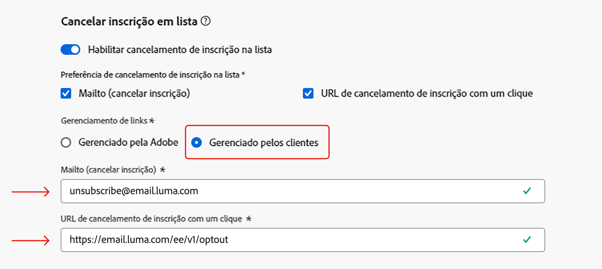

# Notas de versão de 2025 {#release-notes-2025}

Esta página lista todos os recursos e melhorias da versão de 2025 do [!DNL Journey Optimizer].

## Notas de versão de maio de 2025 {#25-5-rn}

<!--**Release date**: May 20-21, 2025-->

### Novos recursos {#25-05-features}

Os novos recursos incluídos nesta versão são detalhados abaixo.

<table>
<thead>
<tr>
<th><strong>Exibição de calendário para inventários de campanha e jornada</strong> </th>
</tr>
</thead>
<tbody>
<tr>
<td>

Agora há uma exibição de calendário disponível nas listas de jornadas e campanhas. Ela permite ver todas as ativações de jornadas e campanhas nas respectivas listas.

Essa alteração está disponível apenas para um conjunto de organizações (disponibilidade limitada). Para solicitar acesso, use <a href="https://forms.cloud.microsoft/r/FC49afuJVi" target="_blank">este formulário</a>.

Para obter mais informações, consulte estas seções: <a href="../building-journeys/journey-ui.md">Procurar e filtrar jornadas</a>, <a href="../campaigns/modify-stop-campaign.md">Acessar campanhas</a>.

Data de disponibilidade: 28 de maio de 2025

</td>
</tr>
</tbody>
</table>

<table>
<thead>
<tr>
<th><strong>Integração de fragmentos de conteúdo do Adobe Experience Manager</strong> </th>
</tr>
</thead>
<tbody>
<tr>
<td>

Com a integração do Adobe Experience Manager e do Adobe Journey Optimizer, agora é possível usar com facilidade os fragmentos de conteúdo do Adobe Experience Manager no conteúdo do Journey Optimizer. Essa conexão perfeita facilita o acesso e o uso do conteúdo do AEM diretamente no Journey Optimizer.

Anteriormente disponível para um conjunto limitado de organizações (DL), esse recurso agora está disponível para o público geral com o seguinte aprimoramento: agora é possível definir espaços reservados e mapear valores de personalização na assinatura do fragmento usando o modo Editor.

<ul>
<!--li>Create offers by directly selecting an AEM Content Fragment.</li>
<li>Define placeholders and map personalization values within the fragment signature using the Editor mode.</li-->
</ul>
 

Para obter mais informações, consulte a <a href="../integrations/aem-fragments.md">documentação detalhada</a>.

Data de disponibilidade: 23 de maio de 2025

</td>
</tr>
</tbody>
</table>

<table>
<thead>
<tr>
<th><strong>Integração do Dynamic Media com o Adobe Experience Manager</strong> </th>
</tr>
</thead>
<tbody>
<tr>
<td>

Os ativos do Dynamic Media agora estão diretamente disponíveis e acessíveis no Journey Optimizer. Essa integração permite:

<ul>
<li>Gerenciar ativos centralmente com atualizações em tempo real.</li>
<li>Modificar instantaneamente suas configurações de ativos, como largura e altura.</li>
<li>Personalizar modelos do Dynamic Media atualizando o conteúdo e adicionando campos de personalização.</li>
</ul>
 

Anteriormente lançado com disponibilidade limitada, esse recurso agora está disponível para todos os ambientes (disponibilidade geral).

Para obter mais informações, consulte a <a href="../integrations/aem-dynamic.md">documentação detalhada</a>.

Data de disponibilidade: 23 de maio de 2025

</td>
</tr>
</tbody>
</table>

<table>
<thead>
<tr>
<th><strong>ID complementar para jornadas acionadas por eventos</strong> </th>
</tr>
</thead>
<tbody>
<tr>
<td>

Agora é possível acionar jornadas usando uma ID de perfil juntamente com outro identificador, como uma ID de pedido, ID de assinatura ou ID de prescrição, permitindo que o mesmo perfil esteja na mesma jornada várias vezes ao mesmo tempo. Isso possibilita cenários como o gerenciamento de vários pedidos ou assinaturas em paralelo, com cada instância seguindo seu próprio caminho pela jornada.

Para obter mais informações, consulte a <a href="../building-journeys/supplemental-identifier.md">documentação detalhada</a>.

Esse recurso está disponível apenas para um conjunto de organizações (disponibilidade limitada). Para obter acesso, entre em contato com o(a) representante da Adobe.

Data de disponibilidade: 23 de maio de 2025

</td>
</tr>
</tbody>
</table>

<table>
<thead>
<tr>
<th><strong>Simular variações de conteúdo</strong> </th>
</tr>
</thead>
<tbody>
<tr>
<td>
<!--p>Previously available in beta, content variations simulation is now generally available (GA). It allows you to preview different variations of your content using sample input data uploaded from a CSV or JSON file or added manually. All the attributes used in your content for personalization are automatically detected by the system and can be used for your tests to create multiple variants.</p-->

Anteriormente lançado com disponibilidade limitada, esse recurso agora está disponível para todos os ambientes. Com esta versão de disponibilidade geral, o recurso agora inclui suporte para conteúdo multilíngue e experimentos de conteúdo, permitindo testar variações em diferentes idiomas e tratamentos. Além disso, agora ele é compatível com atributos contextuais (além dos atributos de perfil), permitindo testes de conteúdo ainda mais dinâmicos e específicos.

Para obter mais informações, consulte a <a href="../test-approve/simulate-sample-input.md">documentação detalhada</a>.

Data de disponibilidade: 23 de maio de 2025

</td>
</tr>
</tbody>
</table>

<table>
<thead>
<tr>
<th><strong>Sincronizar a programação do público-alvo de leitura com o trabalho de segmentação em lote</strong> </th>
</tr>
</thead>
<tbody>
<tr>
<td>

Agora é possível acionar execuções diárias da jornada após a conclusão da segmentação em lote Essa opção agora está disponível em jornadas agendadas diariamente para todos os clientes. Ela permite definir uma janela de tempo de até 6 horas para aguardar os dados de público-alvo de trabalhos de segmentação em lote, garantindo que as jornadas sejam executadas com os dados mais atualizados ou sejam ignoradas, se não estiverem prontas. 

Anteriormente lançado com disponibilidade limitada, esse recurso agora está disponível para todos os ambientes (disponibilidade geral).

Para obter mais informações, consulte a <a href="../building-journeys/read-audience.md#schedule">documentação detalhada</a>.

Data de disponibilidade: 20 de maio de 2025

</td>
</tr>
</tbody>
</table>

<table>
<thead>
<tr>
<th><strong>Provedor de SMS personalizado</strong> </th>
</tr>
</thead>
<tbody>
<tr>
<td>

O Journey Optimizer agora permite configurar provedores de SMS adicionais além das opções padrão: Sinch, Infobip e Twilio. Com a configuração personalizada do provedor SMS, é possível integrar diretamente provedores de terceiros, aproveitar a personalização avançada de conteúdo para gerar mensagens dinâmicas e gerenciar preferências de consentimento (aceitação e recusa) para garantir a conformidade.

Para obter mais informações, consulte a <a href="../sms/sms-configuration-custom.md">documentação detalhada</a>.

Anteriormente lançado com disponibilidade limitada, esse recurso agora está disponível para todos os ambientes (disponibilidade geral).

Data de disponibilidade: 20 de maio de 2025

</td>
</td>
</tr>
</tbody>
</table>

<table>
<thead>
<tr>
<th><strong>Temas no Designer de email</strong> </th>
</tr>
</thead>
<tbody>
<tr>
<td>

Agora é possível aplicar temas pré-aprovados rapidamente para garantir a consistência da marca em todos os emails, acelerar o processo de criação de campanha e produzir emails de alta qualidade de forma independente, reduzindo a dependência de equipes de design.

No momento, esse recurso está na versão beta e disponível apenas para clientes beta. Para participar do programa beta, entre em contato com seu representante da Adobe.

Para obter mais informações, consulte a <a href="../email/apply-email-themes.md">documentação detalhada</a>.

Data de disponibilidade: 14 de maio de 2025

</td>
</tr>
</tbody>
</table>

<table>
<thead>
<tr>
<th><strong>Decisão - Novo construtor de fórmulas de IA</strong> </th>
</tr>
</thead>
<tbody>
<tr>
<td>

Agora é possível criar fórmulas de classificação de decisão específicas por definir e combinar critérios a partir de uma interface nova e aprimorada. Em vez de contar apenas com uma prioridade de oferta estática, é possível definir fórmulas de classificação personalizadas que combinam pontuações do modelo de IA, prioridades de oferta, atributos de perfil, atributos de oferta e sinais contextuais por meio de uma interface guiada.

Para obter mais informações, consulte a <a href="../experience-decisioning/exd-ranking-formulas.md">documentação detalhada</a>.

Data de disponibilidade: 14 de maio de 2025

</td>
</tr>
</tbody>
</table>

### Aprimoramentos {#25-05-improv}

Os aprimoramentos incluídos nesta versão estão listados abaixo.

* **Suporte a novos objetos de campanha para cópia da sandbox** — Data de disponibilidade: 15 de maio de 2025

  Ao copiar campanhas em várias sandboxes usando os recursos de exportação e importação de pacotes, as seguintes dependências agora também são copiadas: configurações de canal, variantes e configurações de experimento, políticas e itens de decisão. [Leia mais](../configuration/copy-objects-to-sandbox.md)

* **Pastas para páginas de destino** - Data de disponibilidade: 9 de maio de 2025

  Para gerenciar facilmente as páginas de destino, agora é possível usar pastas para organizá-las com mais eficiência em uma hierarquia estruturada. [Leia mais](../landing-pages/manage-lp.md)

* **Correspondência direta: suporte à chave SSH para conexões SFTP** - Data de disponibilidade: 5 de maio de 2025

  Na configuração de roteamento do arquivo de correspondência direta, além do SFTP existente com autenticação por senha, agora é possível exportar o arquivo de correspondência direta para um servidor SFTP com autenticação por chave SSH. [Leia mais](../direct-mail/direct-mail-configuration.md)

* **Ativação de pílulas para personalização** - Data de disponibilidade: 5 de maio de 2025

  Um novo botão “Pílulas” foi adicionado ao editor de personalização. Quando habilitado, os atributos contextuais e de perfil são exibidos como pílulas, melhorando a legibilidade do código. [Leia mais](../personalization/personalization-build-expressions.md#options)

  >[!AVAILABILITY]
  >
  >Esse recurso será implantado gradualmente em todos os ambientes nos próximos 30 dias.

* **Suporte ao recurso “Redirecionar para URL” no canal da Web** — Data de disponibilidade: 20 de maio de 2025

  O canal da web do Journey Optimizer agora permite redirecionar visitantes para outro URL existente, em vez de criar uma nova variação no editor visual. Esse recurso pode ser usado para realizar experimentos comparando duas páginas completamente diferentes, em vez de apenas alterar alguns elementos em uma página. [Leia mais](../web/create-web.md#web-redirect-to-url)

* **Pastas para modelos e fragmentos** — Data de disponibilidade: 20 de maio de 2025

  As pastas permitem organizar objetos com mais facilidade e eficácia, usando uma hierarquia estruturada. Anteriormente disponíveis para apenas algumas organizações (disponibilidade limitada), as pastas agora estão disponíveis para todos os usuários (disponibilidade geral), permitindo o gerenciamento de modelos e fragmentos de conteúdo. Saiba mais nas seções [Modelos de conteúdo](../content-management/access-content-templates.md#folders) e [Fragmentos](../content-management/manage-fragments.md#folders).

* **Rastreamento de cliques em modelos de email** — Data de disponibilidade: 20 de maio de 2025

  O rastreamento de cliques em elementos `<area>` nos mapas de imagem de conteúdos de email agora é um recurso nativo do [!DNL Journey Optimizer]. Isso visa garantir que as áreas do mapa de imagem recebam o mesmo tratamento de rastreamento que os hiperlinks padrão, o que envolve a inclusão de códigos, dados e parâmetros de rastreamento. [Saiba mais sobre o rastreamento de mensagens](../email/message-tracking.md#manage-tracking)

<!--
* **Decisioning - Leverage Adobe Experience Platform datasets** 
  
  Journey Optimizer now allows you to leverage Adobe Experience Platform datasets in the following Decisioning objects: eligibility rules, ranking formulas, and capping rules.-->

* **Painel direito na lista de campanhas** — Data de disponibilidade: 20 de maio de 2025

  Agora, selecionar uma campanha na lista abre um painel que exibe seus detalhes.

<!--* **Form fields in code-based experience content**

  In content templates, you can now define specific JSON or HTML fields which enable non-technical users to easily edit content in code-based experiences without the need to manipulate code.-->

<!--* **Subdomains - 'Custom delegation' method**  
  In addition to the full delegation and the CNAME method, a new subdomain configuration method is now available: the Custom delegation method, which enables you to fully own controlling and maintaining all aspects of DNS that are required for delivering, rendering, and tracking messages.
  -->

## Notas da versão de abril de 2025 {#25-4-rn}

**Data de lançamento**: 29-30 de abril de 2025

### Novos recursos {#25-04-features}

Os novos recursos incluídos nesta versão estão listados abaixo.

<table>
<thead>
<tr>
<th><strong>Editor de personalização - Aprendizado prático</strong> </th>
</tr>
</thead>
<tbody>
<tr>
<td>

Agora há um playground de personalização disponível, onde é possível experimentar com expressões de personalização. Ele permite explorar modelos de amostra e conteúdos para ajudar a iniciar e experimentar suas próprias expressões de personalização.

Para obter mais informações, consulte a <a href="../personalization/personalize.md#playground">documentação detalhada</a>.

Data de disponibilidade: 24 de abril de 2025

</td>
</tr>
</tbody>
</table>

<!--table>
<thead>
<tr>
<th><strong>Adobe Experience Manager as a Cloud Service integration</strong> </th>
</tr>
</thead>
<tbody>
<tr>
<td>

The integration between Adobe Journey Optimizer and Adobe Experience Manager as a Cloud Service is now released in General Availability (GA). This integration enables seamless content sourcing and management for personalized customer journeys.

For more information, refer to the <a href="../integrations/aem-templates.md">detailed documentation</a>.

</td>
</tr>
</tbody>
</table-->

<!--<table>
<thead>
<tr>
<th><strong>Simulate content variations (General Availability)</strong> </th>
</tr>
</thead>
<tbody>
<tr>
<td>

Previously available in beta, content variations simulation is now generally available (GA). It allows you to preview different variations of your content using sample input data uploaded from a CSV or JSON file or added manually. All the attributes used in your content for personalization are automatically detected by the system and can be used for your tests to create multiple variants.

With the General Availability release, the feature now includes support for multilingual content and content experiments, enabling you to test variations across different languages and treatments. Additionally, it now supports contextual attributes (in addition to profile attributes), allowing for even more dynamic and situational content testing.

</td>
</tr>
</tbody>
</table>-->

<table>
<thead>
<tr>
<th><strong>Canal LINE </strong> </th>
</tr>
</thead>
<tbody>
<tr>
<td>

O Adobe Journey Optimizer expandiu seus recursos entre canais para incluir suporte para o canal LINE. Esse aprimoramento permite criar, editar e visualizar experiências LINE, garantindo interações mais personalizadas e envolventes. Com o LINE, você pode se conectar com mais clientes, enviar conteúdo relevante e melhorar seu engajamento.

O canal LINE é habilitado para clientes do Adobe Journey Optimizer mediante solicitação. Entre em contato com o Atendimento ao cliente da Adobe ou com o(a) representante da Adobe para ativar o recurso em sua organização.

Para obter mais informações, consulte a <a href="../line/get-started-line.md">documentação detalhada</a>.
</td>
</tr>
</tbody>
</table>

<!--table>
<thead>
<tr>
<th><strong>Custom SMS provider (General Availability)</strong> </th>
</tr>
</thead>
<tbody>
<tr>
<td>

Adobe Journey Optimizer now supports custom SMS providers, allowing you to integrate your preferred SMS services for enhanced communication flexibility.

For more information, refer to the <a href="../sms/sms-configuration-custom.md">detailed documentation</a>.
</td>
</tr>
</tbody>
</table-->

<table>
<thead>
<tr>
<th><strong>Métricas de jornada</strong> </th>
</tr>
</thead>
<tbody>
<tr>
<td>

As métricas de jornada agora estão disponíveis, permitindo medir o impacto de suas atividades nas métricas principais do seu negócio e fornecer insights mais claros sobre seu desempenho.

 

Para obter mais informações, consulte a <a href="../building-journeys/success-metrics.md">documentação detalhada</a>.

Data de disponibilidade: 9 de abril de 2025

</td>
</tr>
</tbody>
</table>

<!--<table>
<thead>
<tr>
<th><strong>Calendar view for campaign and journey inventory (Limited Availability)</strong> </th>
</tr>
</thead>
<tbody>
<tr>
<td>

A new calendar view is now available for campaigns and journey activations. This feature provides a visual representation of scheduled activities, allowing you to view and manage your campaigns and journeys more effectively. Selecting a calendar item opens a right rail with detailed information. This feature is currently in Limited Availability.

</td>
</tr>
</tbody>
</table>-->

<table>
<thead>
<tr>
<th><strong>Integração do Adobe Express (disponibilidade limitada)</strong> </th>
</tr>
</thead>
<tbody>
<tr>
<td>

O Adobe Journey Optimizer agora se integra ao Adobe Express, permitindo conectar facilmente seus ativos criativos à orquestração de jornada. Essa integração simplifica o processo de criação e implantação de conteúdo personalizado em campanhas. 

No momento, essa integração não está disponível para uso com o Healthcare Shield ou com o Privacy and Security Shield.

Para obter mais informações, consulte a <a href="../integrations/express.md">documentação detalhada</a>.

</td>
</tr>
</tbody>
</table>

<table>
<thead>
<tr>
<th><strong>Acionar execuções diárias de jornada após a conclusão da segmentação em lote (disponibilidade limitada)</strong> </th>
</tr>
</thead>
<tbody>
<tr>
<td>

Para jornadas agendadas diariamente, uma nova opção permite definir uma janela de tempo de até 6 horas para aguardar os dados de público-alvo de trabalhos de segmentação em lote, garantindo que as jornadas sejam executadas com os dados mais atualizados ou sejam ignoradas, se não estiverem prontas. A opção “Acionar após a avaliação de público-alvo em lote” está disponível apenas para um conjunto de organizações (disponibilidade limitada). Para obter acesso, entre em contato com o(a) representante da Adobe.

Para obter mais informações, consulte a <a href="../building-journeys/read-audience.md#schedule">documentação detalhada</a>.

</td>
</tr>
</tbody>
</table>

<!--table>
<thead>
<tr>
<th><strong>Themes in the Email Designer (Beta)</strong> </th>
</tr>
</thead>
<tbody>
<tr>
<td>

You can now quickly apply pre-approved styling themes to your email content to ensure brand consistency across all emails, speed up your campaign creation process and independently produce hight-quality emails while reducing dependency on design teams.

This capability is currently in beta version and only available to beta customers. To join the beta program, contact your Adobe representative.

For more information, refer to the <a href="../content-management/brands-score.md">detailed documentation</a>.

Availability date: May 5, 2025

</td>
</tr>
</tbody>
</table-->

<table>
<thead>
<tr>
<th><strong>Pontuação de alinhamento à marca (beta)</strong> </th>
</tr>
</thead>
<tbody>
<tr>
<td>

O recurso de pontuação de alinhamento da marca oferece feedback claro diretamente no Designer de email, ajudando você a ver se o conteúdo está alinhado ao tom, estilo e diretrizes da sua marca. Esse recurso está disponível na versão beta.

Para obter mais informações, consulte a <a href="../content-management/brands-score.md">documentação detalhada</a>.

</td>
</tr>
</tbody>
</table>

<!--
<table>
<thead>
<tr>
<th><strong>Decisioning - New AI formula builder</strong> </th>
</tr>
</thead>
<tbody>
<tr>
<td>

You can now create specific Decisioning ranking formulas by defining and combining criteria from a new improved interface. Ranking formulas allow you to define rules that will determine which decision items should be presented first, rather than taking into account the priority scores.

For more information, refer to the <a href="../content-management/brands-score.md">detailed documentation</a>.

Availability date: May 5, 2025

</td>
</tr>
</tbody>
</table>
-->

### Aprimoramentos {#25-04-improv}

**API de visualização de campanhas**

Há novas APIs disponíveis para visualizar campanhas, além dos recursos existentes de envio de provas. [Leia mais](https://developer.adobe.com/journey-optimizer-apis/references/simulations/#operation/createCampaignPreview){target="_blank"}.

**Ferramentas de sandbox**

* **Ferramentas de sandbox para ações personalizadas**

  As ações personalizadas agora são incluídas na lista de objetos do Adobe Journey Optimizer que podem ser copiados usando as ferramentas de sandbox, simplificando o teste e a implantação. [Leia mais](../configuration/copy-objects-to-sandbox.md)

* **Ferramentas de sandbox para campanhas** - Data de disponibilidade: 3 de abril de 2025

  Agora é possível copiar campanhas em várias sandboxes usando recursos de exportação e importação de pacotes. As campanhas são copiadas junto com todos os itens relacionados ao perfil, público-alvo, esquema, mensagens em linha e objetos dependentes. Alguns itens não são copiados, como itens de decisão, rótulos de uso de dados e configurações de idioma. [Leia mais](../configuration/copy-objects-to-sandbox.md#custom-actions)

**Personalização**

* **Novo atributo contextual**

  A **ID de perfil da mensagem**, um novo atributo contextual, agora está disponível para seleção no editor de personalização. Este é um atributo orientado por mensagem que identifica exclusivamente as mensagens enviadas para cada perfil direcionado em uma entrega. É possível usar esse identificador exclusivo, por exemplo, como um parâmetro de rastreamento de URL para distinguir cada link aberto ou clicado pelos destinatários.

* **Atributos preenchidos no painel de atributos** - Data de disponibilidade: 2 de abril de 2025

  Por padrão, o painel de atributos no editor de personalização agora mostra apenas atributos preenchidos. Para exibir todos os atributos, use o botão de configurações para desativar a opção **[!UICONTROL Mostrar apenas atributos preenchidos]**. [Leia mais](../personalization/personalization-build-expressions.md)

**Canal de email**

* **Rastreamento personalizado de URL** - Data de disponibilidade: 30 de abril de 2025

  Para aumentar a flexibilidade e o controle sobre suas configurações de email, agora você pode personalizar todos os parâmetros de rastreamento de URL de uma só vez no nível de configuração do canal de email, em vez de fazer isso no Designer de email para cada link no seu conteúdo. [Leia mais](../email/surface-personalization.md#personalize-url-tracking)

* **Designer de email** - Data de disponibilidade: 1º de abril de 2025

  Para melhorar a acessibilidade no Journey Optimizer, agora há dois novos campos disponíveis no Designer de email, os quais correspondem ao elemento `<title>` e ao atributo `lang` no elemento `<html>` do conteúdo do email. Além dessas configurações, é possível definir o campo **[!UICONTROL Pré-cabeçalho]** na seção **[!UICONTROL Corpo]** do email. [Leia mais](../email/email-metadata.md)

**Manuais de casos de uso**

* **Criação e compartilhamento de manuais de estratégia (beta privado)** - Agora é possível criar, gerenciar e compartilhar seus próprios manuais de estratégia de casos de uso. No momento, esse recurso está disponível apenas para algumas organizações como um beta privado. Para obter acesso, entre em contato com o(a) representante da Adobe. [Leia mais](../start/playbooks.md)

**Navegação**

* **Gerenciamento de conteúdo** - Data de disponibilidade: 2 de abril de 2025

  Para gerenciar facilmente seus modelos e fragmentos de conteúdo, agora é possível usar pastas para organizá-los de forma mais eficaz em uma hierarquia estruturada. Saiba mais nas seções [Modelos de conteúdo](../content-management/access-content-templates.md#folders) e [Fragmentos](../content-management/manage-fragments.md#folders).

  >[!AVAILABILITY]
  >
  >Esta melhoria está disponível apenas para um conjunto de organizações (disponibilidade limitada).

<!--- **Folders for content templates and fragments** - Availability date: May 5, 2025

  Previously available for a set of organizations (LA), folders are now available to all users (GA) to manage their content templates and fragments. Folders let you organize your content templates and fragments more easily and effectively into a structured hierarchy.

<!--- **Right rail in campaigns list**  

  A right rail has been added to the campaigns list, providing detailed information when a campaign is selected.-->

<!--**Playbooks**

- **Create your own playbooks (Beta)**
  
  You can now create your own playbooks in Adobe Journey Optimizer, enabling greater customization and flexibility in journey planning.-->

## Notas de versão de março de 2025 {#25-3-rn}

### Novos recursos {#25-03-features}

Os novos recursos incluídos nesta versão são detalhados abaixo.

<!--table>
<thead>
<tr>
<th><strong>Integration with Adobe Express (Limited Availability)</strong> </th>
</tr>
</thead>
<tbody>
<tr>
<td>

The Adobe Express integration in Adobe Journey Optimizer lets you use Adobe Express's editing tools directly during content creation, enabling you to resize, remove backgrounds, crop, and convert assets to JPEG or PNG.

Adobe Express integration in Adobe Journey Optimizer is currently only available for a set of organizations (Limited Availability). It cannot be deployed for use with Healthcare Shield or Privacy and Security Shield.

For more information, refer to the <a href="../integrations/express.md">detailed documentation</a>.

 

</td>
</tr>
</tbody>
</table-->

<!--table>
<thead>
<tr>
<th><strong>Journey metrics</strong> </th>
</tr>
</thead>
<tbody>
<tr>
<td>

Journey metrics are now available, allowing you to measure the impact of your activities across the key metrics of your business and to provide clearer insights into your performance.

For more information, refer to the <a href="../building-journeys/success-metrics.md">detailed documentation</a>.

</td>
</tr>
</tbody>
</table-->

<!-- table>
<thead>
<tr>
<th><strong>Calendar view for journeys (Limited Availability)</strong> </th>
</tr>
</thead>
<tbody>
<tr>
<td>

A calendar view is now available in Journey Optimizer to visualize all journeys activations. From this view, you can browse your journeys and check details and properties.

This change is only available for a set of organizations (Limited Availability). To gain access, contact your Adobe representative.

For more information, refer to the <a href="../conflict-prioritization/rule-sets.md">detailed documentation</a>.

</td>
</tr>
</tbody>
</table-->

<table>
<thead>
<tr>
<th><strong>Integração com o Dynamic Media (disponibilidade limitada)</strong> </th>
</tr>
</thead>
<tbody>
<tr>
<td>

Os ativos do Dynamic Media agora estão diretamente disponíveis e acessíveis no Journey Optimizer. Essa integração permite:
<ul>
<li>Gerenciar ativos centralmente com atualizações em tempo real</li>
<li>Modificar instantaneamente suas configurações de ativos, como largura e altura</li>
<li>Personalizar modelos do Dynamic Media atualizando o conteúdo e adicionando campos de personalização</li>
</ul>

Esta integração está disponível apenas para um conjunto de organizações (disponibilidade limitada). Para obter acesso, entre em contato com o(a) representante da Adobe.

Para obter mais informações, consulte a <a href="../integrations/aem-dynamic.md">documentação detalhada</a>.

</td>
</tr>
</tbody>
</table>

<table>
<thead>
<tr>
<th><strong>Integração com o Adobe GenStudio (disponibilidade limitada)</strong> </th>
</tr>
</thead>
<tbody>
<tr>
<td>

Para aprimorar a eficiência do marketing e manter a consistência da marca, agora é possível integrar perfeitamente as experiências do GenStudio para marketing de desempenho com o Journey Optimizer. Isso permite que você aproveite a criação de conteúdo com inteligência artificial do GenStudio juntamente com os recursos avançados de orquestração do Journey Optimizer.

O uso da integração do GenStudio no Journey Optimizer está atualmente indisponível para uso com o Healthcare Shield ou o Privacy and Security Shield (disponibilidade limitada).

Para obter mais informações, consulte a <a href="../integrations/genstudio.md">documentação detalhada</a>.

</td>
</tr>
</tbody>
</table>

<table>
<thead>
<tr>
<th><strong>Avaliação de público-alvo flexível (disponibilidade geral)</strong> </th>
</tr>
</thead>
<tbody>
<tr>
<td>

Anteriormente disponível para apenas algumas organizações (disponibilidade limitada), a avaliação de público-alvo flexível agora está disponível para todos os usuários (disponibilidade geral). Esse recurso permite executar um trabalho de segmentação sob demanda para públicos-alvo selecionados, garantindo que você sempre tenha os dados de público-alvo mais atualizados antes de direcioná-los para jornadas e campanhas do Journey Optimizer.

Para obter mais informações, consulte a <a href="../audience/creating-a-segment-definition.md#flexible">documentação detalhada</a>.

</tr>
</tbody>
</table>
</table>

<!--table>
<thead>
<tr>
<th><strong>LINE channel (Limited Availability)</strong> </th>
</tr>
</thead>
<tbody>
<tr>
<td>

Adobe Journey Optimizer has expanded its cross-channel capabilities to include support for the LINE channel. This enhancement allows you to create, edit, and preview LINE experiences enabling more personalized and engaging interactions. With LINE, you can connect with more customers, send relevant content, and improve your engagement.

This capability is only available for a set of organizations (Limited Availability). To gain access, contact your Adobe representative.

For more information, refer to the <a href="../conflict-prioritization/rule-sets.md">detailed documentation</a>.

</td>
</tr>
</tbody>
</table-->

### Aprimoramentos {#25-03-improv}

**Editor de personalização** (data de disponibilidade: 12 de março)

O editor de personalização do Journey Optimizer foi atualizado com novos recursos:
* **Design do editor de código atualizado**: uma interface mais simples e moderna para melhorar a usabilidade e o foco.
* **Pesquisar e substituir**: adição da funcionalidade para localizar e substituir rapidamente o conteúdo no editor.
* **Desfazer e refazer**: permite reverter ou reaplicar facilmente as alterações.
* **Tamanho de fonte personalizável**: permite ajustar o tamanho da fonte do editor para facilitar a leitura.
* **Validação JSON em linha**: fornece validação do lado do cliente em tempo real para conteúdo JSON, a fim de acelerar a detecção de erros.
* **Preenchimento automático para atributos de perfil e contexto**: oferece sugestões inteligentes para simplificar a criação de conteúdo.
* **Realce de sintaxe aprimorado**: melhora a legibilidade por tornar a estrutura do código mais visualmente distinta.

Para obter mais informações, consulte a [documentação detalhada](../personalization/personalization-build-expressions.md).

**Aprovações**

Ao definir as condições para uma política de aprovação, agora há a opção de filtrar por tag e/ou categoria de objeto.

Para obter mais informações, consulte a [documentação detalhada](../test-approve/approval-policies.md).

**Configuração**

* Agora é possível atribuir tags unificadas da Adobe Experience Platform às configurações de canais. Isso permite classificá-las facilmente e melhorar a pesquisa e a navegação em todas as listas. [Saiba mais](../configuration/channel-surfaces.md#channel-config-tags)

* Ao configurar ou editar um subdomínio de email no Journey Optimizer, agora você pode optar por gerenciar o registro DMARC associado por conta própria, se disponível no domínio principal. [Saiba mais](../configuration/dmarc-record.md#set-up-dmarc)

**Regras de negócios**

Agora você pode usar o limite de frequência diário em jornadas e campanhas com segmentação em lote. Para garantir a precisão das regras diárias de limite de frequência, escolha o namespace de prioridade mais alta ao criar uma campanha ou jornada. Saiba mais sobre a prioridade de namespace no [Guia do serviço de identidade da Platform](https://experienceleague.adobe.com/pt-br/docs/experience-platform/identity/features/identity-graph-linking-rules/namespace-priority){target="_blank"}

Como lembrete, o limite de frequência diária em conjuntos de regras está disponível apenas para algumas organizações (disponibilidade limitada). Para obter acesso, entre em contato com o(a) representante da Adobe.

Para obter mais informações sobre regras de negócios, consulte a [documentação detalhada](../conflict-prioritization/rule-sets.md).

**Modelos de conteúdo**

Os modelos de conteúdo do tipo HTML agora estão obsoletos. Observe que ainda é possível usar os modelos de conteúdo HTML anteriores criados no [!DNL Journey Optimizer]. [Saiba mais sobre modelos de conteúdo](../content-management/content-templates.md)

<!--**Deliverability**

You can now choose to have your emails relayed to your SMTP servers instead of being sent directly from Journey Optimizer to ISPs. This allows you to route final email deliveries through your own Mail Transfer Agents and IPs, or to perform final validations on the emails before sending them to your recipients. The SMTP relay capacity is available on demand - contact your Adobe representative.-->

## Notas da versão de fevereiro de 2025 {#25-02-rn}

**Data de lançamento**: 18 a 19 de fevereiro de 2025

### Novos recursos {#25-02-features}

Os novos recursos incluídos nesta versão são detalhados abaixo.

<table>
<thead>
<tr>
<th><strong>Criar e gerenciar regras de negócios</strong> </th>
</tr>
</thead>
<tbody>
<tr>
<td>

Agora é possível criar regras de negócios usando conjuntos de regras. Os conjuntos de regras são grupos de regras que ajudam a limitar as mensagens enviadas em campanhas e ações de jornada entre canais, além de controlar as entradas de perfis nas jornadas.

<ul><li>Crie conjuntos de regras de canal para restringir o número de mensagens enviadas por um ou vários canais. Utilize-os em campanhas ou ações de jornada para aplicar as regras definidas no conjunto de regras. O conjunto de regras de canal permite aplicar regras de limite com base nos tipos de comunicação. Por exemplo, defina um conjunto de regras para limitar “mensagens promocionais” e outro para “boletins informativos”. Aplique o conjunto de regras apropriado em sua ação de campanha ou jornada, dependendo do tipo de comunicação que você está enviando.</li>
<li> Crie conjuntos de regras de jornada para controlar entradas de perfil nas jornadas. Limite a frequência com que um perfil pode entrar em uma jornada em um determinado período ou o número de jornadas nas quais um perfil pode ser inscrito simultaneamente. Aplique-as no nível da jornada para garantir um gerenciamento de entradas adequado.</li></ul>

Anteriormente disponíveis para um conjunto de organizações (disponibilidade limitada), as regras de negócios agora estão disponíveis para todos os usuários (disponibilidade geral). As regras de negócios do domínio de jornada continuam disponíveis somente para um conjunto limitado de organizações (disponibilidade limitada).

Para obter mais informações, consulte a <a href="../conflict-prioritization/rule-sets.md">documentação detalhada</a>.

</td>
</tr>
</tbody>
</table>

<table>
<thead>
<tr>
<th><strong>Gerar páginas de destino com o Assistente de IA</strong> </th>
</tr>
</thead>
<tbody>
<tr>
<td>

Com a ajuda do Assistente de IA, agora é possível criar um conteúdo atrativo para suas páginas de destino, incluindo designs de página inteira, texto personalizado e visuais customizados.

Para obter mais informações, consulte a <a href="../content-management/generative-lp.md">documentação detalhada</a>.

</td>
</tr>
</tbody>
</table>

<table>
<thead>
<tr>
<th><strong>Marcas com o Assistente de IA (Beta)</strong> </th>
</tr>
</thead>
<tbody>
<tr>
<td>

Agora é possível configurar suas próprias marcas para definir a identidade visual e verbal da sua marca. 

Esse recurso foi lançado como um beta privado para um conjunto limitado de clientes. Ele será disponibilizado progressivamente a todos os clientes em versões futuras.

Para obter mais informações, consulte a <a href="../content-management/brands.md">documentação detalhada</a>.

</td>
</tr>
</tbody>
</table>

<table>
<thead>
<tr>
<th><strong>Solucionar problemas de ações personalizadas</strong> </th>
</tr>
</thead>
<tbody>
<tr>
<td>

Agora é possível validar uma configuração de ação personalizada fazendo chamadas de API reais diretamente do Adobe Journey Optimizer. Esse novo recurso ajuda você a solucionar problemas de ações personalizadas antes ou depois de usá-las em uma jornada. 

Para obter mais informações, consulte a <a href="../action/troubleshoot-custom-action.md">documentação detalhada</a>.

<!--p> This capability is only available for a set of organizations (Limited Availability). To gain access, contact your Adobe representative.</p-->
</td>
</tr>
</tbody>
</table>

<table>
<thead>
<tr>
<th><strong>Avaliação flexível de público-alvo (disponibilidade limitada)</strong> </th>
</tr>
</thead>
<tbody>
<tr>
<td>

A avaliação flexível de público-alvo permite executar um trabalho de segmentação por demanda para públicos-alvo selecionados, garantindo que você sempre tenha os dados do público-alvo mais atualizados antes de direcioná-los em jornadas e campanhas do Journey Optimizer.

Para obter mais informações, consulte a <a href="../audience/creating-a-segment-definition.md#flexible">documentação detalhada</a>.

Esse recurso está disponível apenas para um conjunto de organizações (disponibilidade limitada). Para obter acesso, entre em contato com o(a) representante da Adobe.

Data de disponibilidade: 28 de janeiro de 2025

</tr>
</tbody>
</table>
</table>

### Aprimoramentos {#25-02-improvements}

As melhorias abaixo estão incluídas na atualização de fevereiro.

* **Tempo de vida do conjunto de dados**: a partir deste mês, uma medida de proteção de tempo de vida (TTL) será implantada nos conjuntos de dados gerados pelo sistema do Journey Optimizer para novas sandboxes e organizações da seguinte maneira:

   * 90 dias para dados na loja de perfis
   * 13 meses para dados no data lake

  Essa alteração será implementada nas sandboxes de clientes existentes em uma próxima fase.

  Saiba mais sobre esta atualização nas [Perguntas frequentes dedicadas](../data/datasets-ttl.md#frequently-asked-questions).

<!--* **Playbooks** - You can now create and publish your own Use Case Playbooks in Journey Optimizer.-->

* **Correspondência direta**: um novo tipo de servidor, Zona de destino de dados, agora é compatível com o roteamento de arquivos na configuração do canal de correspondência direta. [Leia mais](../direct-mail/direct-mail-configuration.md#file-routing-configuration)

* **SMS**: agora é possível gerenciar a entrega de mensagens SMS de pontos de acesso multirregionais substituindo os URLs de entrega, feedback, entrada e retorno de chamada. Para oferecer suporte a isso, um novo campo Substituir URL foi adicionado à configuração Credenciais da API. Essa alteração está disponível somente com o provedor Sinch. [Leia mais](../sms/sms-configuration-sinch.md)

* **Personalização** (Data de disponibilidade: 29 de janeiro de 2025): há novas funções auxiliares de data/hora disponíveis para uso no editor de personalização. [Leia mais](../personalization/functions/dates.md)

<!--
* The personalization editor has been enhanced with new capabilities such as Auto-complete, Search, and filtering options. You can also show or hide deprecated attributes.-->

* **Configuração de email**: se você estiver gerenciando o consentimento fora da Adobe, agora será possível definir um endereço de email personalizado para cancelar a inscrição e um URL personalizado para cancelar a inscrição com um clique como parte das configurações do canal de email. [Leia mais](../email/list-unsubscribe.md#custom-managed)

  {width="80%"}

* **Decisão** (Data de disponibilidade: 28 de janeiro de 2025): o serviço de decisão agora oferece suporte a tipos de dados de objeto ao editar o esquema do catálogo de itens. [Leia mais](../experience-decisioning/catalogs.md)
