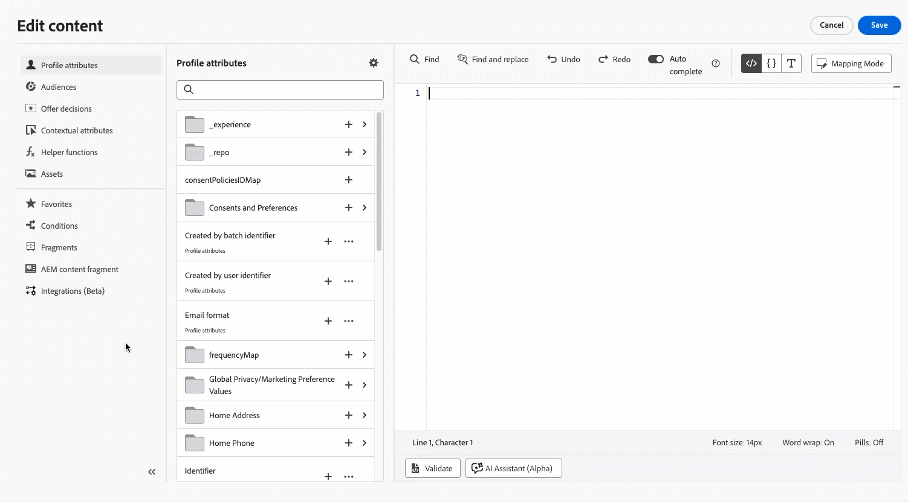

# Notas de versão de 2026 {#release-notes-2026}

Esta página lista todos os recursos e melhorias do [!DNL Journey Optimizer] lançado em 2026.

## Notas de versão de março de 2026 {#march-26-rn}

As seções [Novos recursos](#march-26-features) e [Melhorias](#march-26-improv) abordam recursos já disponíveis. <!--The [Coming soon](#coming-soon) section lists features and improvements scheduled for release later in March.-->

<!--
**The pre-release notes below are subject to change without prior notice until the release availability date**. Links, screens and updated documentation are published in the release notes, at the release date.

See also [Adobe Experience Platform pre-release notes](https://experienceleague.adobe.com/en/docs/experience-platform/release-notes/pre-release-notes){target="_blank"}.
-->

**Data de lançamento**: 24 a 25 de março de 2026

### Novos recursos {#march-26-features}

<table>
<thead>
<tr>
<th><strong>Criptografia de parâmetro de URL</strong> </th>
</tr>
</thead>
<tbody>
<tr>
<td>

Os parâmetros de URL em links de rastreamento e de página de aterrissagem adicionados às suas mensagens de email agora podem ser criptografados, fornecendo uma camada adicional de segurança para dados de parâmetros confidenciais.

<ul>
<li>Registre e gerencie chaves de criptografia no Registro <strong>Administração</strong> dedicado.</li>
<li>Use a nova função auxiliar "Encrypt" em expressões para criptografar dados confidenciais em URLs para os parâmetros de consulta que você deseja proteger no momento da renderização.</li>
</ul>

Esse recurso está disponível apenas para um conjunto de organizações (disponibilidade limitada). Para obter acesso, entre em contato com um representante da Adobe.

Para obter mais informações, consulte a <a href="../personalization/url-parameter-encryption.md">documentação detalhada</a>.

Data de disponibilidade: 31 de março de 2026

</td>
</tr>
</tbody>
</table>

<table>
<thead>
<tr>
<th><strong>Converter imagens em modelos de conteúdo de email</strong> </th>
</tr>
</thead>
<tbody>
<tr>
<td>

Agora é possível converter imagens em modelos de conteúdo de email diretamente no Journey Optimizer. Use a análise baseada em IA para gerar automaticamente modelos estruturados do HTML a partir de referências visuais, reduzindo significativamente o tempo de design de email.

Anteriormente lançado em disponibilidade limitada, este recurso já está disponível para todos os ambientes (disponibilidade geral).

Para obter mais informações, consulte a <a href="../content-management/image-to-html.md">documentação detalhada</a>.

Data de disponibilidade: 31 de março de 2026

</td>
</tr>
</tbody>
</table>

<table>
<thead>
<tr>
<th><strong>Formulários personalizados de página de destino</strong> </th>
</tr>
</thead>
<tbody>
<tr>
<td>

Com o [!DNL Journey Optimizer], você pode capturar atributos de perfil por meio das páginas de aterrissagem.

Crie, projete e gerencie formulários personalizados adaptados às suas necessidades com base em um conjunto de dados específico. Em seguida, é possível usar esses formulários em páginas de destino para adicionar os atributos de perfil de sua escolha ao conjunto de dados definido para cada formulário.

Anteriormente lançado com disponibilidade limitada para clientes nos Estados Unidos e na Austrália, esse recurso agora está disponível para todos os ambientes (disponibilidade geral).

Para obter mais informações, consulte a <a href="../landing-pages/lp-forms.md">documentação detalhada</a>.

Data de disponibilidade: 26 de março de 2026.

</td>
</tr>
</tbody>
</table>

<table>
<thead>
<tr>
<th><strong>Atividade de teste em campanhas orquestradas</strong> </th>
</tr>
</thead>
<tbody>
<tr>
<td>

Uma nova atividade <strong>Test</strong> está disponível em Campanhas Orquestradas. Essa atividade roteia a execução do fluxo de trabalho para diferentes ramificações com base em condições definidas, permitindo validar a lógica e as configurações da campanha antes de ativar os deliveries ativos.

Para obter mais informações, consulte a <a href="../orchestrated/activities/test.md">documentação detalhada</a>.

</td>
</tr>
</tbody>
</table>

<table>
<thead>
<tr>
<th><strong>Suporte à pesquisa de conjunto de dados no jornada</strong> </th>
</tr>
</thead>
<tbody>
<tr>
<td>

Uma nova atividade de <strong>Pesquisa de conjunto de dados</strong> no jornada permite recuperar dinamicamente dados de conjuntos de dados de registros Adobe Experience Platform no tempo de execução, fornecendo acesso a informações que não fazem parte do perfil ou da carga do evento, de modo que as interações com o cliente permaneçam relevantes e oportunas.

Anteriormente lançada em Disponibilidade limitada para um conjunto restrito de organizações, a atividade de pesquisa do conjunto de dados no jornada agora está disponível para todos os clientes autorizados a [pesquisa do conjunto de dados](../data/lookup-aep-data.md), enquanto permanece em Disponibilidade limitada.

Para obter mais informações, consulte a <a href="../building-journeys/dataset-lookup.md">documentação detalhada</a>.

</td>
</tr>
</tbody>
</table>

<table>
<thead>
<tr>
<th><strong>A atividade Action substitui atividades de jornada específicas do canal</strong> </th>
</tr>
</thead>
<tbody>
<tr>
<td>

Após a Disponibilidade geral da <strong>Atividade de ação</strong> em fevereiro de 2026, as atividades de canal nativas herdadas (Email, Push, SMS, No aplicativo, Web, Experiência baseada em código e Cartão de conteúdo) na tela de jornada foram descontinuadas.

Agora você deve usar a atividade única Action para configurar todas as ações de canal, substituindo a necessidade de nós específicos do canal separados.

As jornadas existentes que usam atividades de canal herdadas continuam a funcionar sem nenhuma alteração ou migração necessária.

Para obter mais informações, consulte a <a href="../building-journeys/journey-action.md">documentação detalhada</a>.

</td>
</tr>
</tbody>
</table>

<table>
<thead>
<tr>
<th><strong>Editor avançado do HTML para modelos de email</strong> </th>
</tr>
</thead>
<tbody>
<tr>
<td>

O modo HTML avançado para modelos de conteúdo de email permite editar a origem de HTML do seu conteúdo no Designer de email, adicionar expressões avançadas (como condições) na origem e alternar entre a exibição do HTML e a exibição da área de trabalho sem perder as alterações.

Esse recurso está disponível em modelos de conteúdo somente para o canal de email. No momento, a disponibilidade é limitada — entre em contato com o representante da Adobe para obter acesso.

Para obter mais informações, consulte a <a href="../email/email-expert-mode.md">documentação detalhada</a>.

Data de disponibilidade: 10 de março de 2026

</td>
</tr>
</tbody>
</table>

<table>
<thead>
<tr>
<th><strong>Integração de modelos personalizados do Firefly e modelos de geração de imagens de terceiros</strong> </th>
</tr>
</thead>
<tbody>
<tr>
<td>

Permita a integração perfeita de modelos padrão e personalizados do Firefly, bem como de modelos de imagem de terceiros aprovados, para oferecer maior flexibilidade, controle e alinhamento com a marca na geração de imagens.

Escolha o modelo certo para suas necessidades:

<ul><li> <strong>Modelo da Adobe</strong> (desenvolvido pelo Firefly Image Model 4) para geração imediata de imagens sem configuração adicional</li><li> <strong>Modelo de parceiro</strong> (desenvolvido por Gemini 2.5 Flash) para recursos especializados</li><li><strong>Modelos personalizados</strong> (modelos específicos para cada marca, treinados com seus próprios recursos) para uma geração de conteúdo que se alinhe perfeitamente à identidade, ao estilo e às diretrizes visuais da sua marca.</li></ul>

Para obter mais informações, consulte a <a href="../content-management/generative-models.md">documentação detalhada</a>.

Data de disponibilidade: 2 de março de 2026

</td>
</tr>
</tbody>
</table>

<table>
<thead>
<tr>
<th><strong>Atividade online para iOS</strong> </th>
</tr>
</thead>
<tbody>
<tr>
<td>

Traga experiências em tempo real diretamente para o Lock Screens e Dynamic Island de seus clientes com a <strong>Atividade do iOS Live</strong> no Adobe Journey Optimizer. Forneça atualizações em tempo real, desde o rastreamento de pedidos e o status do voo até a contagem regressiva de eventos, pontuações em tempo real e o progresso do delivery, sem exigir que os usuários abram seu aplicativo. Mantenha seu público informado e engajado no momento exato, exatamente onde eles estão.

Anteriormente lançado na versão beta, esse recurso agora está disponível para todos os ambientes (Disponibilidade geral).

Para obter mais informações, consulte a <a href="../mobile-live/get-started-mobile-live.md">documentação detalhada</a>.

Data de disponibilidade: 3 de março de 2026

</td>
</tr>
</tbody>
</table>

<table>
<thead>
<tr>
<th><strong>Journey Agent: criação de conteúdo de canal</strong> </th>
</tr>
</thead>
<tbody>
<tr>
<td>

Com a tecnologia <strong>Adobe Experience Platform Agent Orchestrator</strong>, o <strong>Journey Agent</strong> está disponível no Journey Optimizer e permite que você analise jornadas por meio de uma interface de linguagem natural. Agora você também pode gerar e gerenciar conteúdo específico de canal diretamente no Journey Agent, criando conteúdo para canais como email e push, aplicando e visualizando modelos, refinando o tom e o estilo por meio de prompts e abrindo conteúdo no <strong>Content Designer</strong> para edição em contexto.

Esse recurso está disponível apenas para um conjunto de organizações (disponibilidade limitada). Para obter acesso, entre em contato com um representante da Adobe.

Para obter mais informações, consulte a <a href="https://experienceleague.adobe.com/docs/experience-cloud-ai/experience-cloud-ai/agents/ajo-agent.html" target="_blank">documentação detalhada</a>.

Data de disponibilidade: 4 de março de 2026

</td>
</tr>
</tbody>
</table>

<table>
<thead>
<tr>
<th><strong>Monitoramento do modelo de IA</strong> </th>
</tr>
</thead>
<tbody>
<tr>
<td>

O Journey Optimizer agora permite monitorar a integridade, o status do treinamento e o desempenho dos modelos de IA de decisão. Isso permite verificar o sucesso do treinamento, solucionar problemas de falhas e entender o impacto em seus resultados, a fim de selecionar as melhores ofertas para cada cliente que usa a IA. Observe que esse recurso está disponível somente para <strong>Decisão</strong> (não para modelos herdados do Gerenciamento de decisões).

Este recurso está disponível atualmente apenas para <strong>modelos de otimização personalizada</strong> (não de otimização automática).

Para obter mais informações, consulte a <a href="../experience-decisioning/ranking/ai-model-observability.md">documentação detalhada</a>.

Data de disponibilidade: 9 de março de 2026

</td>
</tr>
</tbody>
</table>

<table>
<thead>
<tr>
<th><strong>Acionar campanhas orquestradas usando um sinal</strong> </th>
</tr>
</thead>
<tbody>
<tr>
<td>

As campanhas orquestradas agora podem ser acionadas por meio de um <strong>sinal de API</strong>. Para configurar isso, configure a campanha do target como <strong>Acionada por um sinal</strong>, publique-a e acione-a usando uma chamada de API. Todos os parâmetros incluídos na chamada da API estão disponíveis como variáveis na campanha em execução. Observe que as campanhas orquestradas acionadas por sinal permanecem <strong>campanhas em lote</strong> e são distintas das campanhas acionadas por API.

Para obter mais informações, consulte a <a href="../orchestrated/trigger-orchestrated-campaign.md">documentação detalhada</a>.

</td>
</tr>
</tbody>
</table>

<table>
<thead>
<tr>
<th><strong>Categoria transacional em campanhas orquestradas</strong> </th>
</tr>
</thead>
<tbody>
<tr>
<td>

Em Campanhas orquestradas, agora é possível definir uma atividade de canal para a categoria <strong>Transacional</strong>. Isso aplica configurações de canal transacional a essa atividade e é útil quando as regras de negócios não devem se aplicar ou quando a aceitação dos clientes não é necessária.

Para obter mais informações, consulte a <a href="../orchestrated/activities/channels.md#add">documentação detalhada</a>.

Esse recurso será gradualmente distribuído a todas as regiões nos próximos dias.

</td>
</tr>
</tbody>
</table>

### Aprimoramentos {#march-26-improv}

Os aprimoramentos incluídos nesta versão estão listados abaixo.

#### Personalização

* **Personalização completa/básica da URL** - Você pode personalizar URLs de destino usando atributos de perfil (por exemplo, para o domínio ou caminho). Para ativar esse recurso, forneça à Adobe sua lista de domínios aceitos. [Leia mais](../personalization/personalization-build-expressions.md#where)

  Anteriormente lançado com disponibilidade limitada para uso no jornada, esse recurso agora está disponível para todos os ambientes (disponibilidade geral).

  Data de disponibilidade: 1 de abril de 2026

#### Relatórios

* **Otimização de Tempo de Envio: a localização dos controles atualizados e o novo relatório de aumento** - os controles de Otimização de Tempo de Envio (STO) foram realocados para o menu de configuração Ação. Além disso, um novo relatório de aumento está disponível nos relatórios do Jornada para medir o impacto do STO nas métricas de desempenho da campanha. [Leia mais](../reports/channel-report-cja.md#optimization-models)

  Data de disponibilidade: 27 de março de 2026

<!--
* **Exclude bot clicks for email and SMS reporting** - Email and SMS reporting now automatically filters out bot clicks from click metrics, providing more accurate engagement data and preventing automated traffic from inflating your performance figures.

#### Email Designer

* **Email Designer displayed in Unified Shell** - The Email Designer is now displayed within the Unified Shell experience, providing a consistent navigation and header experience that aligns with other Adobe applications.

* **Text mode support in fragments** - To support text-based email workflows, you can now create and manage text versions of your visual fragments for optimal use in the plain text version of emails that include that fragment.

  **Caution:** When using a fragment that was created before the current release, the fragment text version may be incorrectly rendered—both in the Email Designer and in the final email delivered to your recipients. For best results with older fragments, edit, save and republish each fragment.
-->

#### Configuração

<!--* **Folders for journeys and campaigns** - You can now organize your journeys and campaigns into folders, enabling structured navigation and easier management for teams working with large volumes of content. This capability is only available for a set of organizations (Limited Availability). To gain access, contact your Adobe representative.-->

* **Renovação de certificados de domínio do AJO mal sucedida** - Agora você pode assinar para receber alertas do sistema, por email ou na central de notificações da Journey Optimizer, quando um certificado de domínio usado para entrega de email estiver perto de expirar ou já tiver expirado. [Leia mais](../reports/alerts.md#alert-certificates-renewal-unsuccessful)

  Data de disponibilidade: 26 de março de 2026

* **Conjunto de Dados do Evento de Feedback de Destinatário Secundário do AJO renomeado** - O Conjunto de Dados `AJO Email BCC Feedback Event` foi renomeado para Conjunto de Dados `AJO Secondary Recipient Feedback Event`. O impacto varia dependendo da sua situação:

   * **Usuários existentes**: somente o nome para exibição é atualizado. O nome da tabela subjacente permanece inalterado.
   * **Novos usuários e sandboxes**: o nome de exibição e o nome da tabela refletem o novo nome.
   * **Usuários existentes com novas sandboxes**: o nome de exibição e o nome da tabela são atualizados para o novo nome.

  >[!NOTE]
  >
  >Novos conjuntos de dados mostram o novo nome imediatamente. Para nomes mais antigos de conjuntos de dados, o preenchimento retroativo e a reconciliação acontecem gradualmente e podem levar várias semanas para serem concluídos.

  Data de disponibilidade: 2 de março de 2026

#### Jornadas

* **Ação Atualizar Perfil: suporte para vários atributos de perfil** - A atividade de ação **Atualizar Perfil** agora oferece suporte à atualização de até cinco atributos de perfil em um único nó. Anteriormente, cada ação só podia atualizar um atributo por vez, o que exigia que vários nós atualizassem vários atributos. Use o novo botão **Atualizar outro campo** para adicionar outros pares de campo/valor, reduzindo a complexidade da tela e melhorando o desempenho. [Saiba mais](../building-journeys/update-profiles.md)

* **Envio de mensagens de saída em ondas no jornada** - Agora é possível agendar mensagens do Journey Optimizer jornada para serem entregues em lotes controlados ao longo do tempo. [Saiba mais](../building-journeys/send-using-waves.md)

  Anteriormente lançado com disponibilidade limitada para uso no jornada, esse recurso agora está disponível para todos os ambientes (disponibilidade geral).

  Data de disponibilidade: 16 de março de 2026

* **Detalhes de pausa e retomada nos detalhes técnicos da jornada** - Os **detalhes técnicos** da jornada agora incluem informações adicionais de pausa e retomada: a data e a hora da última pausa e retomada, o nome para exibição e o identificador interno do usuário que executou cada ação e um conjunto completo de configurações de jornada pausadas, como comportamento de pausa, duração máxima da pausa e estado de retomada automática. [Saiba mais](../building-journeys/journey-properties.md)

  Data de disponibilidade: 2 de março de 2026

#### Tomada de decisão

* **Migração de decisão — oferta e atributos de contexto** - O mapeamento de entidade da API de migração agora lista **atributos de oferta** (`migratedofferattributes` no esquema de item de oferta personalizada) e **atributos de contexto** (`migratedcontextattributes` no esquema de conjunto de dados de migração). [Leia mais](../experience-decisioning/decisioning-migration-api.md#entity-mapping)

  Data de disponibilidade: 31 de março de 2026

<!--
## Coming soon {#coming-soon}

The features and improvements below are planned for release later in March/early April. Release dates and scope are **subject to change without prior notice**.

WAITING RELEASE DATE CONFIRMATION * **Target dimension simplification in Orchestrated Campaigns** - The active targeting dimension is now shown on the workflow canvas, so you can see which dimension is used by a channel activity. The multi-entity segmentation flow is simpler as you no longer need a separate "Change dimension" activity. Moreover, you can now choose explicitly whether messages are sent at the profile level or at a secondary dimension level.

WAITING RELEASE DATE CONFIRMATION
* **Target dimension simplification in Orchestrated Campaigns** - The active targeting dimension is now shown on the workflow canvas, so you can see which dimension is used by a channel activity. The multi-entity segmentation flow is simpler as you no longer need a separate "Change dimension" activity. Moreover, you can now choose explicitly whether messages are sent at the profile level or at a secondary dimension level.
-->

## Notas de versão de fevereiro de 2026 {#feb-26-01-rn}

### Novos recursos {#feb-26-01-features}

<table>
<thead>
<tr>
<th><strong>Arbitragem de jornada</strong> </th>
</tr>
</thead>
<tbody>
<tr>
<td>

Agora você pode usar as <strong>fórmulas de classificação</strong> para aumentar automaticamente as pontuações de prioridade de jornada com base nos atributos do perfil do cliente e em fatores contextuais, garantindo que os clientes insiram as jornadas mais relevantes.

Esse recurso está disponível apenas para um conjunto de organizações (disponibilidade limitada). Para obter acesso, entre em contato com um representante da Adobe.

Para obter mais informações, consulte a <a href="../conflict-prioritization/journey-ranking-formulas.md">documentação detalhada</a>.

Data de disponibilidade: 24 de fevereiro de 2026

</td>
</tr>
</tbody>
</table>

<table>
<thead>
<tr>
<th><strong>Atividade de ação em jornadas</strong> </th>
</tr>
</thead>
<tbody>
<tr>
<td>

O Journey Optimizer oferece suporte a uma nova <strong>Atividade de ação</strong> genérica que permite configurar ações únicas e grupos de ação de entrada de várias ações, permitindo uma configuração de ação simplificada na tela de jornada. Em especial, este novo recurso permite:

<ul>
<li>Uma configuração de ação nativa simplificada na tela da jornada.</li>
<li>A capacidade de criar grupos de ação de entrada multiação.</li>
<li>A capacidade de adicionar otimização a qualquer ação de canal integrada.</li>
<li>A capacidade de adicionar opções de experimentação e multilíngues a qualquer ação.</li>
</ul>

Anteriormente lançado em disponibilidade limitada, este recurso já está disponível para todos os ambientes (disponibilidade geral).

Para obter mais informações, consulte a <a href="../building-journeys/journey-action.md">documentação detalhada</a>.

Data de disponibilidade: 20 de fevereiro de 2026

<strong>Observação:</strong> todos os canais nativos agora estão acessíveis por meio da atividade de jornada de Ação. As atividades herdadas do canal nativo serão descontinuadas na versão de março. As jornadas existentes que incluem ações herdadas continuarão a funcionar como estão — não é necessária nenhuma migração.

</td>
</tr>
</tbody>
</table>

<table>
<thead>
<tr>
<th><strong>Envio de onda de mensagens de saída</strong> </th>
</tr>
</thead>
<tbody>
<tr>
<td>

Agora é possível agendar mensagens de campanhas ou jornadas do Journey Optimizer para serem entregues em lotes controlados ao longo do tempo.

O Wave sending oferece os seguintes benefícios:

<ul>
<li>Melhor capacidade de entrega - O Spread envia ao longo do tempo para ajudar a manter uma sólida reputação do remetente e reduzir o risco de ser sinalizado como spam.</li>
<li>Controle de carga - Evite sobrecarregar os sistemas de downstream (por exemplo, centrais de atendimento, páginas de aterrissagem) limitando quantas mensagens saem de uma vez.</li>
<li>Casos de uso de alto volume e sensíveis ao tempo — adequados a grandes públicos ou quando é necessário controlar o tempo (por exemplo, capacidade da central de atendimento, aumento ou ofertas vinculadas ao tempo).</li>
</ul>

Em <strong>campanhas</strong>, esse recurso está disponível para todos os ambientes (Disponibilidade Geral). Para obter mais informações, consulte a <a href="../campaigns/send-using-waves.md">documentação detalhada</a>.

No <strong>jornada</strong>, esse recurso só está disponível para algumas organizações (disponibilidade limitada). Para obter acesso, entre em contato com o representante da Adobe. Para obter mais informações, consulte a <a href="../building-journeys/send-using-waves.md">documentação detalhada</a>.

Data de disponibilidade: 19 de fevereiro de 2026

</td>
</tr>
</tbody>
</table>

<table>
<thead>
<tr>
<th><strong>Migrar subdomínios para delegação personalizada</strong> </th>
</tr>
</thead>
<tbody>
<tr>
<td>

Agora é possível migrar subdomínios usando o modo de delegação CNAME para delegação personalizada diretamente da interface, para que você possa atender a políticas de segurança mais rigorosas, de acordo com as diretrizes de sua empresa, sem recriar configurações de canal.

Esse recurso está disponível apenas para um conjunto de organizações (disponibilidade limitada). Para obter acesso, entre em contato com um representante da Adobe.

Para obter mais informações, consulte a <a href="../configuration/custom-subdomain-migration.md">documentação detalhada</a>.

Data de disponibilidade: 19 de fevereiro de 2026

</td>
</tr>
</tbody>
</table>

<table>
<thead>
<tr>
<th><strong>Canal de notificações por push da Web</strong> </th>
</tr>
</thead>
<tbody>
<tr>
<td>

O Adobe Journey Optimizer agora oferece suporte a <strong>notificações por push na Web</strong>, expandindo o canal de push para além dos dispositivos móveis. Você pode enviar notificações perfeitamente para <strong>navegadores móveis e de desktop</strong>, permitindo que você alcance os clientes diretamente em seus dispositivos sem precisar de um aplicativo. Esse aprimoramento permite interagir com os usuários com mensagens personalizadas e oportunas em tempo real, aproveitando os mesmos fluxos de trabalho de criação e recursos de direcionamento já disponíveis para notificações por push em dispositivos móveis.

Anteriormente lançado no Beta, esse recurso estará disponível para todos os ambientes (Disponibilidade geral).

Para obter mais informações, consulte a <a href="../push/push-configuration-web.md">documentação detalhada</a>.

Data de disponibilidade: 13 de fevereiro de 2026

</td>
</tr>
</tbody>
</table>

<table>
<thead>
<tr>
<th><strong>Atividade de decisão de conteúdo</strong> </th>
</tr>
</thead>
<tbody>
<tr>
<td>

Uma nova <strong>Atividade de decisão de conteúdo</strong> está disponível na tela de jornada para integrar ofertas personalizadas diretamente às jornadas do cliente. Essa atividade permite fornecer conteúdo baseado em decisão e fazer referência a essas ofertas em toda a jornada, em condições para criar ramificações baseadas em elegibilidade, em ações personalizadas para transmitir dados de oferta a sistemas externos e em outras atividades para criar experiências do cliente totalmente personalizadas.

Anteriormente lançado em disponibilidade limitada, este recurso já está disponível para todos os ambientes (disponibilidade geral).

Para obter mais informações, consulte a <a href="../building-journeys/content-decision.md">documentação detalhada</a>.

Data de disponibilidade: 10 de fevereiro de 2026

</td>
</tr>
</tbody>
</table>

<table>
<thead>
<tr>
<th><strong>APIs de ferramentas de migração de autoatendimento</strong> </th>
</tr>
</thead>
<tbody>
<tr>
<td>

As APIs de ferramentas de migração agora estão disponíveis para migrar programaticamente entidades do <strong>Gerenciamento de decisão</strong> para a <strong>Decisão</strong>, apresentando:

<ul>
<li>Escopos de migração flexíveis (nível de sandbox, oferta ou decisão)</li>
<li>Análise e validação automatizadas de dependências</li>
<li>Suporte à reversão para migrações concluídas</li>
<li>Relatórios de migração detalhados com mapeamentos de objeto</li>
</ul>

Para obter mais informações, consulte a <a href="../experience-decisioning/decisioning-migration-api.md">documentação detalhada</a>.

Data de disponibilidade: 3 de fevereiro de 2026

</td>
</tr>
</tbody>
</table>

<table>
<thead>
<tr>
<th><strong>Monitoramento de ação personalizado</strong> </th>
</tr>
</thead>
<tbody>
<tr>
<td>

Obtenha um insight mais profundo sobre a integridade e o desempenho de seus endpoints de ação personalizados com um novo painel de monitoramento e dados de evento de etapa do jornada aprimorados. Monitore chamadas bem-sucedidas, erros, taxa de transferência, tempos de resposta e tempos de espera na fila para entender rapidamente quando, onde e por que ocorrem anomalias.

Anteriormente lançado em disponibilidade limitada, este recurso já está disponível para todos os ambientes (disponibilidade geral).

Para obter mais informações, consulte a <a href="../action/reporting.md">documentação detalhada</a>.

Data de disponibilidade: 3 de fevereiro de 2026

</td>
</tr>
</tbody>
</table>

<table>
<thead>
<tr>
<th><strong>Suporte à decisão no canal de SMS</strong> </th>
</tr>
</thead>
<tbody>
<tr>
<td>

Agora você pode personalizar e otimizar o conteúdo de suas mensagens SMS com o Decisioning. Use Pontuações de prioridade, Fórmulas ou Modelos de IA para exibir o melhor conteúdo para os clientes.

Para obter mais informações, consulte a <a href="../experience-decisioning/create-decision.md">documentação detalhada</a>.

Data de disponibilidade: 2 de fevereiro de 2026

</td>
</tr>
</tbody>
</table>

### Aprimoramentos {#feb-26-01-improv}

Os aprimoramentos incluídos nesta versão estão listados abaixo.

#### Configuração

* **Uso do evento de experiência em expressões de jornada** - A partir de 1º de abril de 2026, o uso de atributos de evento de experiência em expressões de jornada não será mais suportado para organizações que não usaram esse recurso nos últimos 90 dias. Esse recurso já está indisponível para novas organizações de clientes desde 8 de julho de 2025. Para obter alternativas, consulte [Pesquisa de evento de experiência no jornada](../building-journeys/exp-event-lookup.md).

#### Gerenciamento de conteúdo

<!--
* **Update brands with new color tab** - Brand guidelines help ensure your brand is presented consistently across all touchpoints. The new <strong>Colors</strong> section defines the standards for your brand's color system, outlining how colors are selected, organized, and applied across experiences. It ensures consistent use of primary, secondary, accent, and neutral colors to support a cohesive, accessible, and recognizable brand identity. [Read more](../content-management/brands.md)
-->

* **Usar temas para converter imagens em modelos de email** - Ao converter uma imagem em um modelo de email no Journey Optimizer, agora é possível usar um tema como entrada para que o HTML gerado siga os parâmetros da sua marca. Estilos como cor de fundo, cor do botão, fontes, espaçamento entre linhas, margens e preenchimento são aplicados automaticamente, reduzindo o trabalho manual de design e fornecendo um modelo pronto para uso com edições mínimas. [Leia mais](../content-management/image-to-html.md)

  Data de disponibilidade: 17 de fevereiro de 2026.

<!--* **Text mode for fragments** - You can now create and manage text versions of your fragments, supporting workflows that rely on plain text content and providing the same flexibility as in email content. [Read more](../content-management/create-fragments.md)-->

#### Designer de email

* **Recuo de texto** - Agora é possível aplicar recuo à esquerda personalizável à primeira linha de parágrafos em componentes de texto diretamente do painel de propriedades. <!--The new **Indentation** control lets you define indentation in pixels or percentage via a numeric input or slider, with live preview on the canvas. -->Isso melhora a legibilidade de conteúdo de forma longa, como editoriais e artigos. [Leia mais](../email/get-started-email-style.md)

  Data de disponibilidade: 18 de fevereiro de 2026.

#### Tomada de decisão

* **Suporte de entrada do Edge para o uso de dados do Adobe Experience Platform no Decisioning** - O uso de dados do Adobe Experience Platform no Decisioning agora oferece suporte a casos de uso de entrada de borda, além de email e ações personalizadas no jornada. [Leia mais](../experience-decisioning/aep-data-exd.md)

  Esse recurso está disponível apenas para um conjunto de organizações (disponibilidade limitada). Para obter acesso, entre em contato com um representante da Adobe.

* **Visualização da decisão no canal de experiência baseado em código** - Agora é possível visualizar itens de decisão ao configurar a Decisão com o canal de experiência baseado em código. A visualização está disponível diretamente na interface de criação antes de entrar em funcionamento. [Leia mais](../code-based/test-code-based.md#preview-code-based)

  Data de disponibilidade: 18 de fevereiro de 2026

<!--
THIS WAS FINALLY NOT RELEASED IN FEBRUARY

* **Attach fragments to decision items** - Journey Optimizer now provides the ability to attach fragments to decision items which can be leveraged in code-based experience campaigns through decision policies. [Read more](../experience-decisioning/fragments-decision-policies.md)

  Previously released in Limited Availability, this capability is now available to all environments (General Availability).

  Availability date: February 12, 2026.
-->

#### Personalização

* **Auxiliar de metadados de execução** - A função auxiliar `executionMetadata` agora está disponível para todos os clientes do Journey Optimizer. Use-as para anexar dinamicamente informações contextuais a qualquer ação nativa e capturá-las em um conjunto de dados para exportação para sistemas externos. [Leia mais](../personalization/functions/helpers.md#execution-metadata)

  Anteriormente lançado em disponibilidade limitada, este recurso já está disponível para todos os ambientes (disponibilidade geral).

  Data de disponibilidade: 20 de fevereiro de 2026.

#### SMS

* **Webhooks de SMS** - Webhooks agora são aceitos em todos os provedores de SMS. Você pode configurar cada webhook com base na finalidade pretendida: webhooks de entrada para capturar mensagens de entrada e webhooks de feedback para receber confirmações de entrega, atualizações de status e outros eventos relacionados à mensagem. [Leia mais](../sms/sms-webhook.md)

  Data de disponibilidade: 2 de fevereiro de 2026.

## Notas de versão de janeiro de 2026 {#jan-26-rn}

<!--**Release date**: January 27-28, 2026-->

### Novos recursos {#jan-26-01-features}

<table>
<thead>
<tr>
<th><strong>Suporte à decisão no canal push</strong> </th>
</tr>
</thead>
<tbody>
<tr>
<td>

Agora você pode personalizar e otimizar o conteúdo de suas <strong>Notificações por push</strong> com a <strong>Decisão</strong>. Use Pontuações de prioridade, Fórmulas ou Modelos de IA para exibir o melhor conteúdo para os clientes.

O Experience Decisioning com notificações por push requer uma versão específica do Mobile SDK. Antes de implementar este recurso, verifique as <a href="https://developer.adobe.com/client-sdks/home/release-notes" target="_blank">notas de versão</a> para identificar a versão necessária e se você atualizou adequadamente. Você também pode exibir todas as versões do SDK disponíveis para sua plataforma <a href="https://developer.adobe.com/client-sdks/home/current-sdk-versions" target="_blank">nesta seção</a>.

Para obter mais informações, consulte a <a href="../experience-decisioning/create-decision.md">documentação detalhada</a>.

Data de disponibilidade: 30 de janeiro de 2026

</td>
</tr>
</tbody>
</table>

<table>
<thead>
<tr>
<th><strong>Canal de correspondência direta em jornadas</strong> </th>
</tr>
</thead>
<tbody>
<tr>
<td>

Anteriormente limitado a campanhas, o canal <strong>Correspondência direta</strong> agora está disponível na tela de jornada, permitindo que você incorpore correspondência direta às jornadas. A Correspondência direta agora pode ser usada em <strong>cenários de jornada em lote e 1:1</strong>, com suporte para configuração de extração de arquivos e configurações de frequência baseadas em tempo.

Anteriormente lançado em disponibilidade limitada, este recurso já está disponível para todos os ambientes (disponibilidade geral).

Para obter mais informações, consulte a <a href="../direct-mail/get-started-direct-mail.md">documentação detalhada</a>.

Data de disponibilidade: sexta-feira, 29 de janeiro de 2026

</td>
</tr>
</tbody>
</table>

<table>
<thead>
<tr>
<th><strong>Períodos de silêncio (exclusões com base no tempo)</strong> </th>
</tr>
</thead>
<tbody>
<tr>
<td>

Os <strong>Períodos de silêncio</strong> permitem definir exclusões baseadas em tempo para canais de email, SMS, notificações por push e WhatsApp. Eles garantem que nenhuma mensagem seja enviada durante períodos específicos, ajudando a respeitar as preferências do cliente e os requisitos de conformidade. É possível aplicar períodos de silêncio por meio de <strong>conjuntos de regras</strong>, que podem ser atribuídos a ações individuais em campanhas ou jornadas para proporcionar um controle preciso.

Anteriormente lançado com disponibilidade limitada, esse recurso agora está disponível para todos os ambientes. Nesta versão de disponibilidade geral, o recurso agora permite colocar uma ação de campanha na fila até a conclusão do Horário de silêncio e inclui a capacidade de pré-visualizar a regra de Horário de silêncio ativada.

Para obter mais informações, consulte a <a href="../conflict-prioritization/quiet-hours.md">documentação detalhada</a>.

Data de disponibilidade: sexta-feira, 29 de janeiro de 2026

</td>
</tr>
</tbody>
</table>

<table>
<thead>
<tr>
<th><strong>Exportação de mensagem</strong> </th>
</tr>
</thead>
<tbody>
<tr>
<td>

Um novo recurso <strong>Exportação de mensagem</strong> está disponível para canais de email e SMS. Esse recurso permite exportar automaticamente o conteúdo da mensagem enviada para um conjunto de dados dedicado da Experience Platform, permitindo:

<ul>
<li>Atender aos requisitos de conformidade normativa (como a HIPAA)</li>
<li>Arquivar mensagens para solicitações legais e consultas do atendimento ao cliente</li>
<li>Reter cópias de conteúdo personalizado enviadas a indivíduos</li>
</ul>

Os registros são retidos no conjunto de dados de exportação de mensagens do AJO por sete dias corridos a partir da ingestão. Durante esse período de retenção, você pode exportá-los para seu próprio armazenamento por meio dos destinos do Experience Platform. O recurso é habilitado no nível de configuração de canais, fornecendo a você <strong>controle granular</strong> sobre quais mensagens são exportadas.

Esse recurso está disponível apenas para os canais de email e SMS, para organizações que adquiriram o complemento de Exportação de mensagem. Para obter mais informações, entre em contato com o(a) representante da Adobe.

Para obter mais informações, consulte a <a href="../configuration/message-export.md#message-export">documentação detalhada</a>.

Data de disponibilidade: 28 de janeiro de 2026

</td>
</tr>
</tbody>
</table>

<table>
<thead>
<tr>
<th><strong>Canal de correspondência direta em campanhas orquestradas</strong> </th>
</tr>
</thead>
<tbody>
<tr>
<td>

O canal de correspondência direta agora está disponível em campanhas orquestradas. A atividade <strong>Correspondência direta</strong> facilita o envio de correspondência direta dentro da campanha orquestrada, tanto para mensagens únicas quanto recorrentes. Ela serve para automatizar o processo de geração do <strong>arquivo de extração</strong> exigido pelos fornecedores de correspondência direta. É possível combinar atividades de canal na tela da campanha orquestrada para criar campanhas entre canais que podem acionar ações com base no comportamento e nos dados do cliente.

Para obter mais informações, consulte a <a href="../orchestrated/activities/channels.md#channel">documentação detalhada</a>.

Data de disponibilidade: 28 de janeiro de 2026

</td>
</tr>
</tbody>
</table>

<table>
<thead>
<tr>
<th><strong>Journey Agent: criar uma jornada</strong> </th>
</tr>
</thead>
<tbody>
<tr>
<td>

O Journey Agent agora oferece recursos de criação, permitindo que os usuários do Journey Optimizer criem e configurem jornadas de marketing por meio de uma <strong>interface de linguagem natural</strong>. Com essas novas habilidades, os profissionais podem criar jornadas rapidamente descrevendo seus requisitos em <strong>prompts de conversa</strong>. Essa inovação simplifica o processo de criação de jornadas, permitindo que os profissionais de marketing se concentrem na estratégia em vez da configuração técnica.

Para obter mais informações, consulte a <a href="../start/ai-features.md#journey-agent">documentação detalhada</a>.

Data de disponibilidade: 12 de janeiro de 2026

</td>
</tr>
</tbody>
</table>

<table>
<thead>
<tr>
<th><strong>API de recuperação da campanha de ação</strong> </th>
</tr>
</thead>
<tbody>
<tr>
<td>

Uma nova API do Journey Optimizer já está disponível, permitindo que você recupere e inspecione programaticamente <strong>dados relacionados à campanha</strong>, como detalhes, versões e configurações.

Para obter mais informações, consulte a <a href="https://developer.adobe.com/journey-optimizer-apis/references/campaigns-retrieve" target="_blank">documentação detalhada</a>.

Data de disponibilidade: 24 de novembro de 2025

</td>
</tr>
</tbody>
</table>

<table>
<thead>
<tr>
<th><strong>Temas do Designer de email</strong> </th>
</tr>
</thead>
<tbody>
<tr>
<td>

Agora você pode aplicar rapidamente <strong>temas pré-aprovados</strong> para garantir a <strong>consistência da marca</strong> em todos os emails, acelerar o processo de criação de campanhas e produzir emails de alta qualidade de forma independente, reduzindo a dependência de equipes de design.

Lançado anteriormente na versão beta, esse recurso agora está disponível para algumas organizações (disponibilidade limitada). Para obter acesso, entre em contato com um representante da Adobe.

Para obter mais informações, consulte a <a href="../email/apply-email-themes.md">documentação detalhada</a>.

Data de disponibilidade: 5 de novembro de 2025

</td>
</tr>
</tbody>
</table>

### Aprimoramentos {#jan-26-01-improv}

#### IA

* **Verificações de qualidade de conteúdo do Assistente de IA**: além do alinhamento da marca, você agora pode avaliar a <strong>qualidade do conteúdo</strong> geral para descobrir possíveis problemas de <strong>legibilidade</strong>, coesão e eficácia, independentemente das diretrizes da marca. Essas verificações automatizadas ajudam a identificar mensagens não claras, tom inconsistente ou falhas estruturais. [Leia mais](../content-management/brands-score.md#validate-quality).

  [Conheça este recurso no vídeo](https://video.tv.adobe.com/v/3470544/?learn=on).

#### Jornadas

* **Combinar ações de mensagens nativas e do Adobe Campaign**: o Journey Optimizer agora permite combinar ações de mensagem do <strong>Adobe Campaign v7/v8</strong> com <strong>ações de canal nativo</strong> na mesma jornada. [Leia mais](../building-journeys/using-adobe-campaign-v7-v8.md)

  Data de disponibilidade: quarta-feira, 27 de janeiro de 2026.

* **Conteúdo de resposta de erro de ação personalizada**: agora você pode definir um <strong>conteúdo de resposta de erro</strong> opcional para ações personalizadas. Quando uma chamada falha, o conteúdo do erro é exposto no contexto da jornada (no nó errorResponse da ação) e está disponível na <strong>ramificação de tempo limite/erro</strong>, juntamente com `jo_status_code`, para oferecer suporte a uma lógica de fallback e depuração mais avançadas. [Leia mais](../action/about-custom-action-configuration.md#define-the-message-parameters)

  Data de disponibilidade: quarta-feira, 27 de janeiro de 2026.

* **Validação do tamanho do conteúdo da jornada em jornadas**: o Journey Optimizer agora valida <strong>tamanhos de conteúdo</strong> para ajudar a garantir desempenho e estabilidade de sistema ideais. Ao criar ou publicar jornadas, você receberá <strong>avisos e erros</strong> claros se os tamanhos de conteúdo se aproximarem ou excederem os limites recomendados, juntamente com orientações acionáveis para otimizar a configuração de jornada. Essa validação proativa ajuda a identificar problemas em potencial antecipadamente e a manter o desempenho da jornada. [Leia mais](../start/guardrails.md#journey-payload-size)

  Data de disponibilidade: quarta-feira, 27 de janeiro de 2026.

* **Alertas de jornada**: novos <strong>alertas pré-configurados</strong> estão disponíveis para jornadas.
   * <strong>Taxa de descarte de perfis excedida</strong>: a proporção de perfis descartados em relação aos perfis inseridos nos últimos 5 minutos excedeu o limite
   * <strong>Taxa de erros de ação personalizada excedida</strong>: a proporção de erros de ação personalizada em relação às chamadas HTTP bem-sucedidas nos últimos 5 minutos excedeu o limite
   * <strong>Taxa de erro de perfil excedida</strong>: a proporção de perfis com erro em relação aos perfis inseridos nos últimos 5 minutos excedeu o limite

  Para obter mais informações, consulte a [documentação detalhada](../reports/alerts.md).

  Data de disponibilidade: 14 de outubro de 2025.

#### Campanhas orquestradas

* **Herança de rótulo de uso de dados para públicos-alvo**: os rótulos aplicados na Adobe Experience Platform agora são transferidos automaticamente ao salvar <strong>públicos-alvo</strong> em campanhas orquestradas, reduzindo a <strong>marcação DULE</strong> manual. [Leia mais](../orchestrated/activities/save-audience.md)

* **Filtros predefinidos com parâmetros**: agora você pode criar <strong>filtros predefinidos</strong> com <strong>parâmetros</strong> em campanhas orquestradas para regras editáveis e reutilizáveis. [Leia mais](../orchestrated/predefined-filters.md)

* **Selecionar atributos e copiar valores de distribuição**: agora é possível <strong>selecionar ou copiar valores</strong> diretamente da tela <strong>Distribuição de valores</strong> em campanhas orquestradas. [Leia mais](../orchestrated/build-query.md)

* **Confirmação de mensagem antes do envio**: uma <strong>etapa de confirmação</strong> agora está habilitada por padrão antes de enviar campanhas orquestradas para reduzir envios acidentais. [Leia mais](../orchestrated/activities/channels.md#confirm-message-sending)

* **Filtros de redirecionamento predefinidos**: para facilitar o redirecionamento de casos de uso de campanhas orquestradas, esta versão introduz novos <strong>filtros de feedback de campanha</strong>. Esses filtros permitem direcionar públicos-alvo diretamente com base no <strong>engajamento de mensagens</strong>, como enviado, aberto somente, aberto ou clicado, ou aberto e clicado, e selecionar a campanha específica ou a campanha em transição que você deseja redirecionar. [Leia mais](../orchestrated/retarget.md)

* **Suporte ao controle de taxa**: as campanhas orquestradas agora oferecem suporte ao <strong>controle de taxa</strong> para ajudar você a acompanhar as entregas e alinhar-se às <strong>restrições de volume</strong>. [Leia mais](../orchestrated/activities/channels.md#rate-control)

* **Botão Reiniciar**: as campanhas orquestradas agora incluem um <strong>botão Reiniciar</strong> para que você possa <strong>reiniciar as execuções</strong> rapidamente quando necessário, antes de publicar a campanha. [Leia mais](../orchestrated/start-monitor-campaigns.md)

* **Suporte a metadados gerados pelo usuário**: a <strong>função auxiliar executionMetadata</strong> agora está disponível no editor de personalização para campanhas orquestradas, permitindo que você anexe informações contextuais a qualquer ação nativa e armazene-a em um conjunto de dados para exportação para sistemas externos. [Leia mais](../personalization/functions/helpers.md#execution-metadata)

  Data de disponibilidade: quarta-feira, 27 de janeiro de 2026.

* **Reverter campanhas ativas para o status de rascunho** - Agora é possível reverter campanhas orquestradas em tempo real para o status de rascunho quando elas encontram erros de execução ou quando é necessário modificar campanhas agendadas antes de começarem a ser executadas. Essa opção estará disponível até que a primeira mensagem seja enviada. [Leia mais](../orchestrated/start-monitor-campaigns.md#back-to-draft)

#### Campanhas

* **Agendar campanha usando o fuso horário do perfil**: o agendamento de campanha agora pode usar o <strong>fuso horário</strong> de cada perfil para entregar mensagens no horário local desejado. [Leia mais](../campaigns/campaign-schedule.md)

  **Observação**: esta melhoria só estará disponível para um conjunto de organizações (Disponibilidade Limitada).

  Data de disponibilidade: quarta-feira, 27 de janeiro de 2026.

#### Permissões

* **Impedir a autoaprovação para jornadas e campanhas**: adição de uma opção ao criar ou definir a <strong>Política de aprovação</strong> para impedir que os criadores de jornadas ou campanhas <strong>aprovem seus próprios objetos</strong>. [Leia mais](../test-approve/approval-policies.md)

  Data de disponibilidade: quarta-feira, 27 de janeiro de 2026.
