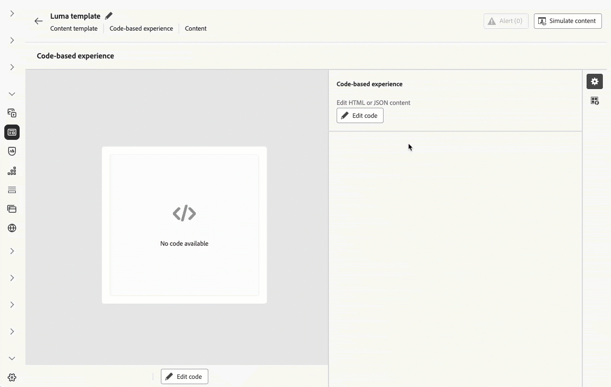

# Notas de versão {#release-notes}

>[!CONTEXTUALHELP]
>id="ajo_homepage_card1"
>title="Novidades?"
>abstract="O **Adobe Journey Optimizer** está sempre fornecendo novos recursos, melhorias para os recursos existentes e correções de erros. Na última semana de cada mês, todas as alterações são consolidadas nessas notas de versão."

O [!DNL Adobe Journey Optimizer] fornece continuamente novos recursos, melhorias para os recursos existentes e correções de erros. Na última semana de cada mês, todas as alterações são consolidadas nessas notas de versão. O [!DNL Adobe Journey Optimizer] é construído nativamente na [!DNL Adobe Experience Platform] e herda suas mais recentes inovações e melhorias. Saiba mais sobre essas alterações nas [Notas de versão da Adobe Experience Platform](https://experienceleague.adobe.com/pt-br/docs/experience-platform/release-notes/latest){target="_blank"}.

## Notas de pré-lançamento de 25 de julho {#25-7-rn}

**As notas de pré-lançamento abaixo estão sujeitas a alterações sem aviso prévio até a data de disponibilidade do lançamento**. Links, telas e a documentação atualizada são publicados na data de lançamento.

Consulte também [Notas de pré-lançamento do Adobe Experience Platform](https://experienceleague.adobe.com/pt-br/docs/experience-platform/release-notes/pre-release-notes){target="_blank"}.

**Data de lançamento**: quarta-feira, 29 de julho de 2025

### Novos recursos {#25-7-features}

Os novos recursos incluídos nesta versão são detalhados abaixo.

#### Recursos

<table>
<thead>
<tr>
<th><strong>Canal do WhatsApp</strong> </th>
</tr>
</thead>
<tbody>
<tr>
<td>

O Journey Optimizer agora oferece suporte a mensagens diretas do WhatsApp, permitindo uma integração perfeita em suas jornadas e campanhas para melhorar a comunicação e o engajamento do recipient. Este canal nativo oferece integração de modelo WhatsApp pronta para uso, pré-visualização de mensagens, personalização, relatórios de entrega, webhooks, gerenciamento de consentimento de aceitação e recusa e muito mais.

Anteriormente lançado no Beta, esse recurso agora está disponível para todos os ambientes (Disponibilidade geral).

<!--For more information, refer to the <a href="../FILE.md">detailed documentation</a>-->

</td>
</tr>
</tbody>
</table>

<table>
<thead>
<tr>
<th><strong>Marcas</strong> </th>
</tr>
</thead>
<tbody>
<tr>
<td>

Agora você pode criar e personalizar suas próprias marcas para definir claramente sua identidade visual e verbal nas comunicações. Com a pontuação de alinhamento da marca, você pode receber feedback em tempo real sobre o desempenho do seu conteúdo em refletir o tom, o estilo e as diretrizes da sua marca, ajudando você a permanecer consistente no mesmo lugar com cada mensagem que envia.

Anteriormente lançado no Beta, esse recurso agora está disponível para todos os ambientes (Disponibilidade geral).

<!--img src="assets/do-not-localize/FILE.gif"/>-->

<!--For more information, refer to the <a href="../FILE.md">detailed documentation</a>-->

</td>
</tr>
</tbody>
</table>

<table>
<thead>
<tr>
<th><strong>Usar o Experience Decisioning no canal de email</strong> </th>
</tr>
</thead>
<tbody>
<tr>
<td>

Agora você pode adicionar políticas de decisão em jornadas de email e campanhas. As políticas de decisão são containers para suas ofertas que aproveitam o mecanismo de decisão para retornar dinamicamente o melhor conteúdo a ser entregue para cada membro do público.

No momento, esse recurso não está disponível para uso com o Healthcare Shield e com o Privacy and Security Shield (Disponibilidade limitada).

<!--img src="assets/do-not-localize/FILE.gif"/>-->

<!--For more information, refer to the <a href="../FILE.md">detailed documentation</a>-->

</td>
</tr>
</tbody>
</table>

<table>
<thead>
<tr>
<th><strong>Atividade de decisão de conteúdo</strong> </th>
</tr>
</thead>
<tbody>
<tr>
<td>

Agora você pode incluir ofertas personalizadas em suas jornadas por meio de uma atividade dedicada de Decisão de conteúdo na tela de jornada e usá-las em atividades de jornada, incluindo condições e ações personalizadas.

Anteriormente lançado com disponibilidade limitada, esse recurso agora está disponível para todos os ambientes (disponibilidade geral).

<!--img src="assets/do-not-localize/FILE.gif"/>-->

<!--For more information, refer to the <a href="../FILE.md">detailed documentation</a>-->

</td>
</tr>
</tbody>
</table>

<table>
<thead>
<tr>
<th><strong>Otimização em campanhas</strong> </th>
</tr>
</thead>
<tbody>
<tr>
<td>

O Journey Optimizer agora capacita você com as ferramentas para fornecer conteúdo personalizado e otimizado para o público de suas campanhas, permitindo que você execute experimentos de conteúdo, crie direcionamentos com base em regras e use combinações avançadas de ambos para maximizar a eficiência de suas campanhas.

Com a Otimização, você pode:

<ul>
<li>Executar experimentos de conteúdo</li>
<li>Aproveitar as regras de direcionamento</li>
<li>Use combinações avançadas de experimentação e direcionamento em uma única campanha</li></ul>

Quando a campanha estiver ativa, os perfis serão avaliados em relação aos critérios definidos e, com base nos critérios de correspondência, eles serão entregues com a experiência ou o conteúdo apropriado da campanha.

<!--img src="assets/do-not-localize/FILE.gif"/>-->

<!--For more information, refer to the <a href="../FILE.md">detailed documentation</a>-->

</td>
</tr>
</tbody>
</table>

<table>
<thead>
<tr>
<th><strong>Jornada simulação</strong> </th>
</tr>
</thead>
<tbody>
<tr>
<td>

A execução de prática de jornada é um modo especial de publicação no Adobe Journey Optimizer que permite aos profissionais de jornada o teste de uma jornada usando dados de produção reais sem entrar em contato com clientes do mundo real ou atualizar informações de perfil. Esse recurso ajuda os profissionais de jornada a ganharem confiança no design da jornada e no direcionamento de público-alvo antes de publicá-la.

Anteriormente lançado com disponibilidade limitada, esse recurso agora está disponível para todos os ambientes (disponibilidade geral).

<!--img src="assets/do-not-localize/FILE.gif"/>-->

<!--For more information, refer to the <a href="../FILE.md">detailed documentation</a>-->

</td>
</tr>
</tbody>
</table>

<table>
<thead>
<tr>
<th><strong>Exibição de calendário</strong> </th>
</tr>
</thead>
<tbody>
<tr>
<td>

Anteriormente disponível em Disponibilidade limitada, esse recurso agora está disponível para todos os ambientes. Com esta versão de Disponibilidade Geral, o recurso inclui:

<ul>
<li>Melhorias de design para a navegação em datas</li>
<li>A capacidade de ver campanhas de rascunho se você tiver definido uma data de início e término</li>
<li>Uma nova configuração para ocultar e mostrar os itens do calendário em execução por muito tempo</li>
</ul>

<!--img src="assets/do-not-localize/FILE.gif"/>-->

<!--For more information, refer to the <a href="../FILE.md">detailed documentation</a>-->

</td>
</tr>
</tbody>
</table>

<table>
<thead>
<tr>
<th><strong>ID complementar no jornada</strong> </th>
</tr>
</thead>
<tbody>
<tr>
<td>

Anteriormente lançado com Disponibilidade limitada, o uso de IDs complementares no jornada agora está disponível para todos os ambientes. Com esta versão de Disponibilidade geral, o recurso agora inclui suporte para jornadas Read audience.

<!--img src="assets/do-not-localize/FILE.gif"/>-->

<!--For more information, refer to the <a href="../FILE.md">detailed documentation</a>-->

</td>
</tr>
</tbody>
</table>

### Alteração nas condições da jornada {#ee-change@}

A partir de 8 de julho, em novas organizações de clientes, a criação de expressões usando eventos de experiência não é mais suportada no editor de expressão usado em condições de jornada. Como resultado, os eventos de experiência na [fonte de dados da Experience Platform](../datasource/adobe-experience-platform-data-source.md) não poderão ser usados para criar expressões. Abordagens alternativas e práticas recomendadas para criar expressões/lógica com eventos de experiência são apresentadas [aqui](../building-journeys/exp-event-lookup.md).

Não há alteração em como os dados do evento de contexto de jornada são acessados em jornadas unitárias. Nos editores de expressão e personalização, os usuários podem continuar a acessar os dados transmitidos com o evento de jornada inicial.

Saiba mais [nesta seção de Perguntas frequentes](../building-journeys/exp-event-lookup.md#faq-ee).

### Aprimoramentos {#25-7-improv}

Os aprimoramentos incluídos nesta versão estão listados abaixo.

- **Designer de email**
   - O Journey Optimizer Email Designer agora oferece a capacidade de alternar para a exibição no modo escuro, onde você pode definir configurações personalizadas específicas. Observe que a renderização final depende do cliente de email do recipient. Além disso, nem todos os clientes de email são compatíveis com o modo escuro.
  <!-- [Read more](../FILE.md) -->

- **Campanhas**
   - **Desqualificação de Campanha Baseada em Regras** - Em cartões de Conteúdo, ao editar regras de entrega adicionais, a opção Regras de entrega anterior foi substituída por três tipos de regras distintos para controlar melhor o tempo e a visibilidade da mensagem:
      - Mostrar mensagem se: condições que determinam quando o cartão de conteúdo é exibido.
      - Ignorar mensagem se: condições que ocultam temporariamente o cartão de conteúdo. Ele pode reaparecer se as condições de exibição forem atendidas novamente.
      - Desqualificar mensagem se: condições que impedem permanentemente que o cartão de conteúdo seja exibido novamente.
  <!-- [Read more](../FILE.md) -->

   - **Várias ações de entrada em campanhas** - Para simplificar a orquestração de campanhas, agora é possível definir várias ações de entrada em uma única campanha. Esse recurso permite que você forneça várias experiências baseadas em código, mensagens no aplicativo, Cartões de conteúdo ou ações da Web para locais diferentes ao mesmo tempo, cada ação contendo um conteúdo específico.
  <!-- [Read more](../FILE.md) -->

   - **Reorganização do inventário de campanhas** - Campanhas programadas e acionadas por API agora são divididas em guias separadas no inventário de campanhas para facilitar a navegação e o gerenciamento.
  <!-- [Read more](../FILE.md) -->

- **Gerenciamento de dados**
   - **Atualização de conjuntos de dados do sistema de Gerenciamento de decisões** - As ofertas personalizadas e substitutas excluídas agora são marcadas como arquivadas nos conjuntos de dados &quot;decision_object_repository_personalized_offers&quot; e &quot;decision_object_repository_fallback_offers&quot;. Os registros existentes no conjunto de dados não são alterados.
  <!-- [Read more](../FILE.md) -->

- **Jornadas**
   - **Aprimoramentos de ferramenta de sandbox do Jornada** - Ao copiar jornadas em várias sandboxes usando os recursos de exportação e importação de pacotes, os seguintes recursos também estão disponíveis:
      - Selecionar um evento existente no destino
      - Cópia de um evento independentemente de uma jornada
      - Detecção de relacionamentos de grupos de campos/fontes de dados, vinculação a eles no destino, se existirem, criação deles, se não existirem.
  <!-- [Read more](../FILE.md) -->

- **Canal - InApp**
   - **Pares de Chave/Valor no aplicativo** - Com mensagens no aplicativo, você pode definir pares de Chave e Valor para incluir variáveis personalizadas na carga da mensagem. Esses pares de valor-chave permitem que você transmita dados adicionais com base em sua configuração específica e caso de uso.
  <!-- [Read more](../FILE.md) -->

## Notas de versão de junho de 2025 {#25-6-rn}

<!--
**Early release notes below are subject to change without prior notice until the release availability date**. Links, screens and updated documentation are published at the release date.-->

**Data de lançamento**: 18 de junho de 2025

<!--See also [Adobe Experience Platform Pre Release Notes](https://experienceleague.adobe.com/pt-br/docs/experience-platform/release-notes/pre-release-notes){target="_blank"}.-->

### Novos recursos {#25-06-features}

Os novos recursos incluídos nesta versão são detalhados abaixo.

<table>
<thead>
<tr>
<th><strong>Conjuntos de dados da Adobe Experience Platform na decisão (beta)</strong> </th>
</tr>
</thead>
<tbody>
<tr>
<td>

Anteriormente disponíveis para personalização, os conjuntos de dados da Adobe Experience Platform agora podem ser aproveitados para a decisão. Isso permite estender a definição dos atributos de decisão para dados adicionais nos conjuntos de dados para atualizações em massa que mudam periodicamente, sem precisar atualizar manualmente os atributos um de cada vez. Por exemplo, disponibilidade, tempos de espera etc.

Esse recurso está atualmente disponível para todos os clientes como uma versão beta pública. Entre em contato com o representante da sua conta se desejar obter acesso.

Para obter mais informações, consulte a <a href="../experience-decisioning/aep-data-exd.md">documentação detalhada</a>.

Data de disponibilidade: 20 de junho de 2025

</td>
</tr>
</tbody>
</table>

<table>
<thead>
<tr>
<th><strong>Mensagens RCS</strong> </th>
</tr>
</thead>
<tbody>
<tr>
<td>

As mensagens do Rich Communication Services (RCS) agora são aceitas no Journey Optimizer, o que permite os seguintes recursos de mensagens aprimorados sujeitos ao suporte do provedor e da operadora:

<ul>
<li>Suporte a remetentes com marca e verificados: envie mensagens usando perfis de negócios verificados com elementos de marca (logotipo, nome do remetente, etc.).</li>
<li>Insights de entregas de mensagens: receba relatórios de entrega detalhados, incluindo atualizações de status de mensagem (por exemplo, enviado, entregue, lido).</li>
<li>Rastreamento de link: incorpore e rastreie URLs em mensagens RCS para análise de engajamento.</li>
<li>Fallback para SMS: retorno automático para SMS quando o dispositivo do perfil não dá suporte a RCS ou está temporariamente inacessível via RCS.</li>
<li>Composição básica de mensagem: envie mensagens RCS baseadas em texto com mídia opcional e elementos avançados, dependendo do suporte do provedor.</li>
</ul>

Para obter mais informações, consulte a <a href="../sms/sms-configuration.md">documentação detalhada</a>.

</td>
</tr>
</tbody>
</table>

<table>
<thead>
<tr>
<th><strong>Campos de formulário no conteúdo de experiência baseado em código</strong> </th>
</tr>
</thead>
<tbody>
<tr>
<td>

Agora é possível definir campos editáveis específicos em modelos de conteúdo JSON ou HTML que habilitam usuários comuns a editar facilmente o conteúdo em uma exibição de formulário na criação do canal de experiência baseada em código, sem a necessidade de manipular qualquer código. Mais do que isso, ao definir os modelos de conteúdo da experiência baseada em código, agora é possível inserir políticas de decisão no modelo, aumentando a capacidade de reutilização e a facilidade de uso.

Para obter mais informações, consulte a <a href="../code-based/code-based-form-fields.md">documentação detalhada</a>.

</td>
</tr>
</tbody>
</table>

<!--
<table>
<thead>
<tr>
<th><strong>Custom delegation method for subdomains</strong> </th>
</tr>
</thead>
<tbody>
<tr>
<td>

In addition to the full delegation and the CNAME method, a new subdomain configuration method is now available: the Custom delegation method, which enables you to fully own controlling and maintaining all aspects of DNS that are required for delivering, rendering and tracking messages.

</td>
</tr>
</tbody>
</table>
-->

<table>
<thead>
<tr>
<th><strong>Atividade de decisão de conteúdo em jornadas</strong> </th>
</tr>
</thead>
<tbody>
<tr>
<td>

Agora é possível incluir ofertas personalizadas em suas jornadas por meio de uma atividade dedicada de decisão de conteúdo na tela da jornada e usá-las em atividades da jornada, incluindo condições e ações personalizadas.

Esse recurso só está disponível para um conjunto de organizações (disponibilidade limitada) e será implantado globalmente em uma versão futura.

Para obter mais informações, consulte a <a href="../building-journeys/content-decision.md">documentação detalhada</a>.

</td>
</tr>
</tbody>
</table>

<table>
<thead>
<tr>
<th><strong>Execução de prática de jornada</strong> </th>
</tr>
</thead>
<tbody>
<tr>
<td>

A execução de prática de jornada é um modo especial de publicação no Adobe Journey Optimizer que permite aos profissionais de jornada o teste de uma jornada usando dados de produção reais sem entrar em contato com clientes do mundo real ou atualizar informações de perfil. Esse recurso ajuda os profissionais de jornada a ganharem confiança no design da jornada e no direcionamento de público-alvo antes de publicá-la.

Esse recurso só está disponível para um conjunto de organizações (disponibilidade limitada) e será implantado globalmente em uma versão futura.

Para obter mais informações, consulte a <a href="../building-journeys/journey-dry-run.md">documentação detalhada</a>.

</td>
</tr>
</tbody>
</table>

<table>
<thead>
<tr>
<th><strong>Pausar e retomar jornadas</strong> </th>
</tr>
</thead>
<tbody>
<tr>
<td>

Agora é possível pausar e retomar jornadas. Esse recurso oferece aos profissionais de jornada maior controle e flexibilidade ao permitir que as jornadas ativas sejam temporariamente suspensas sem interromper a experiência do cliente. Quando pausada, nenhuma comunicação é enviada e os perfis permanecem em um estado suspenso até que a jornada seja retomada.

É possível pausar e retomar apenas uma jornada ou executar operações de pausa e retomada em massa para um grupo de jornadas.

Além disso, é possível aplicar filtros globais a jornadas pausadas para excluir perfis com base em seus atributos.

Esse recurso só está disponível para um conjunto de organizações (disponibilidade limitada) e será implantado globalmente em uma versão futura.

Para obter mais informações, consulte a <a href="../building-journeys/journey-pause.md">documentação detalhada</a>.

</td>
</tr>
</tbody>
</table>

<table>
<thead>
<tr>
<th><strong>Dimensionar o experimento vencedor</strong> </th>
</tr>
</thead>
<tbody>
<tr>
<td>

A opção Dimensionar o experimento vencedor permite implantar de forma automática ou manual a variação vencedora de um experimento em todo o seu público-alvo. Esse recurso garante que, após identificar o melhor desempenho, seja possível maximizar seu alcance e eficácia sem necessidade de supervisão manual constante.

Para obter mais informações, consulte a <a href="../content-management/content-experiment.md">documentação detalhada</a>.

Data de disponibilidade: 2 de junho de 2025
</td>
</tr>
</tbody>
</table>

<table>
<thead>
<tr>
<th><strong>Conflito e priorização</strong> </th>
</tr>
</thead>
<tbody>
<tr>
<td>

No Journey Optimizer, gerenciar o volume e o momento de início das campanhas e jornadas é essencial para não sobrecarregar clientes com muitas interações. O Journey Optimizer agora oferece várias ferramentas para o gerenciamento de conflitos e a priorização, antes disponíveis apenas para um número limitado de organizações (disponibilidade limitada), mas que agora estão em disponibilidade geral.

Anteriormente lançado com disponibilidade limitada, esse recurso agora está disponível para todos os ambientes. Esta versão de disponibilidade geral também inclui os seguintes aprimoramentos:

<ul>
<li>Suporte estendido: as ferramentas de gerenciamento de conflitos agora oferecem suporte às jornadas unitárias, jornadas de qualificação de público-alvo e jornadas de público-alvo de leitura.</li>
<li>Solução de problemas aprimorada: agora há dois novos campos de evento de etapa disponíveis no serviço de consulta, permitindo analisar por que um perfil foi rejeitado de uma jornada ou campanha.</li>
<li>Relatórios aprimorados: os relatórios agora indicam qual regra específica excluiu um perfil de uma jornada ou campanha, fornecendo maior transparência e insights acionáveis.</li></ul>

Para obter mais informações, consulte a <a href="../conflict-prioritization/gs-conflict-prioritization.md">documentação detalhada</a>.

Data de disponibilidade: 3 de junho de 2025

</td>
</tr>
</tbody>
</table>

### Aprimoramentos {#25-06-improv}

Os aprimoramentos incluídos nesta versão estão listados abaixo.

&#x200B;* **Conjuntos de regras de canal**

   &#x200B;* **Janela de duração personalizada** para limitação: um novo campo **Todos** agora está disponível na tela de configuração de conjuntos de regras de canal, permitindo que você aplique regras de limitação de frequência em vários dias, semanas ou meses, dependendo da duração especificada.

   &#x200B;* **Frequência de limitação de redefinição por hora**: agora você pode aplicar a limitação por hora para conjuntos de regras de canal. Esse recurso está disponível apenas para um conjunto de organizações (disponibilidade limitada). Entre em contato com o atendimento ao cliente para habilitá-la.

   &#x200B;* **Duração diária**: anteriormente em disponibilidade limitada, o limite de frequência “Diário” nos conjuntos de regras do canal agora está disponível para todos os clientes.

  Para obter mais informações, consulte a [documentação detalhada](../conflict-prioritization/channel-capping.md).

&#x200B;* **Experiências baseadas em código**

   &#x200B;* A adição de uma política de decisão agora está disponível em modelos de conteúdo de experiência baseada em código, nos quais ela pode ser usada para aproveitar ofertas em campos de formulário editáveis. [Leia mais](../code-based/code-based-form-fields.md)

   &#x200B;* Na jornada de experiência baseada em código ou na tela de edição de campanha, agora você pode adicionar diretamente uma política de decisão sem abrir o editor de personalização. [Leia mais](../code-based/create-code-based.md#edit-code)

&#x200B;* **Suporte a CSS personalizado no Designer de email**

  O Journey Optimizer agora permite adicionar CSS personalizado ao conteúdo do email diretamente no Designer de email. [Leia mais](../email/custom-css.md)

&#x200B;* **Nova navegação com guias para campanhas**

  Um novo padrão de navegação permite acesso mais rápido à criação de conteúdo e oferece suporte à expansão de configurações em todas as campanhas. [Leia mais](../campaigns/create-campaign.md)

&#x200B;* **Decisão**

   &#x200B;* **Decisão e cópia da sandbox** (data de disponibilidade: 3 de junho de 2025): os objetos de decisão agora podem ser copiados entre sandboxes, simplificando os fluxos de trabalho de teste e implantação. [Leia mais](../configuration/copy-objects-to-sandbox.md#decisioning)

   &#x200B;* **Suporte a atributos de item de decisão para regras de decisão** (data de disponibilidade: 4 de junho de 2025): agora você pode aproveitar os atributos de item de decisão para criar regras de decisão. [Leia mais](../experience-decisioning/rules.md#create)

&#x200B;* **Atualização da API de execução de mensagem interativa** — Data de disponibilidade: 6 de junho de 2025

  A API de execução de mensagem interativa agora permite excluir o cronograma da execução de campanhas futuras. [Leia mais](https://developer.adobe.com/journey-optimizer-apis/references/messaging/){target="_blank"}
