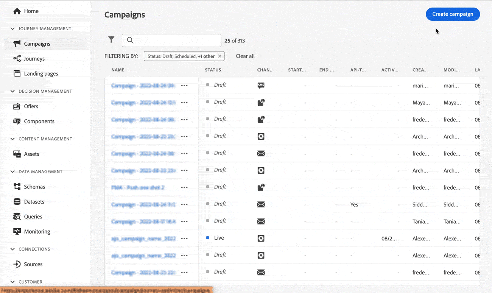

# Notas de versão {#release-notes}

Esta página lista todos os novos recursos e melhorias do [!DNL Journey Optimizer]. Também é possível consultar a página das [atualizações mais recentes da documentação](documentation-updates.md) para conhecer mais alterações.

O [!DNL Adobe Journey Optimizer] é construído nativamente na [!DNL Adobe Experience Platform] e herda suas mais recentes inovações e melhorias. Saiba mais sobre essas alterações nas [Notas de versão da Adobe Experience Platform](https://experienceleague.adobe.com/docs/experience-platform/release-notes/latest.html?lang=pt-BR){target=&quot;_blank&quot;}.

 Assine o [Informativo trimestral do Adobe Journey Optimizer](https://www.adobe.com/subscription/Adobe_Journey_Optimizer_NL.html){target=&quot;_blank&quot;} hoje e receba as últimas atualizações de produtos, histórias interessantes, casos de uso, dicas e muito mais, entregues diretamente à sua caixa de entrada a cada trimestre.

## Versão de agosto de 2022 {#aug-2022-release}

### Novos recursos

<table>
<thead>
<tr>
<th><strong>Criar e gerenciar campanhas no Journey Optimizer</strong> </th>
</tr>
</thead>
<tbody>
<tr>
<td>

Use campanhas do Journey Optimizer para fornecer conteúdo único a um segmento específico usando vários canais. Ao usar jornadas, as ações são projetadas para serem executadas em sequência. Com campanhas, as ações são executadas simultaneamente, imediatamente ou com base em um agendamento especificado. 

Saiba como criar uma campanha no <a href="../campaigns/get-started-with-campaigns.md">documentação detalhada</a> e <a href="https://video.tv.adobe.com/v/346680">vídeo de recurso</a>.
</td>
</tr>
</tbody>
</table>

<table>
<thead>
<tr>
<th><strong>Enviar SMS para seus usuários (disponibilidade geral)</strong> </th>
</tr>
</thead>
<tbody>
<tr>
<td>

Agora você pode criar, personalizar e enviar SMS no Journey Optimizer por meio de uma integração com o <b>Sinch</b> ou <b>Twilio</b>.

Saiba como criar e enviar um SMS nesta <a href="../messages/create-sms.md">documentação detalhada</a>.

</td>
</tr>
</tbody>
</table>

<!--table>
<thead>
<tr>
<th><strong>New Dynamic Expression Builder</strong> </th>
</tr>
</thead>
<tbody>
<tr>
<td>

You can now create conditional content blocks across different authoring services to personalize your content.

In addition to the Personalization Expression Library, the Expression Editor provides a new Conditional Rule Builder to help you design and save your content blocks.

For more information, refer to the <a href="../building-journeys/read-segment.md#configuring-segment-trigger-activity">detailed documentation</a>.
</td>
</tr>
</tbody>
</table-->

### Melhorias

**Relatórios**

* A tabela e o gráfico de políticas de consentimento agora estão disponíveis nos relatórios globais do Jornada. Esses widgets permitem rastrear os perfis excluídos das políticas em suas ações personalizadas. [Saiba mais](../reports/journey-global-report.md#journey-global)

   Para ter acesso aos widgets mais recentes, observe que será necessário redefinir os diferentes painéis de relatórios. Para obter mais informações sobre personalização de painel, consulte [documentação detalhada](../reports/global-report.md).

**Administração**

* Agora é possível atualizar o número de telefone principal a ser usado para o canal SMS. [Saiba mais](../configuration/primary-email-addresses.md)