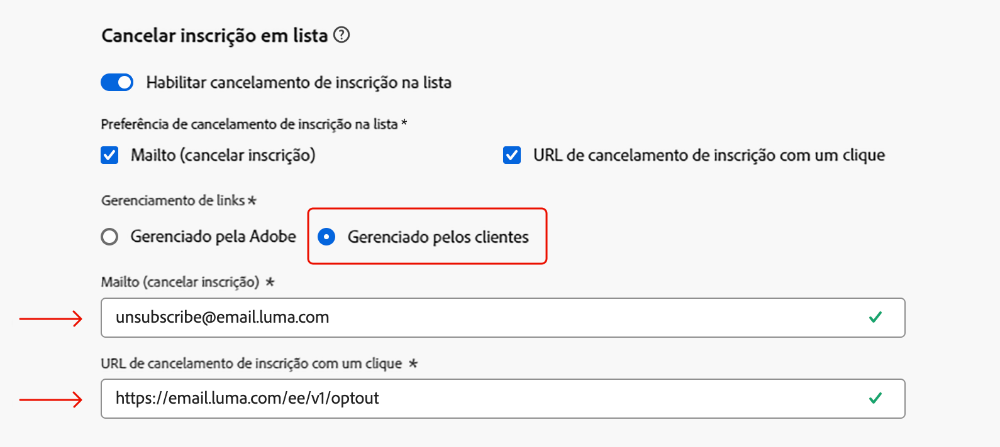

# Notas de versão {#release-notes}

>[!CONTEXTUALHELP]
>id="ajo_homepage_card1"
>title="Novidades"
>abstract="O **Adobe Journey Optimizer** está sempre fornecendo novos recursos, melhorias para os recursos existentes e correções de erros. Na última semana de cada mês, todas as alterações são consolidadas nessas notas de versão."

O [!DNL Adobe Journey Optimizer] fornece continuamente novos recursos, melhorias para os recursos existentes e correções de erros. Na última semana de cada mês, todas as alterações são consolidadas nessas notas de versão. O [!DNL Adobe Journey Optimizer] é construído nativamente na [!DNL Adobe Experience Platform] e herda suas mais recentes inovações e melhorias. Saiba mais sobre essas alterações nas [Notas de versão da Adobe Experience Platform](https://experienceleague.adobe.com/docs/experience-platform/release-notes/latest.html?lang=pt-BR){target="_blank"}.

## Notas de versão de março de 2025 {#25-3-rn}

### Novos recursos {#25-03-features}

Os novos recursos incluídos nesta versão são detalhados abaixo.

<table>
<thead>
<tr>
<th><strong>Integração com o Adobe Express (disponibilidade limitada)</strong> </th>
</tr>
</thead>
<tbody>
<tr>
<td>

A integração do Adobe Express no Adobe Journey Optimizer permite usar as ferramentas de edição da Adobe Express diretamente durante a criação de conteúdo, o que permite redimensionar, remover planos de fundo, recortar e converter ativos em JPEG ou PNG.

No momento, a integração do Adobe Express no Adobe Journey Optimizer está disponível apenas para algumas organizações (disponibilidade limitada). Ele não pode ser implantado para uso com o Healthcare Shield ou o Privacy and Security Shield.

Para obter mais informações, consulte a <a href="../integrations/express.md">documentação detalhada</a>.

 

</td>
</tr>
</tbody>
</table>

<table>
<thead>
<tr>
<th><strong>Jornada métricas</strong> </th>
</tr>
</thead>
<tbody>
<tr>
<td>

As métricas de Jornada agora estão disponíveis, permitindo medir o impacto das suas atividades nas métricas principais da sua empresa e fornecer insights mais claros sobre o seu desempenho.

Para obter mais informações, consulte a <a href="../building-journeys/success-metrics.md">documentação detalhada</a>.

</td>
</tr>
</tbody>
</table>

<!-- table>
<thead>
<tr>
<th><strong>Calendar view for journeys (Limited Availability)</strong> </th>
</tr>
</thead>
<tbody>
<tr>
<td>

A calendar view is now available in Journey Optimizer to visualize all journeys activations. From this view, you can browse your journeys and check details and properties.

This change is only available for a set of organizations (Limited Availability). To gain access, contact your Adobe representative.

For more information, refer to the <a href="../configuration/rule-sets.md">detailed documentation</a>.

</td>
</tr>
</tbody>
</table-->

<table>
<thead>
<tr>
<th><strong>Integração com o Dynamic Media (disponibilidade limitada)</strong> </th>
</tr>
</thead>
<tbody>
<tr>
<td>

Os ativos de mídia dinâmica agora estão diretamente disponíveis e acessíveis no Journey Optimizer. Essa integração permite:
<ul>
<li>Gerenciar ativos centralmente com atualizações em tempo real</li>
<li>Modifique instantaneamente suas configurações de ativos, como largura e altura</li>
<li>Personalizar modelos do Dynamic Media atualizando o conteúdo e adicionando campos de personalização</li>
</ul>

Essa integração só está disponível para um conjunto de organizações (disponibilidade limitada). Para obter acesso, entre em contato com o(a) representante da Adobe.

Para obter mais informações, consulte a <a href="../integrations/aem-dynamic.md">documentação detalhada</a>.

</td>
</tr>
</tbody>
</table>

<table>
<thead>
<tr>
<th><strong>Integração com o Adobe GenStudio (disponibilidade limitada)</strong> </th>
</tr>
</thead>
<tbody>
<tr>
<td>

Para aprimorar a eficiência do marketing e manter a consistência da marca, agora é possível integrar perfeitamente as experiências do GenStudio for Performance Marketing com o Journey Optimizer. Isso permite aproveitar a criação de conteúdo com recursos avançados de orquestração do GenStudio Journey Optimizer baseado em IA.

O uso da integração do GenStudio no Journey Optimizer está atualmente indisponível para uso com o Healthcare Shield ou o Privacy and Security Shield (disponibilidade limitada).

Para obter mais informações, consulte a <a href="../integrations/genstudio.md">documentação detalhada</a>.

</td>
</tr>
</tbody>
</table>

<!--table>
<thead>
<tr>
<th><strong>LINE channel (Limited Availability)</strong> </th>
</tr>
</thead>
<tbody>
<tr>
<td>

Adobe Journey Optimizer has expanded its cross-channel capabilities to include support for the LINE channel. This enhancement allows you to create, edit, and preview LINE experiences enabling more personalized and engaging interactions. With LINE, you can connect with more customers, send relevant content, and improve your engagement.

This capability is only available for a set of organizations (Limited Availability). To gain access, contact your Adobe representative.

For more information, refer to the <a href="../configuration/rule-sets.md">detailed documentation</a>.

</td>
</tr>
</tbody>
</table-->

### Melhorias {#25-03-improv}

**Editor do Personalization** (data de disponibilidade: 12 de março)

O editor de personalização do Journey Optimizer foi atualizado com novos recursos:
* **Design do editor de código atualizado**: uma interface mais simples e moderna para melhorar a usabilidade e o foco.
* **Pesquisar e substituir**: adição da funcionalidade para localizar e substituir rapidamente o conteúdo no editor.
* **Desfazer e refazer**: permite reverter ou reaplicar facilmente as alterações.
* **Tamanho de fonte personalizável**: permite ajustar o tamanho da fonte do editor para facilitar a leitura.
* **Validação JSON em linha**: fornece validação do lado do cliente em tempo real para conteúdo JSON, a fim de acelerar a detecção de erros.
* **Preenchimento automático para atributos de perfil e contexto**: oferece sugestões inteligentes para simplificar a criação de conteúdo.
* **Realce de sintaxe aprimorado**: melhora a legibilidade por tornar a estrutura do código mais visualmente distinta.

Para obter mais informações, consulte a [documentação detalhada](../personalization/personalization-build-expressions.md).

**Aprovações**

Ao definir as condições para uma política de aprovação, agora há a opção de filtrar por Tag e/ou Categoria de objeto.

**Configuração**

* Agora você pode atribuir Tags unificadas do Adobe Experience Platform a configurações de canal. Isso permite classificá-los facilmente e melhorar a pesquisa e a navegação em todas as listas. [Saiba mais](../configuration/channel-surfaces.md#channel-config-tags)

* Ao configurar ou editar um subdomínio de email no Journey Optimizer, agora é possível optar por gerenciar o registro associado do DMARC por conta própria, se disponível no domínio principal. [Saiba mais](../configuration/dmarc-record.md#set-up-dmarc)

**Regras de negócio**

Agora você pode usar o limite de frequência diário em jornadas e campanhas com segmentação em lote. Para garantir a precisão das regras diárias de limite de frequência, certifique-se de escolher o namespace de prioridade mais alta ao criar uma campanha ou jornada. Saiba mais sobre a prioridade de namespace no [guia do Platform Identity Service](https://experienceleague.adobe.com/en/docs/experience-platform/identity/features/identity-graph-linking-rules/namespace-priority){target="_blank"}

Lembrando que o limite diário de frequência em conjuntos de regras só está disponível para um conjunto de organizações (disponibilidade limitada). Para obter acesso, entre em contato com o(a) representante da Adobe.

Para obter mais informações sobre regras de negócios, consulte a [documentação detalhada](../configuration/rule-sets.md).

<!--**Content management**

To easily manage your fragments and your content templates, you can now use folders to organize them more effectively into a structured hierarchy. This improvement is only available for a set of organizations (Limited Availability). <!--To gain access, contact your Adobe representative.

**Deliverability**

You can now choose to have your emails relayed to your SMTP servers instead of being sent directly from Journey Optimizer to ISPs. This allows you to route final email deliveries through your own Mail Transfer Agents and IPs, or to perform final validations on the emails before sending them to your recipients. The SMTP relay capacity is available on demand - contact your Adobe representative.-->

## Notas da versão de fevereiro de 2025 {#25-02-rn}

<!--
**Early release notes below are subject to change without prior notice until the release availability date**. Links, screens and updated documentation are published at the release date.-->

**Data de lançamento**: 18 a 19 de fevereiro de 2025

### Novos recursos {#25-02-features}

Os novos recursos incluídos nesta versão são detalhados abaixo.

<table>
<thead>
<tr>
<th><strong>Criar e gerenciar regras de negócios</strong> </th>
</tr>
</thead>
<tbody>
<tr>
<td>

Agora é possível criar regras de negócios usando conjuntos de regras. Os conjuntos de regras são grupos de regras que ajudam a limitar as mensagens enviadas em campanhas e ações de jornada entre canais, além de controlar as entradas de perfis nas jornadas.

<ul><li>Crie conjuntos de regras de canal para restringir o número de mensagens enviadas por um ou vários canais. Utilize-os em campanhas ou ações de jornada para aplicar as regras definidas no conjunto de regras. O conjunto de regras de canal permite aplicar regras de limite com base nos tipos de comunicação. Por exemplo, defina um conjunto de regras para limitar “mensagens promocionais” e outro para “boletins informativos”. Aplique o conjunto de regras apropriado em sua ação de campanha ou jornada, dependendo do tipo de comunicação que você está enviando.</li>
<li> Crie conjuntos de regras de jornada para controlar entradas de perfil nas jornadas. Limite a frequência com que um perfil pode entrar em uma jornada em um determinado período ou o número de jornadas nas quais um perfil pode ser inscrito simultaneamente. Aplique-as no nível da jornada para garantir um gerenciamento de entradas adequado.</li></ul>

Anteriormente disponível para um conjunto de organizações (DL), as regras de negócios agora estão disponíveis para todos os usuários (DG). As regras de negócios do domínio do Jornada continuam disponíveis somente para um conjunto limitado de organizações (DL).

Para obter mais informações, consulte a <a href="../configuration/rule-sets.md">documentação detalhada</a>.

</td>
</tr>
</tbody>
</table>

<table>
<thead>
<tr>
<th><strong>Gerar páginas de destino com o assistente de IA</strong> </th>
</tr>
</thead>
<tbody>
<tr>
<td>

Com a ajuda do assistente de IA, agora é possível criar um conteúdo atrativo para suas páginas de destino, incluindo designs de página inteira, texto personalizado e visuais customizados.

Para obter mais informações, consulte a <a href="../content-management/generative-lp.md">documentação detalhada</a>.

</td>
</tr>
</tbody>
</table>

<table>
<thead>
<tr>
<th><strong>Marcas com o assistente de IA (Beta)</strong> </th>
</tr>
</thead>
<tbody>
<tr>
<td>

Agora é possível configurar suas próprias marcas para definir a identidade visual e verbal da sua marca. 

Esse recurso foi lançado como um beta privado para um conjunto limitado de clientes. Ele será disponibilizado progressivamente a todos os clientes em versões futuras.

Para obter mais informações, consulte a <a href="../content-management/brands.md">documentação detalhada</a>.

</td>
</tr>
</tbody>
</table>

<table>
<thead>
<tr>
<th><strong>Solucionar problemas de ações personalizadas</strong> </th>
</tr>
</thead>
<tbody>
<tr>
<td>

Agora é possível validar uma configuração de ação personalizada fazendo chamadas de API reais diretamente do Adobe Journey Optimizer. Esse novo recurso ajuda você a solucionar problemas de ações personalizadas antes ou depois de usá-las em uma jornada. 

Para obter mais informações, consulte a <a href="../action/troubleshoot-custom-action.md">documentação detalhada</a>.

<!--p> This capability is only available for a set of organizations (Limited Availability). To gain access, contact your Adobe representative.</p-->
</td>
</tr>
</tbody>
</table>

<table>
<thead>
<tr>
<th><strong>Avaliação flexível de público-alvo (disponibilidade limitada)</strong> </th>
</tr>
</thead>
<tbody>
<tr>
<td>

A avaliação flexível de público-alvo permite executar um trabalho de segmentação por demanda para públicos-alvo selecionados, garantindo que você sempre tenha os dados do público-alvo mais atualizados antes de direcioná-los em jornadas e campanhas do Journey Optimizer.

Para obter mais informações, consulte a <a href="../audience/creating-a-segment-definition.md#flexible">documentação detalhada</a>.

Esse recurso está disponível apenas para um conjunto de organizações (disponibilidade limitada). Para obter acesso, entre em contato com o(a) representante da Adobe.

Data de disponibilidade: 28 de janeiro de 2025

</tr>
</tbody>
</table>
</table>

### Melhorias {#25-02-improvements}

As melhorias abaixo estão incluídas na atualização de fevereiro.

* **Tempo de vida do conjunto de dados**: a partir deste mês, uma medida de proteção de tempo de vida (TTL) será implantada nos conjuntos de dados gerados pelo sistema do Journey Optimizer para novas sandboxes e organizações da seguinte maneira:

   * 90 dias para dados na loja de perfis
   * 13 meses para dados no data lake

  Essa alteração será implementada nas sandboxes de clientes existentes em uma próxima fase.

  Saiba mais sobre esta atualização nas [Perguntas frequentes dedicadas](../data/datasets-ttl.md#frequently-asked-questions).

<!--* **Playbooks** - You can now create and publish your own Use Case Playbooks in Journey Optimizer.-->

* **Correspondência direta**: um novo tipo de servidor, Zona de destino de dados, agora é compatível com o roteamento de arquivos na configuração do canal de correspondência direta. [Leia mais](../direct-mail/direct-mail-configuration.md#file-routing-configuration)

* **SMS**: agora é possível gerenciar a entrega de mensagens SMS de pontos de acesso multirregionais substituindo os URLs de entrega, feedback, entrada e retorno de chamada. Para oferecer suporte a isso, um novo campo Substituir URL foi adicionado à configuração Credenciais da API. Essa alteração está disponível somente com o provedor Sinch. [Leia mais](../sms/sms-configuration-sinch.md)

* **Personalização** (Data de disponibilidade: 29 de janeiro de 2025): há novas funções auxiliares de data/hora disponíveis para uso no editor de personalização. [Leia mais](../personalization/functions/dates.md)

<!--
* The personalization editor has been enhanced with new capabilities such as Auto-complete, Search, and filtering options. You can also show or hide deprecated attributes.-->

* **Configuração de email**: se você estiver gerenciando o consentimento fora da Adobe, agora será possível definir um endereço de email personalizado para cancelar a inscrição e um URL personalizado para cancelar a inscrição com um clique como parte das configurações do canal de email. [Leia mais](../email/list-unsubscribe.md#custom-managed)

  {width="80%"}

* **Decisão** (Data de disponibilidade: 28 de janeiro de 2025): o serviço de decisão agora oferece suporte a tipos de dados de objeto ao editar o esquema do catálogo de itens. [Leia mais](../experience-decisioning/catalogs.md)

