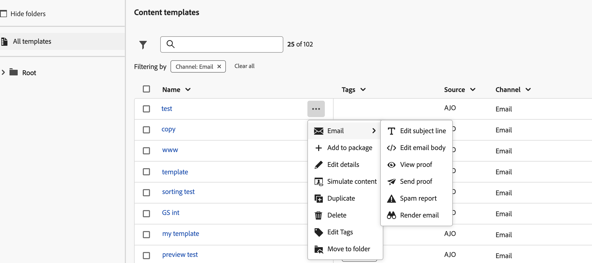
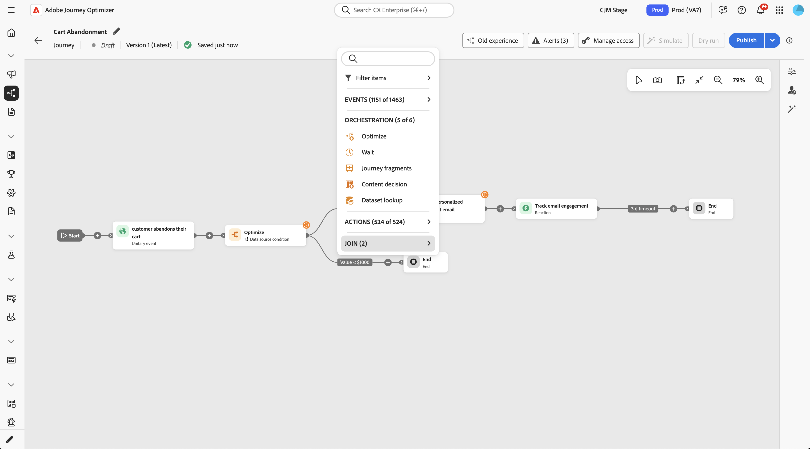
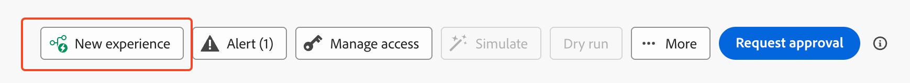

# Notas de versão {#release-notes}

>[!CONTEXTUALHELP]
>id="ajo_homepage_card1"
>title="Novidades"
>abstract="O **Adobe Journey Optimizer** oferece continuamente novos recursos, melhorias nos recursos existentes e correções de erros. Na última semana de cada mês, todas as alterações são consolidadas nessas notas de versão."

O [!DNL Adobe Journey Optimizer] segue um modelo de entrega contínua, permitindo que a Adobe forneça novos recursos, melhorias e correções de forma contínua. Essa abordagem permite uma implantação escalável e em fases de recursos para garantir desempenho e estabilidade em todos os ambientes. Devido a esse modelo, as notas de versão são atualizadas entre as versões mensais. Para obter detalhes completos sobre o ciclo de lançamento e as fases de disponibilidade, consulte o [ciclo de lançamento do Journey Optimizer](releases.md).

O [!DNL Adobe Journey Optimizer] é construído nativamente na [!DNL Adobe Experience Platform] e herda suas mais recentes inovações e melhorias. Saiba mais sobre essas alterações nas [Notas de versão da Adobe Experience Platform](https://experienceleague.adobe.com/docs/experience-platform/release-notes/latest.html?lang=pt-BR){target="_blank"}.

>[!NOTE]
>
>Os recursos listados nestas notas de versão incluem uma **Data de disponibilidade** indicando quando cada alteração se torna acessível no ambiente. As entradas nos acordeões **Em breve** são esperadas nos próximos dias ou semanas. As informações nessas seções estão sujeitas a alterações.

## Atualizações de julho de 2026 {#july-26-updates}

### Novos recursos {#july-26-new-capabilities}

<table>
<thead>
<tr>
<th><strong>Verificação de conteúdo no Designer de email</strong> </th>
</tr>
</thead>
<tbody>
<tr>
<td>

O Journey Optimizer agora inclui validação técnica automatizada diretamente no Designer de email, ajudando a detectar problemas no HTML e no CSS antes do envio.

As verificações abrangem elementos incompatíveis, como tags <code>&lt;script&gt;</code> e <code>&lt;base&gt;</code>, divs em branco que podem quebrar o layout no Microsoft Outlook, tags HTML meta refresh e limites de tamanho de CSS ou HTML que causam falhas de renderização no Gmail.

Os resultados são exibidos como erros, avisos ou avisos informativos diretamente no painel de criação, com detalhes contextuais e correções com um clique, quando disponíveis, para que os problemas possam ser resolvidos sem sair do editor.

Anteriormente em Disponibilidade limitada, esse recurso agora está disponível para todos os clientes.

Para obter mais informações, consulte a <a href="../email/content-check.md">documentação detalhada</a>.

Data de disponibilidade: 16 de julho de 2026

</td>
</tr>
</tbody>
</table>

<table>
<thead>
<tr>
<th><strong>Segmentação baseada em arquivo em campanhas orquestradas</strong> </th>
</tr>
</thead>
<tbody>
<tr>
<td>

As campanhas orquestradas agora permitem carregar um <strong>arquivo CSV ou TXT</strong> diretamente na tela da campanha como público alvo, sem primeiro assimilar o arquivo na Adobe Experience Platform. Os dados do arquivo são consumidos no tempo de execução e não são mantidos como um conjunto de dados do Adobe Experience Platform. Durante a configuração do arquivo, você pode definir mapeamentos de coluna, tipos de dados, tratamento NULL e políticas de erro por coluna. As linhas que falharem na validação são rejeitadas e registradas antes da execução da campanha, mantendo o público-alvo limpo sem pré-processamento manual. Isso é particularmente adequado para envios ad hoc ou campanhas de lista de parceiros em que a criação de um pipeline de assimilação completo não é prática.

Para obter mais informações, consulte a <a href="../orchestrated/activities/load-file.md">documentação detalhada</a>.

 Data de disponibilidade: 6 de julho de 2026

</td>
</tr>
</tbody>
</table>

### Aprimoramentos {#july-26-improvements}

* **Novas ferramentas do servidor MCP do AJO** - O servidor MCP [!DNL Adobe Journey Optimizer] agora expõe cinco **ferramentas de configuração de canal** adicionais somente leitura, permitindo que você consulte configurações de canal, recursos de suporte e ações de marketing diretamente do seu assistente de IA. Agora você pode usar **Configurações de Canal de Lista** (em todos os canais da AJO), **Obter Configuração de Canal**, **Recursos de Configuração de Lista**, **Obter Recurso de Configuração** e **Ações de Marketing de Lista**. [Leia mais](../integrations/ajo-mcp.md#mcp-tools)

  Data de disponibilidade: 9 de julho de 2026

### Melhorias de usabilidade {#july-26-usability}

As seguintes melhorias de usabilidade foram lançadas em julho de 2026.

#### Gerenciamento de conteúdo

* **Atalhos de inicialização rápida no inventário Fragmentos** - Agora você pode acessar rapidamente ações comuns da lista Fragmentos usando o botão **[!UICONTROL Mais ações]**. Os atalhos disponíveis incluem editar o fragmento, abrir os detalhes e descartar a versão de rascunho. [Saiba mais](../content-management/manage-fragments.md#quick-launch-fragments)

  

* **Atalhos de inicialização rápida no inventário Modelos** - O botão **[!UICONTROL Mais ações]** da lista Modelos de Conteúdo agora fornece acesso rápido a ações comuns: editar detalhes do modelo, simular conteúdo e excluir um modelo. Para modelos de email, atalhos adicionais permitem editar a linha de assunto e o corpo do email, exibir ou enviar uma prova, executar um relatório de spam e renderizar o email. [Saiba mais](../content-management/access-content-templates.md#quick-launch-templates)

  

#### Jornadas

Uma **nova interface de usuário** foi introduzida para a tela de jornada, oferecendo melhor desempenho para jornadas grandes, layout automático para melhorar a legibilidade e uma experiência de criação guiada.

Para alternar para a nova interface, clique no botão **[!UICONTROL Nova experiência]**. Essa configuração é salva no nível da jornada, para que a jornada reabra na nova experiência por padrão. Para reverter, clique em **[!UICONTROL Experiência antiga]**. [Saiba mais](../building-journeys/using-the-journey-designer.md#canvas-capabilities)

Data de disponibilidade: 16 de julho de 2026

## Notas de versão de junho de 2026 {#june-26-rn}

### Jornadas {#june-26-journeys}

Os recursos e melhorias a seguir foram adicionados às jornadas nesta versão. Alterações adicionais também são esperadas nos próximos dias ou semanas.

<table>
<thead>
<tr>
<th><strong>Simulação de jornada (disponibilidade geral)</strong> </th>
</tr>
</thead>
<tbody>
<tr>
<td>

Agora é possível definir a jornada como Simulação. Este modo permite validar a lógica usando usuários simulados. São perfis temporários criados especificamente para a simulação, permitindo que você teste livremente sem precisar gerenciar perfis de teste persistentes na Adobe Experience Platform. 

Anteriormente lançada com disponibilidade limitada, a Simulação de jornada agora está disponível para todos os ambientes. Com esta versão de Disponibilidade geral, agora é possível usar o Journey Agent para gerar usuários e eventos simulados diretamente no menu Simulação.

Para obter mais informações, consulte a <a href="../building-journeys/simulate-journey-gs.md">documentação detalhada</a>.

Data de disponibilidade: 9 de junho de 2026

</td>
</tr>
</tbody>
</table>

<table>
<thead>
<tr>
<th><strong>Fragmentos de jornada (Disponibilidade geral)</strong> </th>
</tr>
</thead>
<tbody>
<tr>
<td>

Agora é possível criar <strong>Fragmentos de jornada</strong> no Adobe Journey Optimizer. Os fragmentos de jornada são conjuntos reutilizáveis de nós de jornada que você pode criar uma vez e soltar em qualquer jornada na sandbox. Seja uma verificação de elegibilidade, uma lógica de roteamento de canal preferencial ou uma sequência de boas-vindas, os fragmentos ajudam as equipes a agir mais rápido e a permanecer consistentes, sem reconstruir a mesma lógica do zero todas as vezes.

Depois de criados, os fragmentos são armazenados em um <strong>Inventário de fragmentos</strong> dedicado e podem ser inseridos em qualquer jornada usando a atividade <strong>Fragmentos de jornada</strong>.

Anteriormente em Disponibilidade limitada, esse recurso agora está disponível para todos os clientes. Os fragmentos de jornada também são compatíveis com as <strong>ferramentas de sandbox</strong>, permitindo empacotar e exportar fragmentos nas sandboxes.

Para obter mais informações, consulte a <a href="../building-journeys/journey-fragments.md">documentação detalhada</a>.

Data de disponibilidade: 9 de junho de 2026

</td>
</tr>
</tbody>
</table>

<table>
<thead>
<tr>
<th><strong>Otimização do caminho da jornada - Direcionamento (Disponibilidade geral)</strong> </th>
</tr>
</thead>
<tbody>
<tr>
<td>

A <strong>atividade Otimizar</strong> agora oferece suporte a <strong>Regras de direcionamento</strong> que permitem definir critérios específicos para os clientes na qualificação para um determinado caminho de jornada, com base em segmentos de público-alvo ou atributos de perfil.

Diferentemente da experimentação, em que os clientes são atribuídos a caminhos aleatoriamente, o direcionamento usa uma lógica determinística para garantir que o público-alvo ou o perfil do cliente apropriado seja encaminhado para o caminho desejado.

Anteriormente lançado em disponibilidade limitada, este recurso agora está disponível para todos os ambientes (disponibilidade geral).

Para obter mais informações, consulte a <a href="../building-journeys/path-targeting.md">documentação detalhada</a>.

Data de disponibilidade: 8 de junho de 2026

</td>
</tr>
</tbody>
</table>

<table>
<thead>
<tr>
<th><strong>Assistente de IA para Expressões de jornada (Beta público)</strong> </th>
</tr>
</thead>
<tbody>
<tr>
<td>

O Assistente de IA agora opera no editor de expressão avançado da jornada para converter prompts de linguagem natural em expressões válidas e lógica condicional. Descreva a expressão que deseja criar e o Assistente de IA gera um código pronto para uso que pode ser aplicado imediatamente ou refinado por meio de prompts complementares.

Esse recurso está disponível para todos os clientes como versão Beta pública.

Para obter mais informações, consulte a <a href="../building-journeys/expression/generate-expression.md">documentação detalhada</a>.

Data de disponibilidade: 3 de junho de 2026
 
</td>
</tr>
</tbody>
</table>

* [!BADGE Descontinuação]{type=Negative} **Públicos-alvo em lote descontinuados no nó de Qualificação de Público-Alvo** - A partir de **agosto de 2026**, a Journey Optimizer bloqueará a publicação de qualquer jornada usando um público-alvo em lote em um nó **Qualificação de Público-Alvo**. Um aviso de validação já foi exibido na tela de jornada. As jornadas ativas existentes não são afetadas. As jornadas novas, de rascunho e duplicadas que incluem essa configuração devem ser atualizadas antes de agosto de 2026. Use um público-alvo de transmissão no nó Qualificação de público-alvo ou alterne para uma atividade **Ler público-alvo**. [Saiba como migrar suas jornadas](../building-journeys/aq-batch-audiences-migration.md)

* **Parar uma jornada pausada diretamente** - Agora é possível parar uma jornada diretamente do estado **Pausado**. Anteriormente, uma jornada pausada tinha que ser retomada ao **Live** antes de ser interrompida. [Leia mais](../building-journeys/journey-pause.md#stop-close-paused)

  Data de disponibilidade: 18 a 22 de junho de 2026

* **Compatibilidade com identificador complementar para públicos-alvo externos**: agora, para públicos-alvo externos, os identificadores complementares são permitidos nas jornadas, incluindo públicos-alvo importados de um arquivo CSV e públicos-alvo criados com a composição de público-alvo federado. Você pode designar como identificador complementar qualquer atributo do público-alvo que não seja de identidade ou atributo de identidade que não seja de pessoa. Não é necessário rótulo de esquema. [Leia mais](../building-journeys/supplemental-identifier.md)

  Data de disponibilidade: 11 de junho de 2026

* **Interrupção automática de jornadas de Público-alvo de leitura não recorrentes**: agora, as jornadas de **Público-alvo de leitura** não recorrentes passam automaticamente para o status **Interrompida** assim que o último perfil ativo sair. Anteriormente, essas jornadas permaneciam com status **Ativo** até que o tempo-limite global de 91 dias expirasse — mesmo sem nenhum fluxo de perfis. Com essa melhoria, o status da jornada reflete o estado de execução real assim que é concluída, mantendo o inventário da jornada preciso sem intervenção manual.

  Observe que esse comportamento não se aplica a jornadas que incluem nós que causam períodos de espera, como nós de espera, nós de reação ou transições acionadas por evento. Essas jornadas permanecem sujeitas ao tempo-limite global padrão de 91 dias. [Saiba mais](../building-journeys/end-journey.md#auto-stop-non-recurring)

  Data de disponibilidade: 9 de junho de 2026

* **Autenticação personalizada baseada em certificado em ações personalizadas**: agora as ações personalizadas permitem autenticação personalizada baseada em certificado. Ao adicionar `subType: "certificateCredential"` a uma configuração de autorização personalizada, o Journey Optimizer usa o certificado gerenciado da Adobe para assinar uma declaração de cliente JWT e trocá-la por um token de acesso — não é necessário nenhum segredo de cliente. Projetado para APIs corporativas que exigem a verificação de identidade baseada em certificados, como o Microsoft Entra ID. [Saiba mais](../datasource/external-data-sources.md#certificate-credential)

  Data de disponibilidade: 4 de junho de 2026

* **Limite de jornadas ativas aumentado e novas medidas de proteção**: agora é possível ter até **200 jornadas ativas**, número maior que o limite anterior de 100. [Leia mais](../start/guardrails.md#journeys-guardrails-journeys)

  Data de disponibilidade: 18 de junho de 2026. Esse recurso será gradualmente distribuído a todas as regiões nos próximos dias.

+++ Em breve — **as informações abaixo estão sujeitas a alterações.**

* **Datas de início e fim no cabeçalho da jornada**: quando as datas de início e/ou fim são configuradas em uma jornada ativa, elas agora são exibidas no **cabeçalho da jornada** ao lado do emblema de status ativo. O rótulo exibido se adapta com base no fato de cada data ser futura ou já ter passado.

+++

### Campanhas orquestradas {#june-26-oc}

Os recursos e melhorias a seguir estão chegando às campanhas orquestradas nesta versão.

* **Personalização baseada em loop para dados relacionais** - O editor de personalização agora oferece suporte a um Bloco de loop que repete coleções relacionais, como pedidos, contas ou reservas, e renderiza um bloco de conteúdo por registro em um único email ou SMS. As coleções são configuradas por meio do seletor de dados usando tokens de personalização, sem a necessidade de escrita de expressão. [Leia mais](../orchestrated/add-personalization.md#enrichment-collections)

  Data de disponibilidade: 26 de junho de 2026

### Tomada de decisão {#june-26-decisioning}

Os recursos e melhorias a seguir foram adicionados ao Decisioning nesta versão.

<table>
<thead>
<tr>
<th><strong>Suporte ao Serviço de decisão no canal de correspondência direta</strong> </th>
</tr>
</thead>
<tbody>
<tr>
<td>

Agora é possível adicionar políticas de decisão em jornadas e campanhas de correspondência direta. As políticas de decisão são containers de ofertas que utilizam o mecanismo do Serviço de decisão para retornar dinamicamente o melhor conteúdo a cada membro do público-alvo. A decisão por correspondência direta também é compatível com casos de uso de decisão em lote, permitindo exportar os itens de oferta correspondentes para cada perfil em um determinado público-alvo da Adobe Experience Platform. 

Para obter mais informações, consulte a <a href="../experience-decisioning/use-decision-policy.md">documentação detalhada</a>.

Data de disponibilidade: 3 de junho de 2026

</td>
</tr>
</tbody>
</table>

* **Aproveitar os fragmentos de conteúdo do Adobe Experience Manager na Decisão** - Agora é possível mapear fragmentos de conteúdo do Adobe Experience Manager para itens de decisão na Decisão e aproveitá-los nas políticas de decisão para fornecer o fragmento certo ao cliente certo na hora certa. Anteriormente lançado em disponibilidade limitada, este recurso já está disponível para todos os ambientes (disponibilidade geral). [Leia mais](../experience-decisioning/fragments-decision-policies.md)

  Data de disponibilidade: 18 de junho de 2026

### Gerenciamento de conteúdo {#june-26-content}

Os seguintes recursos e melhorias foram adicionados ao gerenciamento de conteúdo nesta versão.

<table>
<thead>
<tr>
<th><strong>Simular variações de conteúdo — experiência atualizada e geração de variantes de IA</strong> </th>
</tr>
</thead>
<tbody>
<tr>
<td>

Duas atualizações estão disponíveis para o fluxo de trabalho <strong>Simular conteúdo</strong>:

<ul>
<li><strong>Novo caminho padrão</strong> — Clicar em <strong>Simular conteúdo</strong> agora abre a experiência <strong>Simular variações de conteúdo</strong> por padrão. Em uma única tela, é possível adicionar entradas de exemplo manualmente ou a partir de um arquivo CSV/JSON, reutilizar usuários simulados, visualizar a renderização e enviar provas. Para visualizar com perfis de teste da Adobe Experience Platform, enviar provas com dados de perfil de teste ou verificar a renderização da caixa de entrada de email e relatórios de spam, clique em <strong>Simular conteúdo</strong> e selecione <strong>Simular conteúdo (perfis da AEP)</strong> na lista suspensa.</li>
<li><strong>Variantes de conteúdo geradas por IA</strong> — Na experiência <strong>Simular variações de conteúdo</strong>, clique em <strong>Gerar</strong> para usar a IA e criar variantes de conteúdo automaticamente. O sistema analisa a mensagem, detecta campos de personalização e ramificações condicionais e preenche valores realistas para validar a renderização sem precisar criar cada variante manualmente.</li>
</ul>

Para obter mais informações, consulte a <a href="../test-approve/simulate-sample-input.md">documentação detalhada</a>.

Data de disponibilidade: 9 de junho de 2026

</td>
</tr>
</tbody>
</table>

### Canal de email {#june-26-email}

As seguintes melhorias foram adicionadas ao canal de email nesta versão.

* **Criptografia de parâmetros de URL**: agora é possível criptografar parâmetros de URL em links de páginas de destino e rastreamento adicionados às suas mensagens de email. Isso fornece uma camada adicional de segurança para dados de parâmetros confidenciais. Anteriormente lançado em disponibilidade limitada, este recurso já está disponível para todos os ambientes (disponibilidade geral). [Leia mais](../personalization/url-parameter-encryption.md)

  Data de disponibilidade: 1º de junho de 2026

* **Novas permissões para o registro de chaves**: agora são necessárias duas novas permissões para acessar e gerenciar as chaves necessárias para a criptografia de parâmetros de URL: **Gerenciar registro de chaves** e **Exibir registro de chaves**. [Leia mais](../administration/high-low-permissions.md#administration-permissions)

  Data de disponibilidade: 1º de junho de 2026

<table>
<thead>
<tr>
<th><strong>Otimização do tamanho do email</strong> </th>
</tr>
</thead>
<tbody>
<tr>
<td>

O Journey Optimizer agora inclui uma opção para reduzir o tamanho do HTML do email, removendo espaços em branco, comentários e códigos redundantes desnecessários — sem afetar a forma como o email é renderizado.

Isso pode melhorar a capacidade de entrega, evitando os limites de tamanho que alguns provedores de email usam para sinalizar ou rejeitar mensagens, e pode reduzir o tempo de carregamento dos destinatários.

Para obter mais informações, consulte a <a href="../email/create-email.md#optimize-html-size">documentação detalhada</a>.

Data de disponibilidade: 26 de junho de 2026

</td>
</tr>
</tbody>
</table>

<table>
<thead>
<tr>
<th><strong>Rich text em campos editáveis para fragmentos</strong> </th>
</tr>
</thead>
<tbody>
<tr>
<td>

Agora é possível adicionar rich text a fragmentos personalizáveis usados no conteúdo de emails.

Por exemplo, ao usar o componente de Texto como um campo editável no Designer de email, é possível formatar o conteúdo diretamente (por exemplo, negrito e itálico) e inserir hiperlinks.

Para obter mais informações, consulte a <a href="../content-management/customizable-fragments.md#rich-text-visual">documentação detalhada</a>.

Data de disponibilidade: 19 de junho de 2026

</td>
</tr>
</tbody>
</table>

<table>
<thead>
<tr>
<th><strong>Verificação de conteúdo no Designer de email</strong> </th>
</tr>
</thead>
<tbody>
<tr>
<td>

O Journey Optimizer agora inclui validação técnica automatizada diretamente no Designer de email, ajudando a detectar problemas no HTML e no CSS antes do envio.

As verificações abrangem elementos incompatíveis, como tags <code>&lt;script&gt;</code> e <code>&lt;base&gt;</code>, divs em branco que podem quebrar o layout no Microsoft Outlook, tags HTML meta refresh e limites de tamanho de CSS ou HTML que causam falhas de renderização no Gmail.

Os resultados são exibidos como erros, avisos ou avisos informativos diretamente no painel de criação, com detalhes contextuais e correções com um clique, quando disponíveis, para que os problemas possam ser resolvidos sem sair do editor.

Esse recurso está disponível apenas para um conjunto de organizações (disponibilidade limitada). Para obter acesso, entre em contato com um representante da Adobe.

Para obter mais informações, consulte a <a href="../email/content-check.md">documentação detalhada</a>.

Data de disponibilidade: 18 de junho de 2026

</td>
</tr>
</tbody>
</table>

* **Conversor de imagem para HTML aprimorado**: uma nova versão do recurso Conversor de imagem para HTML está disponível, trazendo precisão aprimorada para a geração de HTML. Esta atualização usa modelos LLM de nível superior para fornecer uma saída de HTML mais precisa e confiável a partir de entradas de imagem.

  Data de disponibilidade: 18 de junho de 2026

### Conteúdo e integrações {#june-26-integration}

Os seguintes recursos e melhorias estão chegando ao gerenciamento de conteúdo e às integrações nesta versão.

<table>
<thead>
<tr>
<th><strong>Melhorias nos fragmentos de conteúdo do Adobe Experience Manager no Journey Optimizer</strong> </th>
</tr>
</thead>
<tbody>
<tr>
<td>

Esta versão traz várias melhorias para tornar os <strong>Fragmentos de conteúdo do Adobe Experience Manager</strong> mais utilizáveis, controláveis e prontos para produção nos fluxos de trabalho de criação do Journey Optimizer:

<ul>
<li>O Journey Optimizer agora é compatível com a busca de Fragmentos de conteúdo em várias configurações do Adobe Experience Manager, incluindo os níveis de criação, publicação e publicação autenticada.</li>
<li>Depois que um fragmento é selecionado, seu contexto é preservado em toda a mensagem, permitindo que os autores reutilizem campos de fragmento nos blocos de conteúdo sem fazer uma nova seleção.</li>
<li>Uma nova página dedicada de listagem de Fragmentos de conteúdo foi introduzida no Journey Optimizer para um gerenciamento do ciclo de vida aprimorado. Os usuários podem identificar fragmentos fora de sincronia e acionar sincronizações manuais para se manterem atualizados.</li>
<li>O suporte à localidade e à variação agora permite que os profissionais de marketing trabalhem com versões alternativas do mesmo Fragmento de conteúdo mais deliberadamente.</li>
<li>Agora há flexibilidade em como o Adobe Journey Optimizer acessa o conteúdo do Adobe Experience Manager. Esta versão apresenta a capacidade de <strong>alterar o repositório de origem</strong> de Fragmentos de conteúdo usados em jornadas e campanhas.</li>
<li>Agora compatível com os <b>Serviços Gerenciados</b>, é possível visualizar, acessar e usar os Fragmentos de conteúdo do Adobe Experience Manager diretamente no Journey Optimizer para personalização. Basta adicionar o URL do repositório dos Serviços Gerenciados do Adobe Experience Manager nas definições de configuração como uma configuração única.</li>
</ul>

Para obter mais informações, consulte a <a href="../integrations/aem-fragments-gs.md">documentação detalhada</a>.

Data de disponibilidade: 18 de junho de 2026

</td>
</tr>
</tbody>
</table>

<!--
+++ Coming soon — **Information below is subject to change.**

<table>
<thead>
<tr>
<th><strong>AI assistant integration with Adobe Experience Manager Asset Essentials</strong> </th>
</tr>
</thead>
<tbody>
<tr>
<td>

The AI Assistant now automatically fetches <b>brand-approved images</b> directly from your Adobe Experience Manager Assets when generating Emails, Web pages, and Push notifications. This eliminates the need to manually search the Assets or rely on generic AI fallbacks, ensuring every visual is perfectly accurate and brand-compliant.

</td>
</tr>
</tbody>
</table>

<table>
<thead>
<tr>
<th><strong>AI Assistant for content generation enhancements</strong> </th>
</tr>
</thead>
<tbody>
<tr>
<td>

This release improves the <strong>AI Assistant</strong> content generation experience with stronger image editing, more reliable brand extraction, and content authenticity support in the image flow:

<ul>
<li><strong>AI image editing</strong> is now available in the image generation flow, including Firefly third-party model support, so you can refine source images without leaving the assistant.</li>
<li><strong>Brand signal extraction</strong> delivers higher-quality results. When selected pages lack sufficient signal, improved fallbacks now populate colors, typography, writing guidelines, and other brand attributes.</li>
<li><strong>Web-based brand extraction</strong> is more reliable. Improved timeout handling helps prevent slow pages, popups, and cookie banners from blocking extraction.</li>
<li><strong>Content authenticity (CAI)</strong> is now supported in the image flow. This release also fixes reference image upload issues and improves handling for images without an existing C2PA manifest.</li>
</ul>
</td>
</tr>
</tbody>
</table>

+++
-->

### Relatório {#june-26-reporting}

As seguintes melhorias foram adicionadas aos relatórios nesta versão.

* **Novas métricas de clique estimadas para relatórios de email** - Para fornecer uma visão mais precisa do engajamento real do cliente, novas métricas estimadas agora estão disponíveis nos relatórios de Jornadas, Campanhas e Canal.

  * **CTR estimado** (taxa de cliques): calculado como cliques estimados em relação ao número total de mensagens entregues.

  * **CTOR estimado** (taxa de cliques para abrir): calculado como cliques estimados em relação ao número total de aberturas estimadas.

  Data de disponibilidade: 25 de junho de 2026

### Administração {#june-26-administration}

As seguintes melhorias foram adicionadas à administração e ao gerenciamento de dados nesta versão.

* [!BADGE Importante]{type=Informative} **Conjunto de dados de evento de feedback de mensagem do AJO foi movido para a ingestão em lote**: o **Conjunto de dados de evento de feedback de mensagem do AJO** está passando da ingestão de transmissão para a ingestão em lote. Como resultado, espere uma latência de dados de até 2 horas para esse conjunto de dados. Caso tenha criado relatórios no Customer Journey Analytics ou executado consultas com esse conjunto de dados, considere esse aumento na latência a partir de agora. [Leia mais](../data/datasets-query-examples.md#message-feedback-event-dataset)

  Data de disponibilidade: 10 de junho de 2026

* **Alertas de clientes para eventos de ciclo de vida de campanha**: agora novos alertas do sistema notificam eventos importantes do ciclo de vida para campanhas acionadas por ação e API. Assine no nível da sandbox. [Leia mais](../reports/alerts.md)

  Data de disponibilidade: 1º de junho de 2026

<!--
+++ Coming soon — **Information below is subject to change**

* **Web Application Firewall (WAF) IP whitelisting** - Adobe Journey Optimizer now supports Web Application Firewall (WAF) IP whitelisting for landing pages, enabling organizations to enforce that all incoming requests are routed exclusively through their configured WAF infrastructure. With this enhancement, customers can configure Journey Optimizer to reject any direct requests that bypass the WAF layer, ensuring that security policies defined in tools such as Imperva are consistently applied. This capability strengthens the security posture for enterprises with strict network access requirements, giving them full control over the traffic flow to their AJO-hosted landing pages.
  
  Availability date: Late June, 2026

+++
-->

### Mensagens por dispositivo móvel (SMS, MMS, RCS e LINE) {#june-26-mobile}

As seguintes melhorias estão chegando às mensagens por dispositivo móvel nesta versão.

* **Cliques únicos para relatórios de SMS**: um novo módulo **Cliques únicos** foi introduzido aos relatórios de SMS, trazendo o mesmo nível de rastreamento de desempenho granular para SMS que está disponível atualmente nos relatórios de email.

* **SMS - exibir métricas de uso**: para clientes que compram SMS diretamente pelo Adobe Journey Optimizer, foi introduzido um novo **painel de uso de SMS**. Agora é possível visualizar e acompanhar os últimos 90 dias de métricas de envio de mensagens, categorizadas por mensagens Originadas por dispositivos móveis (MO) e Terminadas por dispositivos móveis (MT). Esses dados também estão disponíveis para download via CSV, o que fornece maior visibilidade e controle sobre o gasto com SMS. [Saiba mais](../mobile/sms-usage-report.md)

* **Relatório de Cliques Estimados para SMS** - Uma nova métrica de Cliques Estimados agora está disponível em Jornadas, Campanhas e Relatórios de canal para email e SMS. Essa métrica exclui o tráfego identificado de bots e de interação não humana (NHI) para fornecer uma visão mais clara do engajamento genuíno do cliente. A métrica Cliques existente permanece disponível e continua a relatar o total de cliques.

+++ Em breve — **as informações abaixo estão sujeitas a alterações.**

* **Canal LINE - alterações de criação**: a interface do canal LINE foi atualizada com recursos avançados de criação de mensagens. Esta versão apresenta suporte para **vários formatos de mensagem**, incluindo Texto, Imagem, Imagemap, Carrossel e Flex (Editor JSON), além de visualizações de dispositivo em tempo real. Os usuários agora podem gerenciar mensagens agrupadas com até cinco mensagens ordenadas (com controles para adicionar, remover e reordenar) e aproveitar o editor de personalização integrado para criar mensagens dinâmicas e validadas.

+++

### Melhorias de usabilidade {#june-26-usability}

* **Pastas para Jornada** - Agora você pode organizar suas jornadas em **pastas** para melhorar a navegação e o gerenciamento na interface. [Leia mais](../building-journeys/journey-ui.md#journeys-folders)

  Data de disponibilidade: 30 de junho de 2026

<!--
+++ Coming soon — **Information below is subject to change.**

* **Override the default execution field in campaigns** - Previously available at the journey level, you can now override the default execution field set globally for your Email, SMS and WhatsApp deliveries in the campaign parameters.

  Availability date: Early June, 2026

+++
-->
