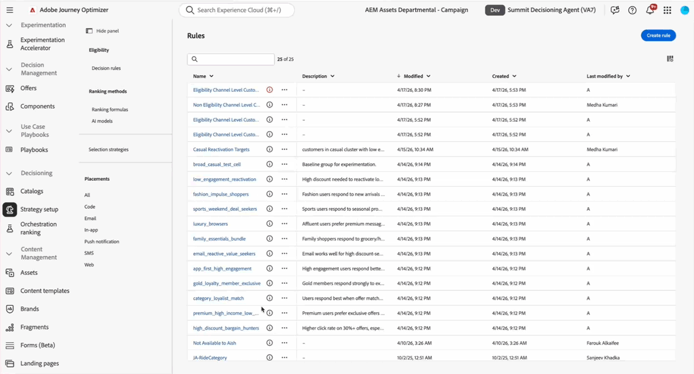

# Notas de versão {#release-notes}

>[!CONTEXTUALHELP]
>id="ajo_homepage_card1"
>title="Novidades"
>abstract="O **Adobe Journey Optimizer** oferece continuamente novos recursos, melhorias nos recursos existentes e correções de erros. Na última semana de cada mês, todas as alterações são consolidadas nessas notas de versão."

O [!DNL Adobe Journey Optimizer] segue um modelo de entrega contínua, permitindo que a Adobe forneça novos recursos, melhorias e correções de forma contínua. Essa abordagem permite uma implantação escalável e em fases de recursos para garantir desempenho e estabilidade em todos os ambientes. Devido a esse modelo, as notas de versão são atualizadas entre as versões mensais. Para obter detalhes completos sobre o ciclo de lançamento e as fases de disponibilidade, consulte o [ciclo de lançamento do Journey Optimizer](releases.md).

O [!DNL Adobe Journey Optimizer] é construído nativamente na [!DNL Adobe Experience Platform] e herda suas mais recentes inovações e melhorias. Saiba mais sobre essas alterações nas [Notas de versão da Adobe Experience Platform](https://experienceleague.adobe.com/docs/experience-platform/release-notes/latest.html?lang=pt-BR){target="_blank"}.

>[!NOTE]
>
>Os recursos listados nestas notas de versão incluem uma **Data de disponibilidade** indicando quando cada alteração se torna acessível em seu ambiente. A seção **Em breve**, na parte inferior desta página, lista os recursos e as melhorias programadas para lançamento nos próximos dias. As informações estão sujeitas a alterações.

## Notas de versão de maio de 2026 {#may-26-rn}

### Novos recursos {#may-26-features}

Os recursos a seguir foram lançados em maio de 2026.

<table>
<thead>
<tr>
<th><strong>Seletor do Supervisor de Conteúdo</strong> </th>
</tr>
</thead>
<tbody>
<tr>
<td>

O Journey Optimizer agora usa o <strong>seletor do Supervisor de conteúdo</strong>, um modal unificado para selecionar fragmentos de conteúdo e Experience Manager Assets. O novo seletor inclui:

<ul>
<li><strong>Navegação, pesquisa e filtragem</strong> em todos os ativos e fragmentos.</li>
<li><strong>Pesquisa semântica de IA</strong>: descreva o que você precisa em linguagem simples, por exemplo, "café nas montanhas", para exibir ativos contextualmente relevantes com base no significado e no conteúdo, não apenas correspondências de texto. Consultas multilíngues também são compatíveis.</li>
<li><strong>Upload breve</strong>: faça upload de um resumo de marketing para exibir automaticamente ativos que se alinham ao contexto da campanha com base no conteúdo e nos requisitos.</li>
<li><strong>Representações do Dynamic Media</strong>: escolha e aplique representações de imagem para ativos dinâmicos sem sair do seletor.</li>
</ul>

Para obter mais informações, consulte a <a href="../integrations/aem-content-advisor.md">documentação detalhada</a>.

Data de disponibilidade: 19 de maio de 2026

</td>
</tr>
</tbody>
</table>

<table>
<thead>
<tr>
<th><strong>Jornada fragmentos</strong> </th>
</tr>
</thead>
<tbody>
<tr>
<td>

Agora você pode criar <strong>Fragmentos de Jornada</strong> no Adobe Journey Optimizer. Os fragmentos de jornada são conjuntos reutilizáveis de nós de jornada que você pode criar uma vez e soltar em qualquer jornada na sandbox. Seja uma verificação de elegibilidade, uma lógica de roteamento de canal preferencial ou uma sequência de boas-vindas, os fragmentos ajudam as equipes a se moverem mais rápido e a permanecerem consistentes, sem reconstruir a mesma lógica do zero todas as vezes.

Depois de criados, os fragmentos são armazenados em um <strong>Inventário de Fragmentos</strong> dedicado e podem ser inseridos em qualquer jornada usando a atividade <strong>Fragmentos de Jornada</strong>.

<!--

-->

Esse recurso está disponível apenas para um conjunto de organizações (disponibilidade limitada). Para obter acesso, entre em contato com um representante da Adobe.

Para obter mais informações, consulte a <a href="../building-journeys/journey-fragments.md">documentação detalhada</a>.

Data de disponibilidade: 13 de maio de 2026

</td>
</tr>
</tbody>
</table>

<table>
<thead>
<tr>
<th><strong>Deeplinks no Designer de email</strong> </th>
</tr>
</thead>
<tbody>
<tr>
<td>

Agora é possível adicionar deep links ao conteúdo de email por meio de uma opção dedicada no Designer de email.

Isso garante que os usuários sejam direcionados diretamente para o conteúdo correto no aplicativo, em vez de serem redirecionados para navegadores ou lojas de aplicativos, preservando o contexto e o engajamento.

Para obter mais informações, consulte a <a href="../email/deeplinks.md">documentação detalhada</a>.

Data de disponibilidade: 12 de maio de 2026

</td>
</tr>
</tbody>
</table>

<table>
<thead>
<tr>
<th><strong>Simulação de jornada</strong> </th>
</tr>
</thead>
<tbody>
<tr>
<td>

Agora você pode definir sua jornada como <strong>Simulação</strong>. Este modo permite validar sua lógica usando <strong>usuários simulados</strong>. São perfis temporários criados especificamente para a simulação, permitindo que você teste livremente sem precisar gerenciar perfis de teste persistentes na Adobe Experience Platform.

Esse recurso está disponível para todos os clientes como uma Disponibilidade limitada com recursos essenciais.

Para obter mais informações, consulte a <a href="../building-journeys/simulate-journey.md">documentação detalhada</a>.

Data de disponibilidade: 5 de maio de 2026

</td>
</tr>
</tbody>
</table>

<table>
<thead>
<tr>
<th><strong>Regras de decisão e otimização da IA da fórmula de classificação</strong> </th>
</tr>
</thead>
<tbody>
<tr>
<td>

[!DNL Adobe Journey Optimizer] O agora usa a IA para detectar regras de decisão e fórmulas de classificação que podem ser simplificadas. No inventário, um indicador vermelho aparece em qualquer regra para a qual a IA identificou uma oportunidade de otimização. Clicar no indicador exibe a expressão original junto com a versão sugerida pela IA. A partir daí, você pode baixar um arquivo para revisar como os perfis simulados são avaliados por cada versão, confirmar se eles se comportam de forma idêntica e, em seguida, substituir a expressão pelo otimizado.

Para obter mais informações, consulte a <a href="../start/ai-features.md#decisioning-optimization">documentação detalhada</a>.

Data de disponibilidade: 5 de maio de 2026

</td>
</tr>
</tbody>
</table>

<table>
<thead>
<tr>
<th><strong>Integrações</strong> </th>
</tr>
</thead>
<tbody>
<tr>
<td>

O recurso <b>Integrações</b> permite conectar fontes de dados de terceiros diretamente ao Adobe Journey Optimizer. Ao simplificar a forma como você obtém dados externos e <b>conteúdo de composição</b>, esse recurso facilita a entrega de mensagens personalizadas e dinâmicas em todos os canais.

Anteriormente lançado na versão beta, este recurso já está disponível para todos os ambientes (disponibilidade geral).

Para obter mais informações, consulte a <a href="../integrations/integrations.md">documentação detalhada</a>.

Data de disponibilidade: 4 de maio de 2026

</td>
</tr>
</tbody>
</table>

### Aprimoramentos {#may-26-improv}

As seguintes melhorias também foram lançadas em maio de 2026.

#### Tomada de decisão

* **APIs de fluxo de trabalho de migração de decisão** - O contrato de API para criação de análise de dependência e fluxos de trabalho de migração foi atualizado: passe **`request-level`** como **parâmetro de consulta** na URL de solicitação (`sandbox`, `offer` ou `decision`). O nível de solicitação não deve mais ser enviado no corpo JSON. [Leia mais](../experience-decisioning/decisioning-migration-api.md)

  Data de disponibilidade: 6 de maio de 2026

#### SMS

<!--
* **Opt-out and consent at phone number and sender** - For SMS, Journey Optimizer now records marketing consent and opt-out at the level of both the profile's phone number and short code. 

  This capability is currently only available for Sinch SMS configurations. [Read more](../sms/sms-configuration-sinch.md)
-->

* **Contagem de caracteres**: no Adobe Journey Optimizer, agora você pode usar a Contagem de caracteres para monitorar o comprimento de suas mensagens SMS em tempo real. Isso ajuda a ver quando uma mensagem será dividida em vários segmentos para gerenciar melhor a formatação e evitar aumentos inesperados nos custos de envio. [Leia mais](../sms/create-sms.md)

* **Entrada de SMS para um conjunto de dados personalizado**: em **credenciais de API de SMS**, encaminhe **SMS de entrada** para um **conjunto de dados de Evento de Experiência personalizado e habilitado para perfil** que você escolher, em vez de apenas o conjunto de dados de rastreamento padrão. [Leia mais](../sms/sms-webhook.md)

* **Aprimoramento da interface do webhook**: ao configurar webhooks de SMS, a interface agora inclui um guia de instalação integrado com exemplos práticos, facilitando o alinhamento do conteúdo do provedor e a solução de problemas sem sair do fluxo de configuração. [Leia mais](../sms/sms-webhook.md)

#### WhatsApp

* **Suporte e rastreamento de botões do WhatsApp** - Os modelos do WhatsApp agora oferecem suporte para **Resposta rápida**, **Call to action - URL** e **Call to action - phone**, **Não há suporte para**. O Journey Optimizer envia botões e rastreia interações compatíveis junto com seus outros relatórios de canal.

* **Dados de contexto do canal do WhatsApp** - O Journey Optimizer agora captura dados adicionais de interação retornados do canal do WhatsApp e os armazena no **Conjunto de Dados do AJO EmailTrackingExperienceEvent** no grupo de campos `whatsAppChannelContext`.

  +++ Os campos a seguir são capturados e podem ser usados para construir públicos e analisar o engajamento do WhatsApp

   * **`messageType`** - Tipo de mensagem do WhatsApp (ex: `templateBased`, `response`)
   * **`inboundMessage`** - Conteúdo de resposta de entrada (por exemplo, `stop`, `start`, `subscribe`)
   * **`inboundNumber`** - ID do remetente em que a mensagem de entrada foi recebida
   * **`channelType`** - Categoria de canal (`Utility`, `Marketing` ou `Promotional`)
   * **`profileNumber`** - Número de telefone do qual a mensagem de entrada foi recebida
   * **`origTimestamp`** - Carimbo de data e hora original do Meta / WhatsApp
   * **`status`** - Status de entrega incluindo feedback de provedor padronizado (`sent`, `delivered`, `bounce`, `error`, `delay`, `duplicate`, `denylist`, `exclude` ou `unknown`) e a mensagem de status de provedor bruto
   * **`reactionEvent`** - Conteúdo da resposta do usuário: emoji para reações ou texto da mensagem para respostas a uma mensagem específica
   * **`reactionMessageID`** - ID da mensagem original que está sendo respondida
   * **`reactionActionName`** - Tipo de ação de resposta (`react`, `unreact` ou `reply`)
   * **`interactiveSelectedTitle`** - Título selecionado pelo usuário de uma mensagem interativa do WhatsApp
   * **`interactiveType`** - Tipo de mensagem interativa (`list reply`, `button reply` ou `button`)
   * **`interactiveSelectedDescription`** - Descrição da opção interativa do WhatsApp selecionada
   * **`interactiveSelectedID`** - ID da opção selecionada do WhatsApp

  +++

## Em breve {#coming-soon}

Os recursos e aprimoramentos a seguir estão programados para serem lançados no final de maio. **As informações estão sujeitas a alterações**. Links, telas e documentação atualizados serão compartilhados assim que essas atualizações estiverem ativas na produção.

### Novos recursos {#coming-soon-features}

<table>
<thead>
<tr>
<th><strong>Novo canal de mensagens móveis e mensagens RCS aprimoradas</strong> </th>
</tr>
</thead>
<tbody>
<tr>
<td>

SMS, MMS e RCS agora estão unificados em uma única ação de <strong>Mensagem móvel</strong> no Adobe Journey Optimizer, facilitando o gerenciamento de todos os tipos de mensagens móveis em um único local. Como parte dessa atualização, agora você pode criar mensagens RCS de mídia avançada, incluindo imagens, carrosséis e ações sugeridas, diretamente no Journey Optimizer por meio de uma nova experiência de criação nativa.

Data de disponibilidade: 20 de maio de 2026

</td>
</tr>
</tbody>
</table>

<table>
<thead>
<tr>
<th><strong>Conclusão automática para jornadas de Leitura de público não recorrentes</strong> </th>
</tr>
</thead>
<tbody>
<tr>
<td>

As jornadas não recorrentes de <strong>Ler público-alvo</strong> agora fazem a transição automática para o status <strong>Parado</strong> depois que o último perfil ativo sai. Anteriormente, essas jornadas permaneciam <strong>Ativas</strong> até que o tempo limite global de 91 dias expirasse — mesmo quando nenhum perfil estava fluindo mais por elas. Com essa melhoria, o status da jornada reflete o estado de execução real assim que é concluída, mantendo o inventário da jornada preciso sem intervenção manual.

Observe que esse comportamento não se aplica a jornadas que incluem nós que causam períodos de espera, como nós de espera, nós de reação ou transições acionadas por evento. Essas jornadas permanecem sujeitas ao tempo limite global padrão de 91 dias.

Data de disponibilidade: 21 de maio de 2026

</tr>
</tbody>
</table>

<table>
<thead>
<tr>
<th><strong>Suporte à decisão no canal de correspondência direta</strong> </th>
</tr>
</thead>
<tbody>
<tr>
<td>

Agora é possível adicionar políticas de decisão a jornadas e campanhas de correspondência direta. As políticas de decisão são containers para suas ofertas que aproveitam o mecanismo de decisão para retornar dinamicamente o melhor conteúdo para cada membro do público. A decisão de correspondência direta também aceita casos de uso de decisão em lote, permitindo exportar os itens de oferta correspondentes para cada perfil em um determinado público-alvo da Adobe Experience Platform.

<!--

-->

Data de disponibilidade: 21 de maio de 2026

</td>
</tr>
</tbody>
</table>

<table>
<thead>
<tr>
<th><strong>Simulação de jornada</strong> </th>
</tr>
</thead>
<tbody>
<tr>
<td>

Agora você pode definir sua jornada como <strong>Simulação</strong>. Este modo permite validar sua lógica usando <strong>usuários simulados</strong>. São perfis temporários criados especificamente para a simulação, permitindo que você teste livremente sem precisar gerenciar perfis de teste persistentes na Adobe Experience Platform.

Anteriormente lançado em disponibilidade limitada para uso em jornadas, este recurso já está disponível para todos os ambientes (disponibilidade geral). Com a versão de Disponibilidade Geral, agora é possível usar o Journey Agent para gerar usuários e eventos simulados diretamente no menu Simulação.

Data de disponibilidade: 28 de maio de 2026

</td>
</tr>
</tbody>
</table>

<table>
<thead>
<tr>
<th><strong>Segmentação baseada em arquivo para campanhas orquestradas</strong> </th>
</tr>
</thead>
<tbody>
<tr>
<td>

As campanhas orquestradas agora permitem o carregamento de um arquivo CSV ou TXT diretamente na tela da campanha como público alvo, sem primeiro assimilar o arquivo na Adobe Experience Platform. Os dados do arquivo são consumidos no tempo de execução e não são mantidos como um conjunto de dados do Adobe Experience Platform. Durante a configuração do arquivo, você pode definir mapeamentos de coluna, tipos de dados, tratamento NULL e políticas de erro por coluna. Isso oferece suporte a envios ad hoc ou campanhas de lista de parceiros em que a criação de um pipeline de assimilação completo não é prática. 

Esse recurso está disponível apenas para um conjunto de organizações (disponibilidade limitada). Para obter acesso, entre em contato com um representante da Adobe.

Data de disponibilidade: 28 de maio de 2026

</td>
</tr>
</tbody>
</table>

### Aprimoramentos  {#coming-soon-improvements}

#### Navegação

* **Pastas para jornadas e campanhas** - Agora é possível organizar suas jornadas e campanhas em pastas para melhorar a navegação e o gerenciamento na interface.

  Data de disponibilidade: 21 de maio de 2026

#### Jornadas

* **Autenticação Personalizada Baseada em Certificado em ações personalizadas** - As ações personalizadas agora oferecem suporte à Autenticação Personalizada Baseada em Certificado. Ao adicionar subType: &quot;certificateCredential&quot; a uma configuração de autorização personalizada, o Journey Optimizer usa o certificado gerenciado da Adobe para assinar uma declaração de cliente JWT e trocá-la por um token de acesso — nenhum segredo do cliente necessário. Projetado para APIs empresariais que impõem a verificação de identidade baseada em certificados, como o Azure Entra ID.

  Data de disponibilidade: 21 de maio de 2026

#### Campanhas orquestradas

* **Adicionar links na atividade de Enriquecimento** - A funcionalidade Adicionar Link agora está disponível na Atividade de Enriquecimento para Campanhas Orquestradas. Isso permite criar uma relação direta entre os dados da tabela de trabalho e as tabelas do banco de dados existente.

  Data de disponibilidade: 26 de maio de 2026

* **Personalização baseada em loop para dados relacionais** - O editor de personalização agora oferece suporte a um Bloco de loop que repete coleções relacionais, como pedidos, contas ou reservas, e renderiza um bloco de conteúdo por registro em um único email ou SMS. As coleções são configuradas por meio do seletor de dados usando tokens de personalização, sem a necessidade de gravação de expressão.

  Data de disponibilidade: 28 de maio de 2026

#### Email

* **Personalizar detalhes do remetente de email por destinatário e campanha** - As campanhas orquestradas agora oferecem suporte à personalização de campos de cabeçalho de email, incluindo Nome do remetente, Endereço do remetente e Responder para, usando atributos de perfil ou dados relacionais. Isso permite que os detalhes do remetente reflitam o supervisor, o local ou a ramificação relevante para cada destinatário, em vez de rotear todos os envios por meio de um único endereço corporativo.

  Os valores do cabeçalho podem ser definidos no nível do canal e substituídos por campanha usando dados contextuais para obter um controle mais preciso.

  Data de disponibilidade: 29 de maio de 2026

#### Configuração

* **Conjunto de Dados de Evento de Feedback de Mensagem sendo movido para assimilação em lote** - O `AJO Message Feedback Event Dataset` está passando do modo de streaming para o modo de assimilação em lote. Essa alteração garante que a assimilação de dados não exceda os limites de assimilação de streaming. Se você usar esse conjunto de dados nos relatórios do Customer Journey Analytics ou executar consultas nele, espere um aumento na latência de dados de até 2 horas no futuro.

  Data de disponibilidade: 29 de maio de 2026
