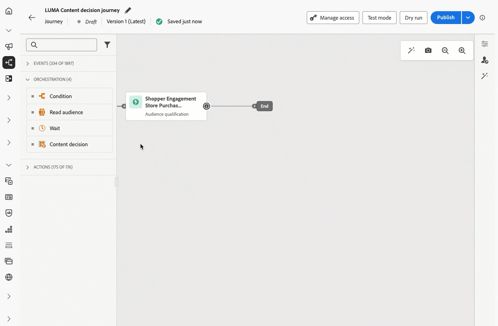

# Notas de versão {#release-notes}

>[!CONTEXTUALHELP]
>id="ajo_homepage_card1"
>title="Novidades"
>abstract="O **Adobe Journey Optimizer** está sempre fornecendo novos recursos, melhorias para os recursos existentes e correções de erros. Na última semana de cada mês, todas as alterações são consolidadas nessas notas de versão."

O [!DNL Adobe Journey Optimizer] segue um modelo de entrega contínua, permitindo que a Adobe forneça novos recursos, melhorias e correções também de forma contínua. Essa abordagem permite uma implantação escalável e em fases de recursos para garantir desempenho e estabilidade em todos os ambientes.

Devido a esse modelo, as notas de versão são atualizadas entre as versões mensais. Para obter detalhes completos sobre o ciclo de lançamento e as fases de disponibilidade, consulte o [ciclo de lançamento do Journey Optimizer](releases.md).

O [!DNL Adobe Journey Optimizer] é construído nativamente na [!DNL Adobe Experience Platform] e herda suas mais recentes inovações e melhorias. Saiba mais sobre essas alterações nas [Notas de versão da Adobe Experience Platform](https://experienceleague.adobe.com/docs/experience-platform/release-notes/latest.html?lang=pt-BR){target="_blank"}.

## Notas de pré-lançamento de março de 2026 {#march-26-rn}

**As notas de pré-lançamento abaixo estão sujeitas a alterações sem aviso prévio até a data de disponibilidade da versão**. Links, telas e a documentação atualizada são publicados nas notas de versão na data de lançamento.

Consulte também [notas de pré-lançamento do Adobe Experience Platform](https://experienceleague.adobe.com/pt-br/docs/experience-platform/release-notes/pre-release-notes){target="_blank"}.

**Data de lançamento**: 24 a 25 de março de 2026

### Novos recursos {#march-26-features}

<table>
<thead>
<tr>
<th><strong>Campanhas transacionais orquestradas</strong> </th>
</tr>
</thead>
<tbody>
<tr>
<td>

As campanhas orquestradas agora podem ser designadas como <strong>transacionais</strong>. Isso permite a entrega de mensagens transacionais acionadas por ações específicas executadas por indivíduos, como solicitações de redefinição de senha ou compras de carrinho. Ao atribuir essa categoria, as configurações de canal transacional são aplicadas e as regras de negócios são ignoradas.

</td>
</tr>
</tbody>
</table>

<table>
<thead>
<tr>
<th><strong>Acionar campanhas orquestradas usando a API</strong> </th>
</tr>
</thead>
<tbody>
<tr>
<td>

Agora você pode acionar uma campanha orquestrada por meio da API. Configure a campanha do target como "Triggered by a signal" (Acionado por um sinal) e publique-a. Em seguida, use uma chamada de API para acionar a campanha. A chamada da API pode incluir parâmetros que estarão disponíveis como variáveis na campanha acionada.

</td>
</tr>
</tbody>
</table>

<table>
<thead>
<tr>
<th><strong>Atividade de teste em campanhas orquestradas</strong> </th>
</tr>
</thead>
<tbody>
<tr>
<td>

Uma nova atividade <strong>Test</strong> está disponível em Campanhas Orquestradas. Essa atividade roteia a execução do fluxo de trabalho para diferentes ramificações com base em condições definidas, permitindo validar a lógica e as configurações da campanha antes de ativar os deliveries ativos.

</td>
</tr>
</tbody>
</table>

<table>
<thead>
<tr>
<th><strong>Criptografia de parâmetro de URL</strong> </th>
</tr>
</thead>
<tbody>
<tr>
<td>

Os parâmetros de URL em links de rastreamento e páginas de aterrissagem agora podem ser criptografados, fornecendo uma camada adicional de segurança para dados de parâmetros confidenciais.

<ul>
<li>Registre e gerencie chaves de criptografia em um Registro <strong>Administração</strong> dedicado.</li>
<li>Use o novo auxiliar de criptografia em expressões para criptografar dados confidenciais em links de rastreamento e URLs de página inicial para os parâmetros de consulta que você deseja proteger no momento da renderização.</li>
</ul>

Esse recurso está disponível apenas para um conjunto de organizações (disponibilidade limitada). Para obter acesso, entre em contato com um representante da Adobe.

</td>
</tr>
</tbody>
</table>

<table>
<thead>
<tr>
<th><strong>Otimização do caminho da jornada</strong> </th>
</tr>
</thead>
<tbody>
<tr>
<td>

Use o novo nó Otimizar para direcionar públicos-alvo específicos ou execute testes A/B para determinar o melhor caminho para atender aos KPIs centrados nos negócios.
Essa ferramenta permite testar, variar e personalizar as comunicações, o sequenciamento e o momento para melhor alcançar os clientes.

Anteriormente lançado em disponibilidade limitada, este recurso já está disponível para todos os ambientes (disponibilidade geral).

Com a disponibilidade geral, esta versão introduz a seleção <strong>tipo de experimento</strong> (A/B ou bandit de vários braços) e <strong>Dimensione o vencedor</strong> para jornadas unitárias.

Para obter mais informações, consulte a <a href="../building-journeys/optimize.md">documentação detalhada</a>.

</td>
</tr>
</tbody>
</table>

<table>
<thead>
<tr>
<th><strong>Suporte à pesquisa de conjunto de dados no jornada</strong> </th>
</tr>
</thead>
<tbody>
<tr>
<td>

Uma nova atividade no jornada, Pesquisa de conjunto de dados, permite recuperar dados dinamicamente dos conjuntos de dados de registro do Adobe Experience Platform durante o tempo de execução. Ao aproveitar esse recurso, é possível acessar dados que podem não estar no perfil ou no conteúdo do evento, garantindo que as interações com o cliente sejam relevantes e oportunas. Anteriormente lançado com disponibilidade limitada, esse recurso agora está disponível para todos os ambientes (disponibilidade geral). Para obter mais informações, consulte a <a href="../building-journeys/dataset-lookup.md">documentação detalhada</a>.

</td>
</tr>
</tbody>
</table>

<table>
<thead>
<tr>
<th><strong>Atividades de ação do canal nativo obsoletas</strong> </th>
</tr>
</thead>
<tbody>
<tr>
<td>

Após a Disponibilidade geral da <strong>Atividade de ação</strong> em fevereiro de 2026, as atividades de canal nativas herdadas (Email, Push, SMS, No aplicativo, Web, Experiência baseada em código e Cartão de conteúdo) na tela de jornada foram descontinuadas.

Agora você usa uma única <strong>Atividade de ação</strong> para configurar todas as ações de canal, substituindo a necessidade de nós separados específicos do canal.
As jornadas existentes que usam as atividades de canal herdadas continuarão a funcionar sem nenhuma alteração ou migração necessária.

Para obter mais informações, consulte a <a href="../building-journeys/journey-action.md">documentação detalhada</a>.

</td>
</tr>
</tbody>
</table>

<table>
<thead>
<tr>
<th><strong>Suporte à decisão no canal de email</strong> </th>
</tr>
</thead>
<tbody>
<tr>
<td>

Agora você pode usar a <strong>Decisão</strong> para personalizar e otimizar o conteúdo de suas mensagens de email. Aproveite as Pontuações de prioridade, as Fórmulas ou os Modelos de IA para exibir as ofertas e o conteúdo mais relevantes para cada recipient.

Anteriormente lançado com disponibilidade limitada, esse recurso agora está disponível para todos os ambientes (disponibilidade geral). Com esta versão de Disponibilidade geral, as mirror pages agora são compatíveis.

Para obter mais informações, consulte a <a href="../experience-decisioning/create-decision-policy.md">documentação detalhada</a>.

</td>
</tr>
</tbody>
</table>

<table>
<thead>
<tr>
<th><strong>Converter imagens em modelos de conteúdo de email</strong> </th>
</tr>
</thead>
<tbody>
<tr>
<td>

Agora é possível converter imagens em modelos de conteúdo de email diretamente no Journey Optimizer. Use a análise baseada em IA para gerar automaticamente modelos estruturados do HTML a partir de referências visuais, reduzindo significativamente o tempo de design de email.

Anteriormente lançado com disponibilidade limitada, esse recurso agora está disponível para todos os ambientes (disponibilidade geral). <a href="../content-management/image-to-html.md">Saiba mais</a>

</td>
</tr>
</tbody>
</table>

<table>
<thead>
<tr>
<th><strong>Caixa de entrada</strong> </th>
</tr>
</thead>
<tbody>
<tr>
<td>

A <strong>Caixa de Entrada</strong> é uma funcionalidade móvel, disponível com Cartões de Conteúdo, que permite aos clientes criar um local centralizado no aplicativo ou site para exibir mensagens enviadas aos usuários. Isso estende a vida útil das comunicações de marketing, garantindo que as mensagens permaneçam acessíveis mesmo após serem descartadas.

Data de disponibilidade: quarta-feira, 31 de março de 2026

</td>
</tr>
</tbody>
</table>

<table>
<thead>
<tr>
<th><strong>Editor avançado do HTML para modelos de email</strong> </th>
</tr>
</thead>
<tbody>
<tr>
<td>

O modo HTML avançado para modelos de conteúdo de email permite editar a origem de HTML do seu conteúdo no Designer de email, adicionar expressões avançadas (como condições) na origem e alternar entre a exibição do HTML e a exibição da área de trabalho sem perder as alterações.

Esse recurso está disponível em modelos de conteúdo somente para o canal de email. No momento, ela está em Disponibilidade limitada. Entre em contato com o representante da Adobe para obter acesso.

Para obter mais informações, consulte a <a href="../content-management/email-template-expert-mode.md">documentação detalhada</a>.

Data de disponibilidade: quarta-feira, 10 de março de 2026

</td>
</tr>
</tbody>
</table>

<table>
<thead>
<tr>
<th><strong>Integração de modelos personalizados do Firefly e modelos de geração de imagens de terceiros</strong> </th>
</tr>
</thead>
<tbody>
<tr>
<td>

Permita a integração perfeita de modelos Firefly padrão e personalizados, juntamente com modelos de imagem de terceiros aprovados, para oferecer maior flexibilidade, controle e alinhamento de marca ao gerar imagens.

Escolha o modelo certo para suas necessidades:

<ul><li> <strong>Modelo do Adobe</strong> (desenvolvido pela Firefly Image Model 4) para geração imediata de imagens sem configuração adicional</li><li> <strong>Modelo de parceiro</strong> (viabilizado pelo Gemini 2.5 Flash) para recursos especializados</li><li><strong>Modelos personalizados</strong> (modelos específicos da marca treinados em seus próprios ativos) para geração de itens sob marca que se alinham precisamente à identidade, ao estilo e às diretrizes visuais da sua marca.</li></ul>

Para obter mais informações, consulte a <a href="../content-management/generative-models.md">documentação detalhada</a>.

Data de disponibilidade: terça-feira, 2 de março de 2026

</td>
</tr>
</tbody>
</table>

<table>
<thead>
<tr>
<th><strong>Atividade online para iOS</strong> </th>
</tr>
</thead>
<tbody>
<tr>
<td>

Traga experiências em tempo real diretamente para o Lock Screens e o Dynamic Island de seus clientes com a atividade do iOS Live no Adobe Journey Optimizer. Forneça atualizações em tempo real, desde o rastreamento de pedidos e o status do voo até a contagem regressiva de eventos, pontuações em tempo real e o progresso do delivery, sem exigir que os usuários abram seu aplicativo. Mantenha seu público informado e engajado no momento exato, exatamente onde eles estão.

Anteriormente lançado na versão beta, esse recurso agora está disponível para todos os ambientes (Disponibilidade geral).

Para obter mais informações, consulte a <a href="../mobile-live/get-started-mobile-live.md">documentação detalhada</a>.

Data de disponibilidade: quarta-feira, 3 de março de 2026

</td>
</tr>
</tbody>
</table>

<table>
<thead>
<tr>
<th><strong>Journey Agent: criação de conteúdo de canal</strong> </th>
</tr>
</thead>
<tbody>
<tr>
<td>

Com a tecnologia <strong>Adobe Experience Platform Agent Orchestrator</strong>, o <strong>Journey Agent</strong> está disponível no Journey Optimizer e permite que você analise jornadas por meio de uma interface de linguagem natural. Agora você também pode gerar e gerenciar conteúdo específico de canal diretamente no Journey Agent, criando conteúdo para canais como email e push, aplicando e visualizando modelos, refinando o tom e o estilo por meio de prompts e abrindo conteúdo no <strong>Content Designer</strong> para edição em contexto.

Esse recurso está disponível apenas para um conjunto de organizações (disponibilidade limitada). Para obter acesso, entre em contato com um representante da Adobe.

Para obter mais informações, consulte a <a href="https://experienceleague.adobe.com/docs/experience-cloud-ai/experience-cloud-ai/agents/ajo-agent.html?lang=pt-BR">documentação detalhada</a>.

Data de disponibilidade: quinta-feira, 4 de março de 2026

</td>
</tr>
</tbody>
</table>

<table>
<thead>
<tr>
<th><strong>Monitoramento do modelo de IA</strong> </th>
</tr>
</thead>
<tbody>
<tr>
<td>

O Journey Optimizer agora permite monitorar a integridade, o status do treinamento e o desempenho dos modelos de IA de decisão. Isso permite verificar o sucesso do treinamento, solucionar problemas de falhas e entender o impacto em seus resultados, a fim de selecionar as melhores ofertas para cada cliente que usa a IA. Observe que esse recurso está disponível somente para <strong>Decisão</strong> (não para modelos herdados do Gerenciamento de decisões).

Este recurso está disponível atualmente apenas para <strong>modelos de otimização personalizada</strong> (não de otimização automática).

Para obter mais informações, consulte a <a href="../experience-decisioning/ranking/ai-model-observability.md">documentação detalhada</a>.

Data de disponibilidade: terça-feira, 9 de março de 2026

</td>
</tr>
</tbody>
</table>

### Aprimoramentos {#march-26-improv}

Os aprimoramentos incluídos nesta versão estão listados abaixo.

#### Relatórios

* **Otimização de Tempo de Envio: a localização dos controles atualizados e o novo relatório de aumento** - os controles de Otimização de Tempo de Envio (STO) foram realocados para o menu de configuração Ação. Além disso, um novo relatório de aumento está disponível nos relatórios do Jornada para medir o impacto do STO nas métricas de desempenho da campanha.

<!--
* **Exclude bot clicks for email and SMS reporting** - Email and SMS reporting now automatically filters out bot clicks from click metrics, providing more accurate engagement data and preventing automated traffic from inflating your performance figures.

#### Email Designer

* **Email Designer displayed in Unified Shell** - The Email Designer is now displayed within the Unified Shell experience, providing a consistent navigation and header experience that aligns with other Adobe applications.

* **Text mode support in fragments** - To support text-based email workflows, you can now create and manage text versions of your visual fragments for optimal use in the plain text version of emails that include that fragment.

  **Caution:** When using a fragment that was created before the current release, the fragment text version may be incorrectly rendered—both in the Email Designer and in the final email delivered to your recipients. For best results with older fragments, edit, save and republish each fragment.-->

#### Tomada de decisão

* **Fragmentos opcionais em itens de decisão** - Ao usar fragmentos em itens de decisão, agora é possível tornar um fragmento opcional para que, se ele estiver temporariamente indisponível no Edge, seja ignorado e a jornada ou campanha continue a ser renderizada em vez de falhar.

#### Configuração

* **Pastas para jornadas e campanhas** - Agora é possível organizar suas jornadas e campanhas em pastas, permitindo uma navegação estruturada e um gerenciamento mais fácil para equipes que trabalham com grandes volumes de conteúdo. Esse recurso está disponível apenas para um conjunto de organizações (disponibilidade limitada). Para obter acesso, entre em contato com um representante da Adobe.

* **Conjunto de Dados do Evento de Feedback de Destinatário Secundário do AJO renomeado** - O Conjunto de Dados `AJO Email BCC Feedback Event` foi renomeado para Conjunto de Dados `AJO Secondary Recipient Feedback Event`. O impacto varia dependendo da sua situação:

   * **Usuários existentes**: somente o nome para exibição é atualizado. O nome da tabela subjacente permanece inalterado.
   * **Novos usuários e sandboxes**: o nome de exibição e o nome da tabela refletem o novo nome.
   * **Usuários existentes com novas sandboxes**: o nome de exibição e o nome da tabela são atualizados para o novo nome.

  Data de disponibilidade: terça-feira, 2 de março de 2026

#### Campanhas orquestradas

* **Variáveis globais em Campanhas orquestradas** - As Campanhas orquestradas agora oferecem suporte a variáveis globais que podem ser definidas uma vez e reutilizadas em todas as atividades de um fluxo de trabalho, simplificando a configuração e garantindo a consistência em valores dinâmicos, expressões e personalização de conteúdo.

* **Simplificação da dimensão do Target em Campanhas orquestradas** - Agora é possível selecionar facilmente ou deduzir automaticamente o direcionamento correto e as dimensões secundárias em Campanhas orquestradas para uma ativação de público precisa e eficiente.

#### Jornadas

* **Tipo de experimento** - Agora é possível escolher entre um experimento A/B (divisão fixa no início) ou um bandit multicampo (divisão automática com atualizações de peso semanais) ao configurar um experimento de caminho.

* **Experimentação de caminho: dimensionar o vencedor** - Agora é possível implantar automática ou manualmente o caminho vencedor de um experimento em todo o seu público-alvo. Uma vez determinado o vencedor, você pode ampliar seu alcance e eficácia sem monitorar constantemente o experimento.

  Esse recurso está disponível somente em jornadas unitárias (acionadas por eventos e qualificações de Público-alvo). Não está disponível para jornadas Read audience.

* **Envio de mensagens de saída em ondas no jornada** - Agora é possível agendar mensagens do Journey Optimizer jornada para serem entregues em lotes controlados ao longo do tempo. [Saiba mais](../building-journeys/send-using-waves.md)

  Anteriormente lançado com disponibilidade limitada para uso no jornada, esse recurso agora está disponível para todos os ambientes (disponibilidade geral).

  Data de disponibilidade: terça-feira, 16 de março de 2026

* **Detalhes de pausa e retomada nos detalhes técnicos da jornada** - Os **detalhes técnicos** da jornada agora incluem informações adicionais de pausa e retomada: a data e a hora da última pausa e retomada, o nome para exibição e o identificador interno do usuário que executou cada ação e um conjunto completo de configurações de jornada pausadas, como comportamento de pausa, duração máxima da pausa e estado de retomada automática. [Saiba mais](../building-journeys/journey-properties.md)

  Data de disponibilidade: terça-feira, 2 de março de 2026

## Notas de versão de fevereiro de 2026 {#feb-26-01-rn}

As seções [Novos recursos](#feb-26-01-features) e [Melhorias](#feb-26-01-improv) abordam recursos já disponíveis. <!--The [Coming soon](#coming-soon) section lists features and improvements scheduled for release later in February.-->

<!--**The pre-release notes below are subject to change without prior notice until the release availability date**. Links, screens and updated documentation are published in the release notes, at the release date.

See also [Adobe Experience Platform Pre-release notes](https://experienceleague.adobe.com/pt-br/docs/experience-platform/release-notes/pre-release-notes){target="_blank"}.-->

<!--**Release date**: February 17-18, 2026-->

### Novos recursos {#feb-26-01-features}

<table>
<thead>
<tr>
<th><strong>Arbitragem de jornada</strong> </th>
</tr>
</thead>
<tbody>
<tr>
<td>

Agora você pode usar as <strong>fórmulas de classificação</strong> para aumentar automaticamente as pontuações de prioridade de jornada com base nos atributos do perfil do cliente e em fatores contextuais, garantindo que os clientes insiram as jornadas mais relevantes.

Esse recurso está disponível apenas para um conjunto de organizações (disponibilidade limitada). Para obter acesso, entre em contato com um representante da Adobe.

Para obter mais informações, consulte a <a href="../conflict-prioritization/journey-ranking-formulas.md">documentação detalhada</a>.

Data de disponibilidade: quarta-feira, 24 de fevereiro de 2026

</td>
</tr>
</tbody>
</table>

<table>
<thead>
<tr>
<th><strong>Atividade de ação em jornadas</strong> </th>
</tr>
</thead>
<tbody>
<tr>
<td>

O Journey Optimizer oferece suporte a uma nova <strong>Atividade de ação</strong> genérica que permite configurar ações únicas e grupos de ação de entrada de várias ações, permitindo uma configuração de ação simplificada na tela de jornada. Em especial, este novo recurso permite:

<ul>
<li>Uma configuração de ação nativa simplificada na tela da jornada.</li>
<li>A capacidade de criar grupos de ação de entrada multiação.</li>
<li>A capacidade de adicionar otimização a qualquer ação de canal integrada.</li>
<li>A capacidade de adicionar opções de experimentação e multilíngues a qualquer ação.</li>
</ul>

Anteriormente lançado em disponibilidade limitada, este recurso já está disponível para todos os ambientes (disponibilidade geral).

Para obter mais informações, consulte a <a href="../building-journeys/journey-action.md">documentação detalhada</a>.

Data de disponibilidade: sábado, 20 de fevereiro de 2026

<strong>Observação:</strong> todos os canais nativos agora estão acessíveis por meio da atividade de jornada de Ação. As atividades herdadas do canal nativo serão descontinuadas na versão de março. As jornadas existentes que incluem ações herdadas continuarão a funcionar como estão — não é necessária nenhuma migração.

</td>
</tr>
</tbody>
</table>

<table>
<thead>
<tr>
<th><strong>Envio de onda de mensagens de saída</strong> </th>
</tr>
</thead>
<tbody>
<tr>
<td>

Agora é possível agendar mensagens de campanhas ou jornadas do Journey Optimizer para serem entregues em lotes controlados ao longo do tempo.

O Wave sending oferece os seguintes benefícios:

<ul>
<li>Melhor capacidade de entrega - O Spread envia ao longo do tempo para ajudar a manter uma sólida reputação do remetente e reduzir o risco de ser sinalizado como spam.</li>
<li>Controle de carga - Evite sobrecarregar os sistemas de downstream (por exemplo, centrais de atendimento, páginas de aterrissagem) limitando quantas mensagens saem de uma vez.</li>
<li>Casos de uso de alto volume e sensíveis ao tempo — adequados a grandes públicos ou quando é necessário controlar o tempo (por exemplo, capacidade da central de atendimento, aumento ou ofertas vinculadas ao tempo).</li>
</ul>

Em <strong>campanhas</strong>, esse recurso está disponível para todos os ambientes (Disponibilidade Geral). Para obter mais informações, consulte a <a href="../campaigns/send-using-waves.md">documentação detalhada</a>.

No <strong>jornada</strong>, esse recurso só está disponível para algumas organizações (disponibilidade limitada). Para obter acesso, entre em contato com o representante da Adobe. Para obter mais informações, consulte a <a href="../building-journeys/send-using-waves.md">documentação detalhada</a>.

Data de disponibilidade: sexta-feira, 19 de fevereiro de 2026

</td>
</tr>
</tbody>
</table>

<table>
<thead>
<tr>
<th><strong>Migrar subdomínios para delegação personalizada</strong> </th>
</tr>
</thead>
<tbody>
<tr>
<td>

Agora é possível migrar subdomínios usando o modo de delegação CNAME para delegação personalizada diretamente da interface, para que você possa atender a políticas de segurança mais rigorosas, de acordo com as diretrizes de sua empresa, sem recriar configurações de canal.

Esse recurso está disponível apenas para um conjunto de organizações (disponibilidade limitada). Para obter acesso, entre em contato com um representante da Adobe.

Para obter mais informações, consulte a <a href="../configuration/custom-subdomain-migration.md">documentação detalhada</a>.

Data de disponibilidade: sexta-feira, 19 de fevereiro de 2026

</td>
</tr>
</tbody>
</table>

<table>
<thead>
<tr>
<th><strong>Canal de notificações por push da Web</strong> </th>
</tr>
</thead>
<tbody>
<tr>
<td>

O Adobe Journey Optimizer agora oferece suporte a <strong>notificações por push na Web</strong>, expandindo o canal de push para além dos dispositivos móveis. Você pode enviar notificações perfeitamente para <strong>navegadores móveis e de desktop</strong>, permitindo que você alcance os clientes diretamente em seus dispositivos sem precisar de um aplicativo. Esse aprimoramento permite interagir com os usuários com mensagens personalizadas e oportunas em tempo real, aproveitando os mesmos fluxos de trabalho de criação e recursos de direcionamento já disponíveis para notificações por push em dispositivos móveis.

Anteriormente lançado no Beta, esse recurso estará disponível para todos os ambientes (Disponibilidade geral).

Para obter mais informações, consulte a <a href="../push/push-configuration-web.md">documentação detalhada</a>.

Data de disponibilidade: sábado, 13 de fevereiro de 2026

</td>
</tr>
</tbody>
</table>

<table>
<thead>
<tr>
<th><strong>Atividade de decisão de conteúdo</strong> </th>
</tr>
</thead>
<tbody>
<tr>
<td>

Uma nova <strong>Atividade de decisão de conteúdo</strong> está disponível na tela de jornada para integrar ofertas personalizadas diretamente às jornadas do cliente. Essa atividade permite fornecer conteúdo baseado em decisão e fazer referência a essas ofertas em toda a jornada, em condições para criar ramificações baseadas em elegibilidade, em ações personalizadas para transmitir dados de oferta a sistemas externos e em outras atividades para criar experiências do cliente totalmente personalizadas.

Anteriormente lançado em disponibilidade limitada, este recurso já está disponível para todos os ambientes (disponibilidade geral).

Para obter mais informações, consulte a <a href="../building-journeys/content-decision.md">documentação detalhada</a>.

Data de disponibilidade: quarta-feira, 10 de fevereiro de 2026

</td>
</tr>
</tbody>
</table>

<table>
<thead>
<tr>
<th><strong>APIs de ferramentas de migração de autoatendimento</strong> </th>
</tr>
</thead>
<tbody>
<tr>
<td>

As APIs de ferramentas de migração agora estão disponíveis para migrar programaticamente entidades do <strong>Gerenciamento de decisão</strong> para a <strong>Decisão</strong>, apresentando:

<ul>
<li>Escopos de migração flexíveis (nível de sandbox, oferta ou decisão)</li>
<li>Análise e validação automatizadas de dependências</li>
<li>Suporte à reversão para migrações concluídas</li>
<li>Relatórios de migração detalhados com mapeamentos de objeto</li>
</ul>

Para obter mais informações, consulte a <a href="../experience-decisioning/decisioning-migration-api.md">documentação detalhada</a>.

Data de disponibilidade: 3 de fevereiro de 2026

</td>
</tr>
</tbody>
</table>

<table>
<thead>
<tr>
<th><strong>Monitoramento de ação personalizado</strong> </th>
</tr>
</thead>
<tbody>
<tr>
<td>

Obtenha um insight mais profundo sobre a integridade e o desempenho de seus endpoints de ação personalizados com um novo painel de monitoramento e dados de evento de etapa do jornada aprimorados. Monitore chamadas bem-sucedidas, erros, taxa de transferência, tempos de resposta e tempos de espera na fila para entender rapidamente quando, onde e por que ocorrem anomalias.

Anteriormente lançado em disponibilidade limitada, este recurso já está disponível para todos os ambientes (disponibilidade geral).

Para obter mais informações, consulte a <a href="../action/reporting.md">documentação detalhada</a>.

Data de disponibilidade: 3 de fevereiro de 2026

</td>
</tr>
</tbody>
</table>

<table>
<thead>
<tr>
<th><strong>Suporte à decisão no canal de SMS</strong> </th>
</tr>
</thead>
<tbody>
<tr>
<td>

Agora você pode personalizar e otimizar o conteúdo de suas mensagens SMS com o Decisioning. Use Pontuações de prioridade, Fórmulas ou Modelos de IA para exibir o melhor conteúdo para os clientes.

Para obter mais informações, consulte a <a href="../experience-decisioning/create-decision.md">documentação detalhada</a>.

Data de disponibilidade: 2 de fevereiro de 2026

</td>
</tr>
</tbody>
</table>

### Aprimoramentos {#feb-26-01-improv}

Os aprimoramentos incluídos nesta versão estão listados abaixo.

#### Configuração

* **Uso do evento de experiência em expressões de jornada** - A partir de 1º de abril de 2026, o uso de atributos de evento de experiência em expressões de jornada não será mais suportado para organizações que não usaram esse recurso nos últimos 90 dias. Esse recurso já está indisponível para novas organizações de clientes desde 8 de julho de 2025. Para obter alternativas, consulte [Pesquisa de evento de experiência no jornada](../building-journeys/exp-event-lookup.md).

#### Gerenciamento de conteúdo

<!--
* **Update brands with new color tab** - Brand guidelines help ensure your brand is presented consistently across all touchpoints. The new <strong>Colors</strong> section defines the standards for your brand's color system, outlining how colors are selected, organized, and applied across experiences. It ensures consistent use of primary, secondary, accent, and neutral colors to support a cohesive, accessible, and recognizable brand identity. [Read more](../content-management/brands.md)
-->

* **Usar temas para converter imagens em modelos de email** - Ao converter uma imagem em um modelo de email no Journey Optimizer, agora é possível usar um tema como entrada para que o HTML gerado siga os parâmetros da sua marca. Estilos como cor de fundo, cor do botão, fontes, espaçamento entre linhas, margens e preenchimento são aplicados automaticamente, reduzindo o trabalho manual de design e fornecendo um modelo pronto para uso com edições mínimas. [Leia mais](../content-management/image-to-html.md)

  Data de disponibilidade: 17 de fevereiro de 2026.

<!--* **Text mode for fragments** - You can now create and manage text versions of your fragments, supporting workflows that rely on plain text content and providing the same flexibility as in email content. [Read more](../content-management/create-fragments.md)-->

#### Designer de email

* **Recuo de texto** - Agora é possível aplicar recuo à esquerda personalizável à primeira linha de parágrafos em componentes de texto diretamente do painel de propriedades. <!--The new **Indentation** control lets you define indentation in pixels or percentage via a numeric input or slider, with live preview on the canvas. -->Isso melhora a legibilidade de conteúdo de forma longa, como editoriais e artigos. [Leia mais](../email/get-started-email-style.md)

  Data de disponibilidade: 18 de fevereiro de 2026.

#### Tomada de decisão

* **Suporte de entrada do Edge para o uso de dados do Adobe Experience Platform no Decisioning** - O uso de dados do Adobe Experience Platform no Decisioning agora oferece suporte a casos de uso de entrada de borda, além de email e ações personalizadas no jornada. [Leia mais](../experience-decisioning/aep-data-exd.md)

  Esse recurso está disponível apenas para um conjunto de organizações (disponibilidade limitada). Para obter acesso, entre em contato com um representante da Adobe.

* **Visualização da decisão no canal de experiência baseado em código** - Agora é possível visualizar itens de decisão ao configurar a Decisão com o canal de experiência baseado em código. A visualização está disponível diretamente na interface de criação antes de entrar em funcionamento. [Leia mais](../code-based/test-code-based.md#preview-code-based)

  Data de disponibilidade: quinta-feira, 18 de fevereiro de 2026

* **Anexar fragmentos a itens de decisão**: o Journey Optimizer agora oferece a capacidade de anexar fragmentos a itens de decisão que podem ser aproveitados em campanhas de experiência baseada em código por meio de políticas de decisão. [Leia mais](../experience-decisioning/fragments-decision-policies.md)

  Anteriormente lançado em disponibilidade limitada, este recurso já está disponível para todos os ambientes (disponibilidade geral).

  Data de disponibilidade: 12 de fevereiro de 2026.

#### Personalização

* **Auxiliar de metadados de execução** - A função auxiliar `executionMetadata` agora está disponível para todos os clientes do Journey Optimizer. Use-as para anexar dinamicamente informações contextuais a qualquer ação nativa e capturá-las em um conjunto de dados para exportação para sistemas externos. [Leia mais](../personalization/functions/helpers.md#execution-metadata)

  Anteriormente lançado em disponibilidade limitada, este recurso já está disponível para todos os ambientes (disponibilidade geral).

  Data de disponibilidade: 20 de fevereiro de 2026.

#### SMS

* **Webhooks de SMS** - Webhooks agora são aceitos em todos os provedores de SMS. Você pode configurar cada webhook com base na finalidade pretendida: webhooks de entrada para capturar mensagens de entrada e webhooks de feedback para receber confirmações de entrega, atualizações de status e outros eventos relacionados à mensagem. [Leia mais](../sms/sms-webhook.md)

  Data de disponibilidade: 2 de fevereiro de 2026.

<!--## Coming soon {#coming-soon}

The features and improvements below are planned for release later in February. Release dates and scope may change without prior notice.
-->

