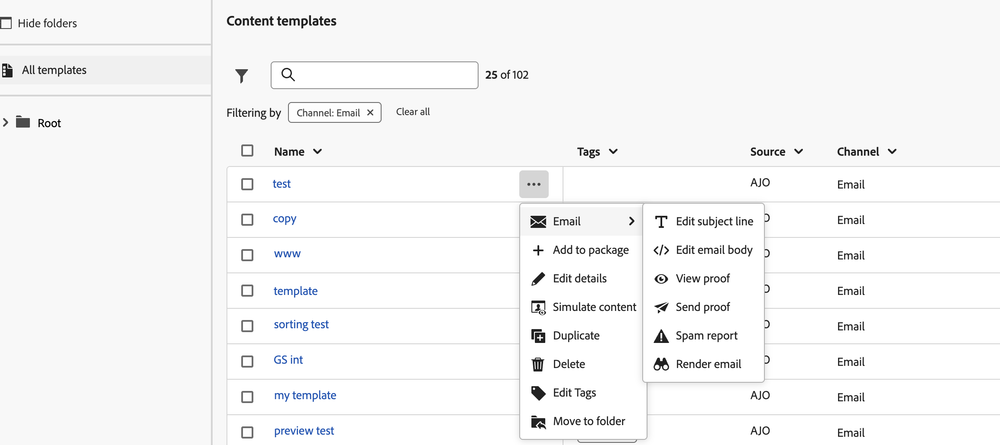

# Notas de versão {#release-notes}

>[!CONTEXTUALHELP]
>id="ajo_homepage_card1"
>title="Novidades"
>abstract="O **Adobe Journey Optimizer** oferece continuamente novos recursos, melhorias nos recursos existentes e correções de erros. Na última semana de cada mês, todas as alterações são consolidadas nessas notas de versão."

O [!DNL Adobe Journey Optimizer] segue um modelo de entrega contínua, permitindo que a Adobe forneça novos recursos, melhorias e correções de forma contínua. Essa abordagem permite uma implantação escalável e em fases de recursos para garantir desempenho e estabilidade em todos os ambientes. Devido a esse modelo, as notas de versão são atualizadas entre as versões mensais. Para obter detalhes completos sobre o ciclo de lançamento e as fases de disponibilidade, consulte o [ciclo de lançamento do Journey Optimizer](releases.md).

O [!DNL Adobe Journey Optimizer] é construído nativamente na [!DNL Adobe Experience Platform] e herda suas mais recentes inovações e melhorias. Saiba mais sobre essas alterações nas [Notas de versão da Adobe Experience Platform](https://experienceleague.adobe.com/docs/experience-platform/release-notes/latest.html?lang=pt-BR){target="_blank"}.

>[!NOTE]
>
>Os recursos listados nestas notas de versão incluem uma **Data de disponibilidade** indicando quando cada alteração se torna acessível no ambiente. As entradas nos acordeões **Em breve** são esperadas nos próximos dias ou semanas. As informações nessas seções estão sujeitas a alterações.

## Notas de versão de julho de 2026 {#july-26-updates}

### Desafios de fidelidade {#july-26-loyalty}

A Journey Optimizer apresenta os desafios de fidelidade, um novo recurso nesta versão.

<table>
<thead>
<tr>
<th><strong>Desafios de fidelidade</strong> </th>
</tr>
</thead>
<tbody>
<tr>
<td>

Os desafios de fidelidade transformam iniciativas de fidelidade em experiências envolventes e gamificadas que motivam os clientes a realizar ações valiosas, como fazer compras, escrever comentários ou qualquer comportamento desejado.

Os administradores podem usar o menu Admin de fidelidade para conectar o Journey Optimizer ao seu ecossistema de fidelidade, incluindo APIs de atendimento de recompensa, definições de eventos, inventário de produtos, exclusões e configurações de identidade. Em seguida, os profissionais de marketing podem projetar desafios padrão, sequenciais ou em sequência, definir tarefas e recompensas, fornecer cartões de conteúdo e mensagens de marca e monitorar o desempenho com painéis de relatórios alimentados por IA. A Journey Optimizer gera as jornadas que organizam cada desafio em segundo plano, para que as equipes possam se concentrar na experiência do cliente e nas metas de negócios.

A fidelização também apresenta habilidades de colegas de trabalho que permitem que as equipes executem operações de desafio principais com mais eficiência, incluindo a criação de desafios, a definição de propriedades de desafio, o gerenciamento de públicos-alvo e configurações relacionadas e a análise de insights para monitorar a participação de desafios e o desempenho de recompensas.

Esse recurso só está disponível para organizações licenciadas para o Journey Optimizer Loyalty. Para obter acesso, entre em contato com um representante da Adobe.

Para obter mais informações, consulte a <a href="../loyalty-challenges/get-started.md">documentação detalhada</a>.

 Data de disponibilidade: 28 de julho de 2026

</td>
</tr>
</tbody>
</table>

### Jornadas {#july-26-journeys}

Os recursos e melhorias a seguir foram adicionados às jornadas nesta versão.
<table>
<thead>
<tr>
<th><strong>Nova interface de usuário</strong> </th>
</tr>
</thead>
<tbody>
<tr>
<td>

Uma <b>nova interface de usuário</b> foi introduzida para a tela de jornada, oferecendo melhor desempenho para jornadas grandes, layout automático para melhorar a legibilidade e uma experiência de criação guiada.

Para alternar para a nova interface, clique no botão <b>Nova experiência</b>. Essa configuração é salva no nível da jornada, para que a jornada reabra na nova experiência por padrão. Para reverter, clique em <b>Experiência antiga</b>. <a href="../building-journeys/using-the-journey-designer.md#canvas-capabilities">Saiba mais</a>.

 Data de disponibilidade: 16 de julho de 2026

</td>
</tr>
</tbody>
</table>

* [!BADGE Descontinuação]{type=Negative} Públicos-alvo em lote não são mais compatíveis com o nó Qualificação de público-alvo - A partir de 3 de agosto de 2026, a Journey Optimizer bloqueará a publicação de qualquer jornada usando um público-alvo em lote em um nó Qualificação de público-alvo. Essa imposição substitui o aviso de tela introduzido na versão de junho. As jornadas ativas existentes não são afetadas. Use um público-alvo de transmissão no nó Qualificação do público-alvo ou alterne para uma atividade Ler público-alvo. [Saiba como migrar suas jornadas](../building-journeys/aq-batch-audiences-migration.md)

### Campanhas orquestradas {#july-26-oc}

Os recursos e melhorias a seguir estão chegando às campanhas orquestradas nesta versão.

<table>
<thead>
<tr>
<th><strong>Segmentação baseada em arquivo em campanhas orquestradas</strong> </th>
</tr>
</thead>
<tbody>
<tr>
<td>

As campanhas orquestradas agora permitem carregar um <strong>arquivo CSV ou TXT</strong> diretamente na tela da campanha como público alvo, sem primeiro assimilar o arquivo na Adobe Experience Platform. Os dados do arquivo são consumidos no tempo de execução e não são mantidos como um conjunto de dados do Adobe Experience Platform. Durante a configuração do arquivo, você pode definir mapeamentos de coluna, tipos de dados, tratamento NULL e políticas de erro por coluna. As linhas que falharem na validação são rejeitadas e registradas antes da execução da campanha, mantendo o público-alvo limpo sem pré-processamento manual. Isso é particularmente adequado para envios ad hoc ou campanhas de lista de parceiros em que a criação de um pipeline de assimilação completo não é prática.

Para obter mais informações, consulte a <a href="../orchestrated/activities/load-file.md">documentação detalhada</a>.

 Data de disponibilidade: 6 de julho de 2026

</td>
</tr>
</tbody>
</table>

### Gerenciamento de conteúdo {#july-26-content}

Os seguintes recursos e melhorias foram adicionados ao gerenciamento de conteúdo nesta versão.

* **Atalhos de inicialização rápida no inventário Fragmentos** - Agora você pode acessar rapidamente ações comuns da lista Fragmentos usando o botão **[!UICONTROL Mais ações]**. Os atalhos disponíveis incluem editar o fragmento, abrir os detalhes e descartar a versão de rascunho. [Saiba mais](../content-management/manage-fragments.md#quick-launch-fragments)

  

* **Atalhos de inicialização rápida no inventário Modelos** - O botão **[!UICONTROL Mais ações]** da lista Modelos de Conteúdo agora fornece acesso rápido a ações comuns: editar detalhes do modelo, simular conteúdo e excluir um modelo. Para modelos de email, atalhos adicionais permitem editar a linha de assunto e o corpo do email, exibir ou enviar uma prova, executar um relatório de spam e renderizar o email. [Saiba mais](../content-management/access-content-templates.md#quick-launch-templates)

  

### Canal de email {#july-26-email}

As seguintes melhorias foram adicionadas ao canal de email nesta versão.

<table>
<thead>
<tr>
<th><strong>Otimização de canal</strong> </th>
</tr>
</thead>
<tbody>
<tr>
<td>

Agora você pode configurar uma jornada ou ação de campanha para incluir vários canais de saída (Email, Push, SMS) e permitir que o Journey Optimizer forneça automaticamente por meio do melhor canal para cada cliente. Três modos de otimização estão disponíveis:

<ul>
<li>Classificação manual: especifique a ordem de canal de sua preferência.</li>
<li>Preferência do cliente: use o canal de preferência do cliente em seu perfil (atributo Consentimentos e preferências do modelo de dados de experiência).</li>
<li>Classificação baseada em modelo de IA: use pontuações de propensão de aprendizado de máquina para inferir o canal mais eficaz por cliente.</li>
</ul>

Quando o canal mais bem classificado estiver indisponível (não aceito, com limite de frequência ou não configurado), o sistema voltará para o próximo canal disponível.

Esse recurso está disponível apenas para um conjunto de organizações (disponibilidade limitada). Para obter acesso, entre em contato com um representante da Adobe.

Para obter mais informações, consulte a <a href="../building-journeys/channel-optimization.md">documentação detalhada</a>.

Data de disponibilidade: 22 de julho de 2026

</td>
</tr>
</tbody>
</table>

<table>
<thead>
<tr>
<th><strong>Verificação de conteúdo no Designer de email (disponibilidade geral)</strong> </th>
</tr>
</thead>
<tbody>
<tr>
<td>

O Journey Optimizer agora inclui validação técnica automatizada diretamente no Designer de email, ajudando a detectar problemas no HTML e no CSS antes do envio.

As verificações abrangem elementos incompatíveis, como tags <code>&lt;script&gt;</code> e <code>&lt;base&gt;</code>, divs em branco que podem quebrar o layout no Microsoft Outlook, tags HTML meta refresh e limites de tamanho de CSS ou HTML que causam falhas de renderização no Gmail.

Os resultados são exibidos como erros, avisos ou avisos informativos diretamente no painel de criação, com detalhes contextuais e correções com um clique, quando disponíveis, para que os problemas possam ser resolvidos sem sair do editor.

Anteriormente em Disponibilidade limitada, esse recurso agora está disponível para todos os clientes.

Para obter mais informações, consulte a <a href="../email/content-check.md">documentação detalhada</a>.

Data de disponibilidade: 16 de julho de 2026

</td>
</tr>
</tbody>
</table>

### Conteúdo e integrações {#july-26-integration}

Os seguintes recursos e melhorias estão chegando ao gerenciamento de conteúdo e às integrações nesta versão.

* **Atributos personalizados dinâmicos de itens de decisão** - Os atributos personalizados de itens de decisão agora podem ser personalizados no momento da entrega usando dados de perfil, contextuais e de público-alvo. Isso elimina a necessidade de manter ofertas duplicadas para pequenas variações de conteúdo, permitindo que os profissionais de marketing gerenciem menos itens de decisão e mais flexíveis. [Leia mais](../experience-decisioning/items.md#attributes)

  Data de disponibilidade: 27 de julho de 2026

* **Novas ferramentas do servidor MCP do AJO** - O servidor MCP [!DNL Adobe Journey Optimizer] agora expõe cinco **ferramentas de configuração de canal** adicionais somente leitura, permitindo que você consulte configurações de canal, recursos de suporte e ações de marketing diretamente do seu assistente de IA. Agora você pode usar **Configurações de Canal de Lista** (em todos os canais da AJO), **Obter Configuração de Canal**, **Recursos de Configuração de Lista**, **Obter Recurso de Configuração** e **Ações de Marketing de Lista**. [Leia mais](../integrations/ajo-mcp.md#mcp-tools)

  Data de disponibilidade: 9 de julho de 2026

### Administração {#july-26-administration}

As seguintes melhorias foram adicionadas à administração e ao gerenciamento de dados nesta versão.

* **Medidas de proteção de TTL (Time-to-live) do conjunto de dados — sandboxes existentes** - A medida de proteção TTL (time-to-live) para conjuntos de dados gerados pelo sistema da Journey Optimizer (90 dias no repositório de perfis, 13 meses no data lake) será aplicada em **sandboxes e organizações de clientes existentes** a partir de **1 de outubro de 2026**. [Saiba mais](../data/datasets-ttl.md#ttl-guardrail)

