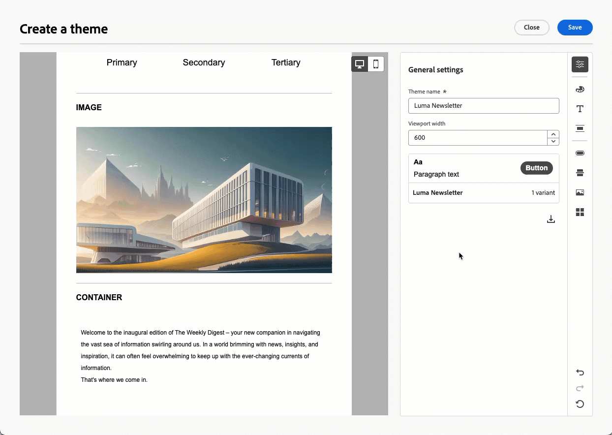

# Notas de versão {#release-notes}

>[!CONTEXTUALHELP]
>id="ajo_homepage_card1"
>title="Novidades?"
>abstract="O **Adobe Journey Optimizer** está sempre fornecendo novos recursos, melhorias para os recursos existentes e correções de erros. Na última semana de cada mês, todas as alterações são consolidadas nessas notas de versão."

O [!DNL Adobe Journey Optimizer] fornece continuamente novos recursos, melhorias para os recursos existentes e correções de erros. Na última semana de cada mês, todas as alterações são consolidadas nessas notas de versão. O [!DNL Adobe Journey Optimizer] é construído nativamente na [!DNL Adobe Experience Platform] e herda suas mais recentes inovações e melhorias. Saiba mais sobre essas alterações nas [Notas de versão da Adobe Experience Platform](https://experienceleague.adobe.com/docs/experience-platform/release-notes/latest.html?lang=pt-BR){target="_blank"}.

## Atualizações de maio de 2025 {#25-5-rn}

* **Temas no Designer de email (Beta)** - Data de disponibilidade: 14 de maio de 2025

  Agora é possível aplicar rapidamente os temas de estilo pré-aprovados ao seu conteúdo de email para garantir a consistência da marca em todos os emails, acelerar o processo de criação de campanha e produzir emails de alta qualidade de forma independente e, ao mesmo tempo, reduzir a dependência das equipes de design. [Leia mais](../email/apply-email-themes.md)

  >[!AVAILABILITY]
  >
  >No momento, esse recurso está na versão beta, disponível apenas para clientes beta. Para participar do programa beta, entre em contato com seu representante da Adobe.

  

* **Decisão - Novo construtor de fórmulas de IA** - Data de disponibilidade: 14 de maio de 2025

  Agora é possível criar fórmulas de classificação específicas no serviço de decisão por definir e combinar critérios na nova interface aprimorada. Em vez de depender apenas de uma prioridade de oferta estática, você pode definir fórmulas de classificação personalizadas que combinam pontuações do modelo de IA, prioridades de oferta, atributos de perfil, atributos de oferta e sinais contextuais por meio de uma interface guiada. [Leia mais](../experience-decisioning/exd-ranking-formulas.md)

  

* **Pastas para páginas de destino** - Data de disponibilidade: sábado, 9 de maio de 2025

  Para gerenciar facilmente suas páginas de aterrissagem, agora é possível usar pastas para organizá-las com mais eficiência em uma hierarquia simplificada.  [Leia mais](../landing-pages/manage-lp.md)

* **Ativação de pílulas para personalização** - Data de disponibilidade: 5 de maio de 2025

  Um novo botão &quot;Comprimidos&quot; foi adicionado ao editor de personalização. Quando ativados, o perfil e os atributos contextuais são exibidos como pílulas, melhorando a legibilidade do seu código. [Leia mais](../personalization/personalization-build-expressions.md#options)

  >[!AVAILABILITY]
  >
  >Esse recurso será gradualmente implantado em todos os ambientes nos próximos 30 dias.

## Notas de versão de abril de 2025 {#25-4-rn}

**Data de lançamento**: 29-30 de abril de 2025

### Novos recursos {#25-04-features}

Os novos recursos que acompanham esta versão estão listados abaixo.

<table>
<thead>
<tr>
<th><strong>Editor de personalização — Aprenda fazendo</strong> </th>
</tr>
</thead>
<tbody>
<tr>
<td>

Um playground de personalização agora está disponível, onde é possível experimentar expressões de personalização. Ele permite explorar modelos de amostra e conteúdos para ajudar a iniciar e testar suas próprias expressões de personalização.

Para obter mais informações, consulte a <a href="../personalization/personalize.md#playground">documentação detalhada</a>.

Data de disponibilidade: 24 de abril de 2025

</td>
</tr>
</tbody>
</table>

<!--table>
<thead>
<tr>
<th><strong>Adobe Experience Manager as a Cloud Service integration</strong> </th>
</tr>
</thead>
<tbody>
<tr>
<td>

The integration between Adobe Journey Optimizer and Adobe Experience Manager as a Cloud Service is now released in General Availability (GA). This integration enables seamless content sourcing and management for personalized customer journeys.

For more information, refer to the <a href="../integrations/aem-templates.md">detailed documentation</a>.

</td>
</tr>
</tbody>
</table-->

<!--<table>
<thead>
<tr>
<th><strong>Simulate content variations (General Availability)</strong> </th>
</tr>
</thead>
<tbody>
<tr>
<td>

Previously available in beta, content variations simulation is now generally available (GA). It allows you to preview different variations of your content using sample input data uploaded from a CSV or JSON file or added manually. All the attributes used in your content for personalization are automatically detected by the system and can be used for your tests to create multiple variants.

With the General Availability release, the feature now includes support for multilingual content and content experiments, enabling you to test variations across different languages and treatments. Additionally, it now supports contextual attributes (in addition to profile attributes), allowing for even more dynamic and situational content testing.

</td>
</tr>
</tbody>
</table>-->

<table>
<thead>
<tr>
<th><strong>Canal LINE </strong> </th>
</tr>
</thead>
<tbody>
<tr>
<td>

O Adobe Journey Optimizer expandiu seus recursos entre canais para incluir suporte para o canal LINE. Esse aprimoramento permite criar, editar e visualizar experiências LINE, garantindo interações mais personalizadas e envolventes. Com o LINE, você pode se conectar com mais clientes, enviar conteúdo relevante e melhorar seu engajamento.

O canal LINE é ativado para clientes do Adobe Journey Optimizer mediante solicitação. Entre em contato com o Atendimento ao cliente da Adobe ou com seu representante da Adobe para ativar o recurso para sua organização.

Para obter mais informações, consulte a <a href="../line/get-started-line.md">documentação detalhada</a>.
</td>
</tr>
</tbody>
</table>

<!--table>
<thead>
<tr>
<th><strong>Custom SMS provider (General Availability)</strong> </th>
</tr>
</thead>
<tbody>
<tr>
<td>

Adobe Journey Optimizer now supports custom SMS providers, allowing you to integrate your preferred SMS services for enhanced communication flexibility.

For more information, refer to the <a href="../sms/sms-configuration-custom.md">detailed documentation</a>.
</td>
</tr>
</tbody>
</table-->

<table>
<thead>
<tr>
<th><strong>Métricas de jornada</strong> </th>
</tr>
</thead>
<tbody>
<tr>
<td>

As métricas de jornada agora estão disponíveis, permitindo medir o impacto de suas atividades nas métricas principais do seu negócio e fornecer insights mais claros sobre seu desempenho.

 

Para obter mais informações, consulte a <a href="../building-journeys/success-metrics.md">documentação detalhada</a>.

Data de disponibilidade: 9 de abril de 2025

</td>
</tr>
</tbody>
</table>

<!--<table>
<thead>
<tr>
<th><strong>Calendar view for campaign and journey inventory (Limited Availability)</strong> </th>
</tr>
</thead>
<tbody>
<tr>
<td>

A new calendar view is now available for campaigns and journey activations. This feature provides a visual representation of scheduled activities, allowing you to view and manage your campaigns and journeys more effectively. Selecting a calendar item opens a right rail with detailed information. This feature is currently in Limited Availability.

</td>
</tr>
</tbody>
</table>-->

<table>
<thead>
<tr>
<th><strong>Integração do Adobe Express (disponibilidade limitada)</strong> </th>
</tr>
</thead>
<tbody>
<tr>
<td>

O Adobe Journey Optimizer agora se integra ao Adobe Express, permitindo conectar facilmente ativos criativos à orquestração de jornada. Essa integração simplifica o processo de criação e implantação de conteúdo personalizado em campanhas. 

No momento, essa integração não está disponível para uso com o Healthcare Shield ou o Privacy and Security Shield.

Para obter mais informações, consulte a <a href="../integrations/express.md">documentação detalhada</a>.

</td>
</tr>
</tbody>
</table>

<table>
<thead>
<tr>
<th><strong>Acionar execuções diárias de jornada após a conclusão da segmentação em lote (disponibilidade limitada)</strong> </th>
</tr>
</thead>
<tbody>
<tr>
<td>

Para jornadas agendadas diariamente, uma nova opção permite definir uma janela de tempo de até 6 horas de espera para dados de público-alvo de trabalhos de segmentação em lote, garantindo que as jornadas sejam executadas com os dados mais atualizados ou sejam ignoradas, se não estiverem prontas. A opção “Acionar após a avaliação de público-alvo em lote” está disponível apenas para algumas organizações (disponibilidade limitada). Para obter acesso, entre em contato com o(a) representante da Adobe.

Para obter mais informações, consulte a <a href="../building-journeys/read-audience.md#schedule">documentação detalhada</a>.

</td>
</tr>
</tbody>
</table>

<!--table>
<thead>
<tr>
<th><strong>Themes in the Email Designer (Beta)</strong> </th>
</tr>
</thead>
<tbody>
<tr>
<td>

You can now quickly apply pre-approved styling themes to your email content to ensure brand consistency across all emails, speed up your campaign creation process and independently produce hight-quality emails while reducing dependency on design teams.

This capability is currently in beta version and only available to beta customers. To join the beta program, contact your Adobe representative.

For more information, refer to the <a href="../content-management/brands-score.md">detailed documentation</a>.

Availability date: May 5, 2025

</td>
</tr>
</tbody>
</table-->

<table>
<thead>
<tr>
<th><strong>Pontuação de alinhamento à marca (Beta)</strong> </th>
</tr>
</thead>
<tbody>
<tr>
<td>

O recurso de pontuação de alinhamento da marca oferece feedback claro diretamente no designer de email, ajudando você a ver se o conteúdo está alinhado ao tom, estilo e diretrizes da sua marca. Esse recurso está disponível no Beta.

Para obter mais informações, consulte a <a href="../content-management/brands-score.md">documentação detalhada</a>.

</td>
</tr>
</tbody>
</table>

<!--
<table>
<thead>
<tr>
<th><strong>Decisioning - New AI formula builder</strong> </th>
</tr>
</thead>
<tbody>
<tr>
<td>

You can now create specific Decisioning ranking formulas by defining and combining criteria from a new improved interface. Ranking formulas allow you to define rules that will determine which decision items should be presented first, rather than taking into account the priority scores.

For more information, refer to the <a href="../content-management/brands-score.md">detailed documentation</a>.

Availability date: May 5, 2025

</td>
</tr>
</tbody>
</table>
-->

### Melhorias {#25-04-improv}

**API de visualização de campanhas**

Novas APIs estão disponíveis para visualizar campanhas, além dos recursos existentes de envio de prova. [Leia mais](https://developer.adobe.com/journey-optimizer-apis/references/simulations/#operation/createCampaignPreview){target="_blank"}.

**Ferramentas de sandbox**

<!--- **Decisioning sandbox copy**

  Decisioning objects can now be copied between sandboxes, streamlining testing and deployment workflows.-->

* **Ferramentas de sandbox para ações personalizadas**

  As ações personalizadas agora estão incluídas na lista de objetos do Adobe Journey Optimizer que podem ser copiados usando o recurso de ferramentas de sandbox, simplificando o teste e a implantação. [Leia mais](../configuration/copy-objects-to-sandbox.md)

* **Ferramentas de sandbox para campanhas** — Data de disponibilidade: 3 de abril de 2025

  Agora é possível copiar campanhas em várias sandboxes usando recursos de exportação e importação de pacotes. As campanhas são copiadas junto com todos os itens relacionados ao perfil, público-alvo, esquema, mensagens em linha e objetos dependentes. Alguns itens não são copiados, como itens de decisão, rótulos de uso de dados e configurações de idioma. [Leia mais](../configuration/copy-objects-to-sandbox.md#custom-actions)

**Personalização**

* **Novo atributo contextual**

  Um novo atributo contextual, **ID do perfil da mensagem**, agora está disponível para seleção no editor de personalização. Este é um atributo orientado por mensagem que identifica exclusivamente cada mensagem enviada para cada perfil direcionado em uma entrega. É possível usar esse identificador exclusivo, por exemplo, como um parâmetro de rastreamento de URL para distinguir cada link aberto ou clicado pelos destinatários.

* **Atributos preenchidos no painel de atributos** — Data de disponibilidade: 2 de abril de 2025

  Por padrão, o painel de atributos no editor de personalização agora mostra apenas atributos preenchidos. Para exibir todos os atributos, use o botão de configurações para desativar a opção **[!UICONTROL Mostrar apenas atributos preenchidos]**. [Leia mais](../personalization/personalization-build-expressions.md)

**Canal de email**

* **Rastreamento personalizado de URL** - Data de disponibilidade: 30 de abril de 2025

  Para aumentar a flexibilidade e o controle sobre suas configurações de email, agora é possível personalizar todos os parâmetros de rastreamento de URL de uma só vez no nível de configuração do canal de email, em vez de fazer isso no Designer de email para cada link no seu conteúdo. [Leia mais](../email/surface-personalization.md#personalize-url-tracking)

* **Designer de email** - Data de disponibilidade: 1º de abril de 2025

  Para melhorar a acessibilidade no Journey Optimizer, agora há dois novos campos disponíveis no Designer de email, os quais correspondem ao elemento `<title>` e ao atributo `lang` no elemento `<html>` do conteúdo do email. Além dessas configurações, é possível definir o campo **[!UICONTROL Pré-cabeçalho]** na seção **[!UICONTROL Corpo]** do email. [Leia mais](../email/email-metadata.md)

**Livros de reprodução do caso de uso**

* **Criação e compartilhamento de manuais (Beta)** - Agora você pode criar, gerenciar e compartilhar seus próprios manuais de casos de uso. No momento, esse recurso está disponível para todos os clientes como um beta público. [Leia mais](../start/playbooks.md)

**Navegação**

* **Gerenciamento de conteúdo** - Data de disponibilidade: 2 de abril de 2025

  Para gerenciar facilmente seus modelos e fragmentos de conteúdo, agora é possível usar pastas para organizá-los de forma mais eficaz em uma hierarquia estruturada. Saiba mais nas seções [Modelos de conteúdo](../content-management/access-content-templates.md#folders) e [Fragmentos](../content-management/manage-fragments.md#folders).

  >[!AVAILABILITY]
  >
  >Esta melhoria está disponível apenas para um conjunto de organizações (disponibilidade limitada).

<!--- **Folders for content templates and fragments** - Availability date: May 5, 2025

  Previously available for a set of organizations (LA), folders are now available to all users (GA) to manage their content templates and fragments. Folders let you organize your content templates and fragments more easily and effectively into a structured hierarchy.

<!--- **Right rail in campaigns list**  

  A right rail has been added to the campaigns list, providing detailed information when a campaign is selected.-->

<!--**Playbooks**

- **Create your own playbooks (Beta)**
  
  You can now create your own playbooks in Adobe Journey Optimizer, enabling greater customization and flexibility in journey planning.-->

