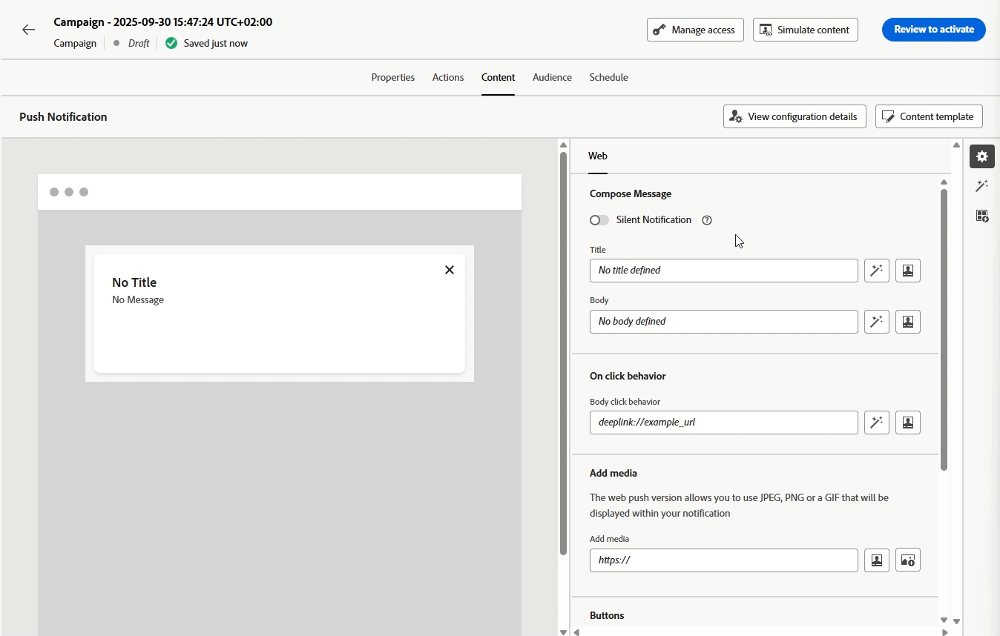

# Notas de versão {#release-notes}

>[!CONTEXTUALHELP]
>id="ajo_homepage_card1"
>title="Novidades"
>abstract="O **Adobe Journey Optimizer** está sempre fornecendo novos recursos, melhorias para os recursos existentes e correções de erros. Na última semana de cada mês, todas as alterações são consolidadas nessas notas de versão."

O [!DNL Adobe Journey Optimizer] segue um modelo de entrega contínua, permitindo que a Adobe forneça novos recursos, melhorias e correções também de forma contínua. Essa abordagem permite uma implantação escalável e em fases de recursos para garantir desempenho e estabilidade em todos os ambientes.

Devido a esse modelo, as notas de versão são atualizadas entre as versões mensais. Para obter detalhes completos sobre o ciclo de lançamento e as fases de disponibilidade, consulte o [ciclo de lançamento do Journey Optimizer](releases.md).

O [!DNL Adobe Journey Optimizer] é construído nativamente na [!DNL Adobe Experience Platform] e herda suas mais recentes inovações e melhorias. Saiba mais sobre essas alterações nas [Notas de versão da Adobe Experience Platform](https://experienceleague.adobe.com/docs/experience-platform/release-notes/latest.html?lang=pt-BR){target="_blank"}.

## Notas de pré-lançamento de 26 de fevereiro {#feb-26-01-rn}

**As notas de pré-lançamento abaixo estão sujeitas a alterações sem aviso prévio até a data de disponibilidade da versão**. Links, telas e a documentação atualizada são publicados nas notas de versão na data de lançamento.

Consulte também as [Notas de pré-lançamento da Adobe Experience Platform](https://experienceleague.adobe.com/pt-br/docs/experience-platform/release-notes/pre-release-notes){target="_blank"}.

**Data de lançamento**: 17 a 18 de fevereiro de 2026

### Novos recursos {#feb-26-01-features}

<table>
<thead>
<tr>
<th><strong>Envio de onda de mensagens de saída</strong> </th>
</tr>
</thead>
<tbody>
<tr>
<td>

Você pode agendar mensagens de saída de <strong>campanhas</strong> ou <strong>jornadas</strong> para serem entregues em <strong>lotes</strong> controlados ao longo do tempo.

O Wave sending oferece os seguintes benefícios:

<ul>
<li>Melhor <strong>entregabilidade</strong> - O Spread envia ao longo do tempo para ajudar a manter uma sólida reputação do remetente e reduzir o risco de ser sinalizado como spam.</li>
<li><strong>Controle de carga</strong> - Evite sobrecarregar os sistemas downstream (por exemplo, centrais de atendimento, páginas de aterrissagem) limitando quantas mensagens saem de uma vez.</li>
<li>Casos de uso de alto volume e sensíveis ao tempo — adequados a grandes públicos ou quando é necessário controlar o tempo (por exemplo, capacidade da central de atendimento, aumento ou ofertas vinculadas ao tempo).</li>
</ul>
</td>
</tr>
</tbody>
</table>

<table>
<thead>
<tr>
<th><strong>Arbitragem de jornada</strong> </th>
</tr>
</thead>
<tbody>
<tr>
<td>

Agora você pode usar <strong>fórmulas</strong> e <strong>modelos de IA</strong> para aumentar automaticamente as pontuações de prioridade de jornada com base nos atributos do perfil do cliente e em fatores contextuais, garantindo que os clientes insiram as jornadas mais relevantes.

Este recurso só está disponível para um conjunto de organizações (<strong>Disponibilidade Limitada</strong>). Para obter acesso, entre em contato com um representante da Adobe.

</td>
</tr>
</tbody>
</table>

<table>
<thead>
<tr>
<th><strong>Journey Agent: criação de conteúdo do canal</strong> </th>
</tr>
</thead>
<tbody>
<tr>
<td>

Com a tecnologia <strong>Adobe Experience Platform Agent Orchestrator</strong>, o <strong>Journey Agent</strong> está disponível no Journey Optimizer e permite que você analise jornadas por meio de uma interface de linguagem natural. Agora você também pode gerar e gerenciar conteúdo específico de canal diretamente no Journey Agent, criando conteúdo para canais como email e push, aplicando e visualizando modelos, refinando o tom e o estilo por meio de prompts e abrindo conteúdo no <strong>Content Designer</strong> para edição em contexto.

</td>
</tr>
</tbody>
</table>

<!--
<table>
<thead>
<tr>
<th><strong>Mobile Live Activities</strong> </th>
</tr>
</thead>
<tbody>
<tr>
<td>

<strong>Live Activities</strong> provide real-time updates and interactive experiences within mobile apps, allowing users to stay informed about ongoing events or tasks directly on their device's screen. This feature enhances engagement by delivering live information, such as progress tracking, event updates, or interactive content, without requiring users to open the app.

Previously released in beta, this capability is now available to all environments (General Availability).

</td>
</tr>
</tbody>
</table>
-->

<table>
<thead>
<tr>
<th><strong>Atividade de ação em jornadas</strong> </th>
</tr>
</thead>
<tbody>
<tr>
<td>

O Journey Optimizer oferece suporte a uma nova <strong>Atividade de ação</strong> genérica que permite configurar ações únicas e grupos de ação de entrada de várias ações, permitindo uma configuração de ação simplificada na tela de jornada. Em especial, este novo recurso permite:

<ul>
<li>Uma configuração de ação nativa simplificada na tela da jornada.</li>
<li>A capacidade de criar grupos de ação de entrada multiação.</li>
<li>A capacidade de adicionar <strong>otimização</strong> a qualquer ação de canal interna.</li>
<li>A capacidade de adicionar opções de <strong>experimentação</strong> e <strong>multilíngues</strong> a qualquer ação.</li>
</ul>

Anteriormente lançado em disponibilidade limitada, este recurso já está disponível para todos os ambientes (disponibilidade geral).

</td>
</tr>
</tbody>
</table>

<table>
<thead>
<tr>
<th><strong>Canal de notificações por push na web</strong> </th>
</tr>
</thead>
<tbody>
<tr>
<td>

O Adobe Journey Optimizer agora é compatível com <strong>Notificações por push na web</strong>, expandindo o canal de push para além dos dispositivos móveis. Você pode enviar notificações facilmente para navegadores móveis e de desktop, permitindo alcançar clientes diretamente em seus dispositivos sem precisar de um aplicativo. Esse aprimoramento permite interagir com os usuários com mensagens personalizadas e oportunas em tempo real, aproveitando os mesmos fluxos de trabalho de criação e recursos de direcionamento já disponíveis para notificações por push em dispositivos móveis.

Anteriormente lançado na versão beta, esse recurso agora está disponível para todos os ambientes (Disponibilidade geral).

Data de disponibilidade: sábado, 13 de fevereiro de 2026

</td>
</tr>
</tbody>
</table>

<table>
<thead>
<tr>
<th><strong>Canal de notificações por push na web</strong> </th>
</tr>
</thead>
<tbody>
<tr>
<td>

O Adobe Journey Optimizer agora oferece suporte a <strong>Notificações por push na web</strong>, expandindo o canal de push para além dos dispositivos móveis. Você pode enviar notificações perfeitamente para <strong>navegadores móveis e de desktop</strong>, permitindo que você alcance os clientes diretamente em seus dispositivos sem precisar de um aplicativo. Esse aprimoramento permite interagir com os usuários com mensagens personalizadas e oportunas em tempo real, aproveitando os mesmos fluxos de trabalho de criação e recursos de direcionamento já disponíveis para notificações por push em dispositivos móveis.

Anteriormente lançado no Beta, esse recurso estará disponível para todos os ambientes (Disponibilidade geral).

Para obter mais informações, consulte a <a href="../push/push-configuration-web.md">documentação detalhada</a>.

Data de disponibilidade: quinta-feira, 11 de fevereiro de 2026

</td>
</tr>
</tbody>
</table>

<table>
<thead>
<tr>
<th><strong>Atividade de decisão de conteúdo</strong> </th>
</tr>
</thead>
<tbody>
<tr>
<td>

Uma nova <strong>Atividade de decisão de conteúdo</strong> está disponível na tela de jornada para integrar ofertas personalizadas diretamente às jornadas do cliente. Essa atividade permite fornecer conteúdo baseado em decisão e fazer referência a essas ofertas em toda a jornada, em condições para criar ramificações baseadas em elegibilidade, em ações personalizadas para transmitir dados de oferta a sistemas externos e em outras atividades para criar experiências do cliente totalmente personalizadas.

Anteriormente lançado em disponibilidade limitada, este recurso já está disponível para todos os ambientes (disponibilidade geral).

Para obter mais informações, consulte a <a href="../building-journeys/content-decision.md">documentação detalhada</a>.

Data de disponibilidade: quinta-feira, 11 de fevereiro de 2026

</td>
</tr>
</tbody>
</table>

<table>
<thead>
<tr>
<th><strong>APIs de ferramentas de migração de autoatendimento</strong> </th>
</tr>
</thead>
<tbody>
<tr>
<td>

<strong>As APIs de ferramentas de migração</strong> agora estão disponíveis para migrar programaticamente entidades do <strong>Gerenciamento de decisão</strong> para a <strong>Decisão</strong>, apresentando:

<ul>
<li>Escopos de migração flexíveis (<strong>sandbox</strong>, <strong>oferta</strong> ou nível <strong>decisão</strong>)</li>
<li><strong>análise de dependência</strong> e validação automatizadas</li>
<li><strong>Suporte de reversão</strong> para migrações concluídas</li>
<li>Relatórios de migração detalhados com mapeamentos de objeto</li>
</ul>

Para obter mais informações, consulte a <a href="../experience-decisioning/decisioning-migration-api.md">documentação detalhada</a>.

Data de disponibilidade: 3 de fevereiro de 2026

</td>
</tr>
</tbody>
</table>

<table>
<thead>
<tr>
<th><strong>Monitoramento de ação personalizado</strong> </th>
</tr>
</thead>
<tbody>
<tr>
<td>

Insight Saiba mais sobre a integridade e o desempenho de seus <strong>pontos de extremidade de ação personalizados</strong> com um novo <strong>painel de monitoramento</strong> e <strong>dados de evento de etapa de jornada</strong> aprimorados. Monitore chamadas bem-sucedidas, erros, taxa de transferência, tempos de resposta e tempos de espera na fila para entender rapidamente quando, onde e por que ocorrem anomalias.

Anteriormente lançado em disponibilidade limitada, este recurso já está disponível para todos os ambientes (disponibilidade geral).

Para obter mais informações, consulte a <a href="../action/reporting.md">documentação detalhada</a>.

Data de disponibilidade: 3 de fevereiro de 2026

</td>
</tr>
</tbody>
</table>

<table>
<thead>
<tr>
<th><strong>Suporte à decisão no canal de SMS</strong> </th>
</tr>
</thead>
<tbody>
<tr>
<td>

Agora você pode personalizar e otimizar o conteúdo de suas <strong>mensagens SMS</strong> com a <strong>Decisão</strong>. Use as <strong>Pontuações de Prioridade</strong>, as <strong>Fórmulas</strong> ou os <strong>Modelos de IA</strong> para exibir o melhor conteúdo para seus clientes.

Para obter mais informações, consulte a <a href="../experience-decisioning/create-decision.md">documentação detalhada</a>.

Data de disponibilidade: 2 de fevereiro de 2026

</td>
</tr>
</tbody>
</table>

### Aprimoramentos {#feb-26-01-improv}

Os aprimoramentos incluídos nesta versão estão listados abaixo.

#### Configuração

* **Uso do evento de experiência em expressões de jornada** - A partir de 1º de abril de 2026, o uso de atributos de evento de experiência em expressões de jornada não será mais suportado para organizações que não usaram esse recurso nos últimos 90 dias. Esse recurso já está indisponível para novas organizações de clientes desde 8 de julho de 2025. Para obter alternativas, consulte [Pesquisa de evento de experiência no jornada](../building-journeys/exp-event-lookup.md).

* **Alternância do método de delegação de subdomínio** - Agora é possível alternar de um método de delegação de subdomínio para outro. Isso permite migrar domínios usando o modo de delegação CNAME para o método de delegação personalizado a fim de aderir às políticas de segurança da sua empresa.

  **Observação**: este recurso só está disponível para um conjunto de organizações (<strong>Disponibilidade Limitada</strong>). Para obter acesso, entre em contato com um representante da Adobe.

#### Designer de email

* **Usar um tema de marca para converter uma imagem em um modelo de email** - Ao converter uma imagem em um modelo de email no Journey Optimizer, agora é possível usar um tema como entrada para que o HTML gerado siga os parâmetros da sua marca. Estilos como cor de fundo, cor do botão, fontes, espaçamento entre linhas, margens e preenchimento são aplicados automaticamente, reduzindo o trabalho manual de design e fornecendo um modelo pronto para uso com edições mínimas.

* **Atualizar marcas com a nova guia de cores**: as diretrizes de marca ajudam a garantir que sua marca seja apresentada de forma consistente em todos os pontos de contato. A nova seção Cores define os padrões do sistema de cores da sua marca, descrevendo como as cores são selecionadas, organizadas e aplicadas em várias experiências. Ela garante o uso consistente de cores primárias, secundárias, de destaque e neutras para promover uma identidade de marca coesa, acessível e reconhecível.

#### IA

* **Integração de modelos personalizados de Firefly e modelos de geração de imagem de terceiros** - Habilite a integração perfeita de modelos padrão e personalizados de Firefly, juntamente com modelos de imagem de terceiros aprovados (por exemplo, NanoBanana), para oferecer maior flexibilidade, controle e alinhamento de marca ao gerar imagens. Isso permite selecionar o melhor modelo para cada caso de uso: Firefly padrão para necessidades gerais, Firefly personalizado para geração na marca ou modelos aprovados de terceiros para cenários especializados ou experimentais.

#### Escolha de experiências

* **Suporte de entrada do Edge para o uso de dados do Adobe Experience Platform no Decisioning** - O uso de dados do Adobe Experience Platform no Decisioning agora oferece suporte a casos de uso de entrada de borda, além de email e ações personalizadas no jornada.

  **Observação**: este recurso só está disponível para um conjunto de organizações (<strong>Disponibilidade Limitada</strong>). Para obter acesso, entre em contato com um representante da Adobe.

* **Visualização do Experience Decisioning no canal de experiência baseado em código** - Agora é possível visualizar itens de decisão ao configurar o Experience Decisioning com o canal de experiência baseado em código. A visualização está disponível diretamente na interface de criação antes de entrar em funcionamento.

* **Observação do modelo de IA de classificação de oferta** - o Journey Optimizer agora permite monitorar a integridade, o status do treinamento e o desempenho de seus modelos de IA no Decisioning. Assim, você pode verificar o sucesso do treinamento, solucionar problemas de falha e entender o impacto em seus resultados. Esse recurso está disponível somente para modelos de otimização personalizados (não para otimização automática).

* **Anexar fragmentos a itens de decisão** - O Journey Optimizer agora oferece a capacidade de anexar fragmentos a itens de decisão, que podem ser aproveitados em campanhas de experiência baseada em código por meio de políticas de decisão.

  **Observação**: anteriormente lançado com disponibilidade limitada, esse recurso agora está disponível para todos os ambientes (Disponibilidade geral).

  Data de disponibilidade: 12 de fevereiro de 2026.

#### Jornadas

* **Várias ações de entrada em jornadas**: para simplificar a orquestração de jornada, agora é possível definir várias ações de entrada em uma única jornada. Anteriormente disponível em campanhas, esse recurso permite que você forneça várias experiências baseadas em código, mensagens no aplicativo, cartões de conteúdo ou ações da Web a locais diferentes ao mesmo tempo, cada ação contendo conteúdo específico.

  **Observação**: anteriormente lançado com disponibilidade limitada, esse recurso agora está disponível para todos os ambientes (Disponibilidade geral).

* **Webhooks de SMS**: <strong>Webhooks</strong> agora são compatíveis com todos os provedores de SMS. Você pode configurar cada webhook com base na finalidade pretendida: <strong>webhooks de entrada</strong> para capturar mensagens de entrada e <strong>webhooks de comentários</strong> para receber confirmações de entrega, atualizações de status e outros eventos relacionados à mensagem. [Leia mais](../sms/sms-webhook.md)

  Data de disponibilidade: 2 de fevereiro de 2026.