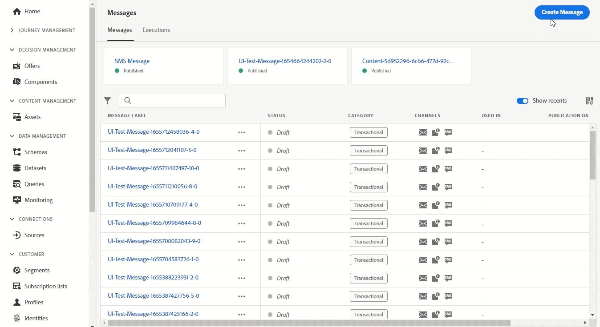

# Notas de versão {#release-notes}

Esta página lista todos os novos recursos e melhorias do [!DNL Journey Optimizer]. Também é possível consultar a página das [atualizações mais recentes da documentação](documentation-updates.md) para conhecer mais alterações.

O [!DNL Adobe Journey Optimizer] é construído nativamente na [!DNL Adobe Experience Platform] e herda suas mais recentes inovações e melhorias. Saiba mais sobre essas alterações nas [Notas de versão da Adobe Experience Platform](https://experienceleague.adobe.com/docs/experience-platform/release-notes/latest.html?lang=pt-BR){target=&quot;_blank&quot;}.

 Assine o [Informativo trimestral do Adobe Journey Optimizer](https://www.adobe.com/subscription/Adobe_Journey_Optimizer_NL.html){target=&quot;_blank&quot;} hoje e receba as últimas atualizações de produtos, histórias interessantes, casos de uso, dicas e muito mais, entregues diretamente à sua caixa de entrada a cada trimestre.

## Versão de junho de 2022 {#june-2022-release}

### Novos recursos

<table>
<thead>
<tr>
<th><strong>Enviar SMS para seus usuários (disponibilidade limitada)</strong> </th>
</tr>
</thead>
<tbody>
<tr>
<td>

Data de disponibilidade: <b>27 de junho</b>

Agora você pode criar, personalizar e enviar SMS no Journey Optimizer, por meio de uma integração com o <b>Sininho</b> ou <b>Twilio</b>.

No momento, o canal SMS está disponível apenas para um conjunto de organizações (Disponibilidade limitada). Para obter mais informações, entre em contato com o representante do Adobe.

Saiba como criar e enviar um SMS neste <a href="../messages/create-sms.md">documentação detalhada</a>.

</td>
</tr>
</tbody>
</table>

<table>
<thead>
<tr>
<th><strong>Encontre imagens mais impactantes mais rapidamente com a integração do Adobe Stock</strong> </th>
</tr>
</thead>
<tbody>
<tr>
<td>

Data de disponibilidade: <b>27 de junho</b>

O plug-in de integração Adobe Stock e Adobe Journey Optimizer Email Designer fornece aos clientes uma maneira fácil de navegar, licenciar e salvar imagens para uso na criação de mensagens.   O novo <b>Localizar fotos semelhantes do Stock</b> também permite localizar fotos de Estoque que corresponderão ao conteúdo, cor e composição de suas imagens. 

Para obter mais informações, consulte a <a href="../design/stock.md">documentação detalhada</a>.

</td>
</tr>
</tbody>
</table>

<table>
<thead>
<tr>
<th><strong>Usar Cco de email em todos os seus emails</strong> </th>
</tr>
</thead>
<tbody>
<tr>
<td>

Agora você pode usar o recurso Email Cco (cópia cega de carbono) para armazenar emails enviados pelo Adobe Journey Optimizer. Ative essa opção nas predefinições de email para que cada email enviado seja copiado para o CCO.

Para obter mais informações, consulte a <a href="../configuration/bcc-email.md">documentação detalhada</a>.

</td>
</tr>
</tbody>
</table>

<!--<table>
<thead>
<tr>
<th><strong>Automatically use the best performing offer in your decisions</strong> </th>
</tr>
</thead>
<tbody>
<tr>
<td>

You can now use personalized optimization model systems in Decision Management. This new type of model allows you to optimize and personalize offers based on segments and offer performance.

The use of personalized optimization AI models is currently restricted to selected users, and will be deployed to all environments in a future release.

For more information, refer to the <a href="../offers/ranking/personalized-optimization-model.md">detailed documentation</a>.

</td>
</tr>
</tbody>
</table>-->

<!--table>
<thead>
<tr>
<th><strong>Copy objects between sandboxes</strong> </th>
</tr>
</thead>
<tbody>
<tr>
<td>

You can now re-create the experiences from a Journey Optimizer sandbox to another, for example from a non-production sandbox to a production sandbox. This new capability copies an entire Journey, including any objects the Journey depends on to run correctly, from one environment to another. In addition to Journeys, you can also copy other components, such as Offers, Messages, Schemas, Datasets, Data Sources, Events, and Actions.

This feature is currently in beta version and only available to beta customers. To join the beta program, contact Adobe Customer Care.

For more information, refer to the <a href="../building-journeys/read-segment.md#configuring-segment-trigger-activity">detailed documentation</a>.
</td>
</tr>
</tbody>
</table-->

<!--table>
<thead>
<tr>
<th><strong>Dynamic Expression Builder</strong> </th>
</tr>
</thead>
<tbody>
<tr>
<td>

You can now create conditional content blocks across different authoring services to personalize your content. In addition to the Personalization Expression Library, the Expression Editor provides a new Conditional Rule Builder to help you design and save your content blocks.

For more information, refer to the <a href="../building-journeys/read-segment.md#configuring-segment-trigger-activity">detailed documentation</a>.
</td>
</tr>
</tbody>
</table-->

### Melhorias

**Gestão de decisões**

* **Suporte a arquivos HTML e JSON** - Agora é possível arrastar e soltar arquivos HTML e JSON externos da biblioteca do Adobe Experience Cloud Asset para o conteúdo de representação da oferta. [Saiba mais](../offers/offer-library/add-representations.md#html-json)

**Email**

* **Salvar como modelo** - Agora você pode salvar um conteúdo de email como modelo e reutilizá-lo ao criar outras mensagens. [Saiba mais](../design/email-templates.md)

<!--
**Journeys**

* **Ending a journey** - In the journey canvas, the **End** activity has been removed from the palette. End tags are now added by default at the end of each path and cannot be removed. This improvement allows better reporting of where a customer dropped out of the journey, without any action from the user.

-->

**Administração**

<!--* **Allowed list in the UI** - You can now use the Journey Optimizer user interface to add new email addresses or domains to the allowed list.-->

* **Visualizar parâmetros de URL de rastreamento** - Ao configurar uma predefinição de mensagem, se você definir parâmetros de rastreamento de URL, uma visualização dinâmica do URL de rastreamento resultante será exibida. [Saiba mais](../configuration/email-settings.md#url-tracking)

<!--* **Personalize tracking URL parameters** - You can now use the Expression Editor to configure URL tracking parameters in your message presets. [Learn more](../configuration/email-settings.md#url-tracking)-->

<!--
**Reporting**

* **Performance measurement** - A new **Reporting** tab is now available in the Administration > Configurations menu to set up reporting data sources.
-->
