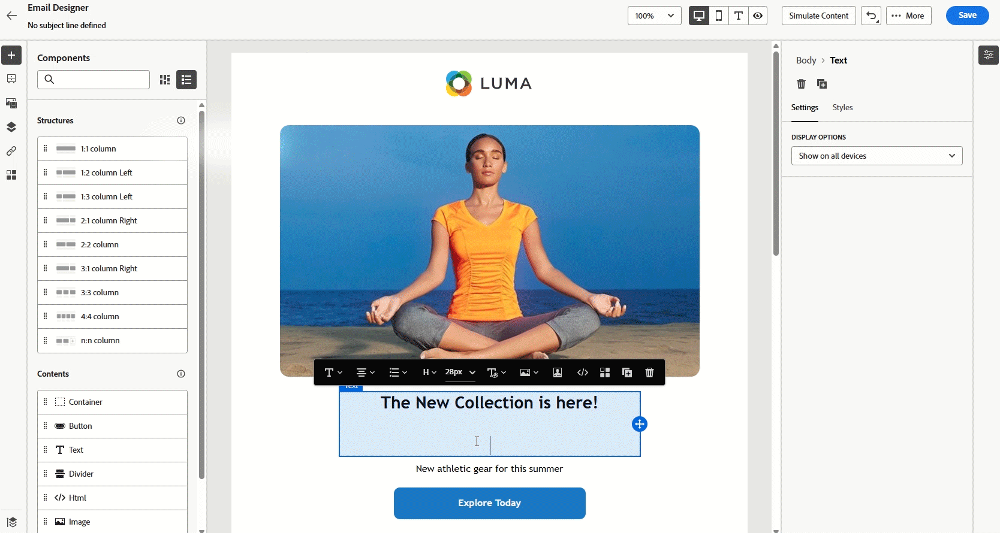

# Notas de versão {#release-notes}

>[!CONTEXTUALHELP]
>id="ajo_homepage_card1"
>title="Novidades?"
>abstract="O **Adobe Journey Optimizer** está sempre fornecendo novos recursos, melhorias para os recursos existentes e correções de erros. Na última semana de cada mês, todas as alterações são consolidadas nessas notas de versão."

O [!DNL Adobe Journey Optimizer] fornece continuamente novos recursos, melhorias para os recursos existentes e correções de erros. Na última semana de cada mês, todas as alterações são consolidadas nessas notas de versão. O [!DNL Adobe Journey Optimizer] é construído nativamente na [!DNL Adobe Experience Platform] e herda suas mais recentes inovações e melhorias. Saiba mais sobre essas alterações nas [Notas de versão da Adobe Experience Platform](https://experienceleague.adobe.com/docs/experience-platform/release-notes/latest.html?lang=pt-BR){target="_blank"}.

## Notas de versão de maio de 2025 {#25-5-rn}

**Data de lançamento**: 20 a 21 de maio de 2025

### Novos recursos {#25-05-features}

Os novos recursos incluídos nesta versão são detalhados abaixo.

<table>
<thead>
<tr>
<th><strong>Temas no Designer de email</strong> </th>
</tr>
</thead>
<tbody>
<tr>
<td>

Agora é possível aplicar rapidamente temas pré-aprovados para garantir a consistência da marca em todos os emails, acelerar o processo de criação de campanha e produzir emails de alta qualidade de maneira independente, reduzindo a dependência de equipes de design.

No momento, esse recurso está na versão beta, disponível apenas para clientes beta. Para participar do programa beta, entre em contato com seu representante da Adobe.

Para obter mais informações, consulte a <a href="../email/apply-email-themes.md">documentação detalhada</a>.

Data de disponibilidade: quinta-feira, 14 de maio de 2025

</td>
</tr>
</tbody>
</table>

<table>
<thead>
<tr>
<th><strong>Decisão - Novo construtor de fórmulas de IA</strong> </th>
</tr>
</thead>
<tbody>
<tr>
<td>

Agora é possível criar fórmulas de classificação específicas no serviço de decisão por definir e combinar critérios na nova interface aprimorada. Em vez de depender apenas de uma prioridade de oferta estática, você pode definir fórmulas de classificação personalizadas que combinam pontuações do modelo de IA, prioridades de oferta, atributos de perfil, atributos de oferta e sinais contextuais por meio de uma interface guiada.

Para obter mais informações, consulte a <a href="../experience-decisioning/exd-ranking-formulas.md">documentação detalhada</a>.

Data de disponibilidade: quinta-feira, 14 de maio de 2025

</td>
</tr>
</tbody>
</table>

<table>
<thead>
<tr>
<th><strong>Sincronizar a programação de público-alvo de leitura com o trabalho de segmentação em lote</strong> </th>
</tr>
</thead>
<tbody>
<tr>
<td>

Agora é possível acionar execuções diárias de jornada após a conclusão da segmentação em lote. Essa opção agora está disponível em jornadas programadas diariamente para todos os clientes. Ele permite definir um período de até 6 horas para aguardar os dados do público-alvo de trabalhos de segmentação em lote, garantindo que as jornadas sejam executadas com os dados mais atualizados ou ignoradas, se não estiverem prontas.

Anteriormente lançado com disponibilidade limitada, esse recurso agora está disponível para todos os ambientes (disponibilidade geral).

Para obter mais informações, consulte a <a href="../building-journeys/read-audience.md#schedule">documentação detalhada</a>.

</td>
</tr>
</tbody>
</table>

<!--table>
<thead>
<tr>
<th><strong>Adobe Experience Manager Content fragment integration</strong> </th>
</tr>
</thead>
<tbody>
<tr>
<td>

With the integration of Adobe Experience Manager and Adobe Journey Optimizer, you can now effortlessly use Adobe Experience Manager Content Fragments within your Journey Optimizer content. This seamless connection makes it easier to access and use your AEM content directly in Journey Optimizer.

Previously available for a limited set of organizations (LA), this capability is now GA with the following enhancements:

<ul>
<li>Create offers by directly selecting an AEM Content Fragment.</li>
<li>Define placeholders and map personalization values within the fragment signature using the Editor mode.</li>
</ul>

</td>
</tr>
</tbody>
</table-->

<!--<table>
<thead>
<tr>
<th><strong>Calendar View for Campaign and Journey inventory</strong> </th>
</tr>
</thead>
<tbody>
<tr>
<td>

A calendar view is now available in the journeys and campaigns lists. It allows you to visualize all journeys and campaigns activations in the respective lists.

This change is only available for a set of organizations (Limited Availability). To gain access, contact your Adobe representative.

For more information, refer to these sections: <a href="../building-journeys/journey-ui.md">Browse & filter your journeys</a>, <a href="../campaigns/modify-stop-campaign.md">Access campaigns</a>.

</td>
</tr>
</tbody>
</table>-->

<!--table>
<thead>
<tr>
<th><strong>Adobe Experience Manager Dynamic media integration</strong> </th>
</tr>
</thead>
<tbody>
<tr>
<td>

Dynamic media assets are now directly available and accessible in Journey Optimizer. This integration enables you to:

<ul>
<li>Centrally manage assets with real-time updates.</li>
<li>Modify your assets settings such as width and height instantly.</li>
<li>Customize Dynamic Media templates by updating your content and adding personalization fields.</li>
</ul>

Previously released in Limited Availability, this capability is now available to all environments (General Availability).

</td>
</tr>
</tbody>
</table-->

<!--<table>
<thead>
<tr>
<th><strong>Conflict & prioritization</strong> </th>
</tr>
</thead>
<tbody>
<tr>
<td>

In Journey Optimizer, managing the volume and timing of campaigns and journeys is essential to avoid overwhelming customers with too many interactions. Journey Optimizer now offers several tools for conflict management and prioritization - previously available only to limited-access (LA) organizations - that are now generally available (GA).

Previously released in Limited Availability, this capability is now available to all environments. With this General Availability release, the following enhancements have been introduced:

<ul>
<li>Expanded Support: Conflict management tools now support both Unitary Journeys and Audience Qualification Journeys, in addition to Read audience journeys.</li>
<li>Improved Troubleshooting: Two new step event fields are now available in the Query Service, enabling you to analyze why a profile was rejected from a journey or campaign.</li>
<li>Enhanced Reporting: Reports now indicate which specific rule excluded a profile from a journey or campaign, providing greater transparency and actionable insights.</li></ul>

For more information, refer to the <a href="../conflict-prioritization/gs-conflict-prioritization.md">detailed documentation</a>.

</td>
</tr>
</tbody>
</table>-->

<!--<table>
<thead>
<tr>
<th><strong>Simulate content variations</strong> </th>
</tr>
</thead>
<tbody>
<tr>
<td>

Previously available in beta, content variations simulation is now generally available (GA). It allows you to preview different variations of your content using sample input data uploaded from a CSV or JSON file or added manually. All the attributes used in your content for personalization are automatically detected by the system and can be used for your tests to create multiple variants.

Previously released in Limited Availability, this capability is now available to all environments. With this General Availability release, the feature now includes support for multilingual content and content experiments, enabling you to test variations across different languages and treatments. Additionally, it now supports contextual attributes (in addition to profile attributes), allowing for even more dynamic and situational content testing.

For more information, refer to the <a href="../test-approve/simulate-sample-input.md">detailed documentation</a>.

</td>
</tr>
</tbody>
</table>-->

<!--table>
<thead>
<tr>
<th><strong>Scale your Experimentation winner</strong> </th>
</tr>
</thead>
<tbody>
<tr>
<td>

Scale the Winner enables you to automatically or manually roll out the winning variation of an experiment to your full audience. This feature ensures that, once a top performer is identified, you can maximize its reach and effectiveness without constant manual oversight.

</td>
</tr>
</tbody>
</table-->

<table>
<thead>
<tr>
<th><strong>Provedor de SMS personalizado</strong> </th>
</tr>
</thead>
<tbody>
<tr>
<td>

O Journey Optimizer agora permite configurar provedores de SMS adicionais além das opções padrão: Sinch, Infobip e Twilio. Com a configuração personalizada do provedor SMS, você pode integrar diretamente provedores de terceiros, aproveitar a personalização avançada de carga para mensagens dinâmicas e gerenciar preferências de consentimento (aceitação/recusa) para garantir a conformidade.

Para obter mais informações, consulte a <a href="../sms/sms-configuration-custom.md">documentação detalhada</a>.

Anteriormente lançado com disponibilidade limitada, esse recurso agora está disponível para todos os ambientes (disponibilidade geral).
</td>
</td>
</tr>
</tbody>
</table>

<!--
<table>
<thead>
<tr>
<th><strong>Supplemental ID for event-triggered journeys</strong> </th>
</tr>
</thead>
<tbody>
<tr>
<td>

You can now trigger journeys using a profile ID along with another identifier, such as an order ID, subscription ID, or prescription ID, allowing the same profile to be in the same journey multiple times at once. This enables scenarios like managing multiple orders or subscriptions in parallel, with each instance following its own path through the journey.

This capability is only available for a set of organizations (Limited Availability). To gain access, contact your Adobe representative.

</td>
</tr>
</tbody>
</table>
-->

### Melhorias {#25-05-improv}

As melhorias incluídas nesta versão estão listadas abaixo.

* **Suporte a novos objetos para cópia de sandbox**

   * **Campanhas** - Data de disponibilidade: 15 de maio de 2025

     Ao copiar campanhas em várias sandboxes usando os recursos de exportação e importação de pacotes, as seguintes dependências também são copiadas: configurações de canal, variantes e configurações de experimento, políticas de decisão e itens. [Leia mais](../configuration/copy-objects-to-sandbox.md)

   * **Decisão** - Data de disponibilidade: 16 de maio de 2025

     Os objetos de decisão agora podem ser copiados entre sandboxes, simplificando os fluxos de trabalho de teste e implantação. [Leia mais](../configuration/copy-objects-to-sandbox.md#decisioning)

* **Pastas para páginas de aterrissagem** - Data de disponibilidade: 9 de maio de 2025

  Para gerenciar facilmente as landing pages, agora é possível usar pastas para organizá-las com mais eficiência em uma hierarquia estruturada. [Leia mais](../landing-pages/manage-lp.md)

* **Correspondência direta: Suporte à chave SSH para conexões SFTP** - Data de disponibilidade: 5 de maio de 2025

  Na configuração de roteamento de arquivo de correspondência direta, além do SFTP existente com tipo de autenticação de senha, agora é possível exportar seu arquivo de correspondência direta para um servidor SFTP com autenticação de chave SSH. [Leia mais](../direct-mail/direct-mail-configuration.md)

* **Ativação de pílulas para personalização** - Data de disponibilidade: 5 de maio de 2025

  Um novo botão “Pílulas” foi adicionado ao editor de personalização. Quando habilitado, os atributos contextuais e de perfil são exibidos como pílulas, melhorando a legibilidade do código. [Leia mais](../personalization/personalization-build-expressions.md#options)

  >[!AVAILABILITY]
  >
  >Esse recurso será implantado gradualmente em todos os ambientes nos próximos 30 dias.

* Suporte para &#39;Redirecionar para URL&#39; de **no canal da Web**

  O canal da Web do Journey Optimizer agora permite redirecionar os visitantes para outro URL existente, em vez de criar uma nova variação no editor visual. Esse recurso pode ser usado para executar experimentos comparando duas páginas completamente diferentes, em vez de apenas alterar alguns elementos em uma página. [Leia mais](../web/create-web.md#web-redirect-to-url)

* **Pastas para modelos e fragmentos**

  As pastas permitem organizar os objetos de forma mais fácil e eficaz em uma hierarquia estruturada. Anteriormente disponíveis para apenas algumas organizações (disponibilidade limitada), as pastas agora estão disponíveis para todos os usuários (disponibilidade geral), permitindo o gerenciamento de modelos e fragmentos de conteúdo. Leia mais nas seções [Modelos de conteúdo](../content-management/access-content-templates.md#folders) e [Fragmentos](../content-management/manage-fragments.md#folders).

* **Rastreamento de cliques em modelos de email**

  O rastreamento de cliques nos elementos `<area>` nos mapas de imagem no conteúdo de email agora tem suporte nativo no [!DNL Journey Optimizer]. Isso garante que as áreas do mapa de imagem recebam os mesmos dados de rastreamento de encapsulamento, dados de rastreamento e parâmetros anexados que os hiperlinks padrão. [Saiba mais sobre o rastreamento de mensagens](../email/message-tracking.md#manage-tracking)

<!--
* **Decisioning - Leverage Adobe Experience Platform datasets** 
  
  Journey Optimizer now allows you to leverage Adobe Experience Platform datasets in the following Decisioning objects: eligibility rules, ranking formulas, and capping rules.

* **Right rail in campaigns list**

  In the campaign list, selecting a campaign now opens a pane displaying its details.

* **Form fields in code-based experience content**

  In content templates, you can now define specific JSON or HTML fields which enable non-technical users to easily edit content in code-based experiences without the need to manipulate code.

* **Decision item attribute support for decisioning rules**
  
  You can now leverage decision item attributes to create decisioning rules.

* **Subdomains - 'Custom delegation' method**  
  In addition to the full delegation and the CNAME method, a new subdomain configuration method is now available: the Custom delegation method, which enables you to fully own controlling and maintaining all aspects of DNS that are required for delivering, rendering, and tracking messages.
  -->

