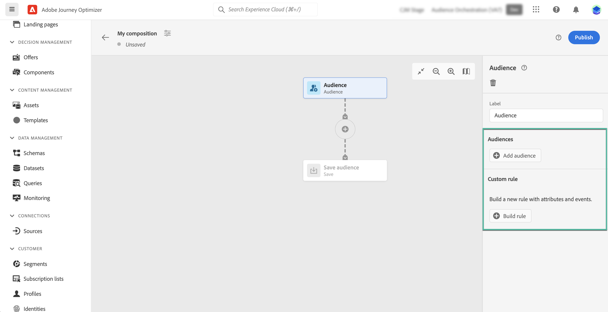

# Trabalhar com a tela de composição {#composition-canvas}

>[!BEGINSHADEBOX]

O que você encontrará nesta documentação:

* [Introdução à composição de público-alvo](get-started-audience-orchestration.md)
* [Criar seu primeiro fluxo de trabalho de composição](create-compositions.md)
* **[Trabalhar com a tela de composição](composition-canvas.md)**
* [Acessar e gerenciar públicos-alvo](access-audiences.md)

>[!ENDSHADEBOX]

A composição do público-alvo fornece uma tela visual que permite criar públicos-alvo e usar várias atividades (dividir, enriquecer, etc.).

As etapas para compor um público-alvo na tela são as seguintes:

1. [Definir os públicos-alvo iniciais](#starting-audience)
1. [Adicionar uma ou várias atividades](#action-activities)
1. [Salve os resultados em um novo público](#save)

## Selecionar o público-alvo inicial {#starting-audience}

A primeira etapa para criar uma composição é selecionar um ou vários públicos-alvo existentes como base de sua composição.

1. Selecione o **[!UICONTROL Público]** em seguida, forneça um rótulo para a atividade.

1. Escolha o público-alvo para direcionar:

   * Clique no botão **[!UICONTROL Adicionar público-alvo]** botão para selecionar um ou vários públicos-alvo existentes,
   * Clique no botão **[!UICONTROL Regra de criação]** para criar uma nova definição de segmento usando o [Serviço de segmentação](https://experienceleague.adobe.com/docs/experience-platform/segmentation/ui/overview.html).

   

1. Se vários públicos-alvo forem selecionados, especifique como os perfis desses públicos-alvo devem ser mesclados:

* **[!UICONTROL União]**: incluir todos os perfis dos públicos-alvo selecionados,
* **[!UICONTROL Interseção]**: incluir perfis comuns a todos os públicos-alvo selecionados,
* **[!UICONTROL Excluir sobreposição]**: inclua perfis que pertençam a um dos públicos-alvo somente. Os perfis pertencentes a mais de um público-alvo não serão incluídos.

Neste exemplo, queremos direcionar todos os perfis pertencentes aos públicos-alvo gold e prata.

Depois que os públicos-alvo forem selecionados, o número estimado de perfis será exibido na parte inferior da atividade.

## Adicionar atividades {#action-activities}

Adicione atividades depois de selecionar seu público-alvo inicial para refinar sua seleção.

Para fazer isso, clique no botão + no caminho da composição e selecione a atividade desejada. O painel direito é aberto, permitindo configurar a atividade recém-adicionada.

As atividades disponíveis são:

* [Público](#audience): incluir perfis adicionais pertencentes a um ou vários públicos-alvo existentes,
* [Excluir](#exclude): excluir perfis pertencentes a um público-alvo existente ou excluir perfis com base em atributos específicos,
* [Enriquecer](#enrich): enriquecer seu público-alvo com atributos adicionais provenientes de conjuntos de dados do Adobe Experience Platform,
* [Classificação](#rank): classificar perfis com base em um atributo específico, especifique o número de perfis a serem mantidos e inclua-os em sua composição,
* [Split](#split): divida sua composição em vários caminhos com base em porcentagens aleatórias ou em atributos.

Você pode adicionar quantos **[!UICONTROL Público]** e **[!UICONTROL Excluir]** conforme necessário na sua composição. No entanto, nenhuma atividade adicional pode ser adicionada após **[!UICONTROL Classificação]** e **[!UICONTROL Split]** atividades.

Você pode remover uma atividade da tela a qualquer momento clicando no botão Excluir no painel direito.  Se a atividade que deseja excluir for a principal de outras atividades na composição, uma mensagem é exibida, permitindo especificar se deseja excluir somente a atividade selecionada ou todas as suas atividades secundárias.

### Atividade Audience {#audience}

>[!CONTEXTUALHELP]
>id="ajo_ao_audience"
>title="Atividade Audience"
>abstract="A atividade Audience permite incluir em sua composição perfis adicionais pertencentes a um público-alvo existente."

>[!CONTEXTUALHELP]
>id="ajo_ao_merge_types"
>title="Tipos de mesclagem"
>abstract="Especifique como os perfis dos públicos-alvo selecionados devem ser mesclados."

O **[!UICONTROL Público]** permite incluir em sua composição perfis adicionais pertencentes a um público-alvo existente.

A configuração dessa atividade é idêntica ao início [Atividade Audience](#starting-audience).

### Excluir atividade {#exclude}

>[!CONTEXTUALHELP]
>id="ajo_ao_exclude_type"
>title="Excluir tipo"
>abstract="Use o tipo Exclude audience para excluir perfis pertencentes a um público-alvo existente. O tipo Exclude using attribute permite excluir perfis com base em um atributo específico."

>[!CONTEXTUALHELP]
>id="ajo_ao_exclude"
>title="Excluir atividade"
>abstract="A atividade Excluir permite excluir perfis de sua composição ao selecionar um público-alvo existente ou usar uma regra."

O **[!UICONTROL Excluir]** permite excluir perfis de sua composição. Dois tipos de exclusão estão disponíveis:

* **[!UICONTROL Excluir público-alvo]**: Excluir perfis pertencentes a um público-alvo existente.

   Clique no botão **[!UICONTROL Adicionar público-alvo]** em seguida, selecione o público a ser excluído.

   

* **[!UICONTROL Excluir usando atributo]**: Excluir perfis com base em um atributo específico.

   Selecione o atributo a ser procurado e especifique o valor a ser excluído. Neste exemplo, estamos excluindo os perfis de composição cujo endereço residencial está no Japão.

   

### Enriquecer {#enrich}

>[!CONTEXTUALHELP]
>id="ajo_ao_enrich"
>title="Enriquecer atividade"
>abstract="Use a atividade Enrich para excluir perfis pertencentes a um público-alvo existente. O tipo Exclude using attribute permite excluir perfis com base em um atributo específico."

>[!CONTEXTUALHELP]
>id="ajo_ao_enrich_dataset"
>title="Conjunto de dados de enriquecimento"
>abstract="Selecione o conjunto de dados de enriquecimento que contém os dados que você deseja associar ao público-alvo."

>[!CONTEXTUALHELP]
>id="ajo_ao_enrich_criteria"
>title="Critérios de enriquecimento"
>abstract="Selecione os campos a serem usados como chave de reconciliação entre o conjunto de dados de origem, ou seja, o público-alvo, e o conjunto de dados de enriquecimento."

>[!CONTEXTUALHELP]
>id="ajo_ao_enrich_attributes"
>title="Atributos de enriquecimento"
>abstract="Selecione um ou vários atributos do conjunto de dados de enriquecimento para associar ao público-alvo. Depois que a composição é publicada, esses atributos são associados ao público-alvo e podem ser aproveitados em campanhas para personalizar deliveries."

O **[!UICONTROL Enriquecer]** permite enriquecer seu público-alvo com atributos adicionais provenientes de conjuntos de dados do Adobe Experience Platform. Por exemplo, você pode adicionar informações relacionadas ao produto comprado, como seu nome, preço ou ID do fabricante, e aproveitar essas informações para personalizar os deliveries enviados ao público.

>[!IMPORTANT]
>
>Por enquanto, os rótulos no conjunto de dados, no nível do conjunto de dados ou no nível do campo, não são propagados para o público recém-criado. Isso pode afetar o controle de acesso e/ou o controle de dados do público resultante. Por esse motivo, use apenas os dados de teste ao compor públicos-alvo.

Para configurar a atividade, siga estas etapas:

1. Selecione o **[!UICONTROL Conjunto de dados de enriquecimento]** contendo os dados que você deseja associar ao público-alvo.

1. No **[!UICONTROL Critérios de enriquecimento]** selecione os campos a serem usados como chave de reconciliação entre o conjunto de dados de origem, ou seja, o público-alvo, e o conjunto de dados de enriquecimento. Neste exemplo, estamos usando a ID do produto comprado como chave de reconciliação.

1. Clique no botão **[!UICONTROL Adicionar atributos]** em seguida, selecione um ou vários atributos do conjunto de dados de enriquecimento para associar ao público-alvo.

   

Depois que a composição é publicada, os atributos selecionados são associados ao público-alvo e podem ser aproveitados em campanhas para personalizar deliveries.

### Atividade de classificação {#rank}

>[!CONTEXTUALHELP]
>id="ajo_ao_ranking"
>title="Atividade de classificação"
>abstract="A atividade Classificação permite classificar perfis com base em um atributo específico e incluí-los na composição. Por exemplo, inclua os 50 perfis com a maior quantidade de pontos de fidelidade."

>[!CONTEXTUALHELP]
>id="ajo_ao_rank_profilelimit_text"
>title="Adicionar limite de perfil"
>abstract="Ative essa opção para especificar um número máximo de perfis para incluir na composição."

O **[!UICONTROL Classificação]** permite classificar perfis com base em um atributo específico e incluí-los na composição. Você pode, por exemplo, incluir os 50 perfis com a maior quantidade de pontos de fidelidade.

1. Selecione o atributo que deseja pesquisar e especifique uma ordem de classificação (crescente ou decrescente).

   >[!NOTE]
   >
   >Você pode selecionar atributos com os seguintes tipos de dados: número inteiro, números, curto <!--(other?)-->

1. Ative o **[!UICONTROL Adicionar limite de perfil]** em e especifique um número máximo de perfis para incluir na composição.

   

### Atividade Split {#split}

<!-- [!CONTEXTUALHELP]
>id="ajo_ao_control_group_text"
>title="Control Group"
>abstract="Use control groups to isolate a portion of the profiles. This allows you to measure the impact of a marketing activity and make a comparison with the behavior of the rest of the population."-->

>[!CONTEXTUALHELP]
>id="ajo_ao_split"
>title="Atividade Split"
>abstract="A atividade Split permite dividir a composição em vários caminhos. Ao publicar a composição, um público-alvo será salvo no Adobe Experience Platform para cada caminho."

>[!CONTEXTUALHELP]
>id="ajo_ao_split_type"
>title="Tipo de divisão"
>abstract="Use o tipo de divisão de porcentagem para dividir aleatoriamente perfis em vários caminhos. O tipo de divisão de atributo permite dividir perfis com base em um atributo específico."

>[!CONTEXTUALHELP]
>id="ajo_ao_split_otherprofiles_text"
>title="Outros perfis"
>abstract="Ative essa opção para criar um caminho adicional com os perfis restantes que não correspondem a nenhuma das condições especificadas nos outros caminhos."

O **[!UICONTROL Split]** permite dividir sua composição em vários caminhos.

Essa operação adiciona automaticamente uma **[!UICONTROL Salvar]** no final de cada caminho. Ao publicar a composição, um público-alvo será salvo no Adobe Experience Platform para cada caminho.

Estão disponíveis dois tipos de operações divididas:

* **[!UICONTROL Divisão de porcentagem]**: dividir aleatoriamente perfis em dois ou mais caminhos. Por exemplo, você pode dividir os perfis em 2 caminhos distintos de 50% cada. <!--and add an additional path for control group.-->

   

* **[!UICONTROL Divisão de atributo]**: dividir perfis com base em um atributo específico. Neste exemplo, estamos dividindo perfis com base em suas preferências de tipo de quarto.

   

   >[!NOTE]
   >
   >O **[!UICONTROL Outros perfis]** permite criar um caminho adicional com os perfis restantes que não correspondem a nenhuma das condições especificadas nos outros caminhos.

## Salvar públicos {#save}

Configure os públicos resultantes que serão salvos no Adobe Experience Platform.

Para fazer isso, selecione o **[!UICONTROL Salvar público-alvo]** ao final de cada caminho, em seguida, especifique o nome do novo público-alvo a ser criado.

Quando sua composição estiver pronta, você poderá publicá-la. [Saiba como criar composições](create-compositions.md)
