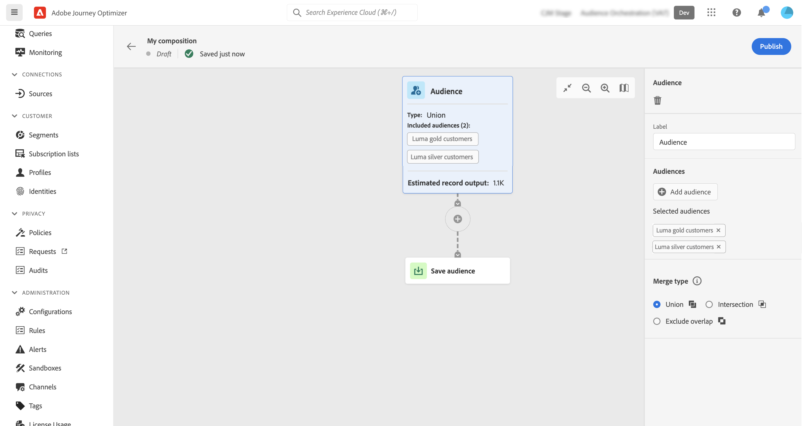
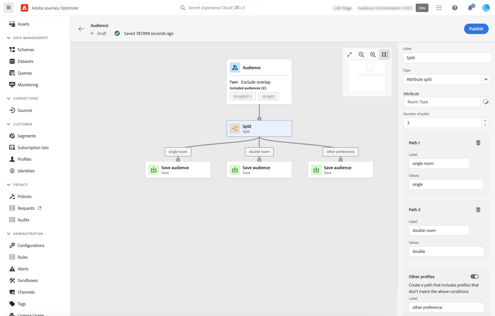

# Trabalhar com a tela de composição {#composition-canvas}

A tela de composição é uma tela visual que permite criar composições aproveitando públicos e atividades (dividir, excluir..).

As etapas para configurar uma composição na tela de composição são as seguintes:

1. [Definir os públicos-alvo iniciais](#starting-audience)
1. [Adicionar uma ou várias atividades](#action-activities)
1. [Salve os resultados em um novo público](#save)

## Selecionar o público-alvo inicial {#starting-audience}

>[!CONTEXTUALHELP]
>id="ajo_ao_merge_types"
>title="Tipos de mesclagem"
>abstract="Especifique como os perfis dos públicos-alvo selecionados devem ser mesclados."

A primeira etapa para criar uma composição é selecionar um ou vários públicos-alvo existentes como base de sua composição.

Selecione o **[!UICONTROL Público]** e clique no botão **[!UICONTROL Adicionar público-alvo]** em seguida, selecione um ou vários públicos-alvo.

Neste exemplo, queremos direcionar todos os perfis pertencentes aos públicos-alvo gold e prata.

Se você selecionar vários públicos, especifique como os perfis desses públicos-alvo devem ser mesclados:

* **[!UICONTROL União]**: incluir todos os perfis dos públicos-alvo selecionados,
* **[!UICONTROL Interseção]**: incluir perfis comuns a todos os públicos-alvo selecionados,
* **[!UICONTROL Excluir sobreposição]**: inclua perfis que pertençam a um dos públicos-alvo somente. Os perfis pertencentes a mais de um público-alvo não serão incluídos.

## Adicionar atividades {#action-activities}

Adicione atividades depois de selecionar seu público-alvo inicial para refinar sua seleção.

Para fazer isso, clique no botão + no caminho da composição e selecione a atividade desejada. O painel direito é aberto, permitindo configurar a atividade.

>[!NOTE]
>
>Você pode adicionar quantos **[!UICONTROL Público]** e **[!UICONTROL Excluir]** conforme necessário na sua composição. No entanto, nenhuma atividade adicional pode ser adicionada após **[!UICONTROL Classificação]** e **[!UICONTROL Split]** atividades.

Você pode remover uma atividade da tela a qualquer momento clicando no botão Excluir no painel direito. Todas as atividades adicionadas após essa atividade também serão removidas da tela.

As atividades disponíveis são:

* [Público](#audience): incluir perfis adicionais pertencentes a um ou vários públicos-alvo existentes,
* [Excluir](#exclude): excluir perfis pertencentes a um público-alvo existente ou excluir perfis com base em atributos específicos,
* [Classificação](#rank): classificar perfis com base em um atributo específico, especifique o número de perfis a serem mantidos e inclua-os em sua composição,
* [Split](#split): divida sua composição em vários caminhos com base em porcentagens aleatórias ou em atributos.

### Atividade Audience {#audience}

>[!CONTEXTUALHELP]
>id="ajo_ao_audience"
>title="Atividade Audience"
>abstract="A atividade Audience permite incluir em sua composição perfis adicionais pertencentes a um público-alvo existente."

O **[!UICONTROL Público]** permite incluir em sua composição perfis adicionais pertencentes a um público-alvo existente.

A configuração dessa atividade é idêntica ao início [Atividade Audience](#starting-audience).

### Excluir atividade {#exclude}

>[!CONTEXTUALHELP]
>id="ajo_ao_exclude_type"
>title="Excluir tipo"
>abstract="Use o tipo Exclude audience para excluir perfis pertencentes a um público-alvo existente. O tipo Exclude using attribute permite excluir perfis com base em um atributo específico."

>[!CONTEXTUALHELP]
>id="ajo_ao_exclude"
>title="Excluir atividade"
>abstract="A atividade Excluir permite excluir perfis de sua composição ao selecionar um público-alvo existente ou usar uma regra."

O **[!UICONTROL Excluir]** permite excluir perfis de sua composição. Dois tipos de exclusão estão disponíveis:

* **[!UICONTROL Excluir público-alvo]**: Excluir perfis pertencentes a um público-alvo existente.

   Clique no botão **[!UICONTROL Adicionar público-alvo]** em seguida, selecione o público a ser excluído.

   

* **[!UICONTROL Excluir usando atributo]**: Excluir perfis com base em um atributo específico.

   Selecione o atributo a ser procurado e especifique o valor a ser excluído. Neste exemplo, estamos excluindo os perfis de composição cujo endereço residencial está no Japão.

   

### Atividade de classificação {#rank}

>[!CONTEXTUALHELP]
>id="ajo_ao_ranking"
>title="Atividade de classificação"
>abstract="A atividade Classificação permite classificar perfis com base em um atributo específico e incluí-los na composição. Por exemplo, inclua os 50 perfis com a maior quantidade de pontos de fidelidade."

O **[!UICONTROL Classificação]** permite classificar perfis com base em um atributo específico e incluí-los na composição. Você pode, por exemplo, incluir os 50 perfis com a maior quantidade de pontos de fidelidade.

1. Selecione o atributo que deseja pesquisar e especifique uma ordem de classificação (crescente ou decrescente).

   >[ OBSERVAÇÃO ]
   >
   >Você pode selecionar atributos com os seguintes tipos de dados: número inteiro, números, curto <!--(other?)-->

1. Ative o **[!UICONTROL Adicionar limite de perfil]** em e especifique um número máximo de perfis para incluir na composição.

   

### Atividade Split {#split}

>[!CONTEXTUALHELP]
>id="ajo_ao_control_group_text"
>title="Grupo de controle"
>abstract="Use grupos de controle para isolar uma parte dos perfis. Isso permite medir o impacto de uma atividade de marketing e fazer uma comparação com o comportamento do restante da população."

>[!CONTEXTUALHELP]
>id="ajo_ao_split"
>title="Atividade Split"
>abstract="A atividade Split permite dividir a composição em vários caminhos. Ao publicar a composição, um público-alvo será salvo no Adobe Experience Platform para cada caminho."

>[!CONTEXTUALHELP]
>id="ajo_ao_split_type"
>title="Tipo de divisão"
>abstract="Use o tipo de divisão de porcentagem para dividir aleatoriamente perfis em vários caminhos. O tipo de divisão de atributo permite dividir perfis com base em um atributo específico."

O **[!UICONTROL Split]** permite dividir sua composição em vários caminhos.

Essa operação adiciona automaticamente uma **[!UICONTROL Salvar]** no final de cada caminho. Ao publicar a composição, um público-alvo será salvo no Adobe Experience Platform para cada caminho.

Estão disponíveis dois tipos de operações divididas:

* **[!UICONTROL Divisão de porcentagem]**: dividir aleatoriamente perfis em dois ou mais caminhos. Por exemplo, você pode dividir os perfis em 2 caminhos distintos de 45% cada e adicionar um caminho adicional para o grupo de controle.

   

* **[!UICONTROL Divisão de atributo]**: dividir perfis com base em um atributo específico. Neste exemplo, estamos dividindo perfis com base em suas preferências de tipo de quarto.

   

   >[!NOTE]
   >
   >O **[!UICONTROL Outros perfis]** permite criar um caminho adicional com os perfis restantes que não correspondem a nenhuma das condições especificadas nos outros caminhos.

## Salvar públicos {#save}

Configure os públicos resultantes que serão salvos no Adobe Experience Platform.

Para fazer isso, selecione o **[!UICONTROL Salvar público-alvo]** ao final de cada caminho, em seguida, especifique o nome do novo público-alvo a ser criado.

Quando sua composição estiver pronta, você poderá publicá-la. [Saiba como criar composições](create-compositions.md)

Saiba mais:

* [Introdução à composição do público-alvo](get-started-audience-orchestration.md)
* [Criar workflows de composição](create-compositions.md)
* [Acessar e gerenciar públicos](access-audiences.md)
