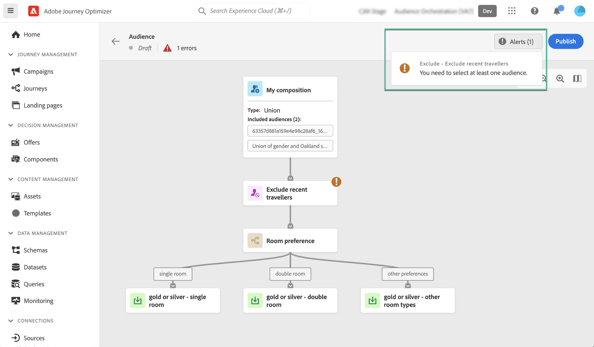

# Criar workflows de composição {#create-compositions}

Os fluxos de trabalho de composição permitem combinar e organizar os públicos-alvo existentes para criar novos públicos-alvo.

## Criar um fluxo de trabalho de composição {#create}

1. Acesse o **[!UICONTROL Segmentos]** e selecione **[!UICONTROL Criar público-alvo]**.

1. Selecionar **[!UICONTROL Compor público-alvo]**.

   >[!NOTE]
   >
   >O **[!UICONTROL Regra de criação]** o método de criação permite criar uma nova definição de segmento usando o [Serviço de segmentação](https://experienceleague.adobe.com/docs/experience-platform/segmentation/ui/overview.html).

   

1. A tela de composição é exibida com duas atividades padrão:

   * **[!UICONTROL Público]**: o ponto de partida da sua composição. Essa atividade permite selecionar um ou vários públicos-alvo como base para o fluxo de trabalho,

   * **[!UICONTROL Salvar]**: o último passo da sua composição. Essa atividade permite salvar o resultado do fluxo de trabalho em um novo público-alvo.
   Para obter mais informações sobre como configurar atividades na tela de fluxo de trabalho de composição, consulte [Trabalhar com a tela de composição](composition-canvas.md).

1. Selecione o **[!UICONTROL Público]** , em seguida, especifique um rótulo para sua composição.

   >[!IMPORTANT]
   >
   >O **[!UICONTROL Público]** rótulo de atividade é o rótulo de sua composição. Certifique-se de fornecer um nome significativo para recuperar a composição mais facilmente na lista.

   

1. Configure sua composição adicionando quantas atividades forem necessárias entre as **[!UICONTROL Público]** e **[!UICONTROL Salvar]** atividades. [Saiba como trabalhar com a tela de composição](composition-canvas.md)

   

1. Quando a composição estiver pronta, clique no botão [**!UICONTROL Publicar]** para publicar a composição e salvar os públicos resultantes no Adobe Experience Platform.

   Se ocorrer algum erro durante a publicação, serão exibidos alertas com informações sobre como resolver o problema.

   

1. A composição é publicada. Os públicos-alvo resultantes são salvos no Adobe Experience Platform. <!-- and are ready to be targeted in Journey Optimizer campaigns. [Get started with campaigns](../campaigns/get-started-with-campaigns.md)-->

## Composições de acesso {#access}

>[!CONTEXTUALHELP]
>id="ajo_ao_publish"
>title="Publicar seu público-alvo"
>abstract="Publique sua composição para salvar os públicos-alvo resultantes no Adobe Experience Platform."

Todas as composições criadas podem ser acessadas na **[!UICONTROL Composições]** guia . Eles podem ter vários status:

* **[!UICONTROL Rascunho]**: a composição está em curso e não foi publicada.
* **[!UICONTROL Publicado]**: a composição foi publicada, os públicos resultantes foram salvos. <!-- and are available for use.-->
* **[!UICONTROL Arquivado]**: a composição foi arquivada.

>[!NOTE]
>
>É possível duplicar ou excluir uma composição existente a qualquer momento usando o botão de elipse na lista.

Saiba mais:

* [Introdução à composição de público-alvo](get-started-audience-orchestration.md)
* [Trabalhar com a tela de composição](composition-canvas.md)
* [Acessar e gerenciar públicos-alvo](access-audiences.md)
