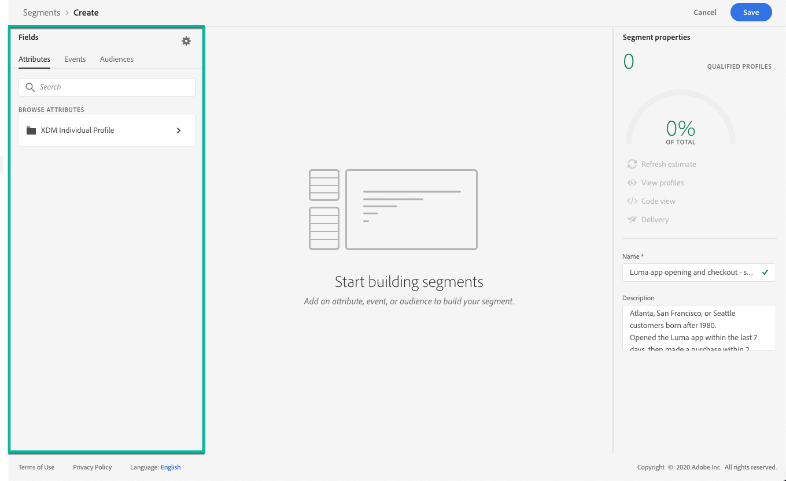

# Construir segmentos {#build-segments}

Neste exemplo, criaremos um segmento para direcionar todos os clientes que moram em Atlanta, São Francisco ou Seattle e nascem depois de 1980. Todos esses clientes devem ter aberto o aplicativo Luma nos últimos 7 dias, e então fizeram uma compra dentro de 2 horas após abrir o aplicativo.

1. Acesse o menu **[!UICONTROL Segments]** e clique no botão **[!UICONTROL Create segment]**.

   

   A tela de definição de segmento permite configurar todos os campos necessários para definir seu segmento. Saiba como configurar segmentos na [documentação do Serviço de segmentação](https://experienceleague.adobe.com/docs/experience-platform/segmentation/ui/overview.html){target=&quot;_blank&quot;}.

   

1. No painel **[!UICONTROL Segment properties]** , forneça um nome e uma descrição (opcional) para o segmento.

   

1. Arraste e solte os campos desejados do painel esquerdo para o espaço de trabalho central e configure-os de acordo com suas necessidades.

   >[!NOTE]
   >
   >Observe que os campos disponíveis no painel esquerdo variam dependendo de como os esquemas **Perfil individual XDM** e **XDM ExperienceEvent** foram configurados para sua organização.  Saiba mais na documentação do [Experience Data Model (XDM)](https://experienceleague.adobe.com/docs/experience-platform/xdm/home.html?lang=pt-BR){target=&quot;_blank&quot;}.

   

   Neste exemplo, precisamos confiar nos campos **Attributes** e **Events** para criar o segmento:

   * **Atributos**: perfis que vivem em Atlanta, São Francisco ou Seattle, nascidos após 1980

      

   * **Eventos**: perfis que abriram o aplicativo Luma nos últimos 7 dias, então fizeram uma compra dentro de 2 horas após abrir o aplicativo.

      

1. À medida que você adiciona e configura novos campos no espaço de trabalho, o painel **[!UICONTROL Segment Properties]** é atualizado automaticamente com informações sobre os perfis estimados pertencentes ao segmento.

   

1. Quando o segmento estiver pronto, clique em **[!UICONTROL Save]**. É exibido na lista de segmentos do Adobe Experience Platform. Observe que uma barra de pesquisa está disponível para ajudá-lo a pesquisar um segmento específico na lista.

O segmento agora pode ser usado em suas jornadas. Para obter mais informações, consulte [esta seção](../segment/about-segments.md).

## Tutorial em vídeo{#create-segment-video}

>[!VIDEO](https://video.tv.adobe.com/v/334281?quality=12)
