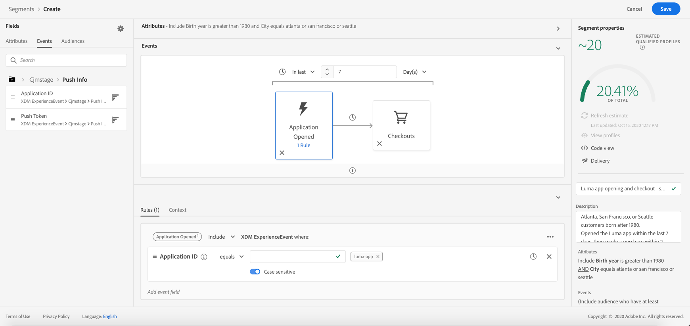
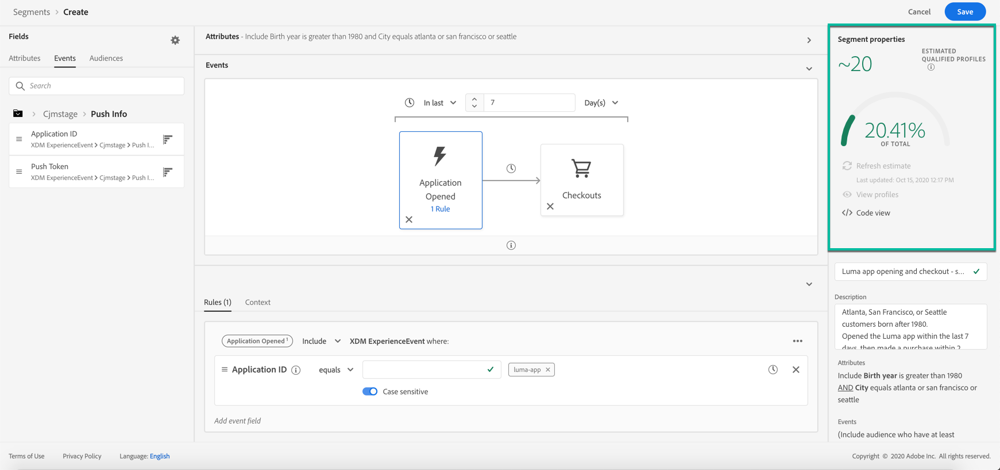

# Construir segmentos {#build-segments}

>[!CONTEXTUALHELP]
>id="ajo_ao_create_rule"
>title="Criar uma regra"
>abstract="O método de criação Criar regra permite criar uma nova definição de segmento usando o Adobe Experience Platform Segmentation Service."

Neste exemplo, criaremos um segmento para direcionar todos os clientes que moram em Atlanta, São Francisco ou Seattle e nascidos após 1980. Todos esses clientes devem ter aberto o aplicativo Luma nos últimos 7 dias e feito uma compra em 2 horas após a abertura do aplicativo.

➡️ [Saiba como criar segmentos neste vídeo](#video-segment)

1. Acesse o **[!UICONTROL Segmentos]** e clique no botão **[!UICONTROL Criar segmento]** botão.

   

   A tela de definição de segmento permite configurar todos os campos obrigatórios para definir seu segmento. Saiba como configurar segmentos no [Documentação do Serviço de segmentação](https://experienceleague.adobe.com/docs/experience-platform/segmentation/ui/overview.html){target="_blank"}.

   

1. No **[!UICONTROL Propriedades do segmento]** forneça um nome e uma descrição (opcional) para o segmento.

   

1. Arraste e solte os campos desejados do painel esquerdo no espaço de trabalho central e configure-os de acordo com suas necessidades.

   >[!NOTE]
   >
   >Observe que os campos disponíveis no painel esquerdo variam dependendo de como a variável **Perfil individual XDM** e **XDM ExperienceEvent** esquemas foram configurados para sua organização.  Saiba mais na [Documentação do Experience Data Model (XDM)](https://experienceleague.adobe.com/docs/experience-platform/xdm/home.html?lang=pt-BR){target="_blank"}.

   

   Neste exemplo, precisamos confiar em **Atributos** e **Eventos** campos para criar o segmento:

   * **Atributos**: perfis que vivem em Atlanta, São Francisco ou Seattle nascidos após 1980

      

   * **Eventos**: perfis que abriram o aplicativo Luma nos últimos 7 dias e fizeram uma compra em 2 horas após a abertura do aplicativo.

      

1. À medida que você adiciona e configura novos campos no espaço de trabalho, a variável **[!UICONTROL Propriedades do segmento]** O painel é atualizado automaticamente com informações sobre os perfis estimados pertencentes ao segmento.

   

1. Quando o segmento estiver pronto, clique em **[!UICONTROL Salvar]**. Ele é exibido na lista de segmentos do Adobe Experience Platform. Observe que uma barra de pesquisa está disponível para ajudá-lo a pesquisar um segmento específico na lista.

O segmento agora pode ser usado em suas jornadas. Para obter mais informações, consulte [esta seção](../segment/about-segments.md).

## Vídeo explicativo{#video-segment}

Saiba como criar segmentos.

>[!VIDEO](https://video.tv.adobe.com/v/334281?quality=12)
