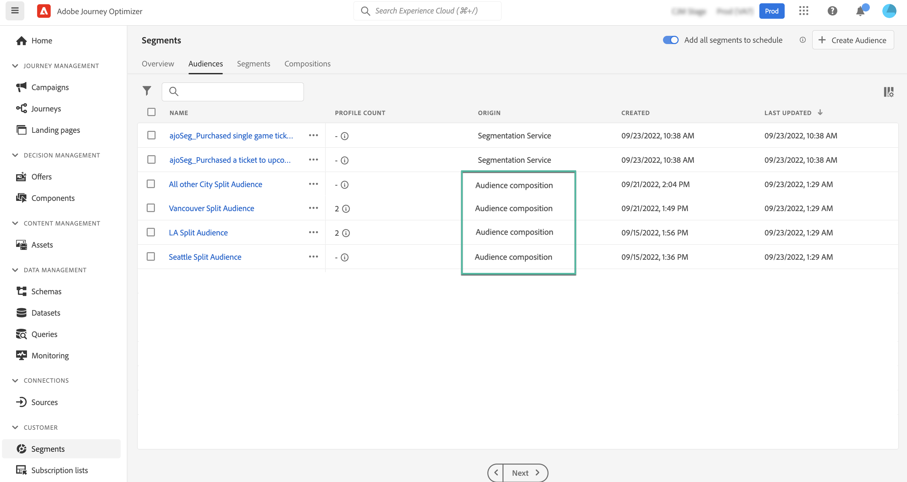

# Introdução à composição de público-alvo {#get-start-audience-composition}

>[!CONTEXTUALHELP]
>id="ajo_ao_create_composition"
>title="Criar uma composição"
>abstract="Crie um fluxo de trabalho de composição para combinar públicos-alvo existentes do Adobe Experience Platform em uma tela visual e aproveitar várias atividades (dividir, excluir..) para criar novos públicos-alvo."

>[!AVAILABILITY]
>
>Atualmente, a composição do público-alvo está disponível apenas como um beta privado e pode estar sujeita a atualizações frequentes sem aviso prévio.

## Sobre a composição do público-alvo {#about}

A composição do público-alvo permite criar **workflows da composição**, onde é possível combinar públicos-alvo existentes do Adobe Experience Platform em uma tela visual e aproveitar várias atividades (dividir, excluir..) para criar novos públicos-alvo.

Depois de concluído, o **públicos-alvo resultantes** são salvas no Adobe Experience Platform junto com os públicos-alvo existentes.<!--, and can be **leveraged in campaigns** to target customers.-->

>[!IMPORTANT]
>
>Por enquanto, os públicos-alvo resultantes de workflows de composição não podem ser direcionados para o Journey Optimizer. Eles não podem ser direcionados para o Adobe Experience Platform Destinations.

## Acessar composição do público-alvo {#access}

A composição do público-alvo pode ser acessada no **[!UICONTROL Segmentos]** menu:

* O **[!UICONTROL Públicos-alvo]** lista todos os públicos-alvo existentes armazenados no Adobe Experience Platform. [Saiba como acessar e gerenciar públicos-alvo](access-audiences.md)

* O **[!UICONTROL Composições]** permite criar fluxos de trabalho de composição, onde é possível combinar e organizar públicos para criar novos fluxos. [Saiba como criar workflows de composição](create-compositions.md)

>[!NOTE]
>
>Esta documentação se aplica somente à composição do público-alvo. O **[!UICONTROL Visão geral]** e **[!UICONTROL Segmentos]** são usadas no contexto da criação de definições de segmento. Para obter mais informações, consulte [Documentação do Serviço de segmentação](https://experienceleague.adobe.com/docs/experience-platform/segmentation/ui/overview.html).

Saiba mais:

* [Criar workflows de composição](create-compositions.md)
* [Trabalhar com a tela de composição](composition-canvas.md)
* [Acessar e gerenciar públicos-alvo](access-audiences.md)
