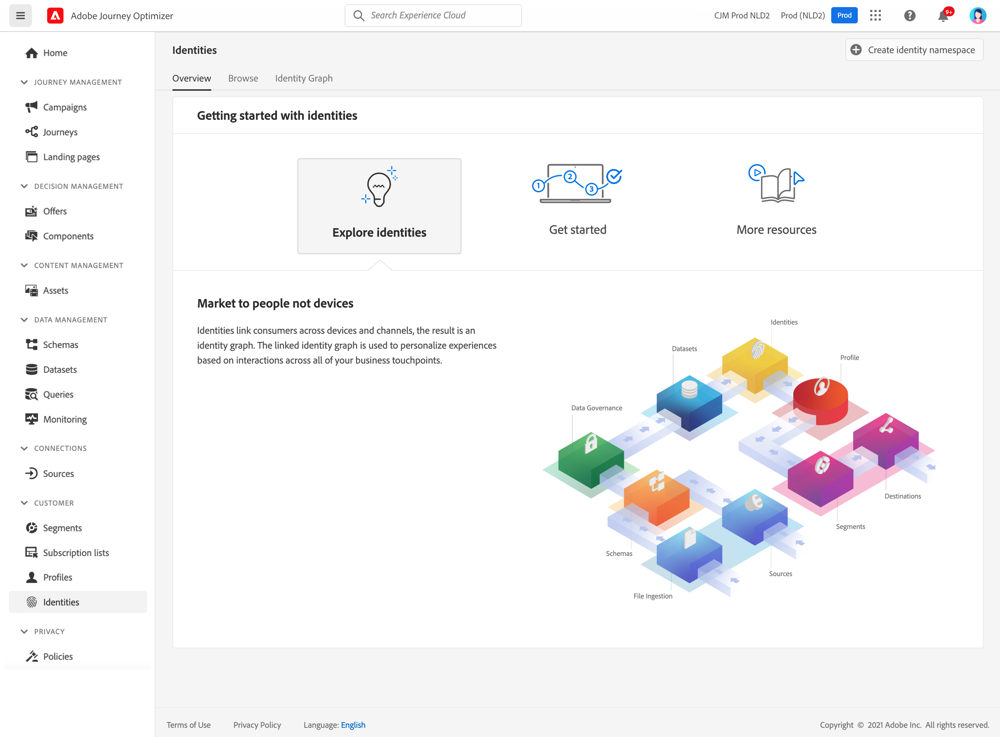

# Introdução a identidades {#identities-gs}

Uma identidade são dados exclusivos de uma entidade, normalmente uma pessoa individual. Uma identidade como uma ID de logon, ECID ou ID de fidelidade é chamada de identidade conhecida.

As Informações pessoais identificáveis (PII), como endereço de email e número de telefone, servem para identificar diretamente um cliente. Como resultado, a PII é usada para corresponder as várias identidades de um cliente em todos os sistemas.

Em [!DNL Adobe Journey Optimizer], **Identidades** vincular consumidores em dispositivos e canais, o resultado é um [gráfico de identidade](#id-graph). O gráfico de identidade vinculado é usado para personalizar experiências com base em interações em todos os pontos de contato comerciais.

Saiba mais sobre **Serviço de identidade** em [esta documentação](https://experienceleague.adobe.com/docs/experience-platform/identity/home.html?lang=pt-BR){target=&quot;_blank&quot;}.

## Namespaces de identidade {#identity-namespaces}

**** Os namespaces de identidade são um componente do Identity Service que serve como indicadores do contexto ao qual uma identidade está relacionada. Por exemplo, eles distinguem um valor de `name@email.com` como endereço de email ou `443522` como uma ID de CRM numérica. Trabalhar com namespaces de identidade requer uma compreensão dos vários serviços da Adobe Experience Platform envolvidos. Antes de começar a trabalhar com namespaces, reveja a documentação dos seguintes serviços:

Saiba mais sobre **Namespaces de identidade** em [esta documentação](https://experienceleague.adobe.com/docs/experience-platform/identity/namespaces.html?lang=pt-BR){target=&quot;_blank&quot;}.

## Gráfico de identidade{#id-graph}

O **Gráfico de identidade** é um mapa de relacionamentos entre diferentes identidades de um cliente específico, que fornece uma representação visual de como seu cliente interage com sua marca em diferentes canais. Todos os gráficos de identidade do cliente são gerenciados e atualizados coletivamente pelo Adobe Experience Platform Identity Service em tempo quase real, em resposta às atividades do cliente.

O visualizador do gráfico de identidade em [!DNL Adobe Journey Optimizer] A interface do usuário do permite visualizar e entender melhor quais identidades de cliente são unidas e de que maneiras. O visualizador permite que você arraste e interaja com diferentes partes do gráfico, permitindo examinar relacionamentos de identidade complexos, depurar com mais eficiência e aproveitar o aumento da transparência com a forma como as informações estão sendo utilizadas.

Saiba mais sobre **Gráfico de identidade** em [esta documentação](https://experienceleague.adobe.com/docs/experience-platform/identity/ui/identity-graph-viewer.html){target=&quot;_blank&quot;}.
