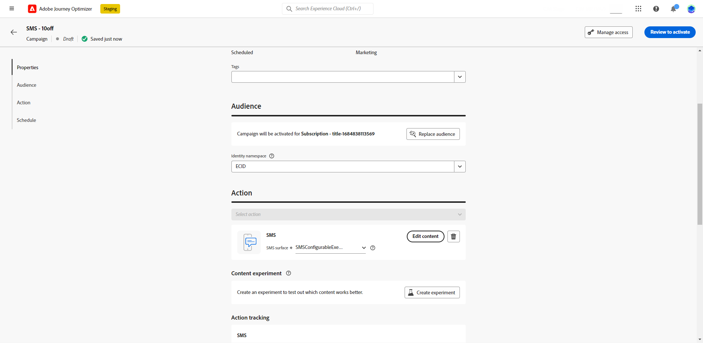

# Criar uma mensagem de SMS. {#create-sms}

>[!CONTEXTUALHELP]
>id="ajo_message_sms"
>title="Criar uma mensagem de SMS."
>abstract="Adicione sua mensagem SMS e comece a personalizá-la com o editor de expressão."

## Adicionar uma mensagem SMS {#create-sms-journey-campaign}

Navegue pelas guias abaixo para saber como adicionar uma mensagem SMS a uma campanha ou jornada.

>[!BEGINTABS]

>[!TAB Adicionar uma mensagem SMS a uma Jornada]

1. Abra a jornada e arraste e solte uma atividade de SMS do **Ações** da paleta.

   

1. Forneça informações básicas sobre a mensagem (rótulo, descrição, categoria) e escolha a superfície da mensagem a ser usada.

   

   Para obter mais informações sobre como configurar uma jornada, consulte [esta página](../building-journeys/journey-gs.md)

<!-- The **[!UICONTROL Surface]**field is pre-filled, by default, with the last surface used for that channel by the user. -->

Agora você pode começar a projetar o conteúdo de sua mensagem SMS do **[!UICONTROL Editar conteúdo]** botão. [Definir o conteúdo do SMS](#sms-content)

>[!TAB Adicionar uma mensagem SMS a uma campanha]

1. Crie uma nova campanha agendada ou acionada por API, selecione **[!UICONTROL SMS]** como sua ação e escolha o **[!UICONTROL Superfície do aplicativo]** para usar. [Saiba mais sobre a configuração de SMS](sms-configuration.md).

   

1. Clique em **[!UICONTROL Criar]**.

1. No **[!UICONTROL Propriedades]** edite o **[!UICONTROL Título]** e **[!UICONTROL Descrição]**.

   

1. No **[!UICONTROL Rastreamento de ações]** , especifique se deseja rastrear cliques em links na mensagem SMS.

1. Clique no botão **[!UICONTROL Seleção do público-alvo]** para definir o público-alvo a ser direcionado a partir da lista de segmentos disponíveis do Adobe Experience Platform. [Saiba mais](../segment/about-segments.md).

1. No **[!UICONTROL Namespace de identidade]** , escolha o namespace a ser usado para identificar os indivíduos do segmento selecionado. [Saiba mais](../event/about-creating.md#select-the-namespace).

   

1. As campanhas são projetadas para serem executadas em uma data específica ou em uma frequência recorrente. Saiba como configurar o **[!UICONTROL Agendar]** da sua campanha em [esta seção](../campaigns/create-campaign.md#schedule).

1. No **[!UICONTROL Acionadores de ação]** escolha o **[!UICONTROL Frequência]** da sua mensagem SMS:

   * Uma vez
   * Diariamente
   * Semanalmente
   * Mês

Agora você pode começar a projetar o conteúdo de sua mensagem SMS do **[!UICONTROL Editar conteúdo]** botão. [Projetar o conteúdo do SMS](#sms-content)

>[!ENDTABS]

## Definir o conteúdo do SMS{#sms-content}

1. Na tela de configuração da jornada ou campanha, clique no botão **[!UICONTROL Editar conteúdo]** para configurar o conteúdo do SMS.

1. Clique no botão **[!UICONTROL Mensagem]** para abrir o editor de expressão.

   

1. Use o editor de expressão para definir o conteúdo e adicionar conteúdo dinâmico. Você pode usar qualquer atributo, como o nome do perfil ou a cidade. Saiba mais sobre [personalização](../personalization/personalize.md) e [conteúdo dinâmico](../personalization/get-started-dynamic-content.md) no Editor de expressão.

1. Após definir o conteúdo, você pode adicionar os URLs de rastreamento à mensagem. Para fazer isso, acesse o **[!UICONTROL Funções auxiliares]** e selecione **[!UICONTROL Ajudantes]**.

   Observe que para usar a função de redução de URL, primeiro você deve configurar um subdomínio que será vinculado à sua superfície. [Saiba mais](sms-subdomains.md)

   

1. No **[!UICONTROL Funções auxiliares]** , clique em **[!UICONTROL Função de URL]** e depois selecione **[!UICONTROL Adicionar URL]**.

   

1. No `originalUrl` cole o URL que deseja encurtar.

1. Clique em **[!UICONTROL Salvar]** e verifique a mensagem na visualização. Você pode usar **[!UICONTROL Simular conteúdo]** para visualizar URLs encurtados ou conteúdo personalizado.

   

Agora você pode testar e enviar sua mensagem SMS para seu público-alvo. [Saiba mais](send-sms.md)
Depois de enviado, você pode medir o impacto do SMS nos relatórios de Campanha ou Jornada. Para obter mais informações sobre relatórios, consulte [esta seção](../reports/campaign-global-report.md#sms-tab).

>[!NOTE]
>
>De acordo com os padrões e regulamentos do setor, todas as mensagens de marketing por SMS devem conter uma maneira de os recipients cancelarem facilmente a inscrição. Para fazer isso, os recipients do SMS podem responder com palavras-chave de aceitação e recusa. [Saiba como gerenciar a recusa](../privacy/opt-out.md#sms-opt-out-management-sms-opt-out-management)

**Tópicos relacionados**

* [Visualizar, testar e enviar sua mensagem SMS](send-sms.md)
* [Configurar canal de SMS](sms-configuration.md)
* [Relatório de SMS](../reports/journey-global-report.md#sms-global)
* [Adicionar uma mensagem em uma jornada](../building-journeys/journeys-message.md)
* [Adicionar uma mensagem em uma campanha](../campaigns/create-campaign.md)
