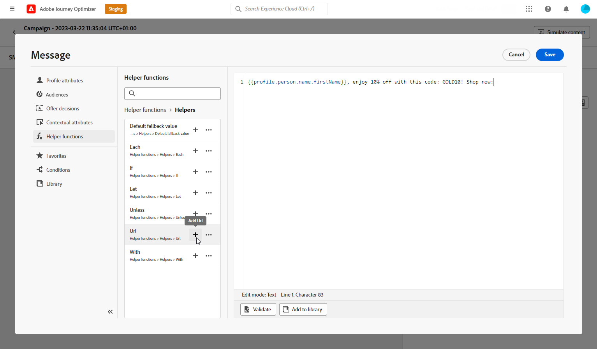

# Criação de uma mensagem de texto (SMS/MMS) {#create-sms}

>[!CONTEXTUALHELP]
>id="ajo_message_sms"
>title="Criação de uma mensagem de texto"
>abstract="Para criar uma mensagem de texto (SMS/MMS), adicione uma ação de SMS na jornada ou campanha e comece a personalizá-la com o editor de personalização."

Você pode criar e enviar mensagens de texto (SMS) e multimídia (MMS) com o Adobe Journey Optimizer. Primeiro, é necessário adicionar uma ação SMS em uma jornada ou campanha e, em seguida, definir o conteúdo da mensagem de texto, conforme detalhado abaixo. O Adobe Journey Optimizer também oferece recursos para testar suas mensagens de texto antes de enviá-las, para que você possa verificar a renderização, os atributos de personalização e todas as outras configurações.

>[!NOTE]
>
>De acordo com os padrões e regulamentos do setor, todas as mensagens de marketing SMS/MMS devem conter uma maneira de os recipients cancelarem facilmente a inscrição. Para fazer isso, os destinatários de SMS podem responder com palavras-chave de aceitação e recusa. [Saiba como gerenciar a opção de não participação](../privacy/opt-out.md#sms-opt-out-management-sms-opt-out-management)

## Adicionar uma mensagem de texto {#create-sms-journey-campaign}

Navegue pelas guias abaixo para saber como adicionar uma mensagem de texto (SMS/MMS) em uma campanha ou jornada.

>[!BEGINTABS]

>[!TAB Adicionar uma mensagem de texto a uma Jornada]

1. Abra a jornada e arraste e solte uma atividade de SMS da seção **Ações** da paleta.

   

1. Forneça informações básicas sobre a mensagem (rótulo, descrição, categoria) e escolha a configuração de mensagem a ser usada.

   

   Para obter mais informações sobre como configurar uma jornada, consulte [esta página](../building-journeys/journey-gs.md)

   O campo **[!UICONTROL configuração]** é preenchido previamente, por padrão, com a última configuração usada para esse canal pelo usuário.

Agora você pode começar a criar o conteúdo da sua mensagem SMS usando o botão **[!UICONTROL Editar conteúdo]**, conforme detalhado abaixo.

>[!TAB Adicionar uma mensagem de texto a uma campanha]

1. Acesse o menu **[!UICONTROL Campanhas]** e clique em **[!UICONTROL Criar campanha]**.

1. Selecione o tipo de campanha que deseja executar

   * **Agendado - Marketing**: execute a campanha imediatamente ou em uma data especificada. As campanhas programadas são destinadas ao envio de mensagens de marketing. Eles são configurados e executados na interface do usuário do.

   * **Acionado por API - Marketing/Transacional**: execute a campanha usando uma chamada de API. As campanhas acionadas por API destinam-se ao envio de mensagens de marketing ou transacionais, ou seja, mensagens enviadas após uma ação executada por um indivíduo: redefinição de senha, compra de carrinho etc.

1. Na seção **[!UICONTROL Propriedades]**, edite o **[!UICONTROL Título]** e a **[!UICONTROL Descrição]** da sua campanha.

1. Clique no botão **[!UICONTROL Selecionar público-alvo]** para definir o público-alvo a ser direcionado na lista de públicos-alvo disponíveis do Adobe Experience Platform. [Saiba mais](../audience/about-audiences.md).

1. No campo **[!UICONTROL Namespace de identidade]**, escolha o namespace a ser usado para identificar os indivíduos do público selecionado. [Saiba mais](../event/about-creating.md#select-the-namespace).

1. Na seção **[!UICONTROL Actions]**, escolha o **[!UICONTROL SMS]** e selecione ou crie uma nova configuração.

   Saiba mais sobre a configuração de SMS [nesta página](sms-configuration.md).

   

1. Clique em **[!UICONTROL Criar experimento]** para começar a configurar seu experimento de conteúdo e criar tratamentos para medir seu desempenho e identificar a melhor opção para seu público-alvo. [Saiba mais](../content-management/content-experiment.md)

1. Na seção **[!UICONTROL Rastreamento de ações]**, especifique se deseja rastrear cliques nos links da mensagem SMS.

1. As campanhas são projetadas para serem executadas em uma data específica ou em uma frequência recorrente. Saiba como configurar o **[!UICONTROL Cronograma]** da sua campanha no [nesta seção](../campaigns/create-campaign.md#schedule).

1. No menu **[!UICONTROL Acionadores de ação]**, escolha a **[!UICONTROL Frequência]** da sua mensagem SMS:

   * Uma vez
   * Diariamente
   * Semanal
   * Mês

Agora você pode começar a projetar o conteúdo da sua mensagem de texto a partir do botão **[!UICONTROL Editar conteúdo]**, conforme detalhado abaixo.

>[!ENDTABS]

## Definição do conteúdo do SMS{#sms-content}

>[!CONTEXTUALHELP]
>id="ajo_message_sms_content"
>title="Definição do conteúdo do SMS"
>abstract="Personalize as mensagens de texto (SMS/MMS) usando o editor de personalização para definir o conteúdo e incorporar elementos dinâmicos."

Para configurar o conteúdo de SMS, siga as etapas abaixo. As configurações para MMS estão detalhadas em [esta seção](#mms-content).

1. Na tela de configuração do jornada ou da campanha, clique no botão **[!UICONTROL Editar conteúdo]** para configurar o conteúdo da mensagem de texto.

1. Clique no campo **[!UICONTROL Mensagem]** para abrir o editor de personalização.

   

1. Use o editor de personalização para definir o conteúdo, adicionar personalização e conteúdo dinâmico. Você pode usar qualquer atributo, como o nome do perfil ou a cidade, por exemplo. Você também pode definir regras condicionais. Navegue até as seguintes páginas para saber mais sobre [personalização](../personalization/personalize.md) e [conteúdo dinâmico](../personalization/get-started-dynamic-content.md) no editor de personalização.

1. Depois de definir o conteúdo, você pode adicionar URLs rastreados à mensagem. Para fazer isso, acesse o menu **[!UICONTROL Funções auxiliares]** e selecione **[!UICONTROL Auxiliares]**.

   Observe que para usar a função de redução de URL, primeiro você deve configurar um subdomínio que será vinculado à sua configuração. [Saiba mais](sms-subdomains.md)

   >[!CAUTION]
   >
   > Para acessar e editar subdomínios SMS, você deve ter a permissão **[!UICONTROL Gerenciar subdomínios SMS]** na sandbox de produção. Saiba mais sobre permissões [nesta seção](../administration/high-low-permissions.md).

   

1. No menu **[!UICONTROL Funções auxiliares]**, clique em **[!UICONTROL Função de URL]** e selecione **[!UICONTROL Adicionar URL]**.

   

1. No campo `originalUrl`, cole a URL que você deseja encurtar e clique em **[!UICONTROL Salvar]**.

1. Clique em **[!UICONTROL Salvar]** e verifique sua mensagem na visualização. Agora você pode testar e verificar o conteúdo da sua mensagem conforme detalhado em [esta seção](#sms-mms-test).

## Definir o conteúdo MMS{#mms-content}

Você pode aprimorar sua comunicação enviando mensagens do Serviço de Mensagens Multimídia (MMS), permitindo o compartilhamento de mídia, como vídeos, imagens, clipes de áudio e GIF e muito mais. Além disso, o MMS permite até 1600 caracteres de texto em sua mensagem.

>[!NOTE]
>
>* O canal MMS contém algumas limitações listadas em [esta página](../start/guardrails.md#sms-guardrails).

Para criar conteúdo MMS, siga estas etapas:

1. Crie um SMS conforme descrito em [esta seção](#create-sms-journey-campaign).

1. Edite seu conteúdo de SMS conforme detalhado em [esta seção](#sms-content).

1. Ative a opção MMS para adicionar mídia ao conteúdo de SMS.

   

1. Adicione um **[!UICONTROL Título]** à sua mídia.

1. Insira a URL da mídia no campo **[!UICONTROL Mídia]**.

   

1. Clique em **[!UICONTROL Salvar]** e verifique sua mensagem na visualização. Agora você pode testar e verificar o conteúdo da mensagem conforme detalhado abaixo.

## Teste e envie suas mensagens {#sms-mms-test}

Use o botão **[!UICONTROL Simular conteúdo]** para visualizar o conteúdo da mensagem de texto, as URLs encurtadas e o conteúdo personalizado.

Depois de executar os testes e validar o conteúdo, você pode enviar a mensagem de texto para o público-alvo. Estas etapas estão detalhadas em [esta página](send-sms.md)

Depois de enviado, você pode medir o impacto do SMS nos relatórios do Campaign ou do Jornada. Para obter mais informações sobre relatórios, consulte [esta seção](../reports/campaign-global-report.md#sms-tab).

**Tópicos relacionados**

* [Pré-visualizar, testar e enviar sua mensagem de texto](send-sms.md)
* [Configuração de canal de SMS](sms-configuration.md)
* [Relatórios SMS/MMS](../reports/journey-global-report.md#sms-global)
* [Adicionar uma mensagem em uma jornada](../building-journeys/journeys-message.md)
* [Adicionar uma mensagem em uma campanha](../campaigns/create-campaign.md)
