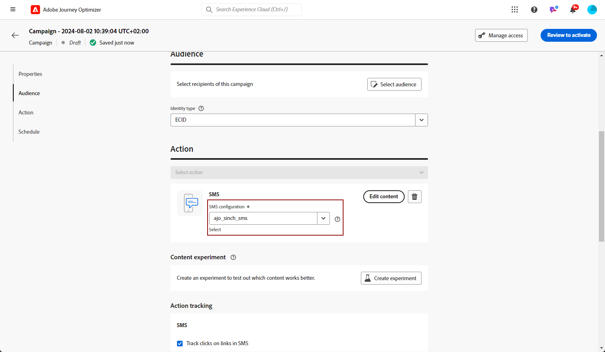

# Criação de uma mensagem de texto {#create-sms}

>[!CONTEXTUALHELP]
>id="ajo_message_sms"
>title="Criação de uma mensagem de texto"
>abstract="Para criar uma mensagem de texto, adicione uma ação SMS em uma jornada ou campanha e comece a personalizá-la com o editor de expressão."

Você pode criar e enviar texto (SMS) com o Adobe Journey Optimizer. Primeiro, é necessário adicionar uma ação SMS em uma jornada ou campanha e, em seguida, definir o conteúdo da mensagem de texto, conforme detalhado abaixo. O Adobe Journey Optimizer também oferece recursos para testar suas mensagens de texto antes de enviá-las, para que você possa verificar a renderização, os atributos de personalização e todas as outras configurações.

>[!NOTE]
>
>De acordo com os padrões e regulamentos do setor, todas as mensagens de marketing por SMS devem conter uma maneira de os recipients cancelarem facilmente a inscrição. Para fazer isso, os destinatários de SMS podem responder com palavras-chave de aceitação e recusa. [Saiba como gerenciar a recusa](../privacy/opt-out.md#sms-opt-out-management-sms-opt-out-management)

## Adicionar uma mensagem de texto {#create-sms-journey-campaign}

Navegue pelas guias abaixo para saber como adicionar uma mensagem de texto em uma campanha ou jornada.

>[!BEGINTABS]

>[!TAB Adicionar uma mensagem de texto a uma Jornada]

1. Abra a jornada e arraste e solte uma atividade de SMS da **Ações** seção da paleta.

   

1. Forneça informações básicas sobre a mensagem (rótulo, descrição, categoria) e escolha a superfície de mensagem a ser usada.

   

   Para obter mais informações sobre como configurar uma jornada, consulte [esta página](../building-journeys/journey-gs.md)

   A variável **[!UICONTROL Superficial]** é pré-preenchido, por padrão, com a última superfície usada para esse canal pelo usuário.

Agora é possível começar a projetar o conteúdo da sua mensagem SMS usando o **[!UICONTROL Editar conteúdo]** conforme detalhado abaixo.

>[!TAB Adicionar uma mensagem de texto a uma campanha]

1. Crie uma nova campanha programada ou acionada por API, selecione **[!UICONTROL SMS]** como sua ação e escolha a opção **[!UICONTROL Superfície do aplicativo]** para usar. Saiba mais sobre a configuração de SMS em [esta página](sms-configuration.md).

   

1. Clique em **[!UICONTROL Criar]**.

1. No **[!UICONTROL Propriedades]** edite o da sua campanha **[!UICONTROL Título]** e **[!UICONTROL Descrição]**.

   

1. Clique em **[!UICONTROL Selecionar público]** botão para definir o público-alvo a ser direcionado na lista de públicos-alvo disponíveis do Adobe Experience Platform. [Saiba mais](../audience/about-audiences.md).

1. No **[!UICONTROL Namespace de identidade]** escolha o namespace a ser usado para identificar os indivíduos do público-alvo selecionado. [Saiba mais](../event/about-creating.md#select-the-namespace).

   

1. Clique em **[!UICONTROL Criar experimento]** para começar a configurar seu experimento de conteúdo e criar tratamentos para medir seu desempenho e identificar a melhor opção para seu público-alvo. [Saiba mais](../campaigns/content-experiment.md)

1. No **[!UICONTROL Rastreamento de ações]** especifique se deseja rastrear cliques nos links da mensagem SMS.

1. As campanhas são projetadas para serem executadas em uma data específica ou em uma frequência recorrente. Saiba como configurar o **[!UICONTROL Agendar]** da sua campanha no [nesta seção](../campaigns/create-campaign.md#schedule).

1. No **[!UICONTROL Acionadores de ação]** selecione o **[!UICONTROL Frequência]** de sua mensagem SMS:

   * Uma vez
   * Diariamente
   * Semanalmente
   * Mês

Agora é possível começar a projetar o conteúdo da sua mensagem de texto a partir do **[!UICONTROL Editar conteúdo]** conforme detalhado abaixo.

>[!ENDTABS]

## Definição do conteúdo do SMS{#sms-content}

>[!CONTEXTUALHELP]
>id="ajo_message_sms_content"
>title="Definição do conteúdo do SMS"
>abstract="Personalize e personalize suas mensagens de texto usando o Editor de expressão para definir o conteúdo e incorporar elementos dinâmicos."

Para configurar o conteúdo de SMS, siga as etapas abaixo.

1. Na tela de configuração do jornada ou da campanha, clique no link **[!UICONTROL Editar conteúdo]** botão para configurar o conteúdo da mensagem de texto.

1. Clique em **[!UICONTROL Mensagem]** para abrir o editor de expressão.

   

1. Use o Editor de expressão para definir o conteúdo, adicionar personalização e conteúdo dinâmico. Você pode usar qualquer atributo, como o nome do perfil ou a cidade, por exemplo. Você também pode definir regras condicionais. Navegue até as seguintes páginas para saber mais sobre [personalização](../personalization/personalize.md) e [conteúdo dinâmico](../personalization/get-started-dynamic-content.md) no Editor de expressão.

1. Depois de definir o conteúdo, você pode adicionar URLs rastreados à mensagem. Para fazer isso, acesse o **[!UICONTROL Funções auxiliares]** e selecione **[!UICONTROL Auxiliares]**.

   Observe que para usar a função de redução de URL, primeiro você deve configurar um subdomínio que será vinculado à sua superfície. [Saiba mais](sms-subdomains.md)

   >[!CAUTION]
   >
   > Para acessar e editar subdomínios SMS, você deve ter a **[!UICONTROL Gerenciar subdomínios de SMS]** permissão na sandbox de produção. Saiba mais sobre permissões [nesta seção](../administration/high-low-permissions.md).

   

1. No prazo de **[!UICONTROL Funções auxiliares]** clique em **[!UICONTROL Função de URL]** e selecione **[!UICONTROL Adicionar URL]**.

   

1. No `originalUrl` cole o URL que deseja encurtar e clique em **[!UICONTROL Salvar]**.

1. Clique em **[!UICONTROL Salvar]** e verifique sua mensagem na pré-visualização. Agora você pode testar e verificar o conteúdo da mensagem conforme detalhado em [nesta seção](#sms-mms-test).

<!--
## Define your MMS content{#mms-content}

You can enhance your communication by sending Multimedia Message Service (MMS) messages, enabling the sharing of media such as videos, pictures, audio clips and GIFs, and more. Additionally, MMS allows for up to 1600 characters of text in your message.

>[!NOTE]
>
>* This feature is currently available with **Sinch** only.
>
>* MMS channel comes with a few limitations listed in [this page](../start/guardrails.md#sms-guardrails).
>

To create MMS content, follow these steps:

1. Create a SMS as described in [this section](#create-sms-journey-campaign).

1. Edit your SMS content as detailed in [this section](#sms-content).

1. Enable the MMS option to add media to your SMS content.

    

1. Add a **[!UICONTROL Title]** to your media.

1. Enter the URL of your media in the **[!UICONTROL Media]** field.

    

1. Click **[!UICONTROL Save]** and check your message in the preview. You can now test and check your message content as detailed below.
-->

## Teste e envie suas mensagens {#sms-mms-test}

Use o **[!UICONTROL Simular conteúdo]** botão para visualizar o conteúdo da mensagem de texto, URLs encurtados e conteúdo personalizado.

Depois de executar os testes e validar o conteúdo, você pode enviar a mensagem de texto para o público-alvo. Essas etapas estão detalhadas em [esta página](send-sms.md)

Depois de enviado, você pode medir o impacto do SMS nos relatórios do Campaign ou do Jornada. Para obter mais informações sobre relatórios, consulte [esta seção](../reports/campaign-global-report.md#sms-tab).

**Tópicos relacionados**

* [Pré-visualizar, testar e enviar sua mensagem de texto](send-sms.md)
* [Configuração de canal de SMS](sms-configuration.md)
* [Relatórios de SMS](../reports/journey-global-report.md#sms-global)
* [Adicionar uma mensagem em uma jornada](../building-journeys/journeys-message.md)
* [Adicionar uma mensagem em uma campanha](../campaigns/create-campaign.md)
