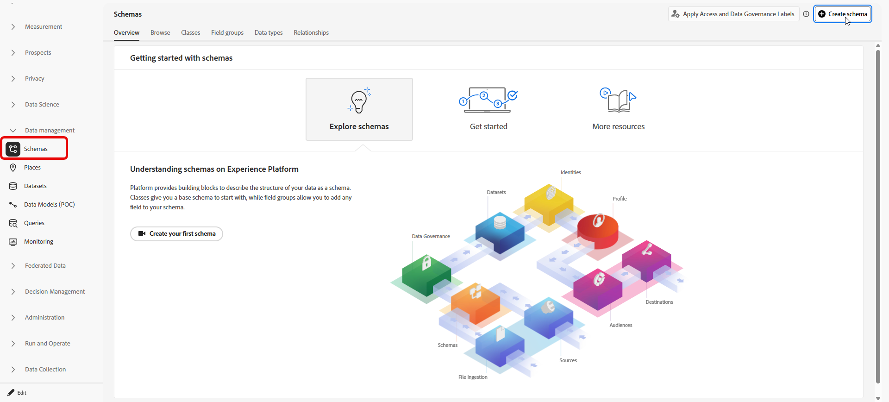
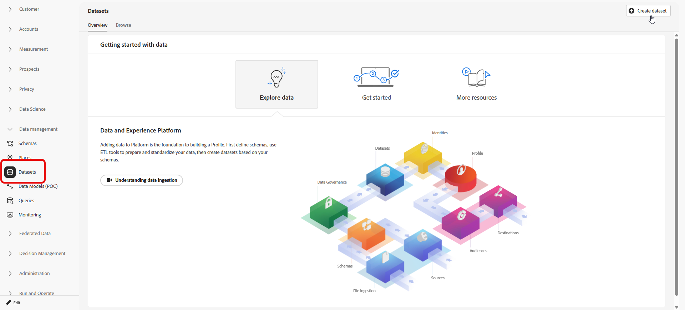
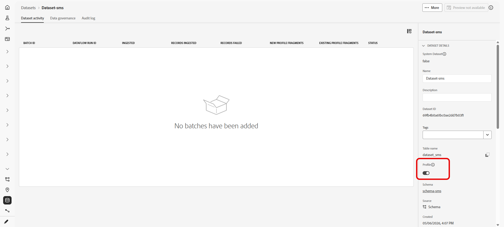

# Usar um conjunto de dados personalizado para palavras-chave de entrada {#custom-dataset-inbound-keywords}

As palavras-chave de SMS de entrada podem ser armazenadas em um conjunto de dados personalizado habilitado para perfil. A configuração consiste em um esquema do Adobe Experience Platform, um conjunto de dados criado a partir desse esquema e credenciais da API de SMS do Journey Optimizer que fazem referência ao conjunto de dados para mensagens de entrada.

Para obter informações sobre esquemas, grupos de campos e conjuntos de dados, consulte a seguinte documentação do Adobe Experience Platform:

* [Visão geral do sistema XDM](https://experienceleague.adobe.com/docs/experience-platform/xdm/home.html?lang=pt-BR){target="_blank"}
* [Noções básicas da composição do esquema](https://experienceleague.adobe.com/docs/experience-platform/xdm/schema/composition.html?lang=pt-BR){target="_blank"}
* [Visão geral dos conjuntos de dados](https://experienceleague.adobe.com/docs/experience-platform/catalog/datasets/overview.html?lang=pt-BR){target="_blank"}

Para usar um conjunto de dados personalizado para palavras-chave de entrada, é necessário:

1. [Criar um esquema](#create-schema)
1. [Criar um conjunto de dados](#create-dataset)
1. [Configurar credenciais da API](#configure-api-credentials)

## Criar um esquema {#create-schema}

Um esquema define a estrutura e as regras de validação que se aplicam aos dados assimilados. Componha um esquema de Evento de experiência para a coleção de palavras-chave de entrada adicionando os grupos de campos existentes listados abaixo.

➡️ [Saiba mais sobre a criação de esquema na documentação do Adobe Experience Platform](https://experienceleague.adobe.com/en/docs/experience-platform/xdm/schema/composition)

1. No Adobe Experience Platform, em **[!UICONTROL Gerenciamento de dados]**, acesse **[!UICONTROL Esquemas]** e selecione **[!UICONTROL Criar esquema]**.

   

1. Escolha **[!UICONTROL Esquema padrão]**.

1. Selecione **[!UICONTROL Evento de experiência]**.

   

1. Insira um **[!UICONTROL Nome de exibição]** para o esquema e clique em **[!UICONTROL Concluir]**.

   O esquema é salvo e o editor de esquema é aberto.

1. Abra **[!UICONTROL Propriedades do esquema]** e habilite o esquema para **[!UICONTROL Perfil]**.

   

1. Em **[!UICONTROL Grupos de campos]**, adicione estes grupos de campos existentes:

   * [!DNL Adobe CJM ExperienceEvent - Message interaction details]
   * [!DNL Adobe CJM ExperienceEvent - Message Execution Details]
   * [!DNL Adobe CJM ExperienceEvent - Message Profile Details]

1. Clique em **[!UICONTROL Salvar]**.

## Criar um conjunto de dados {#create-dataset}

Um conjunto de dados é o container de armazenamento para dados assimilados. Cada conjunto de dados está associado a exatamente um esquema e os registros gravados no conjunto de dados devem estar em conformidade com esse esquema.

1. No Adobe Experience Platform, em **[!UICONTROL Gerenciamento de dados]**, acesse **[!UICONTROL Conjuntos de dados]** e selecione **[!UICONTROL Criar conjunto de dados]**.

   

1. Escolha **[!UICONTROL Criar conjunto de dados do esquema]**.

1. Selecione o esquema criado na seção anterior e clique em **[!UICONTROL Avançar]**.

   

1. Insira um **[!UICONTROL Nome]** e clique em **[!UICONTROL Concluir]**.

1. Na guia **[!UICONTROL Atividade de dados]**, habilite os dados para **[!UICONTROL Perfil]**.

   Selecione a política de **[!UICONTROL retenção de dados]** apropriada aos requisitos de governança organizacional.

   

1. Clique em **[!UICONTROL Salvar]**.

## Configurar credenciais da API {#configure-api-credentials}

Configure credenciais de acordo com seu provedor de SMS usando a [Introdução à configuração de SMS/MMS/RCS](sms-configuration.md). Em seguida, conclua as etapas abaixo para selecionar o conjunto de dados de entrada personalizado.

1. No painel à esquerda, vá para **[!UICONTROL Administração]** > **[!UICONTROL Canais]** `>` **[!UICONTROL Configurações de SMS]** e selecione o menu **[!UICONTROL Credenciais de API]**. Clique no botão **[!UICONTROL Criar novas credenciais de API]**.

1. Crie ou edite credenciais dependendo do seu provedor.

1. Habilite a opção **[!UICONTROL Usar conjunto de dados personalizado para entrada]**.

1. Selecione o **[!UICONTROL Conjunto de Dados]** criado na seção anterior.

   

1. Preencha os campos obrigatórios restantes e clique em **[!UICONTROL Salvar]**.

   >[!NOTE]
   >
   >Ao salvar as credenciais da API, o Journey Optimizer valida se o conjunto de dados de palavra-chave de entrada está configurado corretamente. Se a validação falhar, uma mensagem de erro indicará a correção necessária.

Depois que as credenciais são salvas, o comportamento de mensagens de entrada e saída permanece inalterado; as palavras-chave de entrada para essa credencial são registradas no conjunto de dados personalizado selecionado.
