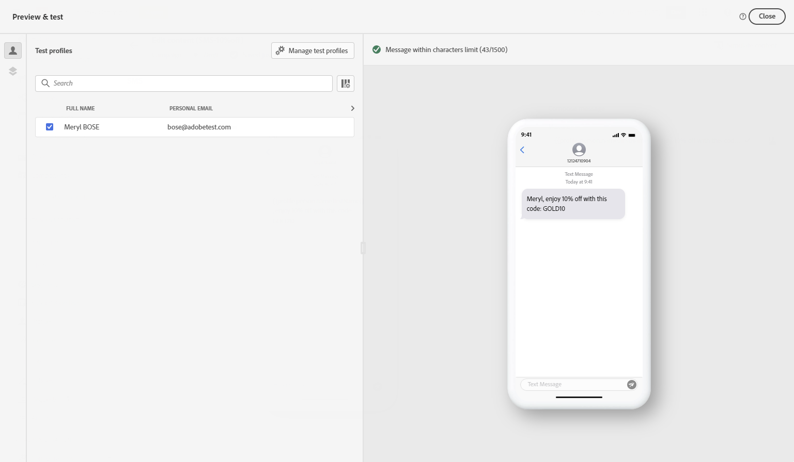
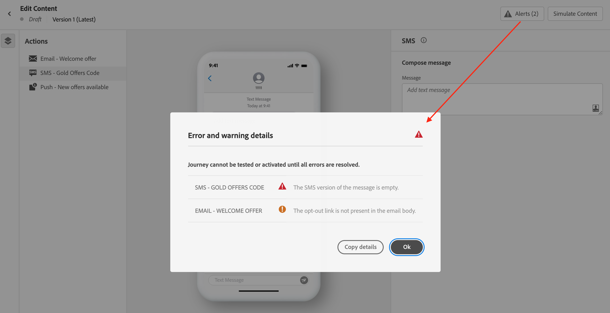

# Verifique e envie sua mensagem de texto (SMS/MMS) {#send-sms}

## Pré-visualizar sua mensagem de texto {#preview-sms}

Depois que o conteúdo da mensagem for definido, você poderá usar perfis de teste para visualizar seu conteúdo. Se você inseriu conteúdo personalizado, é possível verificar como esse conteúdo é exibido na mensagem, usando os dados do perfil de teste.

Para fazer isso, clique em **[!UICONTROL Simular conteúdo]** em seguida, adicione um perfil de teste para verificar sua mensagem usando os dados do perfil de teste.

Informações detalhadas sobre como selecionar perfis de teste e pré-visualizar seu conteúdo estão disponíveis na [Gestão de conteúdo](../content-management/preview-test.md) seção.

## Validar seu conteúdo {#sms-validate}

Você deve verificar os alertas na seção superior do editor. Alguns deles são avisos simples, mas outros podem impedir que você envie a mensagem. Dois tipos de alertas podem ocorrer: avisos e erros.

* **Avisos** consulte recomendações e práticas recomendadas. Por exemplo, uma mensagem de aviso será exibida se a mensagem de texto estiver vazia.

* **Erros** impede que você teste ou ative a jornada, ou publique a campanha, desde que não sejam resolvidos. Por exemplo, uma mensagem de erro avisa quando a linha de assunto está ausente.

>[!NOTE]
>
> Para melhorar sua capacidade de delivery, use os números de telefone nos formatos compatíveis com o provedor. Por exemplo, o Twilio e o Sinch suportam apenas números de telefone no formato E.164.

## Envie suas mensagens de texto {#sms-send}

Quando a mensagem de texto estiver pronta, conclua a configuração de [jornada](../building-journeys/journey-gs.md) ou [campaign](../campaigns/create-campaign.md) para enviá-lo.

**Tópicos relacionados**

* [Configuração de canal de SMS](sms-configuration.md)
* [Relatórios SMS/MMS](../reports/journey-global-report.md#sms-global)
* [Criação de uma mensagem de texto](create-sms.md)
* [Adicionar uma mensagem em uma jornada](../building-journeys/journeys-message.md)
