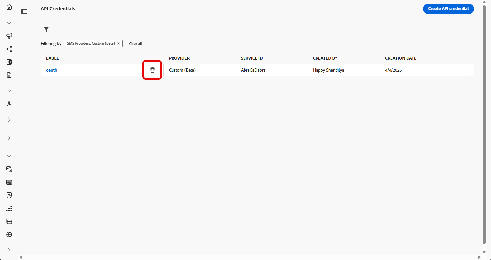

# Configurar um provedor de SMS personalizado {#sms-configuration-custom}

>[!CONTEXTUALHELP]
>id="ajo_admin_sms_api_byop_provider_url"
>title="URL do provedor"
>abstract="Especifique o URL da API externa à qual você planeja se conectar. Esse URL serve como ponto de acesso para acessar os recursos e funcionalidades da API."

>[!CONTEXTUALHELP]
>id="ajo_admin_sms_api_byop_header_parameters"
>title="Parâmetros de cabeçalho"
>abstract="Especifique o rótulo, o tipo e o valor dos cabeçalhos adicionais para habilitar a autenticação adequada, a formatação de conteúdo e a comunicação eficaz da API. "

>[!CONTEXTUALHELP]
>id="ajo_admin_sms_api_byop_provider_payload"
>title="Conteúdo do provedor"
>abstract="Forneça o conteúdo da solicitação para garantir que os dados corretos sejam enviados para processamento e geração de resposta."

>[!AVAILABILITY]
>
>Os provedores personalizados estão disponíveis atualmente como uma versão beta somente para usuários selecionados. Entre em contato com seu representante da Adobe para ser incluído na Beta.
>Observe que esse Beta não é compatível com mensagens de entrada para gerenciamento de consentimento de aceitação/recusa e relatórios de entrega.

Esse recurso permite integrar e configurar seus próprios provedores de SMS, oferecendo flexibilidade além dos provedores padrão (Sinch, Twilio e Infobip). Isso permite a criação, entrega, relatórios e gerenciamento de consentimento perfeitos por SMS.

Com a configuração do provedor personalizado para SMS, você pode:

* Configure provedores de SMS personalizados diretamente no Journey Optimizer.
* Use a personalização avançada de conteúdo para mensagens dinâmicas.
* Gerencie preferências de consentimento (aceitar/recusar) para garantir a conformidade.

## Criar a credencial da API {#api-credential}

Para enviar mensagens no Journey Optimizer usando um provedor personalizado não disponível imediatamente pela Adobe (por exemplo, Sinch, Infobip, Twilio), siga estas etapas:

1. No painel à esquerda, navegue até **[!UICONTROL Administração]** `>` **[!UICONTROL Canais]**, selecione o menu **[!UICONTROL Credenciais de API]** e clique no botão **[!UICONTROL Criar novas credenciais de API]**.

   

1. Configure suas credenciais da API de SMS, conforme detalhado abaixo:

   * **[!UICONTROL Fornecedor de SMS]**: personalizado.

   * **[!UICONTROL Nome]**: digite um nome para a credencial da API.

   * **[!UICONTROL AppId do Provedor]**: insira a ID do aplicativo fornecida pelo seu provedor de SMS.

   * **[!UICONTROL Nome do Provedor]**: insira o nome do seu provedor de SMS.

   * **[!UICONTROL URL do Provedor]**: Insira a URL do seu provedor de SMS.

   * **[!UICONTROL Tipo de Autenticação&#x200B;]**: selecione seu tipo de autorização e [preencha os campos correspondentes](#auth-options) com base no método de autenticação escolhido.

     

1. Na seção **[!UICONTROL Cabeçalhos]**, clique em **[!UICONTROL Adicionar novo parâmetro]** para especificar os cabeçalhos HTTP para a mensagem de solicitação que será enviada para o serviço externo.

   Os campos de cabeçalho **Content-Type** e **Charset** estão definidos por padrão e não podem ser excluídos.

   

1. Adicione a **[!UICONTROL Carga do provedor]** para validar e personalizar as cargas da solicitação.

   Você pode personalizar dinamicamente seu conteúdo usando atributos de perfil do e garantir que dados precisos sejam enviados para processamento e geração de resposta com a ajuda de funções auxiliares integradas.
<!--
1. Add your **Inbound settings** to determine how your system handles incoming messages and subscriber preferences: 

    * **[!UICONTROL Inbound Webhook URL]**: Specify the endpoint URL where inbound messages (e.g. replies or new messages from users) are sent.
    * **[!UICONTROL Opt-in Keywords]**: Enter the default or custom keywords that will automatically trigger your Opt-In Message. For multiple keywords, use comma-separated values.
    * **[!UICONTROL Opt-in Message]**: Enter the custom response that is automatically sent as your Opt-In Message.
    * **[!UICONTROL Opt-out Keywords]**: Enter the default or custom keywords that will automatically trigger your Opt-Out Message. For multiple keywords, use comma-separated values.
    * **[!UICONTROL Opt-out Message]**: Enter the custom response that is automatically sent as your Opt-Out Message.
-->

1. Clique em **[!UICONTROL Enviar]** quando terminar de configurar suas credenciais de API.

1. No menu **[!UICONTROL Credenciais da API]**, clique no ícone de compartimento para excluir suas credenciais da API.

   

1. Para modificar as credenciais existentes, localize as credenciais de API desejadas e clique na opção **[!UICONTROL Editar]** para fazer as alterações necessárias.

   

Depois de criar e configurar sua credencial de API, agora é necessário criar uma superfície de canal para mensagens SMS. [Saiba mais](sms-configuration-surface.md)

Depois de configurado, você pode aproveitar todos os recursos de canal prontos para uso, como criação de mensagens, personalização, rastreamento de links e relatórios.

### Opções de autenticação para Provedores de SMS personalizados {#auth-options}

>[!CONTEXTUALHELP]
>id="ajo_admin_sms_api_byop_auth_type"
>title="Tipo de autenticação"
>abstract="Especifique o método de autenticação necessário para acessar a API, garantindo uma comunicação segura e autorizada com o serviço externo."

>[!BEGINTABS]

>[!TAB Chave de API]

Depois que a credencial da API for criada, preencha os campos necessários para autenticação da chave de API:

* **[!UICONTROL Nome]**&#x200B;: digite um nome para a configuração da chave de API.
* **[!UICONTROL Token de API]**&#x200B;: insira o Token de API fornecido pelo seu provedor de SMS.

>[!TAB Autenticação do MAC]

Depois que a credencial da API for criada, preencha os campos necessários para autenticação da MAC:

* **[!UICONTROL Nome]**&#x200B;: digite um nome para a configuração de autenticação do MAC.
* **[!UICONTROL Token de API]**&#x200B;: insira o Token de API fornecido pelo seu provedor de SMS.
* **[!UICONTROL Chave secreta de API]**: insira a Chave secreta de API fornecida pelo seu provedor de SMS. Essa chave é usada para gerar o MAC (Message Authentication Code) para comunicação segura.
* **[!UICONTROL Formato de hash de autorização do Mac]**: escolha o formato de hash para a autenticação do MAC.

>[!TAB Autenticação OAuth]

Depois que a credencial da API for criada, preencha os campos necessários para autenticação OAuth:

* **[!UICONTROL Nome]**&#x200B;: insira um nome para a configuração de autenticação do OAuth.

* **[!UICONTROL Token de API]**&#x200B;: insira o Token de API fornecido pelo seu provedor de SMS.

* **[!UICONTROL URL do OAuth]**&#x200B;: insira a URL para obter o token do OAuth.

* **[!UICONTROL Corpo de OAuth]**&#x200B;: forneça o corpo da solicitação de OAuth no formato JSON, incluindo parâmetros como `grant_type`, `client_id` e `client_secret`.

>[!TAB Autenticação JWT]

Depois que a credencial da API for criada, preencha os campos necessários para autenticação JWT:

* **[!UICONTROL Nome]**&#x200B;: insira um nome para a configuração de autenticação JWT.

* **[!UICONTROL Token de API]**&#x200B;: insira o Token de API fornecido pelo seu provedor de SMS.

* **[!UICONTROL Carga JWT]**&#x200B;: insira a carga JSON que contém as declarações necessárias para o JWT, como emissor, assunto, público-alvo e expiração.

>[!ENDTABS]

## Vídeo tutorial {#video}

>[!VIDEO](https://video.tv.adobe.com/v/3431625)
