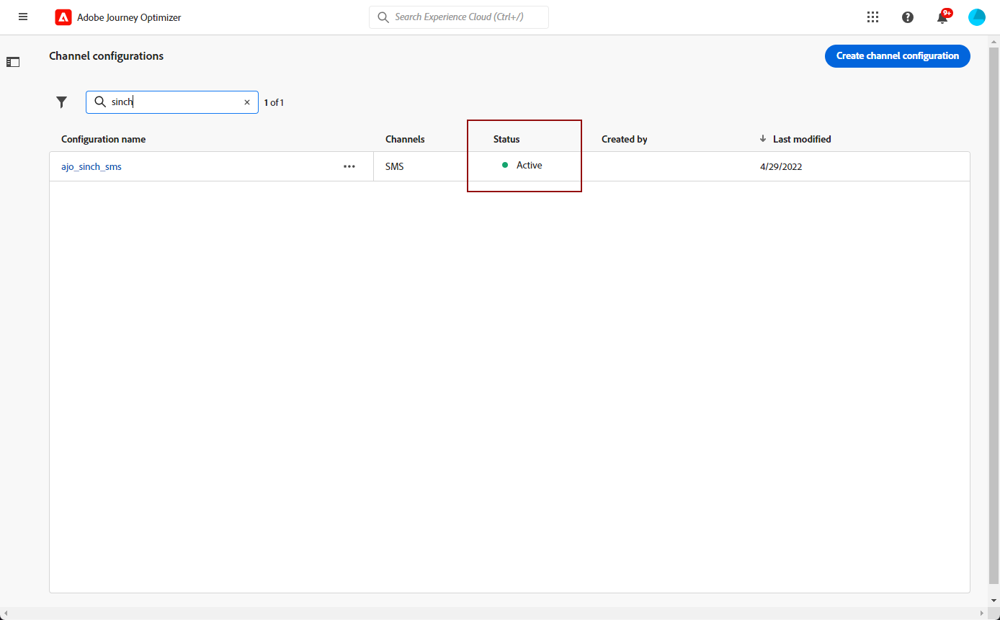

# Criar uma superfície SMS/MMS {#message-preset-sms}

>[!CONTEXTUALHELP]
>id="ajo_admin_surface_sms_type"
>title="Definição da categoria da mensagem"
>abstract="Selecione o tipo de mensagens de texto usando esta superfície: Marketing para mensagens promocionais, que exigem consentimento do usuário, ou Transacional para mensagens não comerciais, como redefinição de senha."
>additional-url="https://experienceleague.adobe.com/docs/journey-optimizer/using/privacy/consent/opt-out.html?lang=pt-BR#sms-opt-out-management" text="Recusar mensagens de texto de marketing"

Depois que o canal SMS/MMS for configurado, você deverá criar uma superfície de canal para enviar mensagens SMS e MMS do **[!DNL Journey Optimizer]**.

Para criar uma superfície de canal, siga estas etapas:

1. No painel esquerdo, navegue até **[!UICONTROL Administração]** > **[!UICONTROL Canais]** e selecione **[!UICONTROL Marcas]** > **[!UICONTROL Superfícies de canal]**. Clique em **[!UICONTROL Criar superfície de canal]** botão.

   

1. Insira um nome e uma descrição (opcional) para a superfície e selecione o canal SMS.

   

   >[!NOTE]
   >
   > Os nomes devem começar com uma letra (A-Z). Ele só pode conter caracteres alfanuméricos. Também é possível usar sublinhado `_`, ponto`.` e hífen `-` caracteres.

1. Defina o **Configurações de SMS**.

   

   Comece selecionando o **[!UICONTROL Tipo de SMS]** que serão enviados com a superfície: **[!UICONTROL Transacional]** ou **[!UICONTROL Marketing]**.

   * Escolher **Marketing** para mensagens de texto promocionais: essas mensagens exigem o consentimento do usuário.
   * Escolher **Transacional** para mensagens não comerciais, como confirmação de pedidos, notificações de redefinição de senha ou informações de entrega, por exemplo.

   Ao criar um SMS/MMS, você deve escolher uma superfície de canal válida que corresponda à categoria selecionada para sua mensagem.

   >[!CAUTION]
   >
   >**Transacional** as mensagens podem ser enviadas a perfis que cancelaram a assinatura de comunicações de marketing. Essas mensagens só podem ser enviadas em contextos específicos.

1. Selecione o **[!UICONTROL Configuração de SMS]** para associar à superfície.

   Para obter mais informações sobre como configurar o seu ambiente para enviar mensagens SMS, consulte [nesta seção](#create-api).

1. Insira o **[!UICONTROL Número do remetente]** &#x200B;que você deseja usar para suas comunicações.

1. Selecione o **[!UICONTROL Campo de execução do SMS]** para selecionar o **[!UICONTROL Atributo de perfil]** associados aos números de telefone dos perfis.

1. Se quiser usar a função de redução de URL em suas mensagens SMS, selecione um item na lista suspensa **[!UICONTROL Subdomínio]** lista.

   >[!NOTE]
   >
   >Para selecionar um subdomínio, verifique se você configurou anteriormente pelo menos um subdomínio SMS/MMS. [Saiba como](sms-subdomains.md)

1. Insira o **[!UICONTROL Número de recusa]** que você deseja usar para esta superfície. Quando os perfis optam por não participar desse número, você ainda pode enviar mensagens de outros números com os quais possa estar usando para enviar mensagens de texto [!DNL Journey Optimizer].

   >[!NOTE]
   >
   >Entrada [!DNL Journey Optimizer], a opção de não participação para mensagens de texto não é mais gerenciada no nível do canal. Agora é específico de um número.

1. Após configurar todos os parâmetros, clique em **[!UICONTROL Enviar]** para confirmar. Você também pode salvar a superfície de canal como rascunho e retomar sua configuração posteriormente.

   

1. Depois que a superfície de canal é criada, ela é exibida na lista com o **[!UICONTROL Processando]** status.

   >[!NOTE]
   >
   >Se as verificações não forem bem-sucedidas, saiba mais sobre os possíveis motivos de falha no [nesta seção](#monitor-channel-surfaces).

1. Depois que as verificações forem bem-sucedidas, a superfície de canal obterá a variável **[!UICONTROL Ativo]** status. Ele está pronto para ser usado para enviar mensagens.

   

Agora você está pronto para enviar mensagens de texto com o Journey Optimizer.

