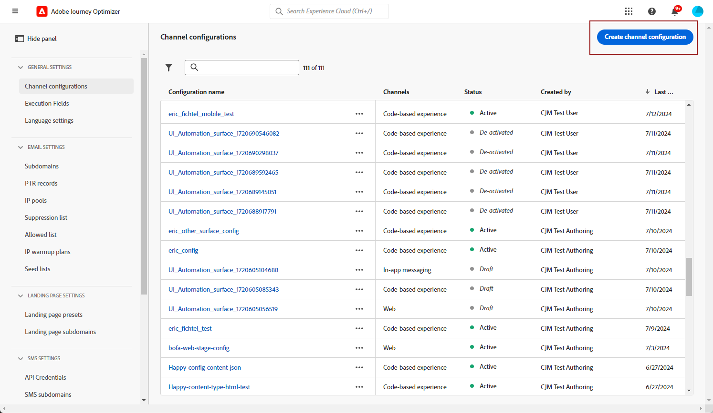

# Configuração de canal de SMS {#sms-configuration}

Antes de enviar SMS ou MMS, você deve configurar o ambiente do Adobe Journey Optimizer. Para executar isso:

* [Integrar as configurações do provedor](#create-api) com o Journey Optimizer
* [Criar uma superfície de SMS](#message-preset-sms) (ou seja, predefinição de SMS), também usada para MMS

Essas etapas devem ser executadas por um Adobe Journey Optimizer [Administrador do sistema](../start/path/administrator.md).

## Pré-requisitos{#sms-prerequisites}

Atualmente, o Adobe Journey Optimizer está integrado a provedores de terceiros que oferecem serviços de mensagens de texto independentes do Adobe Journey Optimizer. Os provedores compatíveis com mensagens de texto são: **Sinch**, **Twilio** e **Infobip**. O MMS só é compatível com **Sinch**.

Antes da configuração do canal SMS, você deve criar uma conta com um desses provedores para obter seu **Token de API** e **ID do serviço**, que você precisa configurar a conexão entre o Adobe Journey Optimizer e o provedor aplicável.

O uso dos serviços de mensagens de texto está sujeito a termos e condições adicionais do provedor aplicável. Como soluções de terceiros, o Sinch, o Twilio e o Infobip estão disponíveis para usuários do Adobe Journey Optimizer por meio de uma integração. A Adobe não controla e não é responsável por produtos de terceiros. Em caso de problemas ou solicitações de assistência relacionados aos serviços de mensagens de texto (SMS/MMS), entre em contato com seu provedor.

>[!CAUTION]
>
>Para acessar e editar subdomínios SMS, você deve ter a **[!UICONTROL Gerenciar subdomínios de SMS]** permissão na sandbox de produção. Saiba mais sobre permissões no [esta página](../administration/high-low-permissions.md#administration-permissions).
>

## Criar novas credenciais de API {#create-api}

>[!CONTEXTUALHELP]
>id="ajo_admin_sms_api_header"
>title="Configurar o provedor de SMS/MMS com o Journey Optimizer"
>abstract="O Adobe Journey Optimizer envia mensagens de texto por meio de provedores de serviços SMS/MMS. Selecione seu provedor e preencha as credenciais da API."

>[!CONTEXTUALHELP]
>id="ajo_admin_sms_api"
>title="Configurar o provedor de SMS/MMS com o Journey Optimizer"
>abstract="Antes de enviar mensagens de texto (SMS/MMS), você deve integrar as configurações do provedor com o Journey Optimizer. Depois de concluído, você precisa criar uma superfície SMS/MMS. Essas etapas devem ser executadas por um Administrador do sistema da Adobe Journey Optimizer."
>additional-url="https://experienceleague.adobe.com/docs/journey-optimizer/using/sms/sms-configuration.html?lang=pt-BR#message-preset-sms" text="Criar uma superfície de canal SMS"

>[!CONTEXTUALHELP]
>id="ajo_admin_sms_configuration"
>title="Selecionar a configuração do fornecedor de SMS"
>abstract="Selecione as credenciais da API configuradas para seu fornecedor de SMS."

Para configurar seu provedor SMS/MMS com o Journey Optimizer, siga estas etapas:

1. No painel esquerdo, navegue até **[!UICONTROL Administração]** > **[!UICONTROL Canais]** e selecione o **[!UICONTROL Credenciais da API]** menu. Clique em **[!UICONTROL Criar novas credenciais de API]** botão.

   

1. Configure suas credenciais da API de SMS, conforme detalhado abaixo.

   

   * Para **[!DNL Sinch]**:

      * **[!UICONTROL Nome]**: escolha um nome para a credencial da API.

      * **[!UICONTROL ID do serviço]** e **[!UICONTROL Token de API]**: para acessar a página APIs, você pode encontrar suas credenciais na guia SMS. Saiba mais em [Documentação da Sinch](https://developers.sinch.com/docs/sms/getting-started/){target="_blank"}.

      * **[!UICONTROL Mensagem de Opt-in]**: digite a resposta personalizada que é enviada automaticamente como **[!UICONTROL Mensagem de Opt-in]**.

      * **[!UICONTROL Mensagem de ajuda]**: digite a resposta personalizada que é enviada automaticamente como **Mensagem de ajuda**.

   * Para **[!DNL Sinch MMS]**:

      * **[!UICONTROL Nome]**: escolha um nome para a credencial da API.

      * **[!UICONTROL ID do projeto]**, **[!UICONTROL ID do aplicativo]** e **[!UICONTROL Token de API]**: no menu da API de conversa, você pode encontrar suas credenciais no menu Aplicativo. Saiba mais em [Documentação da Sinch](https://docs.cc.sinch.com/cloud/service-configuration/en/oxy_ex-1/common/wln1620131604643.html){target="_blank"}.

   * Para **[!DNL Twilio]**:

      * **[!UICONTROL Nome]**: escolha um nome para a credencial da API.

      * **[!UICONTROL SID da conta]** e **[!UICONTROL Token de autenticação]**: acesse o painel Informações da conta da página Painel do Twilio Console para encontrar suas credenciais.

      * **[!UICONTROL SID da Mensagem]**: digite o identificador exclusivo atribuído a cada mensagem criada pela API do Twilio. Saiba mais em [Documentação do Twilio](https://support.twilio.com/hc/en-us/articles/223134387-What-is-a-Message-SID-){target="_blank"}.

   * Para **[!DNL Infobip]**:

      * **[!UICONTROL Nome]**: escolha um nome para a credencial da API.

      * **[!UICONTROL URL de base da API]** e **[!UICONTROL Token de API]**: acesse a página inicial da interface da Web ou a página de gerenciamento de chaves da API para encontrar suas credenciais. Saiba mais em [Documentação do Infobip](https://www.infobip.com/docs/api){target="_blank"}.

1. Clique em **[!UICONTROL Enviar]** quando você concluiu a configuração das credenciais da API.

Depois de criar e configurar a credencial de API, agora é necessário criar uma superfície de canal (ou seja, predefinição de mensagem) para mensagens SMS.

## Criar uma superfície de SMS {#message-preset-sms}

>[!CONTEXTUALHELP]
>id="ajo_admin_surface_sms_type"
>title="Definir a categoria da mensagem"
>abstract="Selecione o tipo de mensagem de texto usando esta superfície: Marketing para mensagens promocionais, que exigem consentimento do usuário, ou Transacional para mensagens não comerciais, como redefinição de senha."
>additional-url="https://experienceleague.adobe.com/docs/journey-optimizer/using/privacy/consent/opt-out.html#sms-opt-out-management" text="Recusar em mensagens de texto de marketing"

Depois que o canal SMS/MMS for configurado, você deverá criar uma superfície de canal para enviar mensagens SMS de **[!DNL Journey Optimizer]**.

Para criar uma superfície de canal, siga estas etapas:

1. No painel esquerdo, navegue até **[!UICONTROL Administração]** > **[!UICONTROL Canais]** e selecione **[!UICONTROL Marcas]** > **[!UICONTROL Superfícies de canal]**. Clique em **[!UICONTROL Criar superfície de canal]** botão.

   

1. Insira um nome e uma descrição (opcional) para a superfície e selecione o canal SMS.

   

   >[!NOTE]
   >
   > Os nomes devem começar com uma letra (A-Z). Ele só pode conter caracteres alfanuméricos. Também é possível usar sublinhado `_`, ponto`.` e hífen `-` caracteres.

1. Defina o **Configurações de SMS**.

   

   Comece selecionando o **[!UICONTROL Tipo de SMS]** que serão enviados com a superfície: **[!UICONTROL Transacional]** ou **[!UICONTROL Marketing]**.

   * Escolher **Marketing** para mensagens de texto promocionais: essas mensagens exigem o consentimento do usuário.
   * Escolher **Transacional** para mensagens não comerciais, como confirmação de pedidos, notificações de redefinição de senha ou informações de entrega, por exemplo.

   Ao criar uma mensagem SMS/MMS, você deve escolher uma superfície de canal válida que corresponda à categoria selecionada para a mensagem.

   >[!CAUTION]
   >
   >**Transacional** as mensagens podem ser enviadas a perfis que cancelaram a assinatura de comunicações de marketing. Essas mensagens só podem ser enviadas em contextos específicos.

1. Selecione o **[!UICONTROL Configuração de SMS]** para associar à superfície.

   Para obter mais informações sobre como configurar o seu ambiente para enviar mensagens SMS, consulte [nesta seção](#create-api).

1. Insira o **[!UICONTROL Número do remetente]** &#x200B;que você deseja usar para suas comunicações.

1. Selecione o **[!UICONTROL Campo de execução do SMS]** para selecionar o **[!UICONTROL Atributo de perfil]** associados aos números de telefone dos perfis.

1. Se quiser usar a função de redução de URL em suas mensagens SMS, selecione um item na lista suspensa **[!UICONTROL Subdomínio]** lista.

   >[!NOTE]
   >
   >Para selecionar um subdomínio, verifique se você configurou anteriormente pelo menos um subdomínio SMS/MMS. [Saiba como](sms-subdomains.md)

1. Insira o **[!UICONTROL Número de recusa]** que você deseja usar para esta superfície. Quando os perfis optam por não participar desse número, você ainda pode enviar mensagens de outros números com os quais possa estar usando para enviar mensagens de texto [!DNL Journey Optimizer].

   >[!NOTE]
   >
   >Entrada [!DNL Journey Optimizer], a opção de não participação para mensagens de texto não é mais gerenciada no nível do canal. Agora é específico de um número.

1. Após configurar todos os parâmetros, clique em **[!UICONTROL Enviar]** para confirmar. Você também pode salvar a superfície de canal como rascunho e retomar sua configuração posteriormente.

   

1. Depois que a superfície de canal é criada, ela é exibida na lista com o **[!UICONTROL Processando]** status.

   >[!NOTE]
   >
   >Se as verificações não forem bem-sucedidas, saiba mais sobre os possíveis motivos de falha no [nesta seção](#monitor-channel-surfaces).

1. Depois que as verificações forem bem-sucedidas, a superfície de canal obterá a variável **[!UICONTROL Ativo]** status. Ele está pronto para ser usado para enviar mensagens.

   

Agora você está pronto para enviar mensagens de texto com o Journey Optimizer.

**Tópicos relacionados**

* [Criar uma mensagem de texto (SMS/MMS)](create-sms.md)
* [Adicionar uma mensagem em uma jornada](../building-journeys/journeys-message.md)
* [Adicionar uma mensagem em uma campanha](../campaigns/create-campaign.md)

