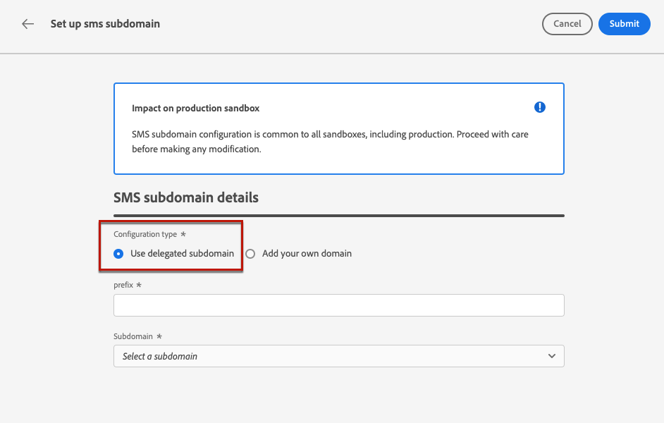

# Configurar subdomínios SMS {#lp-subdomains}

>[!CONTEXTUALHELP]
>id="ajo_admin_subdomain_sms_header"
>title="Delegar um subdomínio SMS"
>abstract="Você definirá seu subdomínio para uso de SMS. Você pode usar um subdomínio que já tenha sido delegado ao Adobe ou configurar outro subdomínio."

>[!CONTEXTUALHELP]
>id="ajo_admin_subdomain_sms"
>title="Delegar um subdomínio SMS"
>abstract="Você deve configurar um subdomínio para usar nas mensagens SMS, pois será necessário usar esse subdomínio para criar uma superfície de SMS. Você pode usar um subdomínio já delegado ao Adobe ou configurar um novo subdomínio."
>additional-url="https://experienceleague.adobe.com/docs/journey-optimizer/using/sms/sms-configuration.html#message-preset-sms" text="Criar superfícies de SMS"

>[!CONTEXTUALHELP]
>id="ajo_admin_config_sms_subdomain"
>title="Selecionar um subdomínio SMS"
>abstract="Para criar uma superfície de SMS, verifique se você configurou anteriormente pelo menos um subdomínio SMS para escolher na lista de nomes de subdomínio."
>additional-url="https://experienceleague.adobe.com/docs/journey-optimizer/using/sms/sms-configuration.html#message-preset-sms" text="Criar superfícies de SMS"

Para encurtar os URLs adicionados às suas mensagens SMS, você deve configurar o subdomínio que selecionará quando [criação de uma superfície de SMS](sms-configuration.md#message-preset-sms).

Você pode usar um subdomínio que já tenha sido delegado ao Adobe ou pode configurar outro subdomínio. Saiba mais sobre como delegar subdomínios ao Adobe [esta seção](../configuration/delegate-subdomain.md).

>[!CAUTION]
>
>A configuração do subdomínio SMS é comum a todos os ambientes. Portanto:
>
>* Para acessar e editar subdomínios SMS, você deve ter a variável **[!UICONTROL Gerenciar subdomínios de SMS]** permissão na sandbox de produção.
>
> * Qualquer modificação em um subdomínio SMS também afetará as sandboxes de produção.

## Usar um subdomínio existente {#sms-use-existing-subdomain}

Para usar um subdomínio que já tenha sido delegado ao Adobe, siga as etapas abaixo.

1. Acesse o **[!UICONTROL Administração]** > **[!UICONTROL Canais]** e selecione **[!UICONTROL Configuração de SMS]** > **[!UICONTROL Subdomínios SMS]**.

   

1. Clique em **[!UICONTROL Configurar subdomínio]**.

   

1. Selecionar **[!UICONTROL Usar subdomínio delegado]** do **[!UICONTROL Tipo de configuração]** seção.

   

1. Insira o prefixo que será exibido no URL do SMS.

   >[!NOTE]
   >
   >Somente caracteres alfanuméricos e hifens são permitidos.

1. Selecione um subdomínio delegado na lista.

   >[!NOTE]
   >
   >Não é possível selecionar um subdomínio que já esteja sendo usado como subdomínio SMS.

   <!--Capital letters are not allowed in subdomains. TBC by PM-->

   

   <!--Note that you cannot use multiple delegated subdomains of the same parent domain. For example, if 'marketing1.yourcompany.com' is already delegated to Adobe for your SMS messages, you will not be able to use 'marketing2.yourcompany.com'. However, multi-level subdomains being supported for SMS, you may proceed using a subdomain of 'marketing1.yourcompany.com' (such as 'email.marketing1.yourcompany.com'), or a different parent domain.-->

   >[!CAUTION]
   >
   >Se você selecionar um domínio que foi delegado ao Adobe usando a variável [método CNAME](../configuration/delegate-subdomain.md#cname-subdomain-delegation), você deve criar o registro DNS na plataforma de hospedagem. Para gerar o registro DNS, o processo é o mesmo que ao configurar um novo subdomínio SMS. Saiba mais sobre como [esta seção](#sms-configure-new-subdomain).

1. Clique em **[!UICONTROL Enviar]**.

1. Depois de enviado, o subdomínio é exibido na lista com a variável **[!UICONTROL Processamento]** status. Para obter mais informações sobre os status dos subdomínios, consulte [esta seção](../configuration/about-subdomain-delegation.md#access-delegated-subdomains).<!--Same statuses?-->

   >[!NOTE]
   >
   >Antes de poder usar esse subdomínio para enviar mensagens, você deve aguardar até que o Adobe execute as verificações necessárias, que podem levar até 4 horas.<!--Learn more in [this section](delegate-subdomain.md#subdomain-validation).-->

1. Depois que as verificações são bem-sucedidas, o subdomínio recebe o **[!UICONTROL Sucesso]** status. Ele está pronto para ser usado para criar superfícies de canal SMS.

## Configurar um novo subdomínio {#sms-configure-new-subdomain}

>[!CONTEXTUALHELP]
>id="ajo_admin_sms_subdomain_dns"
>title="Gerar o registro DNS correspondente"
>abstract="Para configurar um novo subdomínio SMS, você precisa copiar as informações do servidor de nomes do Adobe exibidas na interface do Journey Optimizer e colá-las em sua solução de hospedagem de domínio para gerar o registro DNS correspondente. Depois que as verificações forem bem-sucedidas, o subdomínio estará pronto para ser usado para criar superfícies de SMS."

Para configurar um novo subdomínio, siga as etapas abaixo.

1. Acesse o **[!UICONTROL Administração]** > **[!UICONTROL Canais]** e selecione **[!UICONTROL Configuração de SMS]** > **[!UICONTROL Subdomínios SMS]**.

1. Clique em **[!UICONTROL Configurar subdomínio]**.

1. Selecionar **[!UICONTROL Adicionar seu próprio domínio]** do **[!UICONTROL Tipo de configuração]** seção.

   

1. Especifique o subdomínio que será delegado.

   >[!CAUTION]
   >
   >Não é possível usar um subdomínio SMS existente.
   >
   >Letras maiúsculas não são permitidas em subdomínios.

   Não é permitido delegar um subdomínio inválido para Adobe. Certifique-se de inserir um subdomínio válido que seja de propriedade de sua organização, como marketing.suaempresa.com.

   >[!NOTE]
   >
   >Subdomínios de vários níveis (do mesmo domínio pai) são compatíveis. Por exemplo, você pode usar &#39;sms.marketing.suaempresa.com&#39;.

1. O registro a ser colocado em seus servidores DNS é exibido. Copie esse registro ou baixe um arquivo CSV e navegue até a solução de hospedagem de domínio para gerar o registro DNS correspondente.

1. Certifique-se de que o registro DNS foi gerado em sua solução de hospedagem de domínio. Se tudo estiver configurado corretamente, marque a caixa &quot;I confirm...&quot; e clique em **[!UICONTROL Enviar]**.

   

   >[!NOTE]
   >
   >Ao configurar um novo subdomínio SMS, ele sempre apontará para um registro CNAME.

1. Depois que a delegação de subdomínio for enviada, o subdomínio será exibido na lista com a variável **[!UICONTROL Processamento]** status. Para obter mais informações sobre os status dos subdomínios, consulte [esta seção](../configuration/about-subdomain-delegation.md#access-delegated-subdomains).<!--Same statuses?-->

   >[!NOTE]
   >
   >Antes de poder usar esse subdomínio para enviar mensagens SMS, você deve aguardar até que o Adobe execute as verificações necessárias, que podem levar até 4 horas.<!--Learn more in [this section](#subdomain-validation).-->

1. Depois que as verificações são bem-sucedidas, o subdomínio recebe o **[!UICONTROL Sucesso]** status. Ele está pronto para ser usado para criar superfícies de canal SMS.

   Observe que o subdomínio será marcado como **[!UICONTROL Falha]** se você não criar o registro de validação em sua solução de hospedagem.
