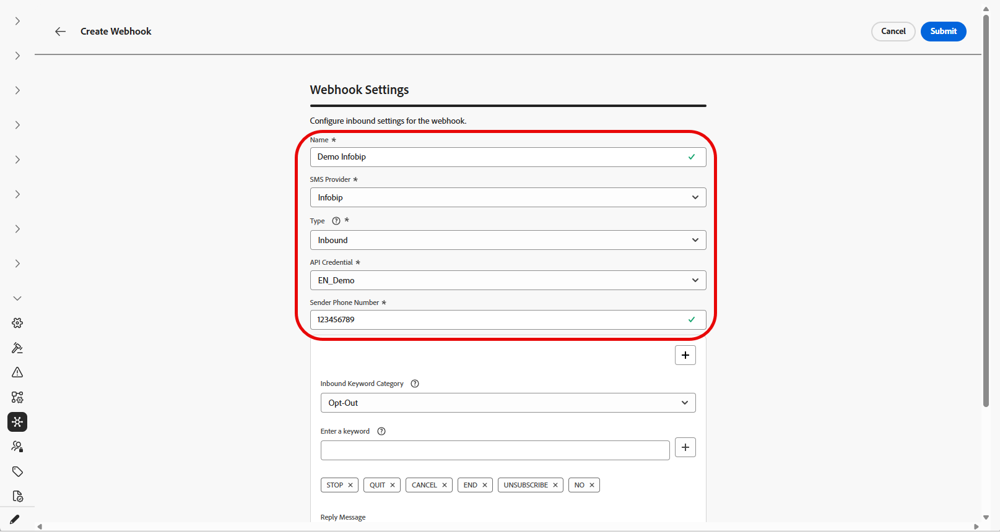
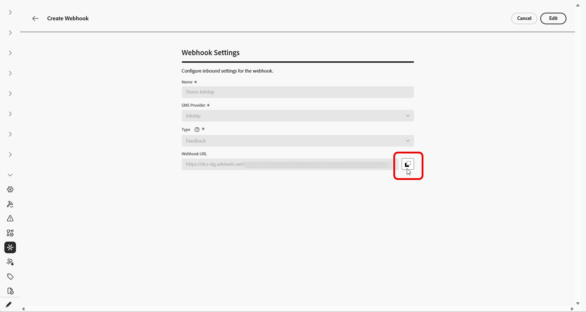
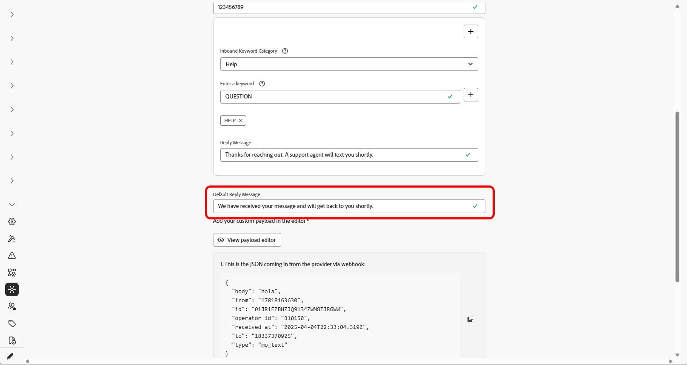

# Criar webhook {#webhook}

>[!CONTEXTUALHELP]
>id="ajo_channels_sms_webhook_settings_create"
>title="Criar um Webhook de SMS"
>abstract="Você pode configurar Webhooks para capturar respostas de entrada para gerenciar o consentimento de aceitação e recusa e para receber relatórios do delivery, incluindo confirmações de leitura, quando disponíveis."

>[!CONTEXTUALHELP]
>id="ajo_admin_sms_webhook_flow_type"
>title="Escolha o tipo de Webhook"
>abstract="Ao configurar um webhook, escolha **Entrada** para capturar respostas de consentimento e preferências do usuário ou **[!UICONTROL Feedback]** para rastrear eventos de entrega e envolvimento para relatórios e análise."

>[!BEGINSHADEBOX]

Quando novas credenciais de API são criadas no Journey Optimizer, os webhooks de SMS agora são a maneira de capturar palavras-chave de entrada e eventos de feedback como entregas e erros. Como cada provedor tem recursos diferentes, há instruções separadas para ativar webhooks.
Com os webhooks que agora oferecem suporte ao provedor personalizado, agora é possível coletar feedback e coleção de palavras-chave de entrada de qualquer provedor para ser relatado e aplicado no Journey Optimizer.

* **Novos clientes:** As instruções aqui podem ser seguidas para configurar webhooks de SMS corretamente.

* **Clientes existentes:** é possível migrar das informações armazenadas nas Credenciais da API para os Webhooks e não há linha do tempo para os clientes migrarem. Para clientes existentes que desejam migrar para Webhooks de SMS, as etapas de migração precisam ser executadas conforme documentado no guia de migração.

>[!ENDSHADEBOX]

## Visão geral {#overview}

Depois que suas credenciais de API forem criadas com êxito, você poderá configurar webhooks para capturar respostas de entrada para gerenciar o consentimento de aceitação e recusa e para receber relatórios do delivery, incluindo confirmações de leitura, quando disponíveis.

Ao configurar um webhook, você pode definir sua finalidade com base no tipo de dados que deseja capturar:

* **Entrada**: use esta opção se desejar capturar respostas de consentimento, como aceitação ou recusa, e coletar preferências do usuário.

* **Feedback**: escolha esta opção para rastrear eventos de entrega e participação, incluindo entregas, erros de saída, confirmações de leitura (se aplicável) para oferecer suporte a relatórios e análises.

Dependendo do seu provedor, haverá expectativas diferentes sobre o que precisa ser configurado para ter uma implementação de SMS bem-sucedida:

* **Conversação entre Sinch e Sinch**: crie um webhook que manipula eventos de entrada e de feedback. Nenhuma configuração de conteúdo é necessária.

* **Infobip**: crie dois webhooks separados, um para eventos de entrada e outro para eventos de feedback. Nenhuma configuração de carga é necessária para qualquer webhook.

* **Twilio**: os webhooks não estão disponíveis. Não há suporte para a coleta de dados de entrada e de feedback.

* **Provedor personalizado**: crie dois webhooks separados, um para eventos de entrada e outro para eventos de feedback. A configuração de carga é necessária para que ambos os webhooks funcionem corretamente.

### Suporte do provedor {#provider-support}

>[!NOTE]
>
>O único formato de webhook compatível é o JSON. Os dados de formulário para webhooks não são compatíveis.

A tabela a seguir mostra quais provedores oferecem suporte a webhooks de entrada e de feedback e se a criação de carga útil é necessária:

| Provedor | Webhook de entrada | Webhook de feedback | Palavras-chave | Criação de carga necessária | Webhook necessário | Criação de carga útil |
| --- | --- | --- | --- | --- | --- | --- |
| Infobip | Configurável | Configurável | Configurável | Não obrigatório | Obrigatório | Não obrigatório |
| Sinch | Configurável | Configurável | Configurável | Não obrigatório | Não. Integrado | N/D |
| Conversação do Sinch | Configurável | Configurável | Configurável | Não obrigatório | Não. Integrado | N/D |
| Twilio | Indisponível | Indisponível | Indisponível | Indisponível | Indisponível | N/D |
| Personalizado | Configurável | Configurável | Configurável | Obrigatório | Obrigatório | Obrigatório |

Para clientes que estão mudando de credenciais de API para webhooks de SMS, as informações sobre o caminho de migração são encontradas no guia de migração.

## Criar webhook

### Para conversa entre Sinch e Sinch {#create-webhook-sinch}

Para a Conversação entre Sinch e Sinch, crie um único webhook que lida com eventos de entrada e de feedback. Nenhuma configuração de carga personalizada é necessária.

1. No painel à esquerda, navegue até **[!UICONTROL Administração]** `>` **[!UICONTROL Canais]**, selecione o menu **[!UICONTROL Webhooks de SMS]** em **[!UICONTROL Configurações de SMS]** e clique no botão **[!UICONTROL Criar Webhook]**.

   

1. Defina as configurações do webhook, conforme detalhado abaixo:

   * **[!UICONTROL Nome]**: digite um nome para o webhook.

   * **[!UICONTROL Selecionar fornecedor de SMS]**: Sinch ou Sinch Conversational.

   * **[!UICONTROL Credenciais da API]**: escolha no menu suspenso suas [credenciais de API configuradas anteriormente](sms-configuration-sinch.md).

   * **[!UICONTROL Número de Telefone do Remetente]**: digite o número de telefone do remetente que você deseja usar para suas comunicações.

   

1. Comece a configurar as palavras-chave de entrada inserindo palavras-chave no campo **[!UICONTROL Inserir uma Palavra-chave]**. Várias palavras-chave podem ser adicionadas e removidas. Observe que palavras-chave não diferenciam maiúsculas de minúsculas.

   

1. Selecione uma categoria de palavra-chave no menu suspenso **[!UICONTROL Categoria de Palavra-chave de Entrada]** para configurar:

   +++ Opt-In

   * Ative as palavras-chave que aceitam os usuários com seu consentimento. Quando a mensagem de um usuário corresponde a uma palavra-chave configurada, seu número de telefone é aceito para receber mensagens SMS.

   * Por padrão, as seguintes palavras-chave são ativadas: Subscribe, Yes, Unstop, Continue, Resume e Begin. Remova quaisquer palavras-chave padrão clicando em .

   * Use o campo **[!UICONTROL Responder Mensagem]** para criar uma mensagem que é enviada automaticamente quando a mensagem de entrada de um usuário corresponde a uma palavra-chave de aceitação.

   +++

   +++ Recusar

   * Ative palavras-chave que recusam usuários e remova o consentimento para enviar mensagens de texto. Quando a mensagem de um usuário corresponde a uma palavra-chave configurada, o número de telefone dele não recebe mensagens SMS.

   * Por padrão, as seguintes palavras-chave são ativadas: Stop, Quit, Cancel, End, Unsubscribe, No. Remova quaisquer palavras-chave padrão clicando em .

   * Use o campo **[!UICONTROL Responder Mensagem]** para criar uma mensagem que é enviada automaticamente quando a mensagem de entrada de um usuário corresponde a uma palavra-chave de recusa.

   * Habilite a **[!UICONTROL Lógica Difusa]** para detectar palavras-chave semelhantes a palavras-chave de Recusa configuradas. Se a resposta de um usuário for fechada, mas não exata, a mensagem inserida no campo **[!UICONTROL Resposta Automática Difusa]** será enviada. Normalmente, essa mensagem indica que a recusa não ocorreu e especifica a palavra-chave exata necessária para cancelar a inscrição.

   +++

   +++ Aceitação dupla

   * Ative palavras-chave para o requisito de aceitação dupla. Quando a mensagem de um usuário corresponde a uma palavra-chave configurada, ele não é totalmente aceito nesse estágio. Esse fluxo de trabalho de consentimento em duas etapas requer que os usuários confirmem sua aceitação com uma segunda palavra-chave.

   * Use o campo **[!UICONTROL Responder Mensagem]** para criar uma mensagem que é enviada automaticamente quando uma palavra-chave de aceitação dupla é correspondida. Essa mensagem instrui o usuário a inserir uma palavra-chave de aceitação para concluir o processo de aceitação.

   +++

   +++ Ajuda

   * Ative palavras-chave que fornecem uma resposta padrão quando a ajuda é solicitada. Quando a mensagem de um usuário corresponde a uma palavra-chave configurada, ele recebe a mensagem Ajuda.

   * Por padrão, as seguintes palavras-chave são ativadas: Ajuda, Informações, Informações. Remova quaisquer palavras-chave padrão clicando em .

   * Use o campo **[!UICONTROL Responder Mensagem]** para criar uma mensagem que é enviada automaticamente quando a mensagem de entrada de um usuário corresponde a uma palavra-chave da Ajuda.

   +++

   +++ Personalizado

   * Configure uma única palavra-chave personalizada. Quando a mensagem de um usuário corresponde a esta palavra-chave, ela é gravada no conjunto de dados **[!UICONTROL Acompanhamento de feedback]** da mensagem para criação de relatórios e público-alvo.

   * Crie um Público (streaming ou lote) que faça referência a essa palavra-chave para uso em suas jornadas e campanhas.

   +++

1. Insira uma **[!UICONTROL Mensagem de Resposta Padrão]**. Esta mensagem é enviada automaticamente quando a resposta de um usuário não corresponde a nenhuma palavra-chave configurada.

   

1. Clique em **[!UICONTROL Enviar]** para salvar a configuração do webhook.

1. No menu **[!UICONTROL Webhooks]**, você pode editar ou excluir webhooks existentes.

1. Acesse o Webhook recém-criado e copie a **[!UICONTROL URL do Webhook]**.

   

1. Use sua **[!UICONTROL URL do Webhook]** para habilitar os eventos de **Feedback** e **Entrada** para entrar no Journey Optimizer.

   * Para o canal SMS, [saiba mais na documentação do Sinch](https://community.sinch.com/t5/SMS/How-do-I-assign-a-callback-URL-to-an-SMS-service/ta-p/8414)

   * Para o canal MMS, [saiba mais na documentação do Sinch](https://developers.sinch.com/docs/conversation/getting-started#5-handle-incoming-messages)

   * Para clientes que compraram SMS diretamente pelo Journey Optimizer, registre um tíquete de suporte com o suporte da Adobe. A equipe de conta da Adobe configurará o URL do webhook para você.
     

Se o webhook usar credenciais de API anexadas a uma configuração de canal existente, o webhook entrará em vigor imediatamente. Caso contrário, crie uma nova configuração de canal.

➡️[Saiba mais sobre a configuração de canal](sms-configuration-surface.md)

### Para Infobip {#create-webhook-infobip}

Para o Infobip, crie dois webhooks separados: um para eventos de Feedback e outro para eventos de Entrada.

1. No painel à esquerda, navegue até **[!UICONTROL Administração]** `>` **[!UICONTROL Canais]**, selecione o menu **[!UICONTROL Webhooks de SMS]** em **[!UICONTROL Configurações de SMS]** e clique no botão **[!UICONTROL Criar Webhook]**.

   

1. Defina as configurações do webhook, conforme detalhado abaixo:

   * **[!UICONTROL Nome]**: digite um nome para o webhook.

   * **[!UICONTROL Selecionar fornecedor de SMS]**: Infobip.

   * **[!UICONTROL Tipo]**: escolha Feedback ou Entrada. Você precisa criar ambos separadamente, aqui, começamos com a Entrada.

   * **[!UICONTROL Credenciais da API]**: escolha no menu suspenso suas [credenciais de API configuradas anteriormente](sms-configuration-infobip.md#api-credential).

   * **[!UICONTROL Número de Telefone do Remetente]**: digite o número de telefone do remetente que você deseja usar para suas comunicações.

   

1. Comece a configurar as palavras-chave de entrada inserindo palavras-chave no campo **[!UICONTROL Inserir uma Palavra-chave]**. Várias palavras-chave podem ser adicionadas e removidas. Observe que palavras-chave não diferenciam maiúsculas de minúsculas.

   

1. Selecione uma categoria de palavra-chave no menu suspenso **[!UICONTROL Categoria de Palavra-chave de Entrada]** para configurar:

   +++ Opt-In

   * Ative as palavras-chave que aceitam os usuários com seu consentimento. Quando a mensagem de um usuário corresponde a uma palavra-chave configurada, seu número de telefone é aceito para receber mensagens SMS.

   * Por padrão, as seguintes palavras-chave são ativadas: Subscribe, Yes, Unstop, Continue, Resume e Begin. Remova quaisquer palavras-chave padrão clicando em .

   * Use o campo **[!UICONTROL Responder Mensagem]** para criar uma mensagem que é enviada automaticamente quando a mensagem de entrada de um usuário corresponde a uma palavra-chave de aceitação.

   +++

   +++ Recusar

   * Ative palavras-chave que recusam usuários e remova o consentimento para enviar mensagens de texto. Quando a mensagem de um usuário corresponde a uma palavra-chave configurada, o número de telefone dele não recebe mensagens SMS.

   * Por padrão, as seguintes palavras-chave são ativadas: Stop, Quit, Cancel, End, Unsubscribe, No. Remova quaisquer palavras-chave padrão clicando em .

   * Use o campo **[!UICONTROL Responder Mensagem]** para criar uma mensagem que é enviada automaticamente quando a mensagem de entrada de um usuário corresponde a uma palavra-chave de recusa.

   * Habilite a **[!UICONTROL Lógica Difusa]** para detectar palavras-chave semelhantes a palavras-chave de Recusa configuradas. Se a resposta de um usuário for fechada, mas não exata, a mensagem inserida no campo **[!UICONTROL Resposta Automática Difusa]** será enviada. Normalmente, essa mensagem indica que a recusa não ocorreu e especifica a palavra-chave exata necessária para cancelar a inscrição.

   +++

   +++ Aceitação dupla

   * Ative palavras-chave para o requisito de aceitação dupla. Quando a mensagem de um usuário corresponde a uma palavra-chave configurada, ele não é totalmente aceito nesse estágio. Esse fluxo de trabalho de consentimento em duas etapas requer que os usuários confirmem sua aceitação com uma segunda palavra-chave.

   * Use o campo **[!UICONTROL Responder Mensagem]** para criar uma mensagem que é enviada automaticamente quando uma palavra-chave de aceitação dupla é correspondida. Essa mensagem instrui o usuário a inserir uma palavra-chave de aceitação para concluir o processo de aceitação.

   +++

   +++ Ajuda

   * Ative palavras-chave que fornecem uma resposta padrão quando a ajuda é solicitada. Quando a mensagem de um usuário corresponde a uma palavra-chave configurada, ele recebe a mensagem Ajuda.

   * Por padrão, as seguintes palavras-chave são ativadas: Ajuda, Informações, Informações. Remova quaisquer palavras-chave padrão clicando em .

   * Use o campo **[!UICONTROL Responder Mensagem]** para criar uma mensagem que é enviada automaticamente quando a mensagem de entrada de um usuário corresponde a uma palavra-chave da Ajuda.

   +++

   +++ Personalizado

   * Configure uma única palavra-chave personalizada. Quando a mensagem de um usuário corresponde a esta palavra-chave, ela é gravada no conjunto de dados **[!UICONTROL Acompanhamento de feedback]** da mensagem para criação de relatórios e público-alvo.

   * Crie um Público (streaming ou lote) que faça referência a essa palavra-chave para uso em suas jornadas e campanhas.

   +++

1. Insira uma **[!UICONTROL Mensagem de Resposta Padrão]**. Esta mensagem é enviada automaticamente quando a resposta de um usuário não corresponde a nenhuma palavra-chave configurada.

   

1. Clique em **[!UICONTROL Enviar]** para salvar a configuração do webhook.

1. No menu **[!UICONTROL Webhooks]**, agora é necessário criar um webhook **Feedback** para o Infobip.

1. Defina as configurações do webhook, conforme detalhado abaixo:

   * **[!UICONTROL Nome]**: digite um nome para o webhook.

   * **[!UICONTROL Selecionar fornecedor de SMS]**: Infobip.

   * **[!UICONTROL Tipo]**: Escolher Comentários.

   

1. Clique em **[!UICONTROL Enviar]** para salvar sua configuração de webhook de Comentários.

1. No menu **[!UICONTROL Webhooks]**, você pode editar ou excluir webhooks existentes.

1. Acesse os Webhooks recém-criados e copie a **[!UICONTROL URL do Webhook]** de cada um deles.

   

1. Agora você pode usar esses URLs para ativar URLs de retorno de chamada para trazer eventos de feedback e de entrada para a Journey Optimizer.

Se o webhook usar credenciais de API anexadas a uma configuração de canal existente, o webhook entrará em vigor imediatamente. Caso contrário, crie uma nova configuração de canal.

➡️[Saiba mais sobre a configuração de canal](sms-configuration-surface.md)

### Para provedor personalizado {#create-webhook-custom}

Para provedores de SMS personalizados, crie dois webhooks separados: um para eventos de Feedback e outro para eventos de Entrada.

1. No painel à esquerda, navegue até **[!UICONTROL Administração]** `>` **[!UICONTROL Canais]**, selecione o menu **[!UICONTROL Webhooks de SMS]** em **[!UICONTROL Configurações de SMS]** e clique no botão **[!UICONTROL Criar Webhook]**.

   

1. Defina as configurações do webhook, conforme detalhado abaixo:

   * **[!UICONTROL Nome]**: digite um nome para o webhook.

   * **[!UICONTROL Selecionar fornecedor de SMS]**: personalizado.

   * **[!UICONTROL Tipo]**: escolha Feedback ou Entrada. Você precisa criar ambos separadamente, aqui, começamos com a Entrada.

   * **[!UICONTROL Credenciais da API]**: escolha no menu suspenso suas [credenciais de API configuradas anteriormente](sms-configuration-custom.md).

   * **[!UICONTROL Número de Telefone do Remetente]**: digite o número de telefone do remetente que você deseja usar para suas comunicações.

   

1. Comece a configurar as palavras-chave de entrada inserindo palavras-chave no campo **[!UICONTROL Inserir uma Palavra-chave]**. Várias palavras-chave podem ser adicionadas e removidas. Observe que palavras-chave não diferenciam maiúsculas de minúsculas.

   

1. Selecione uma categoria de palavra-chave no menu suspenso **[!UICONTROL Categoria de Palavra-chave de Entrada]** para configurar:

   +++ Opt-In

   * Ative as palavras-chave que aceitam os usuários com seu consentimento. Quando a mensagem de um usuário corresponde a uma palavra-chave configurada, seu número de telefone é aceito para receber mensagens SMS.

   * Por padrão, as seguintes palavras-chave são ativadas: Subscribe, Yes, Unstop, Continue, Resume e Begin. Remova quaisquer palavras-chave padrão clicando em .

   * Use o campo **[!UICONTROL Responder Mensagem]** para criar uma mensagem que é enviada automaticamente quando a mensagem de entrada de um usuário corresponde a uma palavra-chave de aceitação.

   +++

   +++ Recusar

   * Ative palavras-chave que recusam usuários e remova o consentimento para enviar mensagens de texto. Quando a mensagem de um usuário corresponde a uma palavra-chave configurada, o número de telefone dele não recebe mensagens SMS.

   * Por padrão, as seguintes palavras-chave são ativadas: Stop, Quit, Cancel, End, Unsubscribe, No. Remova quaisquer palavras-chave padrão clicando em .

   * Use o campo **[!UICONTROL Responder Mensagem]** para criar uma mensagem que é enviada automaticamente quando a mensagem de entrada de um usuário corresponde a uma palavra-chave de recusa.

   * Habilite a **[!UICONTROL Lógica Difusa]** para detectar palavras-chave semelhantes a palavras-chave de Recusa configuradas. Se a resposta de um usuário for fechada, mas não exata, a mensagem inserida no campo **[!UICONTROL Resposta Automática Difusa]** será enviada. Normalmente, essa mensagem indica que a recusa não ocorreu e especifica a palavra-chave exata necessária para cancelar a inscrição.

   +++

   +++ Aceitação dupla

   * Ative palavras-chave para o requisito de aceitação dupla. Quando a mensagem de um usuário corresponde a uma palavra-chave configurada, ele não é totalmente aceito nesse estágio. Esse fluxo de trabalho de consentimento em duas etapas requer que os usuários confirmem sua aceitação com uma segunda palavra-chave.

   * Use o campo **[!UICONTROL Responder Mensagem]** para criar uma mensagem que é enviada automaticamente quando uma palavra-chave de aceitação dupla é correspondida. Essa mensagem instrui o usuário a inserir uma palavra-chave de aceitação para concluir o processo de aceitação.

   +++

   +++ Ajuda

   * Ative palavras-chave que fornecem uma resposta padrão quando a ajuda é solicitada. Quando a mensagem de um usuário corresponde a uma palavra-chave configurada, ele recebe a mensagem Ajuda.

   * Por padrão, as seguintes palavras-chave são ativadas: Ajuda, Informações, Informações. Remova quaisquer palavras-chave padrão clicando em .

   * Use o campo **[!UICONTROL Responder Mensagem]** para criar uma mensagem que é enviada automaticamente quando a mensagem de entrada de um usuário corresponde a uma palavra-chave da Ajuda.

   +++

   +++ Personalizado

   * Configure uma única palavra-chave personalizada. Quando a mensagem de um usuário corresponde a esta palavra-chave, ela é gravada no conjunto de dados **[!UICONTROL Acompanhamento de feedback]** da mensagem para criação de relatórios e público-alvo.

   * Crie um Público (streaming ou lote) que faça referência a essa palavra-chave para uso em suas jornadas e campanhas.

   +++

1. Insira uma **[!UICONTROL Mensagem de Resposta Padrão]**. Esta mensagem é enviada automaticamente quando a resposta de um usuário não corresponde a nenhuma palavra-chave configurada.

   

1. Crie uma carga personalizada que corresponda ao JSON proveniente do provedor. Observe que o único formato de webhook compatível é o JSON. Os dados de formulário para webhooks não são compatíveis.

   O webhook de entrada requer os seguintes campos para receber valores do webhook do seu provedor:

   * **InboundMessage**: a mensagem ou palavra-chave de entrada recebida do usuário.
   * **ProfileNumber**: o número de telefone do usuário que enviou a mensagem.
   * **RequestID**: um identificador exclusivo fornecido pelo seu provedor de SMS para identificar uma transação específica.
   * **OriginTimestamp**: O carimbo de data/hora quando a mensagem é recebida, no formato UTC.
   * **InboundNumber**: o número de telefone usado para esta configuração de webhook.

   +++Exemplo de conteúdo

       &quot;json
       {
       &quot;mensagem de entrada&quot;: &quot;{{inboundMessage}}&quot;,
       &quot;profileNumber&quot;: &quot;{{profileNumber}}&quot;,
       &quot;requestId&quot;: &quot;{{requestId}}&quot;,
       &quot;originTimestamp&quot;: &quot;{{originTimestamp}}&quot;,
       &quot;inboundNumber&quot;: &quot;{{inboundNumber}}&quot;
       
       &quot;
   +++

1. Quando o arquivo JSON for criado, clique em **[!UICONTROL Exibir editor de carga]**, copie e cole sua carga JSON no editor e salve-a.

   

1. Clique em **[!UICONTROL Enviar]** para salvar a configuração do webhook.

1. No menu **[!UICONTROL Webhooks]**, agora é necessário criar um webhook **Feedback** para o provedor personalizado.

1. Defina as configurações do webhook, conforme detalhado abaixo:

   * **[!UICONTROL Nome]**: digite um nome para o webhook.

   * **[!UICONTROL Selecionar fornecedor de SMS]**: personalizado.

   * **[!UICONTROL Tipo]**: Escolher Comentários.

   

1. Crie uma carga personalizada que corresponda ao formato JSON do seu provedor. Observe que o único formato de webhook compatível é o JSON. Os dados de formulário para webhooks não são compatíveis.

   O webhook de feedback requer os seguintes campos para receber valores do webhook do seu provedor:

   * **Referência de Cliente**: um identificador exclusivo retornado na carga para fins de registro em log.
   * **Código**: o código de falha fornecido pelo seu provedor de SMS.
   * **Status**: o status de falha fornecido pelo seu provedor de SMS.

   +++Exemplo de conteúdo

       &quot;json
       {
       &quot;clientReference&quot;: &quot;{{client_reference}}&quot;,
       &quot;status&quot;: [
       {
       &quot;código&quot;: &quot;{{failureCode}}&quot;,
       &quot;status&quot;: &quot;{{feedbackStatus}}&quot;
       
       ]
       
       &quot;
   
   +++

1. Clique em **[!UICONTROL Exibir editor de carga]**, copie e cole sua carga JSON no editor e salve-a.

   

1. Clique em **[!UICONTROL Enviar]** para salvar sua configuração de webhook de Comentários.

1. No menu **[!UICONTROL Webhooks]**, você pode editar ou excluir webhooks existentes.

1. Acesse os Webhooks recém-criados e copie a **[!UICONTROL URL do Webhook]** de cada um deles.

1. Configure seu provedor de SMS para enviar eventos de **Feedback** e **Entrada** para essas URLs de webhook no Journey Optimizer.

   As instruções de configuração variam por provedor de SMS. Consulte a documentação do provedor para obter detalhes sobre como configurar URLs de retorno de chamada.

Se o webhook usar credenciais de API anexadas a uma configuração de canal existente, o webhook entrará em vigor imediatamente. Caso contrário, crie uma nova configuração de canal.

➡️[Saiba mais sobre a configuração de canal](sms-configuration-surface.md)
