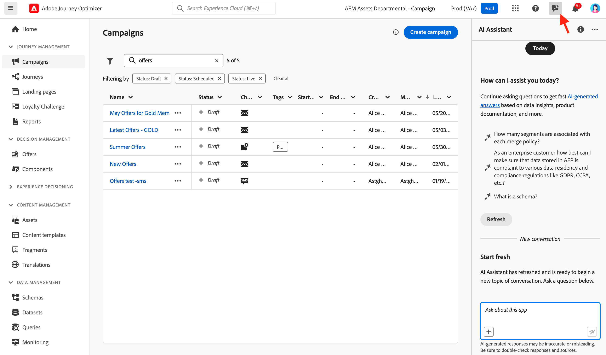
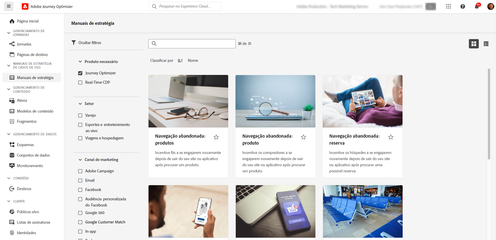

# IA e recursos inteligentes {#ai-features}

>[!BEGINSHADEBOX]

**Nesta página:** Explore os recursos de IA e aprendizado de máquina em toda a Adobe Journey Optimizer, desde o Assistente de IA e agentes até a geração de conteúdo, integrações e ferramentas alimentadas por IA, como o GenStudio e o servidor MCP, otimização de tempo de envio e tomada de decisão, para que você possa trabalhar mais rápido e fornecer experiências mais relevantes ao cliente.

>[!ENDSHADEBOX]

A Adobe Journey Optimizer aproveita o poder da inteligência artificial e do aprendizado de máquina para ajudá-lo a criar, otimizar e fornecer experiências excepcionais para o cliente. Desde a geração de conteúdo personalizado até a previsão de tempos de envio ideais, os recursos de IA simplificam o fluxo de trabalho e maximizam o impacto. Os manuais de casos de uso fornecem modelos pré-criados para implementar rapidamente cenários de marketing comuns.

## Navegação rápida {#quick-navigation}

Use estes links agrupados para ir para o recurso que você precisa:

* **IA de conversa e agentes:** [Assistente de IA](#ai-assistant), [Journey Agent](#journey-agent), [Experimentation Agent](#experimentation-agent), [Agentes de IA adicionais](#additional-ai-agents)
* **Criação de conteúdo:** [Geração de conteúdo habilitada por IA](#content-generation)
* **Integrações e ferramentas alimentadas por IA:** [Conversor de Imagem para HTML](#image-to-html), [GenStudio para marketing de desempenho](#genstudio), [Pontuação de alinhamento de marca](#brand-alignment), [Servidor MCP do Adobe Journey Optimizer](#mcp-server)
* **Otimização e decisão:** [Otimização de Tempo de Envio](#send-time-optimization), [Modelos de IA para decisão](#ai-decisioning), [Regra habilitada por IA e otimização de fórmula](#decisioning-optimization)
* **Experimentação:** [Experimentação de conteúdo com IA](#experimentation)
* **Modelos:** [Guias de reprodução de casos de uso](#playbooks)
* **Ajuda:** [Perguntas frequentes](#faq)

## Assistente de IA {#ai-assistant}

O Assistente de IA é seu guia conversacional do Adobe Journey Optimizer. Use-o para obter respostas instantâneas sobre os recursos do produto, insights operacionais sobre suas jornadas e ajuda para navegar na plataforma.

### Acessar o Assistente de IA

Clique no ícone do Assistente de IA na barra superior para abrir o painel do assistente no lado direito da tela.

>[!IMPORTANT]
>
>Você deve concordar com as [Diretrizes de usuário da IA gerativa da Adobe Experience Cloud](https://experienceleague.adobe.com/pt-br/docs/experience-platform/ai-assistant/home){target="_blank"} antes de usar o Assistente de IA.

### O que o assistente de IA pode fazer

**Conhecimento do Produto** - Faça perguntas sobre os recursos e conceitos do Adobe Journey Optimizer:

* &quot;Como configurar uma campanha no Adobe Journey Optimizer?&quot;
* &quot;Como criar uma ação personalizada para usar no jornada?&quot;
* &quot;Quantas atividades ativas posso ter em uma sandbox?&quot;

**Insights Operacionais (Beta)** - Obtenha informações em tempo real sobre suas jornadas:

* &quot;Quantas jornadas ao vivo eu tenho?&quot;
* &quot;Dê-me uma lista de todas as jornadas agendadas&quot;
* &quot;Quantas jornadas foram criadas nos últimos sete dias?&quot;

>[!NOTE]
>
>Os insights operacionais estão disponíveis atualmente apenas para **Jornada** e refletem dados da sua sandbox atual.

### Como usar o assistente de IA

1. Insira a sua pergunta no campo de texto na parte inferior do painel
2. Pressione Enter para enviar sua consulta
3. Revisar a resposta gerada pela IA
4. Clique em **Mostrar fontes** para acessar a documentação relacionada
5. Use miniaturas para cima/para baixo para classificar a qualidade da resposta

{width="40%"}

[Saiba mais sobre o Assistente de IA no Experience Platform](https://experienceleague.adobe.com/pt-br/docs/experience-platform/ai-assistant/home){target="_blank"}

## Agentes avançados de IA para otimização de Jornada {#ai-agents}

Com base nos recursos conversacionais do Assistente de IA, o Adobe Journey Optimizer oferece agentes de IA especializados que fornecem análise detalhada e recomendações acionáveis para otimização e experimentação de jornadas.

### Journey Agent {#journey-agent}

O Journey Agent inclui duas habilidades no Assistente de IA: Analisar e Criar. Use-as para otimizar jornadas existentes ou criar novas a partir de prompts de linguagem natural.

+++**Permissões necessárias**

* **Exibir Jornadas** - Exibir insights sobre jornadas diretamente no Assistente de IA
* **Gerenciar Jornadas** - Criar novas jornadas diretamente no Assistente de IA
* **Exibir segmentos** - Exibir insights sobre públicos e pesquisar públicos existentes
* **Gerenciar segmentos** - Crie novos públicos diretamente no Assistente de IA
* **Exibir Eventos, Fontes de Dados e Ações da Jornada** - Necessário para que a habilidade Criar pesquise eventos de jornada e ações personalizadas

+++

#### Jornada habilidade de análise {#journey-analyze-skill}

O [Agente de Análise de Jornada](https://experienceleague.adobe.com/en/docs/experience-cloud-ai/experience-cloud-ai/agents/ajo-agent#journey-analyze-use-cases-agentic-skills-and-user-guide){target="_blank"} ajuda a otimizar o desempenho da jornada por meio da análise de linguagem natural:

+++**Principais Recursos**

* **Análise de Fallout de Jornada** - Identifique onde e por que os clientes abandonam durante as jornadas e detecte padrões de separação
* **Detecção de sobreposição de público-alvo** - Analise a sobreposição de público-alvo em várias jornadas para evitar a fadiga devido ao excesso de direcionamento
* **Detecção de Conflito de Agendamento** - Identifique conflitos de tempo entre jornadas agendadas direcionadas para o mesmo público
* **Insights Operacionais** - Obtenha insights baseados em prompts como &quot;mostrar todas as jornadas ativas&quot; ou &quot;quais públicos são usados em mais de X jornadas&quot;

+++

+++**Prompts de Exemplo**

* &quot;Executar uma análise de fallout para a jornada \[Nome da Jornada\]&quot;
* &quot;Há algum conflito de agendamento para a jornada \[Nome da Jornada\]?&quot;
* &quot;Mostrar conflitos de sobreposição de público-alvo para a jornada \[Nome da Jornada\]&quot;
* &quot;Quais públicos-alvo são usados em mais de cinco jornadas?&quot;

+++

#### Jornada criação de habilidade {#journey-create-skill}

O [Agente de Criação de Jornadas](https://experienceleague.adobe.com/en/docs/experience-cloud-ai/experience-cloud-ai/agents/ajo-agent#journey-create-use-cases-agentic-skills-and-user-guide){target="_blank"} ajuda a criar jornadas com base em prompts de linguagem natural, traduzindo suas metas em configurações de jornada estruturadas:

+++**Principais Recursos**

* **Criação da Jornada de linguagem natural** - Descreva a jornada desejada e faça-a criar automaticamente
* **Inícios com base em evento e público-alvo** - Crie jornadas de qualificação de evento, de evento comercial ou de público-alvo acionadas por eventos
* **Lógica condicional** - Criar caminhos divididos com base em atributos ou comportamento do cliente
* **Mensagens multicanal** - Adicionar ações de email, push e SMS
* **Agendamento** - Configurar datas de início e tempo entre etapas

+++

+++**Prompts de Exemplo**

* &quot;Crie uma jornada que começa quando um cliente faz uma compra on-line e envia uma notificação de agradecimento por push.&quot;
* &quot;Crie uma jornada direcionada ao meu público-alvo de visitantes do dia com três emails em duas semanas, a partir de 20/12.&quot;
* &quot;Crie uma jornada que começa quando um usuário entra no local da minha loja e faz o acompanhamento com base no fato de ele ter um endereço de email válido.&quot;

+++

### Experimentation Agent {#experimentation-agent}

O [Experimentation Agent](https://experienceleague.adobe.com/pt-br/docs/experience-cloud-ai/experience-cloud-ai/agents/agent-experiment){target="_blank"} moderniza a forma como você executa e gerencia experimentos digitais em sites, emails, mensagens por push e aplicativos:

+++**Principais Recursos**

* **Análise de desempenho** - Uma visão clara do que aconteceu em experimentos
* **Geração de Insights** - Explicação do motivo da ocorrência de resultados
* **Descoberta de Oportunidades** - Orientação sobre as próximas ações a serem executadas
* **Análise de conteúdo** - Examine elementos de mensagens para entender por que certos tratamentos tiveram desempenho melhor que outros
* **Geração de recomendação** - Sugira novos tratamentos ou ajustes com base em insights

+++

+++**Prompts de Exemplo**

* &quot;Quais experimentos estão sendo executados para \[Nome da campanha\]?&quot;
* &quot;Para meu \[Nome do experimento\], qual tratamento está liderando?&quot;
* &quot;O que aprendemos com o \[Nome do experimento\]?&quot;
* &quot;O que você recomenda que eu faça depois deste experimento?&quot;
* &quot;Quais padrões comuns estão emergindo dos testes recentes?&quot;

+++

+++**Permissões necessárias**

* **Exibir experimentos** - Exibir insights sobre experimentos no Assistente de IA
* **Gerenciar metadados de experimento** - Criar novos experimentos no Assistente de IA

**Observação:** disponível com licença do Journey Optimizer Experimentation Accelerator.

+++

### Agentes de IA adicionais {#additional-ai-agents}

**Audience Agent** - Para exploração e gerenciamento de público-alvo conversacional em toda a Adobe Experience Platform, incluindo detecção de duplicidade e rastreamento de tamanho. [Saiba mais sobre o Audience Agent](https://experienceleague.adobe.com/en/docs/experience-cloud-ai/experience-cloud-ai/agents/audience){target="_blank"}

**Agent Orchestrator** - Coordena vários agentes especializados para solucionar desafios de marketing complexos de várias etapas. O orquestrador determina automaticamente quais agentes envolver e sequencia seu trabalho com eficiência. [Saiba mais sobre o Agent Orchestrator](https://experienceleague.adobe.com/pt-br/docs/experience-cloud-ai/experience-cloud-ai/agents/agent-orchestrator){target="_blank"}

## Geração de conteúdo alimentado por IA {#content-generation}

Use a IA generativa para criar e personalizar o conteúdo em vários canais, acelerando o processo de criação de conteúdo e mantendo a consistência da marca. O Assistente de IA para geração de conteúdo está disponível para experiências de [email](../email/get-started-email.md), [notificações por push](../push/get-started-push.md), [SMS](../mobile/get-started-mobile.md) e [web](../web/get-started-web.md) - ajudando a gerar linhas de assunto, corpo do texto, imagens e variações completas de mensagens.

### Recursos principais

* **Geração de conteúdo completo** - Gere experiências de conteúdo completas (texto e imagens) em um fluxo para email, Web, páginas de aterrissagem e push. [Gerar conteúdo completo com o Assistente de IA](../content-management/generative-full-content.md)
* **Geração de texto** - Crie uma cópia atraente com base na voz e nos objetivos de sua marca. [Gerar texto com IA](../content-management/generative-text.md)
* **Geração de imagem** - Gere imagens personalizadas usando o Adobe Firefly. [Gerar imagens com IA](../content-management/generative-image.md)
* **Variações de conteúdo** - Produza várias variações para teste A/B. [Experimento de conteúdo com IA](../content-management/generative-experimentation.md)
* **Personalization** - Gere novas expressões, explique o código existente ou corrija problemas com o Assistente de IA no Editor do Personalization ou na barra de ferramentas do Email Designer (**Adicionar expressão**). [Assistente de IA para expressões Personalization](../content-management/generative-personalization-expressions.md)
* **Alinhamento da marca** - Verifique se o conteúdo gerado corresponde às diretrizes da sua marca. [Avaliar o alinhamento da marca](../content-management/brands-score.md)
* **Suporte a Modelos** - Utilize seus modelos de email existentes. [Trabalhar com modelos de conteúdo](../content-management/content-templates.md)

### Práticas recomendadas

* **Seja específico** - Forneça prompts claros e detalhados para obter melhores resultados. [Saiba mais sobre as práticas recomendadas do prompt](../content-management/ai-assistant-prompting-guide.md)
* **Carregar ativos da marca** - Use PDFs, imagens ou arquivos ZIP (máx. 50 MB) para manter a consistência da marca
* **Usar modelos personalizados** - Utilize modelos específicos da marca com até 8-10 imagens
* **Fornecer feedback** - Classifique as saídas para ajudar a melhorar os modelos de IA
* **Revisar todo o conteúdo** - Sempre revise a precisão do conteúdo gerado pela IA antes de publicar

[Saiba mais sobre a geração de conteúdo de IA](../content-management/gs-generative.md)

## Integrações e ferramentas alimentadas por IA {#additional-capabilities}

### Conversor de imagem para HTML {#image-to-html}

Transforme designs de imagem estática (JPEG, PNG) em modelos de email editáveis do HTML usando tecnologia de conversão habilitada por IA.

[Saiba mais sobre imagem para o HTML](../content-management/image-to-html.md)

### GenStudio para marketing de desempenho {#genstudio}

Integre com o Adobe GenStudio for Performance Marketing para criar conteúdo de email alimentado por IA e importar modelos no Journey Optimizer para orquestração. Exporte modelos do Journey Optimizer para o GenStudio, gere variações com IA e traga-os de volta para implantação. (Disponibilidade limitada, somente canal de email.)

[Saiba mais sobre o GenStudio](../integrations/genstudio.md)

### Classificação de alinhamento da marca {#brand-alignment}

Avalie como seu conteúdo se alinha às diretrizes da sua marca usando a pontuação alimentada por IA que mede a consistência do tom, da voz e da mensagem.

[Saiba mais sobre o Alinhamento da marca](../content-management/brands-score.md)

### Servidor MCP do Adobe Journey Optimizer (Beta) {#mcp-server}

Conecte o Adobe Journey Optimizer a aplicativos de IA compatíveis com MCP, como Claude Web, Claude Desktop e Cursor, usando o Protocolo de contexto de modelo (MCP). O servidor MCP permite consultar campanhas, jornadas, ofertas e configurações de canal com prompts em linguagem simples — não é necessária nenhuma chamada de API ou navegação na interface. Atualmente, todas as operações são somente leitura.

[Saiba mais sobre o servidor MCP do Journey Optimizer](../integrations/ajo-mcp.md)

## Otimização de tempo de envio {#send-time-optimization}

Use a IA para prever o momento ideal para enviar cada mensagem com base em padrões de comportamento individuais do cliente, maximizando o engajamento.

### Como funciona

A Otimização de tempo de envio analisa os dados históricos de engajamento (aberturas e cliques) para prever quando cada cliente tem maior probabilidade de se engajar com suas mensagens. O sistema programa automaticamente o delivery dentro da janela de tempo especificada.

### Quando usá-lo

| Melhor para | Não Recomendado Para |
|----------|---------------------|
| Campanhas de marketing e informativos | Mensagens operacionais com detecção de hora (confirmações de pedidos, redefinições de senha) |
| Mensagens promocionais | Notificações urgentes (atrasos nos voos, alertas de emergência) |
| Conteúdo educacional | Mensagens baseadas em eventos com requisitos de tempo específicos |
| Campanhas de engajamento | |

[Saiba mais sobre a Otimização de tempo de envio](../building-journeys/send-time-optimization.md)

## Modelos de IA para decisões {#ai-decisioning}

Crie modelos de classificação inteligentes que classificam as ofertas por taxa de conversão (conversões ÷ impressões), mostrando automaticamente a cada cliente a oferta mais provável de conversão.

### Tipos de modelo

* **Otimização automática** - Aprende com o desempenho geral e não personalizado de suas ofertas para melhorar automaticamente a conversão ao longo do tempo. Um bom ajuste quando as ofertas mudam com frequência, já que o modelo é reciclado aproximadamente a cada 6 horas.
* **Otimização personalizada** - Usa atributos de perfil do cliente, comportamento e associação de público-alvo para prever a melhor oferta para cada indivíduo. Escolha essa opção quando precisar de uma classificação diferente por cliente, em vez de um vencedor geral.

### Exigências

Os requisitos mínimos de dados diferem por tipo de modelo:

* **Otimização automática** - Pelo menos 2 ofertas com mais de 100 eventos de exibição e mais de 5 eventos de clique cada um nos últimos 14 dias. As ofertas abaixo desse limite são tratadas como novas e somente servidas por meio do tráfego de exploração.
* **Otimização personalizada** - Usa uma janela contínua de 30 dias. A Adobe recomenda pelo menos 1.000 impressões e 100 eventos de conversão por oferta semanal; por padrão, ofertas com menos de 1.000 impressões ou 50 conversões não receberão um modelo treinado para elas. Até 5 públicos-alvo podem ser selecionados para treinar um único modelo.

[Saiba mais sobre os modelos de IA para a tomada de decisão](../experience-decisioning/ranking/ai-models.md) | [Criar modelos de classificação de IA](../experience-decisioning/ranking/create-ai-models.md)

## Otimização de regras e fórmulas baseada em IA {#decisioning-optimization}

O Adobe Journey Optimizer pode analisar automaticamente [regras de decisão](../experience-decisioning/rules.md) e [fórmulas de classificação](../experience-decisioning/ranking/ranking-formulas.md) expressas em sintaxe PQL e sugerir simplificações que preservem a lógica original. Quando uma simplificação é encontrada, um indicador vermelho **[!UICONTROL Otimizar]** aparece ao lado da regra ou fórmula, abrindo uma comparação lado a lado das expressões originais e sugeridas pela IA, com uma análise que pode ser baixada para validar se ambas se comportam de forma idêntica.

### Principais recursos

* **Simplificações que preservam a lógica** - A IA sugere uma expressão mais curta que retorna o mesmo resultado em perfis simulados.
* **Relatório de validação** - Baixe uma análise (TSV) que mostra como cada perfil simulado é avaliado em relação a ambas as versões antes de aplicar a alteração.
* **Aplicar com um clique** - Substituir o PQL original pela versão otimizada diretamente da janela **[!UICONTROL Otimizar]**.

+++**Qualificação**

Somente regras e fórmulas de classificação cuja expressão PQL é maior que **2 KB** (codificado em UTF-8) são direcionadas para análise, expressões menores não são analisadas.

+++

+++**Permissões**

Este recurso usa os mesmos controles de acesso de IA gerativa que o **Assistente de IA**. Os usuários devem receber a permissão **[!UICONTROL Gerar Conteúdo]** no recurso **[!UICONTROL Assistente de IA]**. [Saiba mais sobre o acesso ao Assistente de IA](../content-management/gs-generative.md#generative-access)

+++

[Otimizar regras de decisão](../experience-decisioning/rules.md#optimize) | [Otimizar fórmulas de classificação](../experience-decisioning/ranking/ranking-formulas.md#optimize)

## Experimentação de conteúdo com IA {#experimentation}

O **Acelerador de experimentos** ajuda você a executar experimentos mais rapidamente com insights e recomendações orientados por IA, identificando variações de conteúdo vencedoras mais rapidamente.

Principais recursos:

* Gerar várias variações de conteúdo automaticamente
* Receba recomendações de IA para o design de experimentos
* Obter indicadores antecipados de tendências de desempenho
* Acelere o tempo de obtenção de significância estatística

[Saiba mais sobre o Acelerador de experimento](../content-management/experiment-accelerator-gs.md)

## Playbooks do caso de uso {#playbooks}

Os manuais de casos de uso são fluxos de trabalho pré-criados que ajudam a implementar cenários de marketing comuns rapidamente. Cada manual inclui jornadas, mensagens, esquemas e segmentos prontos para uso.

+++**Como funcionam os manuais**

1. **Navegue** pela biblioteca do manual para encontrar casos de uso que correspondam às suas metas
2. **Habilitar** um manual para gerar automaticamente todos os recursos necessários
3. **Personalize** os ativos gerados para corresponder à sua marca e requisitos
4. **Implantar** para produção ou teste em uma sandbox de desenvolvimento

+++

+++**Playbooks disponíveis**

Procurar nos manuais do Journey Optimizer cenários comuns, como:

* Recuperação do carrinho abandonado
* Série de boas-vindas para novos clientes
* Compromisso pós-compra
* Mensagens de aniversário
* Campanhas de reengajamento

+++

+++**Pré-requisitos**

* Sandbox com permissões apropriadas
* Configurações de canal para email, push e/ou SMS
* Permissões de usuário para criar jornadas e mensagens

+++

[Exibir todos os manuais disponíveis](https://experienceleague.adobe.com/docs/experience-platform/use-case-playbooks/playbooks/playbooks-list.html?lang=pt-BR){target="_blank"} | [Saiba mais na documentação do Experience Platform](https://experienceleague.adobe.com/docs/experience-platform/use-case-playbooks/playbooks/overview.html){target="_blank"}

## Perguntas frequentes {#faq}

+++**Quais permissões são necessárias para os recursos de IA?**

* **[Assistente de IA para geração de conteúdo](#content-generation)** - Requer a permissão &quot;Gerar conteúdo&quot;
* Conhecimento de produto do **[Assistente de IA](#ai-assistant)** - Requer a aprovação das Diretrizes de usuário da IA geradora da Adobe
* **[Agente de Análise de Jornada](#journey-analyze-skill)** - Requer permissões para Exibir/Gerenciar Jornadas e Exibir/Gerenciar Segmentos
* **[Agente de Criação de Jornada](#journey-create-skill)** - Exige Gerenciar Jornadas, Exibir Eventos de Jornada/Fontes de Dados/Ações, Exibir Segmentos e Gerenciar Permissões de Segmentos
* **[Experimentation Agent](#experimentation-agent)** - Requer as permissões Exibir Experimentos e Gerenciar Metadados de Experimento

Todos os agentes de IA exigem acesso ao Assistente de IA e concordam com as Diretrizes de usuário da IA gerada pela Adobe Experience Cloud.

[Saiba mais sobre permissões](../administration/ootb-permissions.md)

+++

+++**O conteúdo gerado por IA é sempre preciso?**

Não. Sempre revise o [conteúdo gerado por IA](#content-generation) quanto à precisão e à adequação da marca. Use as ferramentas de feedback (polegares para cima/para baixo) para ajudar a melhorar os modelos.

+++

+++**Quais são as principais limitações?**

* **[Otimização de Tempo de Envio](#send-time-optimization)** - Disponível somente para ações de email e push no jornada; sua organização precisa de pelo menos 30 dias de histórico com o uso dessas ações antes de habilitá-la
* **[Geração de conteúdo de IA](#content-generation)** - Disponível somente para os canais de email, push, Web e SMS
* **[Modelos de Classificação de IA](#ai-decisioning)** - São necessários dados mínimos de interação e os limites diferem de acordo com o tipo de modelo (consulte [Requisitos](#ai-decisioning))

+++

+++**Como obter acesso a esses recursos?**

A maioria dos recursos de IA está incluída no Adobe Journey Optimizer. Alguns recursos, como [Otimização de Tempo de Envio](#send-time-optimization) ou [Agentes de IA](#ai-agents), podem exigir a ativação pela Adobe. Entre em contato com seu representante da Adobe para obter detalhes sobre sua licença específica e os recursos disponíveis.

+++

>[!MORELIKETHIS]
>
>* [O que é o Journey Optimizer?](get-started.md) — visão geral dos principais recursos, casos de uso e arquitetura.
>* [Noções básicas sobre como funciona](understanding-ajo.md) — Como o Journey Optimizer e o Experience Platform trabalham juntos.
>* [Geração de conteúdo de IA](../content-management/gs-generative.md) — Gere emails, push, SMS e conteúdo da Web com o Assistente de IA.
>* [Otimização de Tempo de Envio](../building-journeys/send-time-optimization.md) — Preveja e otimize o tempo de entrega de mensagens por indivíduo.
>* [Modelos de IA para decisão](../experience-decisioning/ranking/ai-models.md) — Classifique e personalize ofertas automaticamente com modelos de classificação de IA.
>* [Trabalhar com clientes MCP](../integrations/ajo-mcp.md) — Consultar campanhas, jornadas e ofertas de Claude Web, Claude Desktop ou Cursor usando o servidor MCP do Journey Optimizer.
