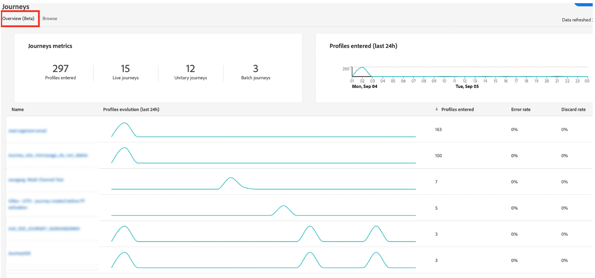
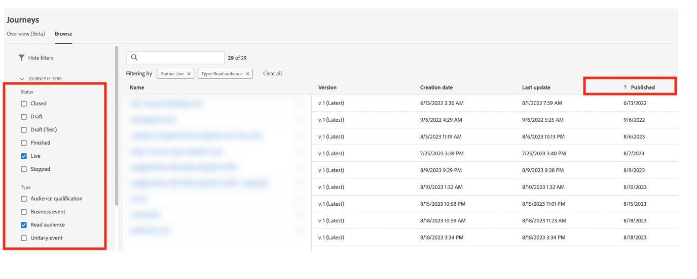

# Práticas recomendadas {#best-practices}

>[!BEGINSHADEBOX]

**Nesta página:** aplique as práticas recomendadas da Journey Optimizer para identificação de identidade, personalização omnicanal e medidas de proteção de jornada, para criar casos de uso confiáveis e dimensionar com eficiência dentro dos limites do sistema.

>[!ENDSHADEBOX]

## Caso de uso em tempo real e orientação de personalização omnicanal {#real-time-guidance}

Após a atualização do Serviço de identidade 2.0, a compilação de identidade em tempo real evoluiu.

O Adobe Journey Optimizer usa o Serviço de identidade para mesclar perfis e personalizar experiências para o usuário. Como resultado, há alguns aspectos importantes no serviço que você deve conhecer ao criar seus casos de uso. Como marca, você procura oferecer uma experiência a uma pessoa. O gráfico de identidade permite que os profissionais de marketing entendam a quais dispositivos uma pessoa está associada em vários canais. O gráfico pode conter identidades que representam uma pessoa (CRMID) ou um navegador da Web (ECID). O Serviço de identidade une essas informações, o que permite a criação de uma &quot;visualização de 360 graus&quot; de uma pessoa ou de um perfil mesclado. Ou seja, quando alguém navega em seu site e faz logon, todos os dados anteriores dessa sessão podem ser associados ao usuário de logon. Essa ação acontece em algumas etapas diferentes:

1. Compilação inicial de identidades - quando uma pessoa faz logon, o identificador de logon (CRMID) é associado ao identificador do navegador da Web (sessão da Web ou de aplicativo móvel):

   * Isso pode levar de 30 minutos a 4 horas para ser concluído.
   * Normalmente, esse evento de logon gerará um gráfico de identidade que vincula a CRMID à ECID.

1. Após a compilação inicial, todos os dados enviados com qualquer uma das duas identidades serão associados ao perfil mesclado e disponibilizados para personalização no Journey Optimizer em tempo real. A atualização do perfil com os dados comportamentais mais recentes pode levar até 1 minuto para ser concluída. Consulte esta [página](https://experienceleague.adobe.com/docs/experience-platform/ingestion/streaming/overview.html?lang=pt-BR).

Ao criar casos de uso, considere o seguinte:

1. A marca deseja reengajar um visitante do site 30 minutos após o abandono (por exemplo, email de carrinho abandonado):

   Use a identidade com os dados - ECID. Se você quiser capturar 100% dos visitantes que forneceram seu endereço de email/aplicativo instalado nos últimos 30 minutos, use a identidade baseada em cookies para iniciar esta jornada (ECID). Isso pressupõe que seu endereço de email, token de push ou outro endereço para a experiência esteja associado à ECID.

1. Engajamento omnicanal na Web, email, push etc.:

   * Você deve ter os endereços para comunicação disponíveis no perfil no momento do engajamento. Para garantir que isso aconteça de forma consistente e oportuna, verifique se seus dados estão associados à identidade que você gostaria de usar.
   * Se você precisar usar informações de um aplicativo ou sessão do navegador recém-instalado combinadas com informações conhecidas ou conectadas, essa comunicação precisará ser enviada após a compilação dessas identidades. Isso pode variar de acordo com o cliente, e recomendamos aguardar no mínimo 30 minutos para obter o maior volume de perfis.

## Dimensionar com as medidas de proteção da Jornada {#scale}

Esta seção o guiará sobre como dimensionar com as duas limitações a seguir:

* O Journey Optimizer tem uma proteção de 50 atividades em uma tela de jornada. Essa garantia foi projetada para ajudar na leitura, no controle de qualidade e na solução de problemas. O número de atividades em uma jornada aparecerá na seção superior esquerda da tela de jornada quando você estiver dentro de 10 atividades com esse limite.

* À medida que você publica jornadas, o Journey Optimizer é dimensionado e ajustado automaticamente para garantir o máximo de rendimento e estabilidade. Ao se aproximar do marco de 100 jornadas ativas de uma vez em uma sandbox, você verá uma sobreposição laranja e um sinal de aviso aparecer na interface nesta conquista. Se vir esta notificação e precisar aumentar o número de jornadas para acima de 100 jornadas ativas por vez, crie um tíquete para o Atendimento ao cliente e ajudaremos a atingir suas metas.

<!--
DOCAC-10977

* As you publish journeys, Journey Optimizer automatically scales and adjusts to ensure maximum throughput and stability. As you near the milestone of 500 live journeys at one time in a sandbox, you will see an orange overlay and warning sign appear in the interface on this achievement. If you see this notification and have a need to extend your journeys beyond 500 live journeys at a time, please create a ticket for customer care and we will help you reach your goals.
-->

Você pode adotar várias práticas recomendadas que o ajudarão a permanecer nas medidas de proteção e usar o sistema com eficiência.

* Se você estiver se aproximando do limite de jornadas ativas, a primeira etapa a ser executada é acessar a guia **Visão geral** em **Jornadas** para ver quantas jornadas estavam ativas nas últimas 24 horas com perfis ativos. Você pode verificar o número de perfis que entram e saem da jornada nesta seção para determinar isso.

  

* Em seguida, na seção Jornada inventory, você pode filtrar todas as jornadas por Status = &quot;Live&quot; e Tipo = &quot;Read audience&quot;. Em seguida, classifique por Data de publicação (mais antiga a mais recente). Clique em na jornada e acesse o cronograma. Pare todas as jornadas ativas com agendamento para execução **Uma Vez** ou **Assim que Possível** que tenham mais de um dia e tenham apenas uma ação.

  

* Se a sua jornada **Ler público-alvo** tiver apenas uma ação, nenhuma espera/decisão ou otimização de tempo de envio, considere movê-la para Campanhas do Journey Optimizer. As campanhas são mais adequadas para o engajamento em uma única etapa. Uma das principais diferenças entre o Campaign e as Jornadas é se você acha importante ouvir ativamente o engajamento do usuário para determinar a próxima etapa e se engajar com outra ação.
* Para diminuir o número de atividades em uma jornada, verifique as etapas de condição. Haverá muitas instâncias em que é possível mover as condições para a definição do segmento ou a composição do público-alvo.
* Se as mesmas condições forem repetidas em várias jornadas (verificações de consentimento, supressões), considere movê-las como parte da definição do segmento. Por exemplo, se você tiver uma condição para verificar &quot;o endereço de email não está vazio&quot; em várias jornadas, inclua essa condição como parte da definição do segmento.
* Se sua jornada tiver várias condições dividindo o público-alvo para ver os números em cada etapa, considere usar o Customer Journey Analytics ou outra solução de relatórios mais adequada para análise.
* Se você estiver se aproximando do limite de nós na tela, considere a consolidação de ações com parâmetros dinâmicos ou conteúdo para veicular o conteúdo correto em vez de nós explícitos.

* Se você tiver uma jornada **Read Audience** com segmento em lote (A) e estiver usando um segmento de transmissão inAudience (B) na jornada a ser excluído (ou seja, execute A-B), considere mover essa lógica para a lógica de segmentação e usar a exclusão como parte da própria lógica de segmentação.