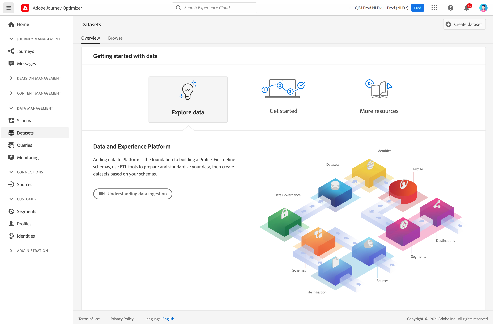

# Introdução aos conjuntos de dados {#datasets-gs}

Todos os dados assimilados no Adobe Experience Platform são mantidos no Data Lake como conjuntos de dados. Um conjunto de dados é uma construção de armazenamento e gerenciamento para uma coleção de dados, normalmente uma tabela, que contém um esquema (colunas) e campos (linhas).

## Acessar conjuntos de dados{#access-datasets}

O **Conjuntos de dados** espaço de trabalho em [!DNL Adobe Journey Optimizer] a interface do usuário permite explorar dados e criar conjuntos de dados.

Selecionar **Conjuntos de dados** na navegação à esquerda para abrir o painel Conjuntos de dados .

Adicionar dados ao [!DNL Adobe Experience Platform] é a base para criar um Perfil. Você poderá aproveitar os perfis no [!DNL Adobe Journey Optimizer]. Primeiro, defina esquemas, use ferramentas de ETL para preparar e padronizar seus dados e, em seguida, crie conjuntos de dados com base em seus esquemas.

Selecione o **Procurar** para exibir a lista de todos os conjuntos de dados disponíveis para sua organização. Os detalhes são exibidos para cada conjunto de dados listado, incluindo seu nome, o esquema ao qual o conjunto de dados adere e o status da execução de assimilação mais recente.

Por padrão, somente os conjuntos de dados assimilados são exibidos. Se quiser ver os conjuntos de dados gerados pelo sistema, habilite o **Mostrar conjuntos de dados do sistema** alterne do filtro.

Selecione o nome de um conjunto de dados para acessar a tela de atividade do Conjunto de dados e ver os detalhes do conjunto de dados selecionado. A guia activity inclui um gráfico que visualiza a taxa de mensagens que estão sendo consumidas, bem como uma lista de lotes bem-sucedidos e com falha.

## Visualizar conjuntos de dados{#preview-datasets}

Na tela de atividade do Conjunto de dados, selecione **Visualizar conjunto de dados** próximo ao canto superior direito da tela para visualizar o lote bem-sucedido mais recente nesse conjunto de dados. Quando um conjunto de dados está vazio, o link de visualização é desativado.

## Criar conjuntos de dados{#create-datasets}

Para criar um novo conjunto de dados, comece selecionando **Criar conjunto de dados** no painel Conjuntos de dados .

É possível:

* Criar conjunto de dados a partir do esquema. [Saiba mais nesta documentação](https://experienceleague.adobe.com/docs/experience-platform/catalog/datasets/user-guide.html?lang=en#schema){target=&quot;_blank&quot;}
* Crie um conjunto de dados a partir do arquivo CSV. [Saiba mais nesta documentação](https://experienceleague.adobe.com/docs/experience-platform/ingestion/tutorials/map-a-csv-file.html?lang=pt-BR){target=&quot;_blank&quot;}

Assista a este vídeo para saber como criar um conjunto de dados, mapeá-lo para um esquema, adicionar dados a ele e confirmar que os dados foram assimilados.

>[!VIDEO](https://video.tv.adobe.com/v/334293?quality=12)

## Governança de dados

Em um conjunto de dados, navegue pelo **Governança de dados** para verificar rótulos no conjunto de dados e no nível do campo. A Governança de dados categoriza os dados de acordo com o tipo de políticas aplicáveis.

Um dos recursos principais de [!DNL Adobe Experience Platform] O é reunir dados de vários sistemas corporativos para melhor permitir que os profissionais de marketing identifiquem, entendam e envolvam clientes. Esses dados podem estar sujeitos a restrições de uso definidas por sua organização ou por regulamentos legais. Portanto, é importante garantir que suas operações de dados estejam em conformidade com as políticas de uso de dados.

[!DNL Adobe Experience Platform Data Governance] O permite gerenciar os dados do cliente e garantir a conformidade com as regulamentações, restrições e políticas aplicáveis ao uso dos dados. Ele desempenha uma função essencial no Experience Platform em vários níveis, incluindo catálogos, linhagem de dados, rotulagem de uso de dados, políticas de uso de dados e controle do uso de dados para ações de marketing.

Saiba mais sobre Governança de dados e rótulos de uso de dados no [Documentação de governança de dados](https://experienceleague.adobe.com/docs/experience-platform/data-governance/labels/user-guide.html){target=&quot;_blank&quot;}

## Amostras e casos de uso{#uc-datasets}

Saiba como criar um esquema, um conjunto de dados e assimilar dados para adicionar perfis de teste no Adobe Journey Optimizer em [esta amostra completa](../segment/creating-test-profiles.md)

Saiba mais sobre a criação de conjunto de dados em [Documentação do Adobe Experience Platform](https://experienceleague.adobe.com/docs/experience-platform/catalog/datasets/overview.html){target=&quot;_blank&quot;}.

Saiba como usar a interface do usuário de conjuntos de dados no [Documentação de visão geral da Ingestão de dados](https://experienceleague.adobe.com/docs/experience-platform/ingestion/home.html?lang=pt-BR){target=&quot;_blank&quot;}.

Uma lista de casos de uso com exemplos de consulta está disponível [here](../start/datasets-query-examples.md).

**Consulte também**

* [Visão geral da assimilação de streaming](https://experienceleague.adobe.com/docs/experience-platform/ingestion/streaming/overview.html?lang=pt-BR){target=&quot;_blank&quot;}
* [Assimilar dados no Adobe Experience Platform](https://experienceleague.adobe.com/docs/experience-platform/ingestion/tutorials/ingest-batch-data.html){target=&quot;_blank&quot;}
