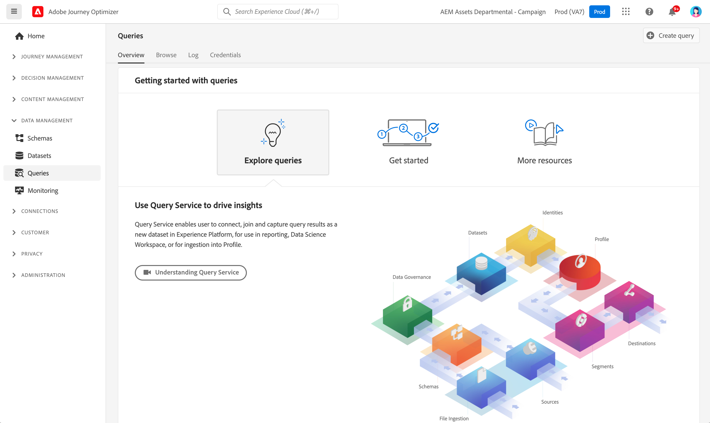

# Introdução a consultas {#queries-gs}

O Editor de consultas é uma ferramenta interativa fornecida pelo Serviço de consultas da Adobe Experience Platform, que permite gravar, validar e executar consultas para dados de experiência do cliente no [!DNL Adobe Journey Optimizer] interface do usuário.

O Editor de consultas oferece suporte ao desenvolvimento de consultas para análise e exploração de dados e permite que você execute consultas interativas para fins de desenvolvimento, bem como consultas não interativas para preencher [conjuntos de dados](get-started-datasets.md).

Saiba como usar o Editor de consultas no [esta documentação](https://experienceleague.adobe.com/docs/experience-platform/query/ui/user-guide.html){target=&quot;_blank&quot;}.

**Consulte também**

* [Documentação do Serviço de query](https://experienceleague.adobe.com/docs/experience-platform/query/home.html?lang=pt-BR){target=&quot;_blank&quot;}
* [Vídeo de visão geral do Serviço de query](https://experienceleague.adobe.com/docs/platform-learn/tutorials/queries/understanding-query-service.html?lang=pt-BR){target=&quot;_blank&quot;}
