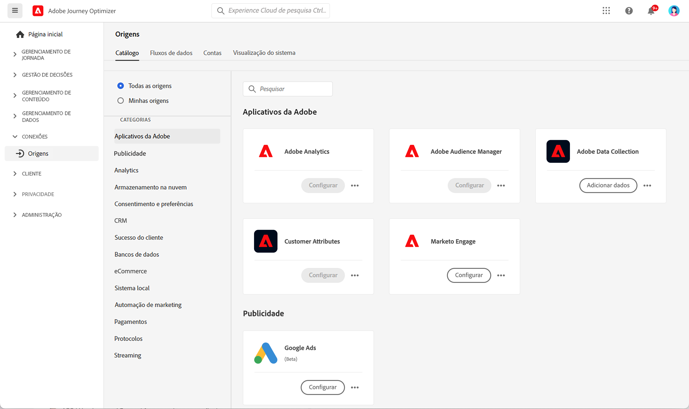

# Introdução a conectores de fontes {#sources-gs}

O Adobe Journey Optimizer permite que os dados sejam assimilados de fontes externas e, ao mesmo tempo, fornece a capacidade de estruturar, rotular e aprimorar os dados recebidos usando os serviços do Platform. Você pode assimilar dados de várias fontes, como aplicativos Adobe, armazenamentos baseados na nuvem, bancos de dados e muitas outras.

Saiba mais sobre conectores de fonte e como configurá-los no Journey Optimizer neste vídeo:

>[!VIDEO](https://video.tv.adobe.com/v/335919?quality=12)

Saiba mais sobre como assimilar dados de fontes externas com conectores de fontes na [Documentação da Adobe Experience Platform](https://experienceleague.adobe.com/docs/experience-platform/sources/home.html?lang=pt-BR){target="_blank"}.
