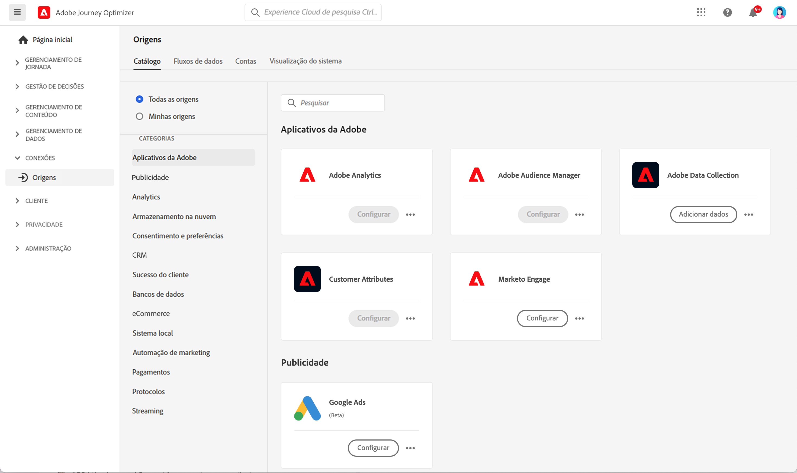

# Introdução aos conectores de origem {#sources-gs}

>[!BEGINSHADEBOX]

**Nesta página:** entenda o que são conectores de origem e como eles trazem dados do CRM, armazenamento na nuvem e bancos de dados para o Adobe Journey Optimizer, para que você possa habilitar jornadas do cliente personalizadas e orientadas por dados.

>[!ENDSHADEBOX]

## O que é uma fonte? {#what-is-source}

Uma **fonte** é um conector que traz dados externos para o Adobe Journey Optimizer. As fontes permitem importar informações do cliente de sistemas que você já usa, como plataformas CRM, armazenamento na nuvem ou bancos de dados, e disponibilizar esses dados para criar jornadas do cliente personalizadas.

Pense nas fontes como pontes entre o Journey Optimizer e os sistemas de dados externos. Elas sincronizam dados automaticamente para que as informações do cliente estejam sempre atualizadas, impulsionando as campanhas de marketing.

## Por que as fontes são importantes {#why-sources-matter}

As fontes são essenciais para criar experiências do cliente personalizadas e orientadas por dados no Journey Optimizer. Veja por quê:

* **Visão do cliente unificada**: combine dados de vários sistemas para ver a imagem completa de cada cliente
* **Personalização em tempo real** - Use dados novos para entregar mensagens relevantes e oportunas nas jornadas
* **Sincronização automatizada de dados** - Mantenha as informações do cliente atualizadas sem importações manuais de dados
* **Fluxos de trabalho eficientes** - Conecte-se uma vez e os dados fluem automaticamente para as jornadas

Por exemplo, é possível usar fontes para importar o histórico de compras da plataforma de comércio eletrônico e criar jornadas que enviam recomendações de produtos personalizadas com base nas compras feitas pelos clientes.

## O que você pode fazer com as fontes {#sources-use-cases}

Casos de uso comuns das fontes no Journey Optimizer incluem:

* **Importar dados do cliente de sistemas CRM** - Sincronize informações de contato, preferências e histórico de engajamento a partir de plataformas como Salesforce ou Microsoft Dynamics
* **Conectar dados de compra**: inclua o histórico de pedidos e as preferências de produtos das plataformas de comércio eletrônico para personalizar ofertas
* **Integrar dados do programa de fidelidade** - Acesse saldos de pontos e informações de níveis para premiar seus clientes mais engajados
* **Sincronizar dados comportamentais** - Importe as interações com o site e os padrões de uso do aplicativo para acionar jornadas relevantes
* **Atualizar atributos de perfil** - Mantenha os perfis de clientes atualizados com dados do armazenamento na nuvem ou de bancos de dados

## Tipos de fontes comuns {#source-types}

O Journey Optimizer oferece suporte a vários tipos de fontes para conexão com os sistemas existentes:

**Aplicativos da Adobe:**
* Adobe Analytics
* Adobe Audience Manager
* Adobe Campaign
* Adobe Commerce

**Armazenamento na nuvem:**
* Amazon S3
* Armazenamento de Blobs do Azure
* Google Cloud Storage
* SFTP

**Bancos de dados:**
* Amazon Redshift
* Google BigQuery
* Microsoft SQL Server
* MySQL
* PostgreSQL

**CRM e automação de marketing:**
* Microsoft Dynamics
* Salesforce
* Salesforce Marketing Cloud

**Fidelidade e recompensas:**
* Talon.One
* Capilar
* Kobie

➡️ Veja a lista completa no [catálogo de fontes da Experience Platform](https://experienceleague.adobe.com/docs/experience-platform/sources/home.html?lang=pt-BR#sources-catalog){target="_blank"}

## Antes de começar {#prerequisites}

Antes de configurar fontes, verifique se possui:

* **Permissões apropriadas**: acesso para gerenciar fontes na Adobe Experience Platform
* **Credenciais do sistema de origem** - Detalhes de autenticação do sistema externo ao qual você deseja se conectar
* **Compreensão dos dados** - Saiba de quais campos de dados você precisa e como eles são mapeados para os perfis do Journey Optimizer

➡️ Saiba mais sobre [controle de acesso e permissões](../administration/permissions.md)

## Como as fontes funcionam {#how-sources-work}

O Adobe Journey Optimizer usa a estrutura de fontes da Adobe Experience Platform. Este é o fluxo de trabalho básico:

1. **Conectar** - Configure a autenticação para o sistema de dados externo
2. **Selecionar dados** - Escolha quais dados importar e com que frequência sincronizar
3. **Mapear campos** - Defina como os campos de dados externos correspondem aos atributos de perfil do Journey Optimizer
4. **Agendar**: configure intervalos de atualização automática de dados
5. **Monitor** - Rastreie o fluxo de dados e resolva os problemas de sincronização

Uma vez configuradas, as fontes são executadas automaticamente em segundo plano, mantendo os dados do cliente atualizados e prontos para uso nas jornadas.

>[!NOTE]
>
>**Ingestão de dados para campanhas orquestradas**: para fontes de captura de dados de alteração baseadas em arquivo usadas com campanhas orquestradas, o campo `_change_request_type` é obrigatório. Os valores aceitos são `u` (substituição) ou `d` (exclusão). Esses valores devem estar em minúsculas `u` e `d`, e não em maiúsculas `U` e `D`. [Saiba mais sobre as medidas de proteção e limitações de Campanhas orquestradas](../orchestrated/guardrails.md)

## Saiba mais {#learn-more}

Assista a este vídeo para entender conectores de origem e como configurá-los no Journey Optimizer:

>[!VIDEO](https://video.tv.adobe.com/v/335919?quality=12)

Para obter informações detalhadas sobre como configurar e gerenciar fontes, consulte a [documentação sobre fontes da Adobe Experience Platform](https://experienceleague.adobe.com/docs/experience-platform/sources/home.html?lang=pt-BR){target="_blank"}.

## Próximas etapas {#next-steps}

Agora que você entende o que são fontes e por que elas são importantes:

* Explore o [catálogo de fontes](https://experienceleague.adobe.com/docs/experience-platform/sources/home.html?lang=pt-BR#sources-catalog){target="_blank"} para encontrar conectores de sistemas
* Saiba como [criar uma conexão de origem](https://experienceleague.adobe.com/en/docs/experience-platform/sources/home){target="_blank"}
* Entenda [o mapeamento e a transformação de dados](https://experienceleague.adobe.com/en/docs/experience-platform/sources/home){target="_blank"}
* Veja como [usar dados importados nas jornadas](../building-journeys/journey-gs.md)
* Consulte a seção de visão geral [Introdução à gestão de dados](../data/gs-data.md) para entender como as fontes se encaixam na configuração completa de dados do Journey Optimizer
