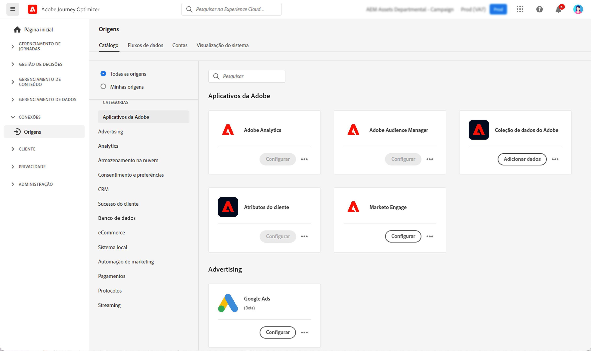

# Introdução a conectores de fontes {#sources-gs}

## O que é uma fonte? {#what-is-source}

Uma **origem** é um conector que traz dados externos para o Adobe Journey Optimizer. As fontes permitem importar informações do cliente de sistemas que você já usa, como plataformas CRM, armazenamento na nuvem ou bancos de dados, e disponibilizar esses dados para criar jornadas personalizadas para o cliente.

Pense nas fontes como pontes entre o Journey Optimizer e seus sistemas de dados externos. Eles sincronizam dados automaticamente para que você sempre tenha informações atualizadas do cliente para potencializar suas campanhas de marketing.

## Por que as fontes são importantes {#why-sources-matter}

As fontes são essenciais para criar experiências personalizadas e orientadas por dados para o cliente no Journey Optimizer. Veja o porquê:

* **Visualização unificada do cliente** - Combine dados de vários sistemas para ver a imagem completa de cada cliente
* **Personalização em tempo real** - Use dados novos para entregar mensagens relevantes e oportunas em suas jornadas
* **Sincronização automatizada de dados** - Mantenha as informações do cliente atualizadas sem importações manuais de dados
* **Fluxos de trabalho eficientes** - Conecte-se uma vez e os dados fluem automaticamente para suas jornadas

Por exemplo, você pode usar fontes para importar o histórico de compras da sua plataforma de comércio eletrônico e criar jornadas que enviam recomendações de produto personalizadas com base nas compras feitas pelos clientes.

## O que você pode fazer com as fontes {#sources-use-cases}

Casos de uso comuns para fontes no Journey Optimizer incluem:

* **Importar dados do cliente de sistemas CRM** - Sincronizar informações de contato, preferências e histórico de participação de plataformas como Salesforce ou Microsoft Dynamics
* **Conectar dados de compra** - Coloque o histórico em ordem e as preferências de produto das plataformas de comércio eletrônico para personalizar ofertas
* **Integre dados do programa de fidelidade** - Acesse saldos de pontos e informações de camada para premiar seus clientes mais engajados
* **Sincronizar dados comportamentais** - Importe interações de site e padrões de uso de aplicativo para acionar jornadas relevantes
* **Atualizar atributos de perfil** - Mantenha os perfis do cliente atualizados com dados do armazenamento na nuvem ou de bancos de dados

## Tipos de origem comuns {#source-types}

O Journey Optimizer oferece suporte a vários tipos de fontes para conexão com seus sistemas existentes:

**aplicativos Adobe:**
* Adobe Analytics
* Adobe Audience Manager
* Adobe Campaign
* Adobe Commerce

**Armazenamento na nuvem:**
* Amazon S3
* Armazenamento Azure Blob
* Google Cloud Storage
* SFTP

**Bancos de dados:**
* Amazon Redshift
* Google BigQuery
* Microsoft SQL Server
* MySQL
* PostgreSQL

**Automação de CRM e marketing:**
* Microsoft Dynamics
* Salesforce
* Marketing Cloud

➡️ Veja a lista completa no [catálogo de fontes do Experience Platform](https://experienceleague.adobe.com/docs/experience-platform/sources/home.html?lang=pt-BR#sources-catalog){target="_blank"}

## Antes de começar {#prerequisites}

Antes de configurar fontes, verifique se você tem:

* **Permissões apropriadas** - Acesso para gerenciar fontes na Adobe Experience Platform
* **Credenciais do sistema Source** - Detalhes de autenticação do sistema externo que você deseja conectar
* **Noções básicas sobre seus dados** - Saiba quais campos de dados você precisa e como eles são mapeados para perfis do Journey Optimizer

➡️ Saiba mais sobre [controle de acesso e permissões](../../administration/permissions.md)

## Como as fontes funcionam {#how-sources-work}

O Adobe Journey Optimizer usa a estrutura de códigos-fonte do Adobe Experience Platform. Este é o fluxo de trabalho básico:

1. **Conectar** - Configurar autenticação para seu sistema de dados externo
2. **Selecionar dados** - Escolha quais dados importar e com que frequência sincronizar
3. **Mapear campos** - Defina como os campos de dados externos correspondem aos atributos de perfil do Journey Optimizer
4. **Agendar** - Configurar intervalos de atualização automática de dados
5. **Monitor** - Rastreie o fluxo de dados e resolva os problemas de sincronização

Uma vez configuradas, as fontes são executadas automaticamente em segundo plano, mantendo os dados do cliente atualizados e prontos para uso no jornada.

## Saiba mais {#learn-more}

Assista a este vídeo para entender conectores de origem e como configurá-los no Journey Optimizer:

>[!VIDEO](https://video.tv.adobe.com/v/335919?quality=12)

Para obter informações detalhadas sobre como configurar e gerenciar fontes, consulte a [documentação sobre fontes do Adobe Experience Platform](https://experienceleague.adobe.com/docs/experience-platform/sources/home.html?lang=pt-BR){target="_blank"}.

## Próximas etapas {#next-steps}

Agora que você entende quais são as fontes e por que elas são importantes:

* Explore o [catálogo de fontes](https://experienceleague.adobe.com/docs/experience-platform/sources/home.html?lang=pt-BR#sources-catalog){target="_blank"} para encontrar conectores para seus sistemas
* Saiba como [criar uma conexão de origem](https://experienceleague.adobe.com/docs/experience-platform/sources/ui-tutorials/create/overview.html){target="_blank"}
* Entender [o mapeamento e a transformação de dados](https://experienceleague.adobe.com/docs/experience-platform/sources/ui-tutorials/dataflow/overview.html){target="_blank"}
* Veja como [usar dados importados no jornada](../building-journeys/journey-gs.md)
