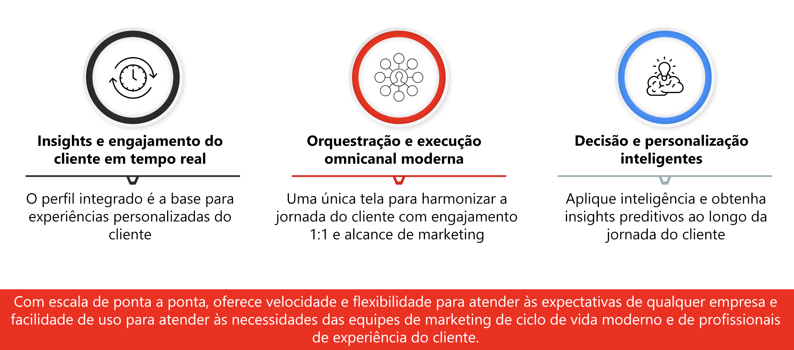

# Introdução ao Journey Optimizer {#cjm-gs}

>[!CONTEXTUALHELP]
>id="test_id"
>title="Algum conteúdo de teste"
>abstract="Teste o conteúdo para obter ajuda contextual de integração ao AJO."

## O que é o [!DNL Adobe Journey Optimizer]?{#about-cjm}

O [!DNL Adobe Journey Optimizer] ajuda as empresas a fornecer experiências conectadas, contextuais e personalizadas aos clientes. A jornada do cliente é todo o processo de interações do cliente com a marca, desde o primeiro momento do contato até o cliente ir embora. Ela começa com a fase de percepção, onde o cliente aprende sobre a marca e começa a se envolver. O cliente interagirá ainda mais com a marca, visitará sites online e locais físicos e fará compras, enviará mensagens ou fará resenhas.

O [!DNL Adobe Journey Optimizer] é criado originalmente no [!DNL Adobe Experience Platform] e combina um perfil de cliente unificado em tempo real, uma estrutura aberta de priorização de API, um offer decisioning centralizado, além de inteligência artificial (AI) e aprendizado de máquina (ML) para personalização e otimização. O Journey Optimizer permite que as marcas determinem de forma inteligente a próxima melhor interação com escala, velocidade e flexibilidade durante toda a jornada do cliente. Com o [!DNL Adobe Journey Optimizer], as empresas podem criar e entregar campanhas de marketing agendadas (como promoções semanais para uma loja de varejo) e comunicações individuais personalizadas (como uma notificação por push sobre um item que um cliente de aplicativo de fidelidade tenha visto e que estava anteriormente indisponível), tudo no mesmo aplicativo.

➡️ [Descubra o Journey Optimizer](https://experienceleague.adobe.com/docs/journey-optimizer-learn/tutorials/introduction-to-journey-optimizer/introduction.html?lang=pt-BR){target=&quot;_blank&quot;} (vídeo)

## Casos de uso {#use-cases}

* Os profissionais de marketing podem usar o [!DNL Adobe Journey Optimizer] para enviar comunicações individualizadas, bem como comunicações em lote baseadas em públicos-alvo. Por exemplo, uma loja de roupas normalmente envia pesquisas pós-compra para todos os clientes que compraram produtos na última semana. Devido às intempéries, alguns carregamentos sofreram atrasos. Ao ver quais clientes não receberam suas remessas, a loja de roupas pode excluí-los do envio agendado de pesquisa de satisfação do cliente e, em vez disso, enviar um email personalizado pedindo desculpas pelo atraso e oferecendo um código de desconto com recomendações de produto baseadas nas compras anteriores do cliente.

   Os profissionais de marketing também podem usar o aplicativo para enviar comunicações em tempo real baseadas em comportamento. Por exemplo, o mesmo varejista poderia engajar um cliente fiel que entra no estacionamento da loja em tempo real enviando a ele uma notificação por push sobre um suéter que está de volta em estoque no seu tamanho.

* Os não profissionais de marketing, como as equipes de operações e suporte ao cliente envolvidas na experiência do cliente, podem usar o [!DNL Adobe Journey Optimizer] para gerenciar várias tarefas, como notificações operacionais ou até mesmo para monitorar o processo de integração de clientes. Pense por exemplo, um parque de diversões onde os visitantes baixam um aplicativo móvel como parte de sua experiência no parque. A equipe de manutenção pode usar o [!DNL Adobe Journey Optimizer] para notificar os visitantes sobre as atrações que estão fechadas atualmente devido à manutenção.

## Principais recursos {#key-capabilities}

O [!DNL Adobe Journey Optimizer] é um aplicativo ágil e escalonável para a criação e o fornecimento de experiências personalizadas, conectadas e oportunas ao cliente por meio de qualquer aplicativo, dispositivo ou canal.

Os principais recursos incluem:

* **Insights e envolvimentos do cliente em tempo real** — um perfil integrado usa dados ao vivo de todas as fontes nos pontos de contato do cliente, incluindo dados comportamentais, transacionais, financeiros e operacionais para otimizar experiências pessoais e contextuais para os clientes em seu tempo.

* **Orquestração e execução modernas do Omnichannel** — uma tela única na qual se pode harmonizar e otimizar a jornada do cliente para um equilíbrio entre o engajamento do cliente e o alcance de marketing, ajudando as marcas a agregar mais valor ao longo do ciclo de vida do cliente. As jornadas do cliente criadas no [!DNL Adobe Journey Optimizer] podem ser dinâmicas e baseadas em eventos para ajudar as marcas a reagir a sinais em tempo real, bem como conectar essas interações com campanhas programadas, para que sejam tomadas as decisões corretas com respeito a quais comunicações devem ser enviadas a um cliente, quando e por quais canais.

* **Decisão e personalização inteligente** — as marcas podem aplicar decisões centralizadas e incorporar inteligência artificial e aprendizado de máquina para exibir insights preditivos no decorrer da experiência do cliente, facilitando a automatização das decisões e a otimização da experiência em escala. O Offer Decisioning possibilita ofertas centralizadas em canais em escala por meio do [!DNL Adobe Journey Optimizer].

## Arquitetura {#architecture}

Entenda a arquitetura básica do [!DNL Adobe Journey Optimizer], os pontos de integração e a relação do [!DNL Journey Optimizer] com outros aplicativos da Adobe.

>[!VIDEO](https://video.tv.adobe.com/v/334205?quality=12)

>[!NOTE]
>
> As diretrizes e procedimentos gerais de privacidade da Adobe Experience Cloud se aplicam ao [!DNL Journey Optimizer]. [Saiba mais sobre a privacidade da Adobe Experience Cloud](https://www.adobe.com/br/privacy/experience-cloud.html).
> Você também precisa estar ciente das [Medidas de proteção aos dados de perfil do cliente em tempo real antes de iniciar](https://experienceleague.adobe.com/docs/experience-platform/profile/guardrails.html?lang=pt-BR).

**Consulte também**

* [Etapas principais para iniciar](quick-start.md)
* [Criar a primeira mensagem](../messages/get-started-content.md)
* [Criar jornadas e enviar mensagens](../building-journeys/journey-gs.md)
* [Relatórios ao vivo](../reports/live-report.md)
* [Perguntas frequentes do Journey Optimizer](../assets/do-not-localize/AJO-FAQ.pdf) (PDF)
* [Visão geral da segurança no Journey Optimizer](https://www.adobe.com/content/dam/cc/en/security/pdfs/AJO_SecurityOverview.pdf) (PDF)
